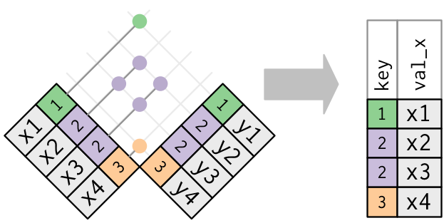
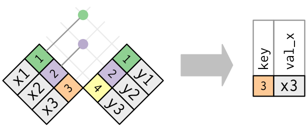

# İlişkisel veri

## Giriş

Veri analizinin tek bir veri tablosundan oluşması nadirdir. Genelde bir sürü veri tablonuz olur ve ilgilendiğiniz soruları cevaplamak için onları birleştirmeniz gerekir. Birçok veri tablosu, toplu olarak __ilişkisel veri__ olarak adlandırılır çünkü tek tek veri setlerinin yanında aralarındaki ilişki de önemlidir.

İlişkiler her zaman bir çift tablo arasında belirlenir. Tüm diğer ilişkiler de bu basit fikirden geliştirilir: üç ya da daha fazla tablonun arasındaki ilişki her zaman her bir çift tablo arasındaki ilişkinin bir özelliğidir. Bazen bir çiftin bütün elemanları aynı tablo olabilir! Bu, mesela, insanlardan oluşan bir tablonuz olduğunda ve her insanın anne babasına referansı olduğunda gereklidir.

İlişkisel veriyle çalışmak için, veri çiftleriyle çalışan fiillere ihtiyacınız var. Üç tane fiil ailesi, ilişkisel veriyle çalışmak için tasarlanmıştır:

* __Değiştiren birleştirmeler__, bir veri çerçevesindeki eşleşen gözlemlerden bir diğer veri çerçevesine yeni değişkenler ekler.

* __Filtreleyen birleştirmeler__, bir veri çerçevesindeki gözlemleri, öteki veri çerçevesindeki gözlemle eşleşmesine bağlı olarak filtreler.

* __Takım operasyonları__, gözlemleri takım elemanlarıymış gibi değerlendirir.

İlişkisel verinin en sık karşılaşılacağı yer, neredeyse bütün güncel veritabanlarını kapsayan bir terim olan _ilişkisel_ veritabanı yönetim sistemidir (RDBMS). Daha önce bir veritabanı kullandıysanız, muhtemelen SQL kullanmışsınızdır. O zaman bu bölümdeki kavramlar, her ne kadar dplyr'daki ifadeleri farklı olsa da size tanıdık gelecektir. Genelde dplyr'ı kullanması SQL'e göre daha kolaydır çünkü dplyr veri analizi yapmak için özelleşmiştir: veri analizinde çoklukla ihtiyaç duyulmayan işlemleri daha zor kılmak pahasına yaygın olan veri analizi işlemlerini kolaylaştırır.

### Ön şartlar

Dplyr'daki iki-tablolu fiilleri kullanarak `nycflights13` içindeki ilişkisel veriyi keşfedeceğiz.

```{r setup, message = FALSE}
library(tidyverse)
library(nycflights13)
```

## nycflights13 {#nycflights13-relational}

İlişkisel veriyi öğrenmek için nycflights13 paketini kullanacağız.
nycflights13, [veri dönüşümü]'nde kullandığınız `flights` tablosuna bağlı dört tane tibble içerir:

*   `airlines` kısaltılmış kodundan tam uçak ismini bulmanızı sağlar:

    ```{r}
    airlines
    ```

*   `airports`, `faa` havalimanı koduyla tanımlanan her havalimanıyla ilgili bilgi verir:

    ```{r}
    airports
    ```

*   `planes`, `tailnum` koduyla tanımlanan her uçakla ilgili bilgi verir:  

    ```{r}
    planes
    ```

*   `weather` her NYC havalimanındaki her saat için hava durumu bilgisi verir:

    ```{r}
    weather
    ```

Farklı tablolar arasındaki ilişkileri göstermenin bir yolu da çizimledir:

```{r, echo = FALSE}
knitr::include_graphics("diagrams/relational-nycflights.png")
```

Bu diyagram size biraz karmaşık görünebilir fakat gerçek hayatta göreceğiniz bazılarına göre yine de basittir! Bu gibi diyagramları anlamanın yolu her ilişkinin her zaman bir çift tablodan oluştuğunu hatırlamaktır. Bütününü anlamanız gerekmiyor; sadece ilgilendiğiniz tablolar arasındaki ilişki zincirini anlamanız yeterli.

nycflights13 için:

* `flights`, `planes`e tek bir değişkenle, `tailnum` ile bağlanıyor. 

* `flights`, `airlines`e `carrier` değişkeniyle bağlanıyor.

* `flights`, `airports`a iki yolla bağlanıyor: `origin` ve
  `dest` değişkenleri yoluyla.

* `flights` `weather`a `origin` (konum), 
  `year`, `month`, `day` ve `hour` (zaman) yoluyla bağlanıyor.

### Alıştırmalar
    
1.  Her uçağın başlangıç noktasından hedefine varış yolunu (yaklaşık olarak)       çizmek istediğinizi hayal edin. Hangi değişkenlere ihtiyacınız olur? Hangi     tabloları bir araya getirmeniz gerekir?
    
1.  `weather` ve `airports`arasındaki ilişkiyi çizmeyi unuttum. Bu ilişki nedir     ve diyagramda nasıl görünür?

1. `weather` sadece (NYC) havalimanları kaynaklarını içeriyor. Eğer USA'daki       bütün havalimanlarıyla ilgili hava durumu bilgilerini içerseydi, `flights`     la hangi ilave bağlantıyı tanımlardı?
  
1.  Yılın bazı günlerinin "özel" olduğunu ve o günlerde normalden az insanın       uçtuğunu biliyoruz. Bu veriyi bir veri tablosu olarak nasıl gösterirdiniz?     Bu tablonun birincil anahtarları ne olurdu? Varolan tablolara nasıl            bağlanırdı?

## Anahtarlar

Her tablo eşini bağlayan değişkenler __anahtarlar__ olarak tanımlanır. Bir gözlemi birebir olarak tanımlayan değişkene (ya da değişkenler setine) anahtar denir. Basit durumlarda tek bir değişken bir gözlemi tanımlamak için yeterlidir. Mesela, her uçak birebir olarak `tailnum`ıyla tanımlanır. Diğer durumlarda birden fazla değişken gerekebilir. Mesela, `weather`da bir gözlemi tanımlamak için beş tane değişkene ihtiyacınız vardır: `year`, `month`, `day`, `hour`, ve `origin`. 

İki çeşit anahtar vardır:

* __birincil anahtar__ bir gözlemi kendi tablosu içinde birebir olarak tanımlar. Mesela, `planes$tailnum` bir birincil anahtardır çünkü `planes` tablosundaki her uçağı birebir olarak tanımlar.

* __yabancı anahtar__ başka bir tablodaki bir gözlemi birebir olarak tanımlar. Mesela,  `flights$tailnum` bir yabancı anahtardır çünkü her uçuşu spesifik bir uçağa eşleyen `flights` tablosunda yer alır.

Bir değişken hem birincil anahtar _hem de_ yabancı anahtar olabilir. Örneğin, `origin`, `weather` birincil anahtarının parçasıdır ve aynı zamanda `airport` tablosu için de yabancı anahtardır.

Tablolarınızdaki birincil anahtarları tanımladıktan sonra, gerçekten her gözlemi birebir olarak tanımlayıp tanımlamadıklarını doğrulamak iyi bir pratiktir. Bunu yapmanın bir yolu, birincil anahtarları `count()` fonksiyonuyla saymak ve `n`in birden büyük olduğu girdilere göz atmaktır:

```{r}
planes %>% 
  count(tailnum) %>% 
  filter(n > 1)

weather %>% 
  count(year, month, day, hour, origin) %>% 
  filter(n > 1)
```

Bazen bir tablonun belirli bir birinci anahtarı yoktur: her satır bir gözlemdir fakat değişkenlerin hiçbir kombinasyonu onu hatasız olarak tanımlamaz. Örneğin, `flights` tablosundaki birincil anahtar nedir? Tarih ve uçuş veya kuyruk numarasının olduğunu düşünebilirsiniz ama bunlardan hiçbiri birebir tanımlama değildir:

```{r}
flights %>% 
  count(year, month, day, flight) %>% 
  filter(n > 1)

flights %>% 
  count(year, month, day, tailnum) %>% 
  filter(n > 1)
```

Bu veriyle çalışmaya başlarken her uçuş numarasının safça her gün bir kere kullanılacağını varsaymıştım: böyle olması belirli bir uçuşla ilgili problemleri aktarmayı çok daha kolay yapacaktı. Ne yazık ki durum böyle değil! Eğer bir tablonun birincil anahtarı yoksa bazen `mutate()` veya `row_number()` ile bir tane eklemek faydalıdır. Bu, eğer filtreleme yaptıysanız ve orijinal veriyle tekrar kontrol etmek istiyorsanız gözlemleri eşleştirmeyi kolaylaştırır. Bunun ismi __vekil anahtar__ dır.

Birincil anahtar ve onun başka bir tablodaki yabancı anahtarı bir __ilişki__ oluşturur. İlişkiler tipik olarak birden-çoğa olur. Örneğin, her uçuşun her uçağın bir tane uçağı var fakat her uçağın bir çok uçuşu var. Farklı bir veride ara sıra birebir ilişki görebilirsiniz. Bu durumu birden-çoğa ilişkinin özel bir durumu olarak düşünebilirsiniz. Çoktan-çoğa ilişkileri çoktan-bire ve birden-çoğa ilişkilerin bir toplamı olarak düşünebilirsiniz. Örneğin, şu veride hava yolu şirketleriyle hava limanları arasında çoktan-çoğa bir ilişki var: her hava yolu şirketi bir çok havalimanına uçuyor; her havalimanı bir sürü hava yolu şirketini barındırıyor. 

### Alıştırmalar

1.  `flights`a bir tane vekil anahtar ekleyin.

1.  Aşağıdaki veri setlerindeki anahtarları belirleyin

    1.  `Lahman::Batting`,
    1.  `babynames::babynames`
    1.  `nasaweather::atmos`
    1.  `fueleconomy::vehicles`
    1.  `ggplot2::diamonds`
    
    (Bazı paketleri yüklemeniz ve biraz dokümantasyon okumanız gerekebilir.)

1.  Lahman paketindeki `Batting`, `Master`, ve `Salaries` tablolarındaki              
    bağlantıları gösteren bir diyagram çizin. `Master`, `Managers`,                   
    `AwardsManagers` arasındaki ilişkileri gösteren başka bir diyagram çizin.
  
    `Batting`, `Pitching`, ve `Fielding` tabloları arasındaki ilişkiyi nasıl tanımlardınız?

## Değiştiren birleştirmeler {#mutating-joins}

Bir çift tabloyu bir araya getirmek için inceleyeceğimiz ilk araç __değiştiren birleştirme__ dir. Değiştiren birleştirme iki tablodaki değişkenleri bir araya getirmenize olanak sağlar. İlk olarak, gözlemleri anahtarlarıyla eşleştirir, sonrasında değişkenleri bir tablodan diğerine kopyalar. 

`mutate()` fonksiyonu gibi, birleştirme fonksiyonları da sağ tarafa değişkenler ekler, yani zaten bir çok değişkeniniz varsa yeni değişkenler ekrana yansıtılmaz. Bu örnekler için, daha ufak bir veri seti yaratarak örneklerde ne olup bittiğini anlamanıza yardımcı olacağız.

```{r}
flights2 <- flights %>% 
  select(year:day, hour, origin, dest, tailnum, carrier)
flights2
```

(Hatırlatalım, RStudio'nun içindeyken bu sorunla karşılaşmamak için `View()`i de kullanabilirsiniz.)

Mesela `flights2` verisine hava yolu şirketinin tam ismini eklemek istiyorsunuz. `airlines` ve `flights2` veri çerçevelerini `left_join()` ile birleştirebilirsiniz:

```{r}
flights2 %>%
  select(-origin, -dest) %>% 
  left_join(airlines, by = "carrier")
```

flights2 verisine havayollarını eklemenin sonucu olarak yeni bir değişken oluştu: `name`. Bu tür birleştirmeleri değiştiren birleştirme olarak adlandırmamın amacı bu. Bu durumda, `mutate()` ve R'ın temel alt kümelemesini kullanarak aynı sonuca ulaşabilirdiniz:

```{r}
flights2 %>%
  select(-origin, -dest) %>% 
  mutate(name = airlines$name[match(carrier, airlines$carrier)])
```

Ama bir çok değişkeni eşlemeniz gerektiğinde bunu genellemek zorlaşır, ve ana amacı anlamak detaylı okuma gerektirir.

Bir sonraki bölümler, detaylı olarak, değiştiren birleştirmelerin nasıl çalıştığını açıklıyor. Birleştirmelerin faydalı bir görsel anlatımını öğrenerek başlayacaksınız. Daha sonra bunu kullanarak değiştiren birleştirmenin dört fonksiyonunu açıklayacağız: içten birleştirme, ve diğer üç dıştan birleştirmeler. Gerçek veriyle çalışırken anahtarlar gözlemleri her zaman birebir olarak tanımlamazlar, o yüzden sonrasında birebir eşleşme olmadığında ne olduğunu konuşacağız. Son olarak elinizdeki bir birleştirme için dplyr'a hangi değişkenlerin anahtar olduğunu nasıl söyleyeceğinizi öğreneceksiniz.

### Birleştirmeleri anlamak

Birleştirmelerin nasıl çalıştığını öğrenmenize yardım etmek için görsel bir anlatım kullanacağım:

```{r, echo = FALSE, out.width = NULL}
knitr::include_graphics("diagrams/join-setup.png")
```
```{r}
x <- tribble(
  ~key, ~val_x,
     1, "x1",
     2, "x2",
     3, "x3"
)
y <- tribble(
  ~key, ~val_y,
     1, "y1",
     2, "y2",
     4, "y3"
)
```

Renkli sütun "anahtar" değişkeni temsil ediyor: bunlar tablolar arasındaki satırları eşleştirmek için kullanılıyor. Gri sütun işlem boyunca taşınan "değer" sütununu temsil ediyor. Bu örnekte size tek bir anahtar değişken göstereceğim fakat anafikir kolayca birden çok anahtara ve birden çok değere genelleştirilebilir.

Bir birleştirme `x`teki her satırı `y`deki sıfır, bir veya daha fazla satıra bitiştirmenin bir yoludur. Aşağıdaki grafik her potansiyel eşleşmeyi bir çift satırın kesişimi olarak gösteriyor.  

```{r, echo = FALSE, out.width = NULL}
knitr::include_graphics("diagrams/join-setup2.png")
```

(Yakından bakarsanız `x`deki anahtar ve değer sütunlarının yerlerini değiştirdiğimizi fark edebilirsiniz. Bu, birleştirmelerin anahtara bağlı olarak eşleştiğini vurgulamak için; değer sadece işlem boyunca taşınıyor.)

Gerçek bir birleştirmede eşleşmeler noktalarla belirtilmiş olacak. Noktaların sayısı = eşleşmelerin sayısı = çıktıdaki satırların sayısı.

```{r, echo = FALSE, out.width = NULL}
knitr::include_graphics("diagrams/join-inner.png")
```

### İçten birleştirme {#inner-join}

En basit birleştirme biçimi __içten birleştirme__ dir. İçten birleştirme anahtarları birbirine eşit olduğunda gözlem çiftlerini eşleştirir:

```{r, echo = FALSE, out.width = NULL}
knitr::include_graphics("diagrams/join-inner.png")
```

(Net olmak gerekirse, bu bir içten __eşbirleştirme__ dir çünkü anahtarlar eşitlik operatörü kullanılarak eşleştirilir. Çoğu birleştirme eşbirleştirme olduğu için genelde bu ayrıntıyı belirtmiyoruz.)

Bir içten birleştirmenin çıktısı, anahtarı, x değerlerini ve y değerlerini içeren yeni bir veri çerçevesidir. Dplyr'a hangi değişkenin anahtar olduğunu söylemek için `by` kullanıyoruz:


```{r}
x %>% 
  inner_join(y, by = "key")
```

İçten birleştirmenin en önemli özelliği eşlenmeyen satırların sonuçta yer almamasıdır. Bu demektir ki genelde içten birleştirmeler analizde kullanmak için uygun değildir çünkü gözlemleri kaybetmek çok kolaydır.

### Dıştan birleştirmeler {#outer-join}

Bir içten birleştirme her iki tabloda olan gözlemleri tutar. Bir __dıştan birleştirme__ tablolardan en az birinde olan gözlemleri tutar. Dıştan birleştirmelerin üç çeşidi vardır:

* Bir __soldan birleştirme__ `x` içindeki tüm gözlemleri tutar.
* Bir __sağdan birleştirme__ `y` içindeki tüm gözlemleri tutar.
* Bir __tam birleştirme__ `x` ve `y` içindeki tüm gözlemleri tutar.

Bu birleştirmeler her tabloya "sanal" bir gözlem ekleyerek çalışır. Bu gözlemin her zaman eşleşen bir anahtarı (eğer başka bir anahtar eşleşmiyorsa) ve `NA` doldurulan bir değeri vardır.

Grafiksel olarak bu şu şekilde görünür:

```{r, echo = FALSE, out.width = NULL}
knitr::include_graphics("diagrams/join-outer.png")
```

En yaygın kullanılan birleştirme soldan birleştirmedir: ne zaman başka bir tablodan ek veri ararsanız bunu kullanırsınız çünkü eşleşme olmadığında bile asıl gözlemleri korur. Soldan birleştirme sizin ilk seçiminiz olmalıdır: diğerlerinden birini kullanmak için güçlü bir sebebiniz olmadığında onu kullanın.

Farklı birleştirme seçeneklerini göstermenin başka bir yolu Venn şeması yoluyladır:

```{r, echo = FALSE, out.width = NULL}
knitr::include_graphics("diagrams/join-venn.png")
```

Yine de bu anlatım kusursuz değildir. Hangi birleştirmenin hangi tablodaki gözlemleri tutacağını hafızanıza kazıyabilir ama temel bir dezavantajı vardır: bir Venn şeması, anahtarlar birebir olarak bir gözleme eşleşmediğinde ne olduğunu gösteremez. 

### Çoğul anahtarlar {#join-matches}

Şimdiye kadar bütün grafikler anahtarların birebir olduğunu varsaydı. Fakat bu her zaman böyle değildir. Bu bölüm anahtarlar birebir olmadığında ne olduğunu açıklıyor. İki seçenek vardır:

1.  Bir tabloda çoğul anahtarlar vardır. Bu, fazladan bilgi eklemek               
    istediğinizde faydalıdır çünkü tipik olarak birden-çoğa ilişki vardır.

    ```{r, echo = FALSE, out.width = NULL}
    knitr::include_graphics("diagrams/join-one-to-many.png")
    ```

    Çıktıda anahtar sütununu biraz farklı bir yere koyduğuma dikkatinizi çekerim. 
    Bu, anahtarın `y` de birincil anahtar ve `x` de yabancı bir anahtar olduğunu yansıtır.
    
    ```{r}
    x <- tribble(
      ~key, ~val_x,
         1, "x1",
         2, "x2",
         2, "x3",
         1, "x4"
    )
    y <- tribble(
      ~key, ~val_y,
         1, "y1",
         2, "y2"
    )
    left_join(x, y, by = "key")
    ```

1.  İki tablonun da çoğul anahtarı vardır. Bu genelde bir hatadır çünkü hiçbir tabloda 
    anahtarlar bir gözlemi birebir olarak tanımlamaz. Çoğul anahtarları birleştirdiğinizde, 
    Kartezyen çarpımı, tüm olası kombinasyonları elde edersiniz:

    ```{r, echo = FALSE, out.width = NULL}
    knitr::include_graphics("diagrams/join-many-to-many.png")
    ```

    ```{r}
    x <- tribble(
      ~key, ~val_x,
         1, "x1",
         2, "x2",
         2, "x3",
         3, "x4"
    )
    y <- tribble(
      ~key, ~val_y,
         1, "y1",
         2, "y2",
         2, "y3",
         3, "y4"
    )
    left_join(x, y, by = "key")
    ```

### Anahtar sütunların tanımlanması {#join-by}

Şimdiye kadar tablo çiftleri her zaman tek bir değişkenle birleştirildi ve o değişken her zaman iki tabloda da aynı isme sahipti. Bu kısıtlama `by = "key"` ile kodlanmıştı. Tabloları diğer şekillerde bağlamak için `by` ile birlikte diğer değerleri kullanabilirsiniz:

  * Otomatik olarak, `by = NULL`,  her iki tabloda bulunan tüm değişkenleri     
  __doğal__ birleştirme diye geçen şekilde kullanır. Örneğin, uçuşlar ve hava durumu
  tabloları ortak değişkenlerinde eşleşirler: `year`, `month`, `day`, `hour` ve `origin`.

    ```{r}
    flights2 %>% 
      left_join(weather)
    ```

  * Bir karakter vektörü, `by = "x"`. Bu doğal birleştirmeye benzer fakat sadece 
  ortak değişkenlerin bir kısmını kullanır. Örneğin, `flights`  ve  `planes` nin `year`  
  değişkenleri var fakat farklı anlamlara geliyorlar ve bu yüzden sadece `tailnum` ile 
  birleştirmek istiyoruz.

    ```{r}
    flights2 %>% 
      left_join(planes, by = "tailnum")
    ```

    Dikkatinizi çekerim ki `year` değişkenleri (her iki veri çerçevesinde bulunan 
    fakat eşit olmak zorunda bırakılmayan) çıktıda bir son-ek ile ayrıştırılmıştır.

  * İsimlendirilmiş bir karakter vektörü: `by = c("a" = "b")`. Bu, `x`  tablosundaki 
  `a` değişkenini `y` tablosundaki `b` değişkenine eşleştirir. Çıktıda `x` e ait 
  değişkenler kullanılacaktır.

    Örneğin, eğer bir harita çizmek istersek uçuşlar verisini, her havalimanının 
    konumunu (`lat` ve `lon`) içeren  havalimanları verisiyle birleştirmemiz gerekir.
    Her uçuşun bir çıkış ve varış `airport` u vardır, bu yüzden hangisine birleştirmek 
    istediğimizi belirtmemiz gerekir:

    ```{r}
    flights2 %>% 
      left_join(airports, c("dest" = "faa"))
    
    flights2 %>% 
      left_join(airports, c("origin" = "faa"))
    ```

### Alıştırmalar

1.  Varış noktasına göre ortalama gecikmeyi hesaplayın, ardından `airports` veri 
    çerçevesiyle  birleştirin ve böylece gecikmelerin konumsal dağılımını gösterebilin. 
    Amerika Birleşik Devletleri'nin haritasını çizmenin kolay bir yolu şöyledir: 

    ```{r, eval = FALSE}
    airports %>%
      semi_join(flights, c("faa" = "dest")) %>%
      ggplot(aes(lon, lat)) +
        borders("state") +
        geom_point() +
        coord_quickmap()
    ```

    (Eğer `semi_join()`nin ne yaptığını anlamıyorsanız endişelenmeyin --- yakında o 
    konuyu işleyeceğiz.)

    Her havalimanı için ortalama gecikmeyi göstermek için noktaların `size` veya `colour`
    özelliğini kullanmak isteyebilirsiniz.

1.  Çıkış _ve_ varış noktasının konumunu (i.e. `lat` ve `lon`) `flights` a ekleyin.

1.  Uçağın yaşı ve gecikmeleri arasında bir ilişki var mı?

1.  Hangi hava durumları gecikmeyle karşılaşma ihtimalini arttırıyor?

1.  Haziran 13 2013 tarihinde ne oldu? Gecikmelerin konumsal paternini gösterin ve 
    ardından Google'ı kullanarak hava durumuyla doğrulayın.

    ```{r, eval = FALSE, include = FALSE}
    worst <- filter(flights, !is.na(dep_time), month == 6, day == 13)
    worst %>%
      group_by(dest) %>%
      summarise(delay = mean(arr_delay), n = n()) %>%
      filter(n > 5) %>%
      inner_join(airports, by = c("dest" = "faa")) %>%
      ggplot(aes(lon, lat)) +
        borders("state") +
        geom_point(aes(size = n, colour = delay)) +
        coord_quickmap()
    ```

### Diğer kullanımlar

`base::merge()` değiştiren birleştirmelerin her dört çeşidini gerçekleşebilir:

dplyr              | merge
-------------------|-------------------------------------------
`inner_join(x, y)` | `merge(x, y)`
`left_join(x, y)`  | `merge(x, y, all.x = TRUE)`
`right_join(x, y)` | `merge(x, y, all.y = TRUE)`,
`full_join(x, y)`  | `merge(x, y, all.x = TRUE, all.y = TRUE)`

Özelleşmiş dplyr fiillerinin avantajları kodunuzun amacını daha açık şekilde ifade edebilmelerindedir: birleştirmeler arasındaki fark gerçekten önemlidir fakat `merge()` argümanlarında gizlenmiştir. dplyr'daki birleştirmeler önemli ölçüde daha hızlıdır ve sütunların sıralamasını bozmazlar. 

dplyr yöntemlerinin ilhamını SQL'den alır, bu yüzden tercümeleri basittir:

dplyr                        | SQL
-----------------------------|-------------------------------------------
`inner_join(x, y, by = "z")` | `SELECT * FROM x INNER JOIN y USING (z)`
`left_join(x, y, by = "z")`  | `SELECT * FROM x LEFT OUTER JOIN y USING (z)`
`right_join(x, y, by = "z")` | `SELECT * FROM x RIGHT OUTER JOIN y USING (z)`
`full_join(x, y, by = "z")`  | `SELECT * FROM x FULL OUTER JOIN y USING (z)`

"INNER" ve "OUTER"ın seçmeli olduğunu ve genelde kullanılmadığını belirtelim.

Tablolar arasındaki farklı değişkenleri birleştirmek, e.g. `inner_join(x, y, by = c("a" = "b"))` SQL'de farklı bir sözdizimi kullanır: `SELECT * FROM x INNER JOIN y ON x.a = y.b`. Bu dizilimin gösterdiği gibi, SQL dplyr'a göre daha geniş birleştirme çeşitlerini destekler çünkü tabloları eşitlik dışında kısıtlar kullanarak da birleştirebilirsiniz (bazen eşitsiz-birleştirmeler diye geçen).

## Filtreleyen birleştirmeler {#filtering-joins}

Filtreleyen birleştirmeler gözlemleri, değiştiren birleştirmelerle aynı şekilde eşleştirir fakat değişkenleri değil de gözlemleri etkiler. İki çeşidi vardır:

* `semi_join(x, y)` `y`de bir eşi olan `x`deki tüm gözlemleri __korur__.
* `anti_join(x, y)` `y`de bir eşi olan `x`deki tüm gözlemleri __eksiltir__.

Yarı-birleştirmeler, filtrelenmiş özet tabloları orijinal sütunlara geri eşleştirmek için kullanışlıdır. Örneğin, en popüler on istikameti bulduğunuzu varsayalım:

```{r}
top_dest <- flights %>%
  count(dest, sort = TRUE) %>%
  head(10)
top_dest
```

Şimdi ise bu istikametlerden bir tanesine gitmiş olan her uçuşu bulmak istiyorsunuz. Kendinize bir filtre yaratabilirsiniz:

```{r}
flights %>% 
  filter(dest %in% top_dest$dest)
```

Fakat bu yaklaşımı çoklu değişkenlere genişletmek zordur. Örneğin, en yüksek ortalama gecikmeli 10 günü bulmak istediğinizi hayal edin. Tekrardan `flights`a eşlemek için `year`, `month`, ve `day`i kullanan filtreleme komutunu nasıl yaratırdınız?

Onun yerine, değiştiren birleştirme gibi tabloları birleştiren fakat yeni sütunlar eklemek yerine `y`de bir eşi olan `x`deki satırları koruyan bir yarı-birleştirme kullanabilirsiniz:

```{r}
flights %>% 
  semi_join(top_dest)
```

Grafik olarak, yarı-birleştirme şu şekilde görünür:

```{r, echo = FALSE, out.width = NULL}
knitr::include_graphics("diagrams/join-semi.png")
```

Sadece eşleşmenin olması önemli; hangi gözlemin eşleştiğinin bir önemi yok. Bu demektir ki filtreleyen birleştirmeler sütunları, değiştiren birleştirmelerin yaptığı gibi asla kopyalamaz:

```{r, echo = FALSE, out.width = NULL}

```

Yarı-birleştirmenin tersi zıt-birleştirmedir. Zıt-birleştirme bir eşi _olmayan_ sütunları muhafaza eder:

```{r, echo = FALSE, out.width = NULL}

```

Zıt-birleştirmeler, yanlış eşleştirmelerin teşhisinde faydalıdır. Örneğin, `flights` ve `planes`i bağlarken, `planes`de bir eşi olmayan bir çok `flights` olup olmadığını öğrenmek isteyebilirsiniz :

```{r}
flights %>%
  anti_join(planes, by = "tailnum") %>%
  count(tailnum, sort = TRUE)
```

### Alıştırmalar

1.  Bir uçuş için `tailnum` ın olmaması ne anlama gelir? `planes`de eşleşen bir kaydı 
    olmayan kuyruk numaralarının ortak özelliği nedir? (İpucu: bir değişken problemlerin 
    ~%90 ını açıklıyor.)

1.  Sadece en az 100 tane uçuşu olan uçaklarla yapılan uçuşları gösterecek şekilde 
    filtre uygulayın.

1.  Sadece en yaygın modellerin kayıtlarını bulmak için `fueleconomy::vehicles` ve                        `fueleconomy::common`ı birleştirin.

1.  En kötü gecikmeye sahip 48 saati (bir tam yıl süresince) bulun. Bunu `weather` 
    verisiyle çapraz-referanslayın. Bir örüntü görebiliyor musunuz?

1.  Sizce `anti_join(flights, airports, by = c("dest" = "faa"))` ne anlatıyor?
    Sizce `anti_join(airports, flights, by = c("faa" = "dest"))` ne anlatıyor?

1.  Her uçak tek bir havayolu tarafından uçurulduğu için uçak ve havayolu arasında 
    örtülü bir ilişki olduğunu bekleyebilirsiniz. Yukarıda öğrendiğiniz araçları kullanarak bu            hipotezi doğrulayın veya reddedin.

## Birleştirme problemleri

Bu bölümde üzerinde çalışıyor olduğunuz veri, olabildiğince az problemle karşılaşmanız için temizlenmiştir. Kendi veriniz büyük ihtimalle bu kadar düzgün olmayacaktır, bu yüzden birleştirmelerinizin pürüzsüz olması için verinizle ilgili yapmanız gereken bir kaç şey var.

1.  Her tabloda birincil anahtarı oluşturan değişkenleri tanımlayarak başlayın. Bunu genelde
    veriyi anlamanıza dayalı olarak yapmanız gerekir, deneysel olarak özgün bir tanımlayıcı veren         değişkenlerin kombinasyonuna bakarak değil. Eğer ne anlama geldiklerini düşünmeden sadece             değişkenlere bakarsanız şans(sız) olup güncel verinizde birebir olan ama genel itibariyle böyle       olmayan bir kombinasyon bulabilirsiniz.
     
    Örneğin, rakım ve boylam özgün olarak her havalimanını tanımlar, fakat onlar 
    iyi tanımlayıcılar değildirler!

    ```{r}
    airports %>% count(alt, lon) %>% filter(n > 1)
    ```

1.  Birincil anahtardaki hiçbir değişkenin eksik olup olmadığını kontrol edin. Eğer bir değer 
    eksikse o zaman o bir gözlemi tanımlayamaz!

1.  Yabancı anahtarlarınızın başka bir tablodaki birincil anahtarlarla eşleşip eşleşmediğini 
    kontrol edin. Bunu yapmanın en iyi yolu `anti_join()` kullanmaktır. Veri girişi hatası
    sebebiyle anahtarların eşleşmemesi yaygındır. Bunları düzeltmek genelde çok uğraştırır.

    Eğer gerçekten eksik anahtarlarınız varsa, içten vs. dıştan birleştirmelerinizle ilgili 
    dikkatli olmalı, eşleşmeyen sütunları kaldırmak isteyip istemediğinizi dikkatlice gözden              geçirmelisiniz.

Birleştirmelerinizin yolunda gidip gitmediğinden emin olmak için, sadece birleştirmeden önce ve sonraki sütun sayısını kontrol etmenin yeterli olmadığına dikkatinizi çekerim. Eğer her iki tabloda da kopya anahtarlı içten birleştirmeniz varsa kaldırılan sütunların sayısıyla kopyalanmış sütunların sayısının tam olarak birbirine eşit olması gibi şanssız bir durumla karşılaşabilirsiniz!

## Takım işlemleri {#set-operations}

İki-tablolu fiilin son çeşidi takım operasyonlarıdır. Genellikle, bunları çok seyrek kullanırım, ama bazen tek bir kompleks filtreyi daha basit parçalara ayırmak istediğinizde işe yararlar. Bu işlemlerin hepsi, her değişkenin değerini karşılaştırarak, bir satırın bütünüyle çalışır. Bunlar `x` ve `y` girdilerinin aynı değişkenlere sahip olmasını bekler ve gözlemleri takımlar gibi değerlendirirler: 

* `intersect(x, y)`: sadece hem `x` hem de `y` de olan gözlemleri bildirir.
* `union(x, y)`: `x` ve `y`deki eşsiz gözlemleri bildirir.
* `setdiff(x, y)`:`x`de olup, `y`de olmayan gözlemleri bildirir.

Bu basit veriye göre:

```{r}
df1 <- tribble(
  ~x, ~y,
   1,  1,
   2,  1
)
df2 <- tribble(
  ~x, ~y,
   1,  1,
   1,  2
)
```

Dört olasılık şunlardır:

```{r}
intersect(df1, df2)

# 3 değil de 4 tane satır elde ettiğimize dikkat edin
union(df1, df2)

setdiff(df1, df2)

setdiff(df2, df1)
```
