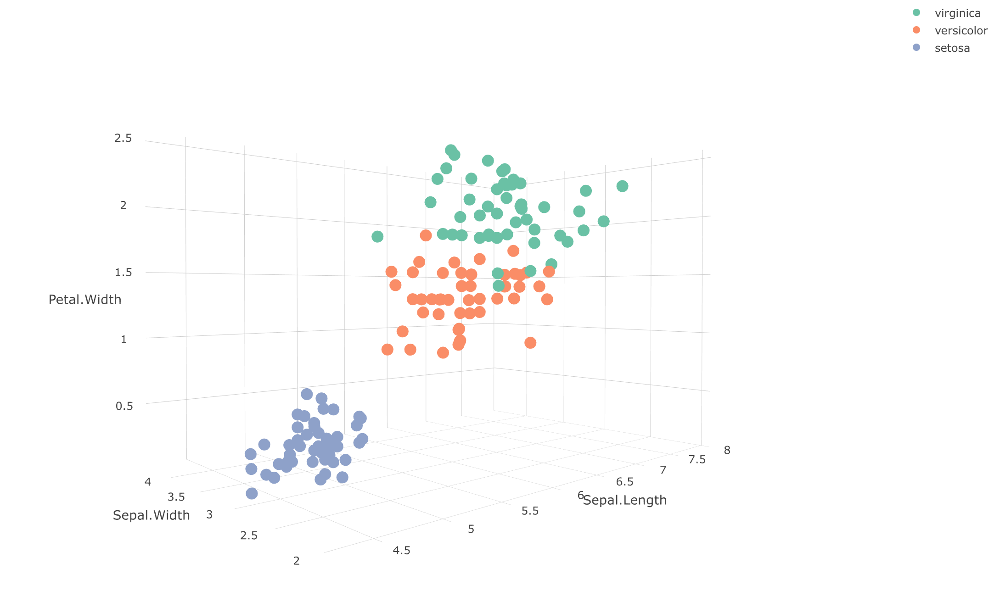
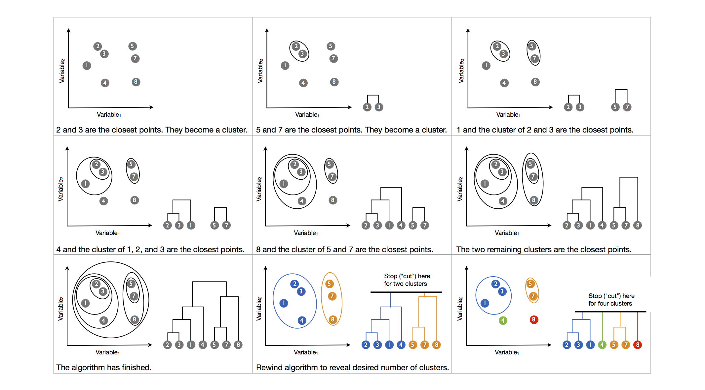
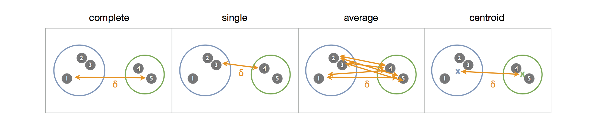
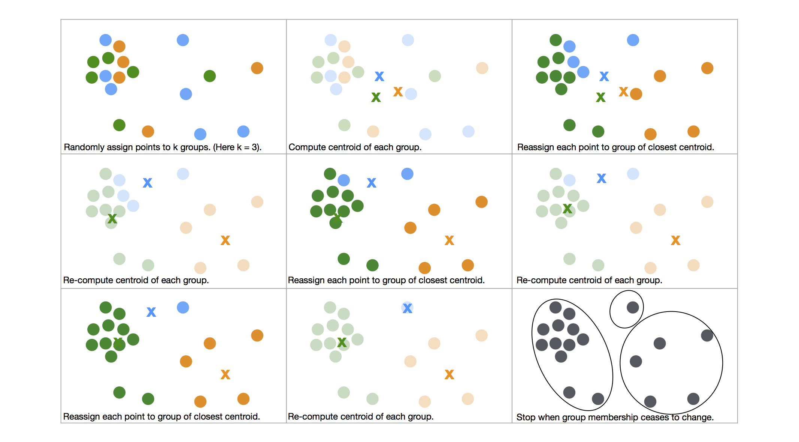

## Visualizing three or more variables

In general, outliers, clusters, and patterns become easier to spot as you look at the interaction of more and more variables. However, as you include more variables in your plot, data becomes harder to visualize.

You can extend scatterplots into three dimensions with the plotly, rgl, rglwidget, and threejs packages (among others). Each creates a "three dimensional," graph that you can rotate with your mouse. Below is an example from plotly, displayed as a static image.

```{r eval = FALSE}
library(plotly)
plot_ly(data = iris, x = Sepal.Length, y = Sepal.Width, z = Petal.Width, 
        color = Species, type = "scatter3d", mode = "markers")
```

```{r, echo = FALSE}

```

You can extend this approach into n-dimensional hyperspace with the ggobi package, but you will soon notice a weakness of multidimensional graphs. You can only visualize multidimensional space by projecting it onto your two dimensional retinas. In the case of 3D graphics, you can combine 2D projections with rotation to create an intuitive illusion of 3D space, but the illusion ceases to be intuitive as soon as you add a fourth dimension.

This doesn't mean that you should ignore complex interactions in your data. You can explore multivariate relationships in several ways. You can

* visualize each combination of variables in a multivariate relationship, two at a time

* use aesthetics and facetting to add additional variables to a 2D plot

* use a clustering algorithm to spot clusters in multivariate space

* use a modeling algorithm to spot patterns and outliers in multivariate space

## Clusters

Cluster algorithms are automated tools that seek out clusters in n-dimensional space for you. Base R provides two easy to use clustering algorithms: hierarchical clustering and k means clustering.

### Hierarchical clustering

Hierarchical clustering uses a simple algorithm to locate groups of points that are near each other in n-dimensional space:

1. Identify the two points that are closest to each other
2. Combine these points into a cluster
3. Treat the new cluster as a point
4. Repeat until all of the points are grouped into a single cluster

You can visualize the results of the algorithm as a dendrogram, and you can use the dendrogram to divide your data into any number of clusters. The figure below demonstrates how the algorithm would proceed in a two dimensional dataset. 

```{r, echo = FALSE}

```

To use hierarchical clustering in R, begin by selecting the numeric columns from your data; you can only apply hierarchical clustering to numeric data. Then apply the `dist()` function to the data and pass the results to `hclust()`. `dist()` computes the distances between your points in the n dimensional space defined by your numeric vectors. `hclust()` performs the clustering algorithm.

```{r}
small_iris <- sample_n(iris, 50)
  
iris_hclust <- small_iris %>% 
  select(Sepal.Length, Sepal.Width, Petal.Length, Petal.Width) %>% 
  dist() %>% 
  hclust(method = "complete")
```

Use `plot()` to visualize the results as a dendrogram. Each observation in the dataset will appear at the bottom of the dendrogram labeled by its rowname. You can use the labels argument to set the labels to something more informative.

```{r fig.height = 4}
plot(iris_hclust, labels = small_iris$Species)
```

To see how near two data points are to each other, trace the paths of the data points up through the tree until they intersect. The y value of the intersection displays how far apart the points are in n-dimensional space. Points that are close to each other will intersect at a small y value, points that are far from each other will intersect at a large y value. Groups of points that are near each other will look like "leaves" that all grow on the same "branch." The ordering of the x axis in the dendrogram is somewhat arbitrary (think of the tree as a mobile, each horizontal branch can spin around meaninglessly). 

You can split your data into any number of clusters by drawing a horizontal line across the tree. Each vertical branch that the line crosses will represent a cluster that contains all of the points downstream from the branch. Move the line up the y axis to intersect fewer branches (and create fewer clusters), move the line down the y axis to intersect more branches and (create more clusters).

`cutree()` provides a useful way to split data points into clusters. Give cutree the output of `hclust()` as well as the number of clusters that you want to split the data into. `cutree()` will return a vector of cluster labels for your dataset. To visualize the results, map the output of `cutree()` to an aesthetic.

```{r}
(clusters <- cutree(iris_hclust, 3))

ggplot(small_iris, aes(x = Sepal.Width, y = Sepal.Length)) +
  geom_point(aes(color = factor(clusters)))
```

You can modify the hierarchical clustering algorithm by setting the method argument of hclust to one of "complete", "single", "average", or "centroid". The method determines how to measure the distance between two clusters or a lone point and a cluster, a measurement that affects the outcome of the algorithm.

```{r, echo = FALSE}

```

* *complete* - Measures the greatest distance between any two points in the separate clusters. Tends to create distinct clusters and subclusters.

* *single* - Measures the smallest distance between any two points in the separate clusters. Tends to add points one at a time to existing clusters, creating ambiguously defined clusters.

* *average* - Measures the average distance between all combinations of points in the separate clusters. Tends to add points one at a time to existing clusters.

* *centroid* - Measures the distance between the average location of the points in each cluster.


```{r fig.height = 4}
small_iris %>% 
  select(Sepal.Length, Sepal.Width, Petal.Length, Petal.Width) %>% 
  dist() %>% 
  hclust(method = "single") %>% 
  plot(labels = small_iris$Species)
```


### K means clustering

K means clustering provides a simulation based alternative to hierarchical clustering. It identifies the "best" way to group your data into a predefined number of clusters. The figure below visualizes (in two dimensional space) the k means algorithm:

1. Randomly assign each data point to one of $k$ groups
2. Compute the centroid of each group
3. Reassign each point to the group whose centroid it is nearest to
4. Repeat steps 2 and 3 until group memberships cease to change

```{r, echo = FALSE}

```

Use `kmeans()` to perform k means clustering with R. As with hierarchical clustering, you can only apply k means clustering to numerical data. Pass your numerical data to the `kmeans()` function, then set `center` to the number of clusters to search for ($k$) and `nstart` to the number of simulations to run. Since the results of k means clustering depend on the initial assignment of points to groups, which is random, R will run `nstart` simulations and then return the best results (as measured by the minimum sum of squared distances between each point and the centroid of the group it is assigned to). Finally, set the maximum number of iterations to let each simulation run in case the simulation cannot quickly find a stable grouping.

```{r}
iris_kmeans <- small_iris %>% 
  select(Sepal.Length, Sepal.Width, Petal.Length, Petal.Width) %>% 
  kmeans(centers = 3, nstart = 20, iter.max = 50)

iris_kmeans$cluster
```

Unlike `hclust()`, the k means algorithm does not provide an intuitive visual interface. Instead, `kmeans()` returns a kmeans class object. Subset the object with `$cluster` to access a list of cluster assignments for your dataset, e.g. `iris_kmeans$cluster`. You can visualize the results by mapping them to an aesthetic, or you can apply the results by passing them to dplyr's `group_by()` function.

```{r}
ggplot(small_iris, aes(x = Sepal.Width, y = Sepal.Length)) +
  geom_point(aes(color = factor(iris_kmeans$cluster)))

small_iris %>% 
  group_by(iris_kmeans$cluster) %>% 
  summarise(n_obs = n(), avg_width = mean(Sepal.Width), avg_length = mean(Sepal.Length))
```


### Asking questions about clustering

Ask the same questions about clusters that you find with `hclust()` and `kmeans()` that you would ask about clusters that you find with a graph. Ask yourself:

* Do the clusters seem to identify real differences between your points? How can you tell?

* Are the points within each cluster similar in some way?

* Are the points in separate clusters different in some way?

* Might there be a mismatch between the number of clusters that you found and the number that exist in real life? Are only a couple of the clusters meaningful? Are there more clusters in the data than you found?

* How stable are the clusters if you rerun the algorithm?

Keep in mind that both algorithms _will always_ return a set of clusters, whether your data appears clustered or not. As a result, you should always be skeptical about the results. They can be quite insightful, but there is no reason to treat them as a fact without doing further research. 
