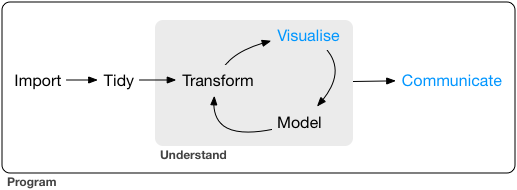

# (PART) Communicate {-}

# Introduction

Parts 1 through 4 have shown you how to understand what is happening in your data, but it won't matter how well you understand your data if you cannot communicate what you find with others. To be effective, you will need to share your work in a way that your audience can comprehend. Your audience might be 

* fellow scientists who will want to reproduce the work
* non-scientists who will want to understand your findings in plain terms
* or yourself (in the future) who will be thankful if you make your work easy to re-learn and recreate 

__Part 5__ discusses communication, and how you can use R Markdown to save and share your work in an incredibly efficient way.

```{r echo = FALSE, out.width = "75%"}

```

Recommendations for learning more about communication:

For writing: [Style: Lessons in Clarity and Grace](http://amzn.com/0321898680), <http://www.americanscientist.org/issues/id.877,y.0,no.,content.true,page.1,css.print/issue.aspx>

For presentations: [slide:ology](http://amzn.com/0596522347), <http://www.howtogiveatalk.com>, <https://github.com/jtleek/talkguide> (academic), http://speaking.io, https://www.coursera.org/learn/public-speaking

For expository visulisations: WSJ guide?

Design: [The Non-Designer's Design Book](http://amzn.com/0133966151)
