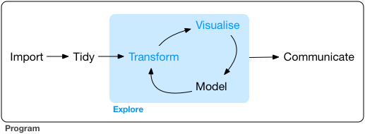

# (PART) Explore {-}

# Introduction {#explore-intro}

The goal of the first part of this book is to get you up to speed with the basic tools of __data exploration__ as quickly as possible. Data exploration is the art of looking at your data, rapidly generating hypotheses, quickly testing them, then repeating again and again and again. The goal of data exploration is to generate many promising leads that you can later explore in more depth.

```{r echo = FALSE, out.width = "75%"}

```

In this part of the book you will learn some useful tools that have an immediate payoff: 

*   Visualisation is a great place to start with R programming, because the 
    payoff is so clear: you get to make elegant and informative plots that help 
    you understand data. In [data visualisation] you'll dive into visualisation, 
    learning the basic structure of a ggplot2 plot, and powerful techniques for 
    turning data into plots. 

*   Visualisation alone is typically not enough, so in [data transformation] 
    you'll learn the key verbs that allow you to select important variables, 
    filter out key observations, create new variables, and compute summaries.
  
*   Finally, in [exploratory data analysis], you'll combine visualisation and
    transformation with your curiosity and scepticism to ask and answer 
    interesting questions about data.

Modelling is an important part of the exploratory process, but you don't have the skills to effectively learn or apply it yet. We'll come back to it in [modelling](#model-intro), once you're better equipped with more data wrangling and programming tools.

Nestled among these three chapters that teach you the tools of exploration are three chapters that focus on your R workflow. In [workflow: basics], [workflow: scripts], and [workflow: projects] you'll learn good practices for writing and organising your R code. These will set you up for success in the long run, as they'll give you the tools to stay organised when you tackle real projects.
