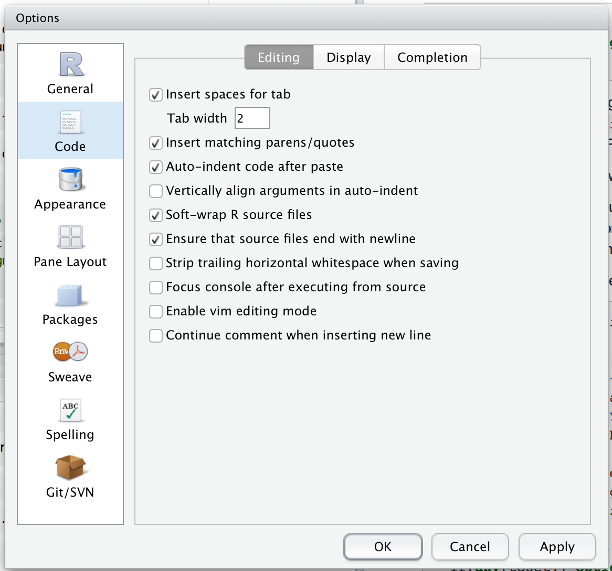

# Functions

One of the best ways to grow in your skills as a data scientist in R is to write functions. Functions allow you to automate common tasks, instead of using copy-and-paste. Writing good functions is a lifetime journey: you won't learn everything but you'll hopefully get to start walking in the right direction.

## When should you write a function?

Whenever you've copied and pasted code more than twice, you need to take a look at it and see if you can extract out the common components and make a function. For example, take a look at this code. What does it do?

```{r}
df <- data.frame(
  a = rnorm(10),
  b = rnorm(10),
  c = rnorm(10),
  d = rnorm(10)
)

df$a <- (df$a - min(df$a, na.rm = TRUE)) / 
  (max(df$a, na.rm = TRUE) - min(df$a, na.rm = TRUE))
df$b <- (df$b - min(df$b, na.rm = TRUE)) / 
  (max(df$a, na.rm = TRUE) - min(df$b, na.rm = TRUE))
df$c <- (df$c - min(df$c, na.rm = TRUE)) / 
  (max(df$c, na.rm = TRUE) - min(df$c, na.rm = TRUE))
df$d <- (df$d - min(df$d, na.rm = TRUE)) / 
  (max(df$d, na.rm = TRUE) - min(df$d, na.rm = TRUE))
```

You might be able to puzzle out that this rescales each column to 0--1. But did you spot the mistake? I made an error when copying-and-pasting the code for `df$b`, and I forgot to change an `a` to a `b`. Extracting repeated code out into a function is a good idea because it helps make your code more understandable (because you can name the operation), and it prevents you from making this class of errors.

To write a function you need to first analyse the operation. How many inputs does it have?

```{r, eval = FALSE}
(df$a - min(df$a, na.rm = TRUE)) /
  (max(df$a, na.rm = TRUE) - min(df$a, na.rm = TRUE))
```

This code only has one input: `df$a`. (You might argue that `TRUE` is also an input: I don't think it is here, but there are other scenarios in which it might be.)

To make that more clear, it's a good idea to rewrite the code using some temporary variables. Here this function only takes one input, so I'll call it `x`:

```{r}
x <- 1:10
(x - min(x, na.rm = TRUE)) / (max(x, na.rm = TRUE) - min(x, na.rm = TRUE))
```

There is some duplication in this code: I'm computing the `min()` and `max()` multiple times, and I could instead do that in one step:

```{r}
rng <- range(x, na.rm = TRUE)
(x - rng[1]) / (rng[2] - rng[1])
```

Now that I've simplified the code, and checked that it still works, I can turn it into a function:

```{r}
rescale01 <- function(x) {
  rng <- range(x, na.rm = TRUE)
  (x - rng[1]) / (rng[2] - rng[1])
}
rescale01(c(0, 5, 10))
```

There are three key components here:

1.  The name of the function, `rescale01`. 

1.  The call to `function` listing each argument to the function. Sometimes 
    these are called _formal_ arguments to distinguish them from the specific
    arguments used in a given call. 

1.  The body of the function wrapped in `{`. This does the computation, and
    the function returns the last evaluated statement.

Note the process that I followed here: I constructed the `function` last. It's much easier to start with code that works on a sample input and then turn it into a function rather than the other way around. You're more likely to get to your final destination if you take small steps and check your work after each step.

Now we can use that to simplify our original example:

```{r}
df$a <- rescale01(df$a)
df$b <- rescale01(df$b)
df$c <- rescale01(df$c)
df$d <- rescale01(df$d)
```

There are two advantages to using a funtion:

1.  We can name the operation. Naming functions well is hard, but important,
    because it makes your code much easier to understand.
  
1.  We avoid one class of copy-and-paste errors. 

However, we still have quite a bit of duplication: we're still doing the same thing to multiple columns. You'll learn how to deal with that in the iteration chapter, but first, you'll need to learn more about functions.

### Practice

1.  Why is `TRUE` not a parameter to `rescale01()`? What would happen if
    `x` containing a missing value, and `na.rm` was `FALSE`.

1.  Practice turning the following code snippets into functions. Think about 
    what each function does. What would you call it? How many arguments does it
    need? Can you rewrite it to be more expressive or less duplicative?

    ```{r, eval = FALSE}
    mean(is.na(x))
    
    x / sum(x, na.rm = TRUE)
    
    sd(x, na.rm = TRUE) / mean(x, na.rm = TRUE)
    ```

1.  Follow <http://nicercode.github.io/intro/writing-functions.html> to 
    write your own functions to compute the variance and skew of a vector.

1.  Implement a `fizzbuzz` function. It take a single number as input. If
    the number is divisible by three, return "fizz". If it's divisible by
    five return "buzz". If it's divisible by three and five, return "fizzbuzz".
    Otherwise, return the number.

1.  What do the following functions do? Why are they useful even though they
    are so short?
    
    ```{r}
    is_directory <- function(x) file.info(x)$isdir
    is_readable <- function(x) file.access(x, 4) == 0
    ```

1.  Read the [complete lyrics](https://en.wikipedia.org/wiki/Little_Bunny_Foo_Foo) 
    to "Little Bunny Foo". There's a lot of duplication in this song. 
    Extend the initial piping example to recreate the complete song, using 
    functions to reduce duplication.

## Functions for humans

It's important to remember that functions are not just for the computer, but are also for humans. R doesn't care what your function is called, or what comments it contains, but there are important for human readers. This section discusses some things that you should bear in mind when naming and commenting your functions.

There are few rules for naming your functions, but lots of suggestions. I strongly recommend using only lowercase, and separating multiple words with underscores ("snake\_case"). Camel case is a legitimate alternative, but be consistent: pick either snake\_case or camelCase for your code, don't mix them.

Generally, function names should be verbs, and arguments should be nouns. There are some exceptions: nouns are ok if the function computes a very well known noun (i.e. `mean()` is better than `compute_mean()`), or accessing some property of an object (i.e. `coef()` is better than `get_coefficients()`). A good sign that a noun might be a better choice is if you're using a very broad verb like get, or compute, or calculate, or determine. Use your best judgement and don't be afraid to rename a function if you later figure out a better name.

Ideally the name of your function will be short, but clearly evoke what the function does. However, concise names are hard, and autocomplete makes it easy to type long names, so it's better to err on the side of clear descriptions, rather than concise names.

```{r, eval = FALSE}
# Good


day_one
day_1

# Bad
f <- function(x, y, z) {}

first_day_of_the_month
DayOne
dayone
djm1
d1
```

There are also a handful of few very short names that are used very commonly. It's worth remembering these and using in your own functions:

* `x`, `y`, `z`: vectors.
* `df`: a data frame.
* `i`, `j`: numeric indices (typically rows and columns).
* `n`: length, or number of rows.
* `p`: number of columns.

If you have a family of functions that do similar things, make sure they have consistent names and arguments. Use a common prefix to indicate that they are connected. That's better than a common suffix because autocomplete allows you to type the prefix and see all the members of the family.

```{r}
# Good
input_select
input_checkbox
input_text

# Not so good
select_input
checkbox_input
text_input
```

Where possible, avoid using names of common existing functions and variables. It's impossible to do in general because so many good names are already taken by other packages, but avoiding the most common names from base R will avoid confusion:

```{r, eval = FALSE}
# Don't do this!
T <- FALSE
c <- 10
mean <- function(x) sum(x)
```

Use comments, `#`, to explain the "why" of your code. You generally should avoid comments that explain the "what" or the "how". If you can't understand what the code does from reading, you should think about how to rewrite it to be more clear. Do you need to add some intermediate variables with useful names? Do you need to break out a subcomponent of a large function so you can describe it with a name? However, your code can never capture the reasoning behind your decisions: why do you choose this approach instead of an alternative? It's a great idea to capture that sort of thinking in a comment so that when you come back to your analysis in the future, you can jog your memory about the why.

Another important use of comments is to break up your file into easily readable chunks. Use long lines of `-` and `=` to make it easy to spot the breaks. RStudio even provides a keyboard shortcut to add this: Cmd/Ctrl + Shift + R. 

```{r, eval = FALSE}
# Load data ---------------------------

# Plot data ---------------------------
```

### Exercises

1.  Read the source code for each of the following three functions, puzzle out
    what they do, and then brainstorm good names.
    
    ```{r}
    f1 <- function(string, prefix) {
      substr(string, 1, nchar(prefix)) == prefix
    }
    f2 <- function(x) {
      if (length(x) <= 1L) return(NULL)
      x[-length(x)]
    }
    f3 <- function(x, y) {
      rep(y, length.out = length(x))
    }
    ```
    
1.  Take a function that you've written recently and spend 5 minutes 
    brainstorming a better name for it and its arguments.

## Conditional execution

An `if` statement allows you to conditionally execute code. It has the following form:

```{r, eval = FALSE}
if (condition) {
  # code executed when condition is TRUE
} else {
  # code executed when condition is FALSE
}
```

To get help on if you need to surround it in backticks: `` ?`if` ``.

Here's a simple function that uses an if statement. The goal of this function is to return a logical vector describing whether or not each element of a vector is named.

```{r}
has_name <- function(x) {
  nms <- names(x)
  if (is.null(nms)) {
    rep(FALSE, length(x))
  } else {
    !is.na(nms) & nms != ""
  }
}
```


Squiggly brackets are always optional (both here and in function definitons), but I recommend using them because it makes it easier to see the hierarchy in your code. An opening curly brace should never go on its own line and should always be followed by a new line. A closing curly brace should always go on its own line, unless it's followed by `else`. Always indent the code inside curly braces.

```{r, eval = FALSE}
# Good

if (y < 0 && debug) {
  message("Y is negative")
}

if (y == 0) {
  log(x)
} else {
  y ^ x
}

# Bad

if (y < 0 && debug)
message("Y is negative")

if (y == 0) {
  log(x)
} 
else {
  y ^ x
}
```

If `condition` isn't a single `TRUE` or `FALSE` you'll get a warning or error.

You can use `||` (or) and `&&` (and) to combine multiple logical expressions. These operators a "short-circuiting": as soon as `||` sees the first `TRUE` it returns `TRUE` without computing anything else. As soon as `&&` sees the first `FALSE` it returns `FALSE`.

Like a function, an `if` statement "returns" the last expression it evaluated. This means you can assign the result of an `if` statement to a variable:

```{r}
y <- 10
x <- if (y < 20) "Too low" else "Too high"
```

I recommend doing this only if the if statement is very short, otherwise it's easier to read:

```{r}
if (y < 20) {
  x <- "Too low" 
} else {
  x <- "Too high"
}
```

(Note there's a built in function that does this for you: `cut()`. The above call is the same as `cut(y, c(-Inf, 20, Inf), c("Too low", "Too high"))`. It returns a factor, and generalises better for large numbers of splits)

This allows you to write compact functions:

```{r}
greeting <- function(time = lubridate::now()) {
  hour <- lubridate::hour(time)
  
  if (hour < 12) {
    "Good morning"
  } else if (hour < 18) {
    "Good afternoon"
  } else {
    "Good evening"
  }
}
greeting()
```

Another useful technique is the `switch()` function. It allows you to evaluate selected code based on position or name.

```{r}
function(x, y, op) {
  switch(op,
    plus = x + y,
    minus = x - y,
    times = x * y,
    divide = x / y,
    stop("Unknown op!")
  )
}
```

Neither `if` not `switch` are vectorised: they work with a single value at a time. 

## Arguments

Note that arguments in R are lazily evaluated: they're not computed until they're needed. That means if they're never used, they're never called. This is an important property of R the programming language, but is unlikely to be important to you for a while. You can read more about lazy evaluation at <http://adv-r.had.co.nz/Functions.html#lazy-evaluation>

Often the arguments to a function fall into two broad sets: one set supplies the data to compute on, and the other supplies arguments that controls the details of the computation. For example:

* In `log()`, the data is `x`, and the base of the logarithm is `base`.

* In `mean()`, the data is `x`, and `trim` and `na.rm` control the computation.

* In `t.test()`, the data is `x` and `y`, and `alternative`, `mu`, `paired`,
  `var.equal`, and `conf.level` control the details of the test.
  
* In `paste()` you can supply unlimited strings to `...`, and the pasting
  is controlled by `sep` and `collapse`.
  
Generally, the arguments that control computation have default values so you don't need to supply the most commonly used values.

In almost all cases, the default value should be the value that is used most commonly. There are a few exceptions to do with safety. For example, `na.rm` should always have default value `FALSE` even though `TRUE` is what you usually want if you have missing values. The default forces you to confront and deal with the missingness in your data, rather than allowing it to silently propagate.


You can choose to supply default values to your arguments for common options. This is useful so that you don't need to repeat yourself all the time.

```{r}
foo <- function(x = 1, y = TRUE, z = 10:1) {
  
}
```

Whenever you have a mix of arguments with and without defaults, those without defaults should come first.

Default values can depend on other arguments but don't overuse this technique as it's possible to create code that is very difficult to understand. What does this function do?

```{r}
bar <- function(x = y + 1, y = x - 1) {
  x * y
}
```

### Arguments that take value from a set

`match.arg()`

### Dot dot dot

There's a special argument that's used quite commonly: `...` (pronounced dot-dot-dot). This captures any other arguments not otherwise matched. It's useful because you can then send those `...` on to another argument. This is a useful catch-all if your function primarily wraps another function.  For example, you might have written your own wrapper designed to add linear model lines to a ggplot:

```{r}
geom_lm <- function(formula = y ~ x, colour = alpha("steelblue", 0.5), 
                    size = 2, ...)  {
  geom_smooth(formula = formula, se = FALSE, method = "lm", colour = colour,
    size = size, ...)
}
```

```{r}
commas <- function(...) paste0(..., collapse = ", ")

rule <- function(..., pad = "-") {
  title <- paste0(...)
  width <- getOption("width") - nchar(title) - 5
  cat(title, " ", paste(rep(pad, width, collapse = "")), "\n", sep = "")
}
```

This allows you to use any other arguments of `geom_smooth()`, even those that aren't explicitly listed in your wrapper (and even arguments that don't exist yet in the version of ggplot2 that you're using).

If you just want to get the values of the `...`, use `list(...)`.

### Exercises

1.  What happens if you call `bar()`? What does the error message mean?

1.  What happens if you try to override the method in `geom_lm()` created
    above (e.g. `geom_lm(method = "glm")`? Why?

## Body

The body of the function does the actual work. The value returned by the function is the last statement it evaluates. Unlike other languages all statements in R return a value. 

### Return values

You can explicitly return early from a function with `return()`. I think it's best to save the use of `return()` to signal that you can return early with a simpler solution. For example, you might write an if statement like this:

```{r, eval = FALSE}
f <- function() {
  if (x) {
    # Do 
    # something
    # that
    # takes
    # many
    # lines
    # to
    # express
  } else {
    # return something short
  }
}
```

But if the first block is very long, by the time you get to the else, you've forgotten what's going on. One way to rewrite it is to use an early return for the simple case:

```{r, eval = FALSE}

f <- function() {
  if (!x) {
    return(something_short)
  }

  # Do 
  # something
  # that
  # takes
  # many
  # lines
  # to
  # express
}
```

This tends to make the code easier to understand, because you don't need quite so much context to understand it.


### Invisible values

Some functions return "invisible" values. These are not printed out by default but can be saved to a variable:

```{r}
f <- function() {
  invisible(42)
}

f()

x <- f()
x
```

You can also force printing by surrounding the call in parentheses:

```{r}
(f())
```

Invisible values are mostly used when your function is called primarily for its side-effects (e.g. printing, plotting, or saving a file). It's nice to be able pipe such functions together, so returning the main input value is useful. This allows you to do things like:

```{r, eval = FALSE}
library(readr)

mtcars %>% 
  write_csv("mtcars.csv") %>% 
  write_tsv("mtcars.tsv")
```

## Environment

The environment of a function controls how R finds the value associated with a name. For example, take this function:

```{r}
f <- function(x) {
  x + y
} 
```

In many programming languages, this would be an error, because `y` is not defined inside the function. In R, this is valid code because R uses rules called lexical scoping to determine the value associated with a name. Since `y` is not defined inside the function, R will look where the function was defined:

```{r}
y <- 100
f(10)

y <- 1000
f(10)
```

This behaviour seems like a recipe for bugs, and indeed you should avoid creating functions like this deliberately, but by and large it doesn't cause too many problems (especially if you regularly restart R to get to a clean slate). The advantage of this behaviour is that from a language standpoint it allows R to be very consistent. Every name is looked up using the same set of rules. For `f()` that includes the behaviour of two things that you might not expect: `{` and `+`.

This allows you to do devious things like:

```{r}
`+` <- function(x, y) {
  if (runif(1) < 0.1) {
    sum(x, y)
  } else {
    sum(x, y) * 1.1
  }
}
table(replicate(1000, 1 + 2))
rm(`+`)
```

This is a common phenomenon in R. R gives you a lot of control. You can do many things that are not possible in other programming languages. You can things that 99% of the time extremely ill-advised (like overriding how addition works!), but this power and flexibility is what makes tools like ggplot2 and dplyr possible. Learning how to make good use of this flexibility is beyond the scope of this book, but you can read about in "Advanced R".

## Errors

```{r}
try_require <- function(package, fun) {
  if (requireNamespace(package, quietly = TRUE)) {
    library(package, character.only = TRUE)
    return(invisible())
  }

  stop("Package `", package, "` required for `", fun , "`.\n",
    "Please install and try again.", call. = FALSE)
}
```

Another place where it's useful to throw errors is if the inputs to the function are the wrong type.  It's a good idea to throw an error early.

`stopifnot()`.

## Non-standard evaluation

One challenge with writing functions is that many of the functions you've used in this book use non-standard evaluation to minimise typing. This makes these functions great for interactive use, but it does make it more challenging to program with them, because you need to use more advanced techniques. For example, imagine you'd written the following duplicated code across a handful of data analysis projects:

```{r, eval = FALSE}
mtcars %>% 
  group_by(cyl) %>% 
  summarise(mean = mean(mpg, na.rm = TRUE), n = n()) %>% 
  filter(n > 10) %>% 
  arrange(desc(mean))

ggplot2::diamonds %>% 
  group_by(cut) %>% 
  summarise(mean = mean(price, na.rm = TRUE), n = n()) %>% 
  filter(n > 10) %>% 
  arrange(desc(mean))

nycflights13::planes %>% 
  group_by(model) %>% 
  summarise(mean = mean(year, na.rm = TRUE), n = n()) %>% 
  filter(n > 100) %>% 
  arrange(desc(mean))
```

You'd like to be able to write a function with arguments data frame, group and variable so you could rewrite the above code as:

```{r, eval = FALSE}
mtcars %>% 
  mean_by(cyl, mpg, n = 10)

ggplot2::diamonds %>% 
  mean_by(cut, price, n = 10)

nycflights13::planes %>% 
  mean_by(model, year, n = 100)
```

Unfortunately the obvious approach doesn't work:

```{r}
mean_by <- function(data, group_var, mean_var, n = 10) {
  data %>% 
    group_by(group_var) %>% 
    summarise(mean = mean(mean_var, na.rm = TRUE), n = n()) %>% 
    filter(n > 100) %>% 
    arrange(desc(mean))
}
```

This fails because it tells dplyr to group by `group_var` and compute the mean of `mean_var` neither of which exist in the data frame. 

Writing reusable functions for ggplot2 poses a similar problem because `aes(group_var, mean_var)` would look for variables called `group_var` and `mean_var`. It's really only been in the last couple of months that I fully understood this problem, so there aren't currently any great (or general) solutions. However, now that I've understood the problem I think there will be some systematic solutions in the near future.


## Code style {#style}

Good coding style is like using correct punctuation. You can manage without it, but it sure makes things easier to read. As with styles of punctuation, there are many possible variations. Below I describe my style, which is used in this book and in all my packages. You don't have to use my style, but I strongly recommend that you use a consistent style and you document it. If you're working on someone else's code, don't impose your own style. Instead, read their style documentation and follow it as closely as possible.

Good style is important because while your code only has one author, it will usually have multiple readers. This is especially true when you're writing code with others. In that case, it's a good idea to agree on a common style up-front. Since no style is strictly better than another, working with others may mean that you'll need to sacrifice some preferred aspects of your style.

### Spacing

Place spaces around all infix operators (`=`, `+`, `-`, `<-`, etc.). The same rule applies when using `=` in function calls. Always put a space after a comma, and never before (just like in regular English).

```{r, eval = FALSE}
# Good
average <- mean(feet / 12 + inches, na.rm = TRUE)

# Bad
average<-mean(feet/12+inches,na.rm=TRUE)
```

There's a small exception to this rule: `:`, `::` and `:::` don't need spaces around them.

```{r, eval = FALSE}
# Good
x <- 1:10
base::get

# Bad
x <- 1 : 10
base :: get
```

Place a space before left parentheses, except in a function call.

```{r, eval = FALSE}
# Good
if (debug) do(x)
plot(x, y)

# Bad
if(debug)do(x)
plot (x, y)
```

Extra spacing (i.e., more than one space in a row) is ok if it improves alignment of equal signs or assignments (`<-`).

```{r, eval = FALSE}
list(
  total = a + b + c, 
  mean  = (a + b + c) / n
)
```

Do not place spaces around code in parentheses or square brackets (unless there's a comma, in which case see above).

```{r, eval = FALSE}
# Good
if (debug) do(x)
diamonds[5, ]

# Bad
if ( debug ) do(x)  # No spaces around debug
x[1,]   # Needs a space after the comma
x[1 ,]  # Space goes after comma not before
```

### Line length

Strive to limit your code to 80 characters per line. This fits comfortably on a printed page with a reasonably sized font. If you find yourself running out of room, this is a good indication that you should encapsulate some of the work in a separate function.

### Indentation

When indenting your code, use two spaces. Never use tabs or mix tabs and spaces. I recommend the following configuration in RStudio:

```{r, echo = FALSE}

```

The only exception is if a function definition runs over multiple lines. In that case, indent the second line to where the definition starts:

```{r, eval = FALSE}
long_function_name <- function(a = "a long argument", 
                               b = "another argument",
                               c = "another long argument") {
  # As usual code is indented by two spaces.
}
```

