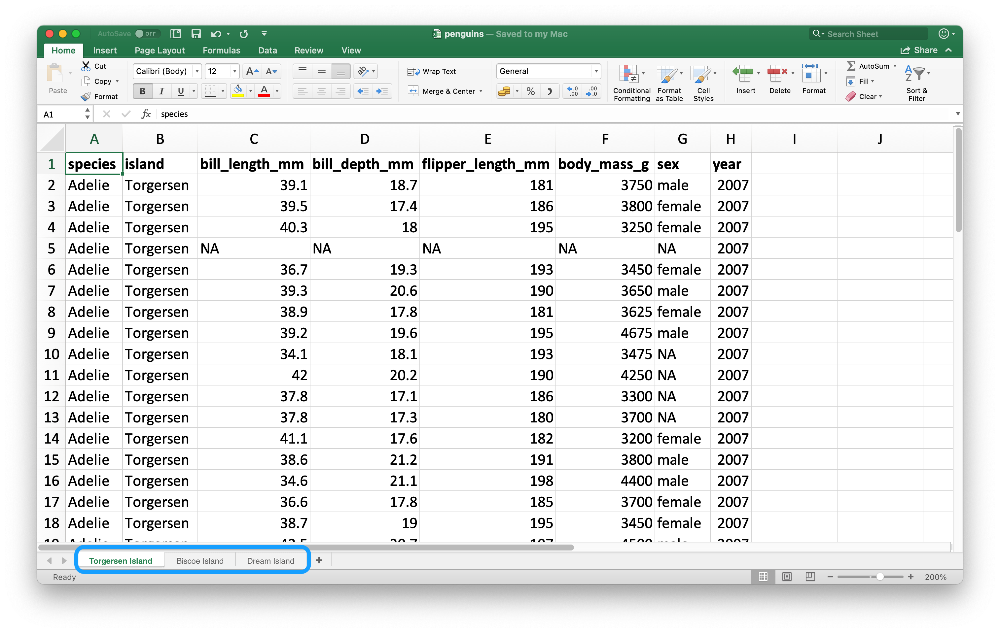
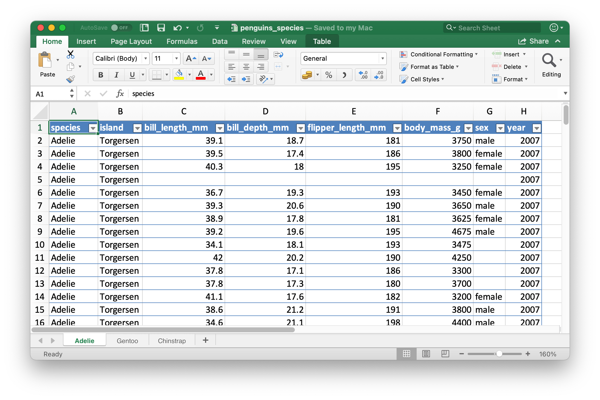

# Spreadsheets {#import-spreadsheets}

## Introduction

So far you have learned about importing data from plain text files, e.g. `.csv` and `.tsv` files.
Sometimes you need to analyze data that lives in a spreadsheet.
In this chapter we will introduce you to tools for working with data in Excel spreadsheets and Google Sheets.
This will build on much of what you've learned in Chapter \@ref(data-import) and Chapter \@ref(import-rectangular), but we will also discuss additional considerations and complexities when working with data from spreadsheets.

If you or your collaborators are using spreadsheets for organizing data, we strongly recommend reading the paper "Data Organization in Spreadsheets" by Karl Broman and Kara Woo: <https://doi.org/10.1080/00031305.2017.1375989>.
The best practices presented in this paper will save you much headache down the line when you import the data from a spreadsheet into R to analyse and visualise.

## Excel

### Prerequisites

In this chapter, you'll learn how to load data from Excel spreadsheets in R with the **readxl** package.
This package is not part of the core tidyverse, therefore you need to load it individually, but since the package is part of the non-core tidyverse packages, you don't need to install it individually if you already have tidyverse installed.
We will also use tidyverse in the examples.

```{r}
library(readxl)
library(tidyverse)
```

### Getting started

Most of readxl's functions allow you to load Excel spreadsheets into R:

-   `read_xls()` reads Excel files with `xls` format.
-   `read_xlsx()` read Excel files with `xlsx` format.
-   `read_excel()` can read files with both `xls` and `xlsx` format. It guesses the file type based on the input.

These functions all have similar syntax just like other functions we have previously introduced for reading other types of files, e.g. `read_csv()`, `read_table()`, etc.
For the rest of the chapter we will focus on using `read_excel()`.

### Reading spreadsheets

Figure \@ref(fig:students-excel) shows what the spreadsheet we're going to read into R looks like in Excel.

```{r students-excel, fig.alt = "A look at the students spreadsheet in Excel. The spreadsheet contains information on 6 students, their ID, full name, favourite food, meal plan, and age.", fig.cap = "Spreadsheet called students.xlsx in Excel.", echo = FALSE}
knitr::include_graphics("images/import-spreadsheets-students.png")
```

The first argument to `read_excel()` is the path to the file to read.

```{r}
students <- read_excel("data/students.xlsx")
```

`read_excel()` will read the file in as a tibble.

```{r}
students
```

We have six students in the data and five variables on each student.
However there are a few things we might want to address in this dataset:

1.  The column names are all over the place.
    You can provide column names that follow consistent format (we recommend `snake_case` using the `col_names` argument.

    ```{r}
    read_excel(
      "data/students.xlsx",
      col_names = c("student_id", "full_name", "favourite_food", "meal_plan", "age")
    )
    ```

    Note that this didn't quite do the trick.
    You now have the variable names we want, but what was previously the header row now shows up as the first observation in the data.
    You can explicitly skip that row using the `skip` argument.

    ```{r}
    read_excel(
      "data/students.xlsx",
      col_names = c("student_id", "full_name", "favourite_food", "meal_plan", "age"),
      skip = 1
    )
    ```

2.  In the `favourite_food` column, one of the observations is `N/A`, which stands for "not available" but it's currently not recognized as an `NA` (note the contrast between this `N/A` and the age of the fourth student in the list).
    You can specify which character strings should be recognized as `NA`s with the `na` argument.
    By default, only `""` (empty string, or, in the case of reading from a spreadsheet, an empty cell) is recognized as an `NA`.

    ```{r}
    read_excel(
      "data/students.xlsx",
      col_names = c("student_id", "full_name", "favourite_food", "meal_plan", "age"),
      skip = 1,
      na = c("", "N/A")
    )
    ```

3.  One other remaining issue is that `age` is read in as a character variable, but it really should be numeric.
    Just like with `read_csv()` and friends for reading data from flat files, you can supply a `col_types` argument to `read_excel()` and specify the column types for the variables you read in.
    Note that the syntax is a bit different, though.
    Your options are `"skip"`, `"guess"`, `"logical"`, `"numeric"`, `"date"`, `"text"` or `"list"`.

    ```{r}
    read_excel(
      "data/students.xlsx",
      col_names = c("student_id", "full_name", "favourite_food", "meal_plan", "age"),
      skip = 1,
      na = c("", "N/A"),
      col_types = c("numeric", "text", "text", "text", "numeric")
    )
    ```

    However, this didn't quite produce the desired result either.
    By specifying that `age` should be numeric, we have turned the one cell with the non-numeric entry (which had the value `five`) into an `NA`.
    In this case, we should read age in as `"text"` and then make the change once the data is loaded in R.

    ```{r}
    students <- read_excel(
      "data/students.xlsx",
      col_names = c("student_id", "full_name", "favourite_food", "meal_plan", "age"),
      skip = 1,
      na = c("", "N/A"),
      col_types = c("numeric", "text", "text", "text", "text")
    )

    students <- students %>%
      mutate(
        age = if_else(age == "five", "5", age),
        age = parse_number(age)
      )

    students
    ```

It took as multiple steps and trial-and-error to load the data in exactly the format we want, and this is not unexpected.
Data science is an iterative process.
There is no way to know exactly what the data will look like until you load it and take a look at it.
Well, there is one way, actually.
You can open the file in Excel and take a peek.
That might be tempting, but it's strongly not recommended.
<!--# TO DO: Provide reason why it's not recommended. --> Instead, you should not be afraid of doing what we did here: load the data, take a peek, make adjustments to your code, load it again, and repeat until you're happy with the result.

### Reading individual sheets

An important feature that distinguishes spreadsheets from flat files is the notion of multiple sheets.
Figure \@ref(fig:penguins-multiple-sheets) shows an Excel spreadsheet with multiple sheets.
There data come from the **palmerpenguins** package.
Each sheet contains information on penguins from a different island where data were collected.

```{r penguins-islands, fig.alt = "A look at the penguins spreadsheet in Excel. The spreadsheet contains has three sheets: Torgersen Island, Biscoe Island, and Dream Island.", fig.cap = "Spreadsheet called penguins.xlsx in Excel.", echo = FALSE}

```

You can read a single sheet from a spreadsheet with the `sheet` argument in `read_excel()`.

```{r}
read_excel("data/penguins.xlsx", sheet = "Torgersen Island")
```

Some variables that appear to contain numerical data are read in as characters due to the character string `"NA"` not being recognized as a true `NA`.

```{r}
penguins_torgersen <- read_excel("data/penguins.xlsx", sheet = "Torgersen Island", na = "NA")

penguins_torgersen
```

However, we cheated here a bit.
We looked inside the Excel spreadsheet, which is not a recommended workflow.
Instead, you can use `excel_sheets()` to get information on all sheets in an Excel spreadsheet, and then read the one(s) you're interested in.

```{r}
excel_sheets("data/penguins.xlsx")
```

Once you know the names of the sheets, you can read them in individually with `read_excel()`.

```{r}
penguins_biscoe <- read_excel("data/penguins.xlsx", sheet = "Biscoe Island", na = "NA")
penguins_dream  <- read_excel("data/penguins.xlsx", sheet = "Dream Island", na = "NA")
```

In this case the full penguins dataset is spread across three sheets in the spreadsheet.
Each sheet has the same number of columns but different numbers of rows.

```{r}
dim(penguins_torgersen)
dim(penguins_biscoe)
dim(penguins_dream)
```

We can put them together with `bind_rows()`.

```{r}
penguins <- bind_rows(penguins_torgersen, penguins_biscoe, penguins_dream)
penguins
```

In Chapter \@ref(iteration) we'll talk about ways of doing this sort of task without repetitive code <!--# Check to make sure that's the right place to present it -->.

### Reading part of a sheet

Since many use Excel spreadsheets for presentation as well as for data storage, it's quite common to find cell entries in a spreadsheet that are not part of the data you want to read into R.
Figure \@ref(fig:deaths-excel) shows such a spreadsheet: in the middle of the sheet is what looks like a data frame but there is extraneous text in cells above and below the data.

```{r deaths-excel, fig.alt = "A look at the deaths spreadsheet in Excel. The spreadsheet has four rows on top that contain non-data information; the text 'For the same of consistency in the data layout, which is really a beautiful thing, I will keep making notes up here.' is spread across cells in these top four rows. Then, there is a data frame that includes information on deaths of 10 famous people, including their names, professions, ages, whether they have kids r not, date of birth and death. At the bottom, there are four more rows of non-data information; the text 'This has been really fun, but we're signing off now!' is spread across cells in these bottom four rows.", fig.cap = "Spreadsheet called deaths.xlsx in Excel.", echo = FALSE}
knitr::include_graphics("images/import-spreadsheets-deaths.png")
```

This spreadsheet is one of the example spreadsheets provided in the readxl package.
You can use the `readxl_example()` function to locate the spreadsheet on your system in the directory where the package is installed.
This function returns the path to the spreadsheet, which you can use in `read_excel()` as usual.

```{r}
deaths_path <- readxl_example("deaths.xlsx")
deaths <- read_excel(deaths_path)
deaths
```

The top three rows and the bottom four rows are not part of the data frame.

We could skip the top three rows with `skip`.
Note that we set `skip = 4` since the fourth row contains column names, not the data.

```{r}
read_excel(deaths_path, skip = 4)
```

We could also set `n_max` to omit the extraneous rows at the bottom.

```{r}
read_excel(deaths_path, skip = 4, n_max = 10)
```

Another approach is using cell ranges.
In Excel, the top left cell is `A1`, as you move across columns to the right the cell label moves down the alphabet, i.e.
`B1`, `C1`, etc.
And as you move down a column, the number in the cell label increases, i.e.
`A2`, `A3`, etc.

The data we want to read is in starts in cell `A5` and ends in cell `F15`.
In spreadsheet notation, this is `A5:F15`.
We can supply this information to the `range` argument.

```{r}
read_excel(deaths_path, range = "A5:F15")
```

We can also do this specifying rows.

```{r}
read_excel(deaths_path, range = cell_rows(c(5, 15)))
```

Or by specifying cells that mark the top-left and bottom-right corners of the data.
The top-left corner, `A5`, translates to `c(5, 1)` (5th row down, 1st column) and the bottom-right corner, `F15`, translates to `c(15, 6)`.

```{r}
read_excel(deaths_path, range = cell_limits(c(5, 1), c(15, 6)))
```

### Writing to Excel

Let's create a small data frame that we can then write out.
Note that `item` is an integer and `quantity` is a factor.

```{r}
bake_sale <- tibble(
  item     = factor(c("brownie", "cupcake", "cookie")),
  quantity = c(10, 5, 8)
)

bake_sale
```

You can write data back to disk as an Excel file using the `write_xlsx()` from the **writexl** package.

```{r eval = FALSE}
library(writexl)
write_xlsx(bake_sale, path = "data/bake-sale.xlsx")
```

Figure \@ref(fig:bake-sale-excel) shows what the data looks like in Excel.
Note that column names are included and bolded.
These can be turned off by setting `col_names` and `format_headers` arguments to `FALSE`.

```{r bake-sale-excel, fig.alt = "Bake sale data frame created earlier in Excel.", fig.cap = "Spreadsheet called bake_sale.xlsx in Excel.", echo = FALSE}
knitr::include_graphics("images/import-spreadsheets-bake-sale.png")
```

Note that just like reading from a CSV, type information is lost when we read the data back in, which makes Excel files also unreliable for caching interim results.
For alternatives, see Section \@ref(writing-to-a-file).

```{r}
read_excel("data/bake-sale.xlsx")
```

The readxl package is a light-weight solution for writing a simple Excel spreadsheet, but if you're interested in additional features like writing to sheets within a spreadsheet and styling, you will want to use the **openxlsx** package.
Below we show how to write a spreadsheet with three sheets, one for each species of penguins in the `penguins` data frame.

```{r}
library(openxlsx)
library(palmerpenguins)

# Create a workbook (spreadsheet)
penguins_species <- createWorkbook()

# Add three sheets to the spreadsheet
addWorksheet(penguins_species, sheetName = "Adelie")
addWorksheet(penguins_species, sheetName = "Gentoo")
addWorksheet(penguins_species, sheetName = "Chinstrap")

# Write data to each sheet
writeDataTable(penguins_species, sheet = "Adelie", 
               x = penguins %>% filter(species == "Adelie"))
writeDataTable(penguins_species, sheet = "Gentoo", 
               x = penguins %>% filter(species == "Gentoo"))
writeDataTable(penguins_species, sheet = "Chinstrap", 
               x = penguins %>% filter(species == "Chinstrap"))
```

This creates a workbook object:

```{r}
penguins_species
```

And we can write this to this with `saveWorkbook()`.

```{r eval = FALSE}
saveWorkbook(penguins_species, "data/penguins-species.xlsx")
```

The resulting spreadsheet is shown in Figure \@ref(fig:penguins-species).
Note that by default openxlsx formats the data as an Excel table.

```{r penguins-species, fig.alt = "A look at the penguins spreadsheet in Excel. The spreadsheet contains has three sheets: Torgersen Island, Biscoe Island, and Dream Island.", fig.cap = "Spreadsheet called penguins.xlsx in Excel.", echo = FALSE}

```

### Other resources

There are a few other R packages that are designed for working with Excel data in R.

-   **tidyxl** is useful for importing non-tabular data from Excel files into R. For example, tidyxl doesn't coerce the pivot table into a data frame.
-   **xlsx** and **XLConnect** can be used for reading data from and writing data to Excel spreadsheets. However these two packages require java installed on your machine and the rJava package. Due to potential challenges with installation, we recommend using alternative packages we've introduced in this chapter.

### Exercises

1.  Recreate the `bake_sale` data frame, write it out to an Excel file using the `write.xlsx()` function from the openxlsx package.
2.  What happens if you try to read in a file with `.xlsx` extension with `read_xls()`?

<!--# Need moar exercises -->

## Google Sheets

### Prerequisites

TO DO:

-   use googlesheets4
-   why 4?

### Getting started

TO DO:

-   reading from public sheet with `read_sheet()` and `read_range()`

### Authentication

### Read sheets

### Write sheets

### Exercises

```{r, results = "asis", echo = FALSE}
status("drafting")
```

<!--# TO DO: Write chapter. -->
