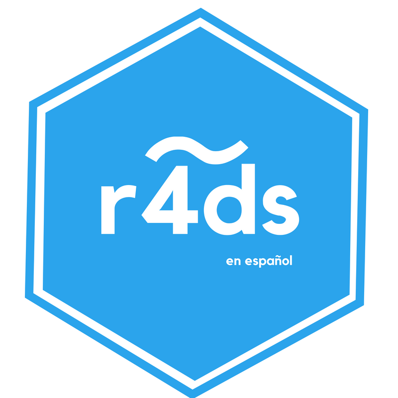

# Bienvenida {-}

Este es el sitio web de la versión en español de __"R for Data Science"__,  de Hadley Wickham y Garrett Grolemund. Este texto te enseñará cómo hacer ciencia de datos con R: aprenderás a importar datos, llevarlos a la estructura más conveniente, transformarlos, visualizarlos y modelarlos. Con él  podrás poner en pŕactica las habilidades necesarias para hacer ciencia de datos. Tal como los químicos aprenden a limpiar tubos de ensayo y ordenar un laboratorio, aprenderás a limpiar datos y crear gráficos--- junto a muchas otras habilidades que permiten que la ciencia de datos tenga lugar. En este libro encontrarás las mejores prácticas para desarrollar dichas tareas usando R. También aprenderás a usar la gramática de gráficos, programación letrada e investigación reproducible para ahorrar tiempo. Además, aprenderás a manejar recursos cognitivos para facilitar el hacer descubrimientos al momento de manipular, visualizar y explorar datos.

## Sobre la traducción

La traducción de "R para Ciencia de Datos" es un proyecto colaborativo de la comunidad de R de Latinoamérica, que tiene por objetivo hacer R más accesible en la región. __El proceso se encuentra actualmente en curso__, por lo que progresivamente irán apareciendo en este sitio las versiones en español de los capítulos.  

En la traducción del libro están participando las siguientes personas (en orden alfabético): Marcela Alfaro, Mónica Alonso, Fernando Álvarez, Yanina Bellini, Juliana Benítez, Elio Campitelli, Florencia D'Andrea, Joshua Kunst, Patricia Loto, Pamela	Matías, Lina Moreno, Paola Prieto, Riva Quiroga, Lucía Rodríguez, Mauricio Vargas, Daniela Vázquez, Melina	Vidoni, Roxana N. Villafañe. ¡Muchas gracias por su trabajo! Agradecemos también a Laura Ación y Edgar Ruiz, que hicieron la convocatoria inicial a participar. La administración del repositorio con la traducción ha estado cargo de Mauricio Vargas. La coordinación general y la edición, a cargo de Riva Quiroga. 

Este proyecto no solo implica la traducción del texto, sino también de los sets de datos que se utilizan a lo largo de él. Para ello, se creó el paquete `datos`, que contiene las versiones traducidas de estos. El paquete ha estado a cargo de Edgar Ruiz, Riva Quiroga y Mauricio Vargas. Para su creación, se utilizó el paquete `datalang` de Edgar Ruiz. 

Si quieres conocer más sobre los principios que han orientado nuestro trabajo y saber cómo participar en el proceso de revisión de las traducciones, puedes leer la documentación del proyecto [aquí](https://github.com/cienciadedatos/descripcion-y-orientaciones). 

## Sobre la versión original en inglés
Puedes consultar la versión original del libro en  [r4ds.had.co.nz/](http://r4ds.had.co.nz/). Existe una edición impresa, que fue publicada por O'Reilly en enero de 2017. Puedes adquirir una copia en [Amazon](http://amzn.to/2aHLAQ1).

(El libro "R for Data Science" primero se llamó "Data Science with R" en "Hands-On Programming with R")

Esta obra se distribuye bajo los términos y condiciones de la licencia [Creative Commons Atribución-No Comercial-Sin Derivados 3.0](http://creativecommons.org/licenses/by-nc-nd/3.0/us/) vigente en los Estados Unidos de América.
