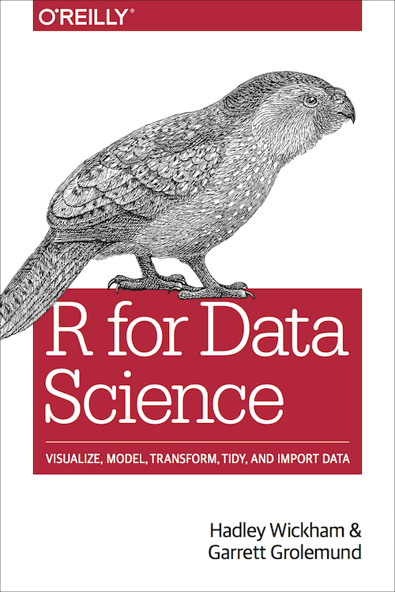

# Welcome {-} 

<a href="http://amzn.to/2aHLAQ1"></a> This is the website for __"R for Data Science"__. This book will teach you how to do data science with R: You'll learn how to get your data into R, get it into the most useful structure, transform it, visualise it and model it. In this book, you will find a practicum of skills for data science. Just as a chemist learns how to clean test tubes and stock a lab, you'll learn how to clean data and draw plots---and many other things besides. These are the skills that allow data science to happen, and here you will find the best practices for doing each of these things with R. You'll learn how to use the grammar of graphics, literate programming, and reproducible research to save time. You'll also learn how to manage cognitive resources to facilitate discoveries when wrangling, visualising, and exploring data. 

This website is (and will always be) __free to use__, and is licensed under the [Creative Commons Attribution-NonCommercial-NoDerivs 3.0](http://creativecommons.org/licenses/by-nc-nd/3.0/us/) License.  If you'd like a __physical copy__ of the book, you can order it from [amazon](http://amzn.to/2aHLAQ1); it was published by O'Reilly in January 2017. If you'd like to __give back__
please make a donation to [Kākāpō Recovery](https://www.doc.govt.nz/kakapo-donate): the [kākāpō](https://www.youtube.com/watch?v=9T1vfsHYiKY) (which appears on the cover of R4DS) is a critically endangered native NZ parrot; there are only 148 left.

The book is written in [RMarkdown](https://rmarkdown.rstudio.com) with [bookdown](https://bookdown.org). It is automatically rebuilt from [source](https://github.com/hadley/r4ds) by [travis](http://travis-ci.org/). R4DS is a collaborative effort and many people have contributed fixes and improvements via pull request. 

```{r, results = "asis", echo = FALSE, message = FALSE}
library(dplyr)
contributors <- readr::read_csv("contributors.csv", col_types = list())
contributors <- contributors %>% 
  mutate(
    link = glue::glue("[\\@{login}](https://github.com/{login})"),
    desc = ifelse(is.na(name), link, glue::glue("{name} ({link})"))
  )

cat("A big thanks goes to everyone who has contributed!\n")
cat(paste0(contributors$desc, collapse = ", "))
```

