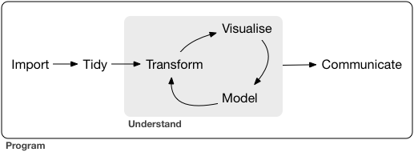
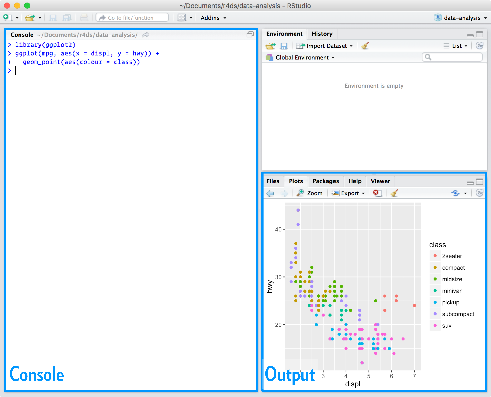

# Introduction

Data science is an exciting discipline that allows you to turn raw data into understanding, insight, and knowledge.
The goal of "R for Data Science" is to help you learn the most important tools in R that will allow you to do data science.
After reading this book, you'll have the tools to tackle a wide variety of data science challenges, using the best parts of R.

## What you will learn

Data science is a huge field, and there's no way you can master it by reading a single book.
The goal of this book is to give you a solid foundation in the most important tools.
Our model of the tools needed in a typical data science project looks something like this:

```{r echo = FALSE, out.width = "75%"}

```

First you must **import** your data into R.
This typically means that you take data stored in a file, database, or web application programming interface (API), and load it into a data frame in R.
If you can't get your data into R, you can't do data science on it!

Once you've imported your data, it is a good idea to **tidy** it.
Tidying your data means storing it in a consistent form that matches the semantics of the dataset with the way it is stored.
In brief, when your data is tidy, each column is a variable, and each row is an observation.
Tidy data is important because the consistent structure lets you focus your struggle on questions about the data, not fighting to get the data into the right form for different functions.

Once you have tidy data, a common first step is to **transform** it.
Transformation includes narrowing in on observations of interest (like all people in one city, or all data from the last year), creating new variables that are functions of existing variables (like computing speed from distance and time), and calculating a set of summary statistics (like counts or means).
Together, tidying and transforming are called **wrangling**, because getting your data in a form that's natural to work with often feels like a fight!

Once you have tidy data with the variables you need, there are two main engines of knowledge generation: visualisation and modelling.
These have complementary strengths and weaknesses so any real analysis will iterate between them many times.

**Visualisation** is a fundamentally human activity.
A good visualisation will show you things that you did not expect, or raise new questions about the data.
A good visualisation might also hint that you're asking the wrong question, or you need to collect different data.
Visualisations can surprise you and don't scale particularly well because they require a human to interpret them.

The last step of data science is **communication**, an absolutely critical part of any data analysis project.
It doesn't matter how well your models and visualisation have led you to understand the data unless you can also communicate your results to others.

Surrounding all these tools is **programming**.
Programming is a cross-cutting tool that you use in every part of the project.
You don't need to be an expert programmer to be a data scientist, but learning more about programming pays off because becoming a better programmer allows you to automate common tasks, and solve new problems with greater ease.

You'll use these tools in every data science project, but for most projects they're not enough.
There's a rough 80-20 rule at play; you can tackle about 80% of every project using the tools that you'll learn in this book, but you'll need other tools to tackle the remaining 20%.
Throughout this book we'll point you to resources where you can learn more.

## How this book is organised

The previous description of the tools of data science is organised roughly according to the order in which you use them in an analysis (although of course you'll iterate through them multiple times).
In our experience, however, this is not the best way to learn them because tarting with data ingest and tidying is sub-optimal because 80% of the time it's routine and boring, and the other 20% of the time it's weird and frustrating.
That's a bad place to start learning a new subject!
Instead, we'll start with visualisation and transformation of data that's already been imported and tidied.
That way, when you ingest and tidy your own data, your motivation will stay high because you know the pain is worth it.

Within each chapter, we try and stick to a similar pattern: start with some motivating examples so you can see the bigger picture, and then dive into the details.
Each section of the book is paired with exercises to help you practice what you've learned.
While it's tempting to skip the exercises, there's no better way to learn than practicing on real problems.

## What you won't learn

There are some important topics that this book doesn't cover.
We believe it's important to stay ruthlessly focused on the essentials so you can get up and running as quickly as possible.
That means this book can't cover every important topic.

### Modelling

### Big data

This book proudly focuses on small, in-memory datasets.
This is the right place to start because you can't tackle big data unless you have experience with small data.
The tools you learn in this book will easily handle hundreds of megabytes of data, and with a little care you can typically use them to work with 1-2 Gb of data.
If you're routinely working with larger data (10-100 Gb, say), you should learn more about [data.table](https://github.com/Rdatatable/data.table).
This book doesn't teach data.table because it has a very concise interface which makes it harder to learn since it offers fewer linguistic cues.
But if you're working with large data, the performance payoff is worth the extra effort required to learn it.

If your data is bigger than this, carefully consider if your big data problem might actually be a small data problem in disguise.
While the complete data might be big, often the data needed to answer a specific question is small.
You might be able to find a subset, subsample, or summary that fits in memory and still allows you to answer the question that you're interested in.
The challenge here is finding the right small data, which often requires a lot of iteration.

Another possibility is that your big data problem is actually a large number of small data problems.
Each individual problem might fit in memory, but you have millions of them.
For example, you might want to fit a model to each person in your dataset.
That would be trivial if you had just 10 or 100 people, but instead you have a million.
Fortunately each problem is independent of the others (a setup that is sometimes called embarrassingly parallel), so you just need a system (like Hadoop or Spark) that allows you to send different datasets to different computers for processing.
Once you've figured out how to answer the question for a single subset using the tools described in this book, you learn new tools like sparklyr, rhipe, and ddr to solve it for the full dataset.

### Python, Julia, and friends

In this book, you won't learn anything about Python, Julia, or any other programming language useful for data science.
This isn't because we think these tools are bad.
They're not!
And in practice, most data science teams use a mix of languages, often at least R and Python.

However, we strongly believe that it's best to master one tool at a time.
You will get better faster if you dive deep, rather than spreading yourself thinly over many topics.
This doesn't mean you should only know one thing, just that you'll generally learn faster if you stick to one thing at a time.
You should strive to learn new things throughout your career, but make sure your understanding is solid before you move on to the next interesting thing.

We think R is a great place to start your data science journey because it is an environment designed from the ground up to support data science.
R is not just a programming language, but it is also an interactive environment for doing data science.
To support interaction, R is a much more flexible language than many of its peers.
This flexibility comes with its downsides, but the big upside is how easy it is to evolve tailored grammars for specific parts of the data science process.
These mini languages help you think about problems as a data scientist, while supporting fluent interaction between your brain and the computer.

## Prerequisites

We've made a few assumptions about what you already know in order to get the most out of this book.
You should be generally numerically literate, and it's helpful if you have some programming experience already.
If you've never programmed before, you might find [Hands on Programming with R](http://amzn.com/1449359019) by Garrett to be a useful adjunct to this book.

There are four things you need to run the code in this book: R, RStudio, a collection of R packages called the **tidyverse**, and a handful of other packages.
Packages are the fundamental units of reproducible R code.
They include reusable functions, the documentation that describes how to use them, and sample data.

### R

To download R, go to CRAN, the **c**omprehensive **R** **a**rchive **n**etwork.
CRAN is composed of a set of mirror servers distributed around the world and is used to distribute R and R packages.
Don't try and pick a mirror that's close to you: instead use the cloud mirror, <https://cloud.r-project.org>, which automatically figures it out for you.

A new major version of R comes out once a year, and there are 2-3 minor releases each year.
It's a good idea to update regularly.
Upgrading can be a bit of a hassle, especially for major versions, which require you to re-install all your packages, but putting it off only makes it worse.
You'll need at least R 4.1.0 for this book.

### RStudio

RStudio is an integrated development environment, or IDE, for R programming.
Download and install it from <http://www.rstudio.com/download>.
RStudio is updated a couple of times a year.
When a new version is available, RStudio will let you know.
It's a good idea to upgrade regularly so you can take advantage of the latest and greatest features.
For this book, make sure you have at least RStudio 1.6.0.

When you start RStudio, you'll see two key regions in the interface:

```{r echo = FALSE, out.width = "75%"}

```

For now, all you need to know is that you type R code in the console pane, and press enter to run it.
You'll learn more as we go along!

### The tidyverse

You'll also need to install some R packages.
An R **package** is a collection of functions, data, and documentation that extends the capabilities of base R.
Using packages is key to the successful use of R.
The majority of the packages that you will learn in this book are part of the so-called tidyverse.
The packages in the tidyverse share a common philosophy of data and R programming, and are designed to work together naturally.

You can install the complete tidyverse with a single line of code:

```{r, eval = FALSE}
install.packages("tidyverse")
```

On your own computer, type that line of code in the console, and then press enter to run it.
R will download the packages from CRAN and install them on to your computer.
If you have problems installing, make sure that you are connected to the internet, and that <https://cloud.r-project.org/> isn't blocked by your firewall or proxy.

You will not be able to use the functions, objects, and help files in a package until you load it with `library()`.
Once you have installed a package, you can load it with the `library()` function:

```{r}
library(tidyverse)
```

This tells you that tidyverse is loading the ggplot2, tibble, tidyr, readr, purrr, and dplyr packages.
These are considered to be the **core** of the tidyverse because you'll use them in almost every analysis.

Packages in the tidyverse change fairly frequently.
You can see if updates are available, and optionally install them, by running `tidyverse_update()`.

### Other packages

There are many other excellent packages that are not part of the tidyverse, because they solve problems in a different domain, or are designed with a different set of underlying principles.
This doesn't make them better or worse, just different.
In other words, the complement to the tidyverse is not the messyverse, but many other universes of interrelated packages.
As you tackle more data science projects with R, you'll learn new packages and new ways of thinking about data.

In this book we'll use three data packages from outside the tidyverse:

```{r, eval = FALSE}
install.packages(c("nycflights13", "gapminder", "Lahman"))
```

These packages provide data on airline flights, world development, and baseball that we'll use to illustrate key data science ideas.

## Running R code

The previous section showed you a couple of examples of running R code.
Code in the book looks like this:

```{r, eval = TRUE}
1 + 2
```

If you run the same code in your local console, it will look like this:

    > 1 + 2
    [1] 3

There are two main differences.
In your console, you type after the `>`, called the **prompt**; we don't show the prompt in the book.
In the book, output is commented out with `#>`; in your console it appears directly after your code.
These two differences mean that if you're working with an electronic version of the book, you can easily copy code out of the book and into the console.

Throughout the book we use a consistent set of conventions to refer to code:

-   Functions are in a code font and followed by parentheses, like `sum()`, or `mean()`.

-   Other R objects (like data or function arguments) are in a code font, without parentheses, like `flights` or `x`.

-   If we want to make it clear what package an object comes from, we'll use the package name followed by two colons, like `dplyr::mutate()`, or\
    `nycflights13::flights`.
    This is also valid R code.

## Acknowledgements

This book isn't just the product of Hadley, Mine, and Garrett, but is the result of many conversations (in person and online) that we've had with the many people in the R community.
There are a few people we'd like to thank in particular, because they have spent many hours answering our questions and helping us to better think about data science:

-   Jenny Bryan and Lionel Henry for many helpful discussions around working with lists and list-columns.

-   The three chapters on workflow were adapted (with permission), from <http://stat545.com/block002_hello-r-workspace-wd-project.html> by Jenny Bryan.

-   Yihui Xie for his work on the [bookdown](https://github.com/rstudio/bookdown) package, and for tirelessly responding to my feature requests.

-   Bill Behrman for his thoughtful reading of the entire book, and for trying it out with his data science class at Stanford.

-   The #rstats Twitter community who reviewed all of the draft chapters and provided tons of useful feedback.

This book was written in the open, and many people contributed pull requests to fix minor problems.
Special thanks goes to everyone who contributed via GitHub:

```{r, results = "asis", echo = FALSE, message = FALSE}
library(dplyr)
# git --no-pager shortlog -ns > contribs.txt
contribs <- readr::read_tsv("contribs.txt", col_names = c("n", "name"))

contribs <- contribs %>% 
  filter(!name %in% c("hadley", "Garrett", "Hadley Wickham",
                      "Garrett Grolemund")) %>% 
  arrange(name) %>% 
  mutate(uname = ifelse(!grepl(" ", name), paste0("@", name), name))

cat("Thanks go to all contributers in alphabetical order: ")
cat(paste0(contribs$uname, collapse = ", "))
cat(".\n")
```

## Colophon

An online version of this book is available at [http://r4ds.had.co.nz](http://r4ds.hadley.nz){.uri}.
It will continue to evolve in between reprints of the physical book.
The source of the book is available at <https://github.com/hadley/r4ds>.
The book is powered by <https://bookdown.org> which makes it easy to turn R Markdown files into HTML, PDF, and EPUB.

This book was built with:

```{r}
sessioninfo::session_info(c("tidyverse"))
```
