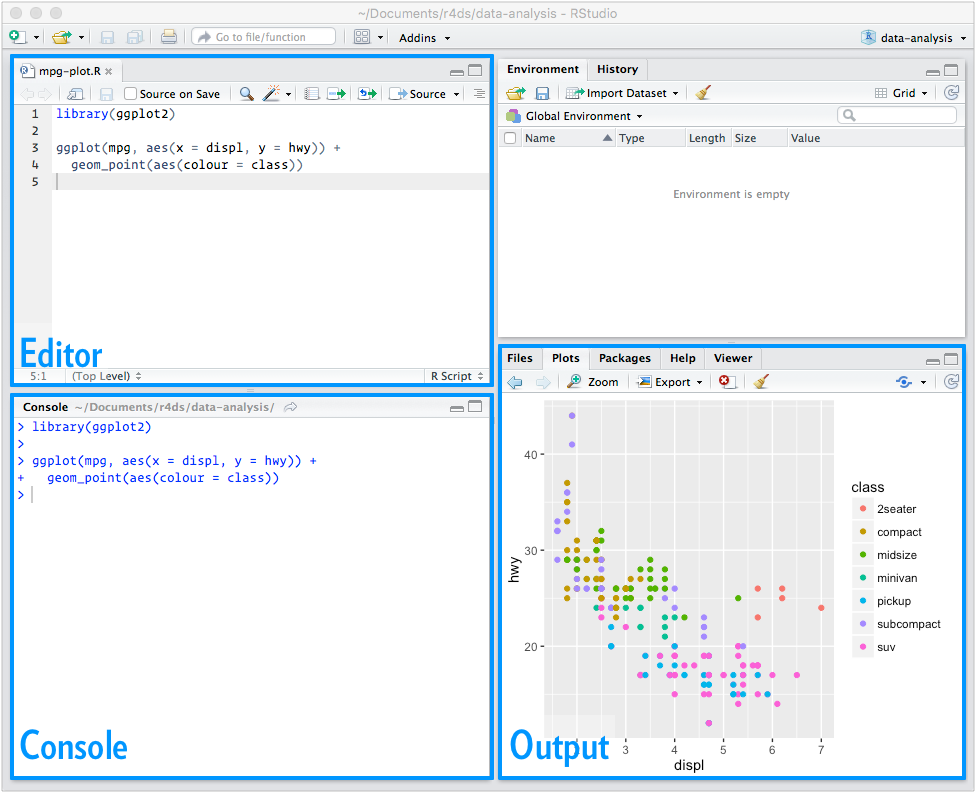
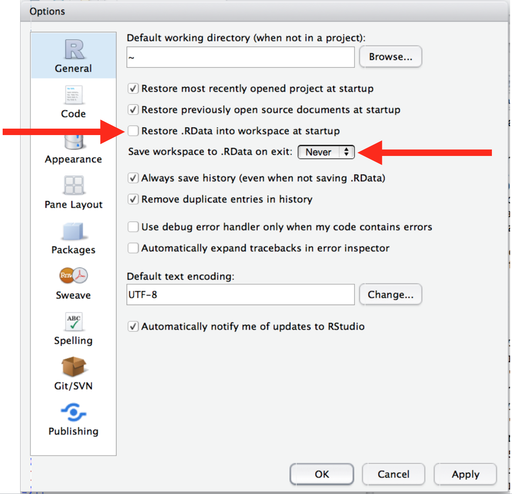

# Introduction

```{r setup-intro, include = FALSE}
install.packages <- function(...) invisible()
```

Data science is an exciting discipline that allows you to turn raw data into understanding, insight, and knowledge. The goal of "R for Data Science" is to help you learn the most important tools R that will allow you to do data science. After reading this book, you'll have the tools to tackle a wide variety of data science challenges, using the best parts of R. 

## What you will learn

Data science is a huge field, and there's no way you can master it by reading a single book. The goal of this book is to give you a solid foundation with the most important tools. Our model of the tools needed in a typical data science project looks something like this:

```{r echo = FALSE}
knitr::include_graphics("diagrams/data-science.png")
```

First you must __import__ your data into R. This typically means that you take data stored in a file, database, or web API, and load it into a data frame in R. If you can't get your data into R, you can't do data science on it!

Once you've imported your data, it is a good idea to __tidy__ it. Tidying your data means storing it in a standard form that matches the semantics of the dataset with the way it is stored. In brief, when your data is tidy, each column is a variable, and each row is an observation. Tidy data is important because the consistent structure lets you focus your struggle on questions about the data, not fighting to get the data into the right form for different functions.

Once you have tidy data, a common first step is to __transform__ it. You may zero in on a subset of data, add new variables that are functions of existing variables, or calculate a set of summary statistics.

Once you have tidy data with the variables you need, there are two main engines of knowledge generation: visualisation and modelling. These have complementary strengths and weaknesses so any real analysis will iterate between them many times.

__Visualisation__ is a fundamentally human activity. A good visualisation will show you things that you did not expect, or raise new questions of the data. A good visualisation might also hint that you're asking the wrong question and you need to refine your thinking. In short, visualisations can surprise you. However, visualisations don't scale particularly well.

__Models__ are the complementary tools to visualisation. Models are a fundamentally mathematical or computational tool, so they generally scale well. Even when they don't, it's usually cheaper to buy more computers than it is to buy more brains. But every model makes assumptions, and by its very nature a model can not question its own assumptions. That means a model cannot fundamentally surprise you.

The last step of data science is __communication__, an absolutely critical part of any data analysis project. It doesn't matter how well your models and visualisation have led you to understand the data unless you can also communicate your results to others.

There's one important toolset that's not shown in the diagram: programming. Programming is a cross-cutting tool that you use in every part of the project. You don't need to be an expert programmer to be a data scientist, but learning more about programming pays off. Becoming a better programmer will allow you to automate common tasks, and solve new problems with greater ease.

You'll use these six tools in every data science project, but for most projects they're not enough. There's a rough 80-20 rule at play: you can probably tackle 80% of every project using the tools that you'll learn in this book, but you'll need more to tackle the remaining 20%. Throughout this book we'll point you to resources where you can learn more.

## The tidyverse

The majority of the packages that you will learn in this book are part of the so-called tidyverse. All packages in the tidyverse share a common philosophy of data and R programming, which makes them fit together naturally. Because they are designed with a unifying vision you should experience fewer problems combining multiple packages to solve real problems. The packages in the tidyverse are not perfect, but over time they will continue to evolve towards greater consistency. 

There are many other excellent packages that are not part of the tidyverse, because they are designed with a different set of underlying principles. This doesn't make them better or worse, just different. In other words, the complement to the tidyverse is not the messyverse, but many other universes of interrelated packages. As you tackle more data science projects with R you'll learn new packages, and new ways of thinking about data. But we hope that the tidyverse will continue to provide a solid foundation no matter how far you go in R.

## How you will learn

The above description of the tools of data science is organised roughly around the order in which you use them in analysis (although of course you'll iterate through them multiple times). In our experience, however, this is not the best way to learn them:

* Starting with data ingest and tidying is sub-optimal because 80% of the time 
  it's routine and boring, and the other 20% of the time it's weird and
  frustrating. Instead, we'll start with visualisation and transformation on 
  data that's already been imported and tidied. That way, when you ingest
  and tidy your own data, your motivation will stay high because you know the
  pain is worth it.
  
* Some topics are best explained with other tools. For example, we believe that
  it's easier to understand how models work as a tool for data science if you
  already know about visualisation, data transformation, and tidy data.
  
* Programming tools are not necessarily interesting in their own right, 
  but do allow you to tackle considerably more challenging problems. We'll
  give you a selection of programming tools in the middle of the book, and 
  then finish off by showing how they combine with the key data science tools 
  to tackle interesting problems.

Within each chapter, we try and stick to a similar pattern: start with some motivating examples so you can see the bigger picture, and then dive into the details. Each section of the book is paired with exercises to help you practice what you've learned. While it's tempting to skip the exercises, there's no better way to learn than practicing on real problems.

## What you won't learn

There are some important topics that this book doesn't cover. We believe it's important to stay ruthlessly focused on the essentials so you can get up and running as quickly as possible. That means this book can't cover every important topic.

### Big data

This book proudly focuses on small, in-memory datasets. This is the right place to start because you can't tackle big data unless you have experience with small data. The tools you learn in this book will easily handle hundreds of megabytes of data, and with a little care you can typically use them to work with 1-2 Gb of data. If you're routinely working with larger data (10-100 Gb, say), you should learn more about [data.table](https://github.com/Rdatatable/data.table). This book doesn't teach data.table because it has a very concise interface that is harder to learn because it offers fewer linguistic cues. But if you're working with large data, the performance payoff is worth the extra effort required to learn it.

If your data is bigger than this, carefully consider if your big data problem might atually be a small data problem in disguise. While the complete data might be big, often the data needed to answer a specific question is small. You might be able to find a subset, subsample, or summary that fits in memory and still allows you to answer the question that you're interested in. The challenge here is finding the right small data, which often requires a lot of iteration. We'll touch on this idea in [[Data transformation]].

Another possibility is that your big data problem is actually a large number of small data problems. Each individual problem might fit in memory, but you have millions of them. For example, you might want to fit a model to each person in your dataset. That would be trivial if you had just 10 or 100 people, but instead you have a million. Fortunately each problem is independent of the others (a setup that is sometimes called embarrassingly parallel), so you just need a system (like Hadoop) that allows you to send different datasets to different computers for processing. Once you've figured out how to answer the question for a single subset using the tools described in this book, you can use packages like sparklyr, rhipe, and ddr to solve it for the full dataset.

### Python, Julia, and friends

In this book, you won't learn anything about Python, Julia, or any other programming language useful for data science. This isn't because we think these tools are bad. They're not! And in practice, most data science teams use a mix of languages, often at least R and Python.

However, we strongly believe that it's best to master one tool at a time. You will get better faster if you dive deep, rather than spreading yourself thinly over many topics. This doesn't mean you should only know one thing, just that you'll generally learn faster if you stick to one thing at a time. You should strive to learn new things throughout your career, but make sure your understanding in solid before you move on to the next interesting thing.

### Non-rectangular data

This book focuses exclusively on structured datasets: collections of values that are each associated with a variable and an observation. There are lots of datasets that do not naturally fit in this paradigm: images, sounds, trees, text. But data frames are extremely common in science and in industry and we believe that they're a great place to start your data analysis journey.

### Hypothesis confirmation

It's possible to divide data analysis into two camps: hypothesis generation, and hypothesis confirmation (sometimes called confirmatory analysis). The focus of this book is unabashedly on hypothesis generation, or data exploration. Here you'll look deeply at the data and combined with your subject knowledge generate many interesting hypotheses to help explain why the data behaves the way it does. You evaluate the hypotheses informally, using your scepticism to challenge the data in multiple ways.

The complement of hypothesis generation is hypothesis confirmation. Hypothesis confirmation is hard for two reasons:

1.  You need a precise mathematical model in order to generate falsifiable
    predictions. This often requires considerably statistical sophistication.
    To learn more about statistical modelling we recommend *Statistical
    Modeling: A Fresh Approach* by Danny Kaplan; *An Introduction to 
    Statistical Learning* by James, Witten, Hastie, and Tibshirani; and 
    *Applied Predictive Modeling* by Kuhn and Johnson.

1.  You can only use an observation once to confirm a hypothesis. As soon as
    you use it more than once you're back to doing exploratory analysis. 
    This means to do hypothesis confirmation you need to "preregister" 
    (write out in advance) your analysis plan, and not deviate from it
    even when you have seen the data. We'll talk a little about some 
    strategies you can use to make this easier in [[model assessment]].

It's common to think about modelling as a tool for hypothesis confirmation, and visualisation for a tool for hypothesis generation. But that's a false dichotomy: models are often used for exploration, and with a little care you can use visualisation for confirmation. The key difference is how often do you look at each observation: if you look only once, it's confirmation; if you look more than once, it's exploration.

## Prerequisites

We've made few assumptions about what you already know in order to get the most out of this book. You should be generally numerically literate, and it's helpful if you have some programming experience already. If you've never programmed before, you might find [Hands on Programming with R](http://amzn.com/1449359019) by Garrett to be a useful adjunct to this book.

To run the code in this book, you will need to install both R and the RStudio IDE, an application that makes R easier to use. Both are open source, free and easy to install:

1. Download and install R, <https://www.r-project.org/>.
1. Download and install RStudio, <http://www.rstudio.com/download>.
1. Install needed packages (see below).

### Code conventions

* In text, we refer to functions in a code font followed by parentheses,
  for example, `sum()`, or `mean()`.

* We refer to other R objects (like data or function arguments) without
  parentheses: `flights`, `x`, ...
  
* If we want to make it clear which package an object comes from, we'll use
  the package name followed by two colons: `dplyr::mutate()`, or   
  `nycflights13::flights`. This is the same convention that R uses.

### RStudio

RStudio is an integrated development environment, or IDE, for R programming. There are three key regions:

```{r echo = FALSE}

```

You run R code in the __console__ pane. Textual output appears inline, and graphical output appears in the __output__ pane. You write more complex R scripts in the __editor__ pane.

There are three keyboard shortcuts for the RStudio IDE that we strongly encourage that you learn because they'll save you so much time:

* Cmd/Ctrl + Enter: sends the current line (or current selection) from the editor to
  the console and runs it.

* Tab: suggest possible completions for the text you've typed.

* Cmd/Ctrl + ↑: in the console, searches all commands you've typed that start with 
  those characters.

If you want to see a list of all keyboard shortcuts, use the meta shortcut Alt + Shift + K: that's the keyboard shortcut to show all the other keyboard shortcuts!

We strongly recommend making two changes to the default RStudio options:

```{r, echo = FALSE}

```

This ensures that every time you restart RStudio you get a completely clean slate. This is good practice because it encourages you to capture all important interactions in your code. There's nothing worse than discovering three months after the fact that you've only stored the results of an important calculation in your workspace, not the calculation itself in your code. During a project, it's good practice to regularly restart R either using the menu Session | Restart R or the keyboard shortcut Cmd + Shift + F10.

### R packages

You'll also need to install some R packages. An R _package_ is a collection of functions, data, and documentation that extends the capabilities of base R. Using packages is key to the successful use of R. To install the packages you'll need for this book open RStudio and run:

```{r}
pkgs <- c(
  "broom", "dplyr", "ggplot2", "jsonlite", "Lahman", "purrr", 
  "rcorpora", "readr", "rmarkdown", "stringr", "tibble", "tidyr"
)
```
```{r, eval = FALSE}
install.packages(pkgs)
```

R will download the packages from CRAN and install them on to your computer. If you have problems installing, make sure that you are connected to the internet, and that <https://cloud.r-project.org/> isn't blocked by your firewall or proxy.

You will not be able to use the functions, objects, and help files in a package until you load it with `library()`. After you have downloaded the packages, you can load any of the packages into your current R session with the `library()` command, e.g.

```{r, eval = FALSE}
library(tidyr)
```

You will need to reload the package every time you start a new R session.

## Getting help and learning more

This book is not an island: there is no single resource that will allow you to master R. As you start to apply the techniques described in this book to your own data you will soon find questions that we do not answer. This section describes a few tips to help you get help, and to help you keep learning.

If you get stuck, start with google. Typically adding "R" to a query is enough to restrict it to relevant results: if the search isn't useful, it often means that there aren't any R specific results available. Google is particuarly useful for error messages. If you get an error message and you have no idea what it means, try googling it! Chances are that someone else has been confused by it in the past, and there will be help somewhere on the web. (If the error message isn't in English, run `Sys.setenv(LANGUAGE = "en")` and re-run the code; you're more likely to find help for English error messages.)

If google doesn't help, try [stackoverflow](http://stackoverflow.com). Start by spending a little time searching for an existing answer (including `[R]` to restrict your search). If you don't find anything useful, next prepare a minimal reproducible example or __reprex__.  A good reprex makes it easier for other people to help you, and often you'll figure out the problem yourself in the course of making it.

There are three things you need to include to make your example reproducible: required packages, data, and code.

1.  **Packages** should be loaded at the top of the script, so it's easy to
    see which ones the example needs. This is a good time to check that you're
    using the latest version of each package: it's possible you've discovered
    a bug that been fixed since you installed the package.

1.  The easiest way to include **data** in a question is to use `dput()` to 
    generate the R code to recreate it. For example, to recreate the `mtcars` 
    dataset in R, I'd perform the following steps:
  
    1. Run `dput(mtcars)` in R
    2. Copy the output
    3. In my reproducible script, type `mtcars <- ` then paste.
    
    Try and find the smallest subset of your data that still reveals
    the problem.

1.  Spend a little bit of time ensuring that your **code** is easy for others to
    read:

    * Make sure you've used spaces and your variable names are concise, yet
      informative.
    
    * Use comments to indicate where your problem lies.
    
    * Do your best to remove everything that is not related to the problem.  
      The shorter your code is, the easier it is to understand, and the 
      easier it is to fix.

Finish by checking that you have actually made a reproducible example by starting a fresh R session and copying and pasting your script in.

You should also spend some time preparing yourself to solve problems before they occur, and investing a little time in learning R each day will pay off handsomely in the long run. One way to is follow what Hadley, Garrett, and everyone else at RStudio are doing on the [RStudio blog](https://blog.rstudio.org). This is where we post announcements about new packages, new IDE features, and in-person courses. You might also want to follow Hadley ([@hadleywickham](https://twitter.com/hadleywickham)) or Garrett ([@statgarrett](https://twitter.com/statgarrett)) on twitter, or follow [@rstudiotips](https://twitter.com/rstudiotips) to keep up with new features in the IDE.

To keep up with the R community more broadly, we recommend reading <http://www.r-bloggers.com>: it aggregates over 500 blogs about R from around the world. If you're an active twitter user, following the `#rstats` hashtag on twitter is also a great way to keep up with the latest and greatest. That's one of the key tools that Hadley uses to keep up with new developments in the community.

## Acknowledgements

This book isn't just the product of Hadley and Garrett, but is the result of many conversations (in person and online) that we've had with the R community. There are few people we'd like to thank specifically because they have spent many hours answering our dumb questions and helping us to better think about data science:

* Jenny Bryan and Lionel Henry for many helpful discussions around working
  with lists and list-columns.

* Genevera Allen for discussions about models, modelling, the statistical
  learning perspective, and the difference between hypothesis generation and 
  hypothesis confirmation.

* Yihui Xie for his work on the bookdown package, and for tireless satisfying
  all my feature request.

This book was written in the open, so a special thanks goes to everyone who contributed via GitHub: 

__INSERT HERE__

## Colophon

An online version of this book is available at <http://r4ds.had.co.nz>. It will continue to evolve in between reprints of the physical book. The source of the book is available at <http://github.com/hadley/r4ds>. The book is powered by <https://bookdown.org> which makes it easy to turn R markdown files into html, pdf, and epub.

This book was built with:

```{r}
devtools::session_info(pkgs)
```
