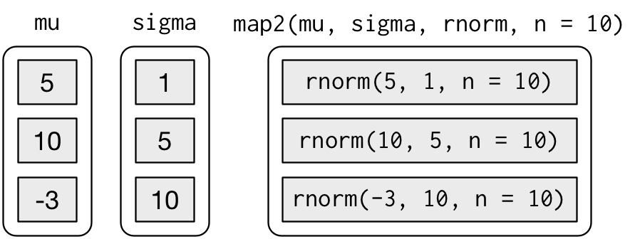
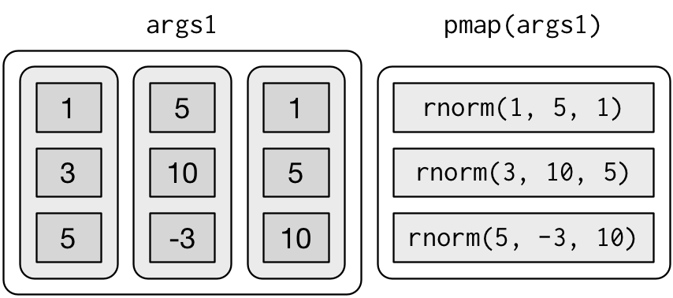
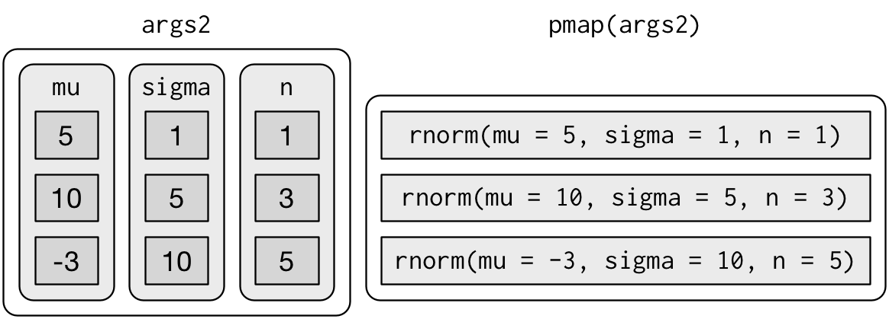
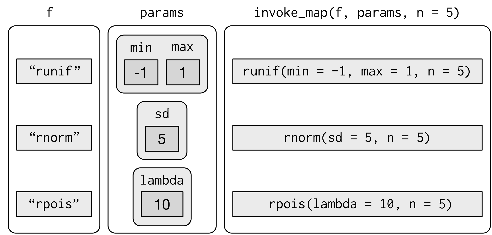

# Iteration

## Introduction

In [functions], we talked about how important it is to reduce duplication in your code by creating functions instead of copying-and-pasting. Reducing code duplication has three main benefits:

1.  It's easier to see the intent of your code, because your eyes are
    drawn to what's different, not what stays the same.
    
1.  It's easier to respond to changes in requirements. As your needs 
    change, you only need to make changes in one place, rather than
    remembering to change every place that you copied-and-pasted the 
    code.
    
1.  You're likely to have fewer bugs because each line of code is 
    used in more places.

One tool for reducing duplication is functions, which reduce duplication by identifying repeated patterns of code and extract them out into independent pieces that can be easily reused and updated. Another tool for reducing duplication is __iteration__, which helps you when you need to do the same thing to multiple inputs: repeating the same operation on different columns, or on different datasets. 
In this chapter you'll learn about two important iteration paradigms: imperative programming and functional programming. On the imperative side you have tools like for loops and while loops, which are a great place to start because they make iteration very explicit, so it's obvious what's happening. However, for loops are quite verbose, and require quite a bit of bookkeeping code that is duplicated for every for loop. Functional programming (FP) offers tools to extract out this duplicated code, so each common for loop pattern gets its own function. Once you master the vocabulary of FP, you can solve many common iteration problems with less code, more ease, and fewer errors.

### Prerequisites

Once you've mastered the for loops provided by base R, you'll learn some of the powerful programming tools provided by purrr, one of the tidyverse core packages.

```{r setup, message = FALSE}
library(tidyverse)
```

## For loops

Imagine we have this simple tibble:

```{r}
df <- tibble(
  a = rnorm(10),
  b = rnorm(10),
  c = rnorm(10),
  d = rnorm(10)
)
```

We want to compute the median of each column. You _could_ do with copy-and-paste:

```{r}
median(df$a)
median(df$b)
median(df$c)
median(df$d)
```

But that breaks our rule of thumb: never copy and paste more than twice. Instead, we could use a for loop:

```{r}
output <- vector("double", ncol(df))  # 1. output
for (i in seq_along(df)) {            # 2. sequence
  output[[i]] <- median(df[[i]])      # 3. body
}
output
```

Every for loop has three components:

1.  The __output__: `output <- vector("double", length(x))`. 
    Before you start the loop, you must always allocate sufficient space 
    for the output. This is very important for efficiency: if you grow
    the for loop at each iteration using `c()` (for example), your for loop 
    will be very slow. 
    
    A general way of creating an empty vector of given length is the `vector()`
    function. It has two arguments: the type of the vector ("logical", 
    "integer", "double", "character", etc) and the length of the vector. 

1.  The __sequence__: `i in seq_along(df)`. This determines what to loop over:
    each run of the for loop will assign `i` to a different value from 
    `seq_along(df)`. It's useful to think of `i` as a pronoun, like "it".
    
    You might not have seen `seq_along()` before. It's a safe version of the 
    familiar `1:length(l)`, with an important difference: if you have a
    zero-length vector, `seq_along()` does the right thing:

    ```{r}
    y <- vector("double", 0)
    seq_along(y)
    1:length(y)
    ```
    
    You probably won't create a zero-length vector deliberately, but
    it's easy to create them accidentally. If you use `1:length(x)` instead
    of `seq_along(x)`, you're likely to get a confusing error message.
    
1.  The __body__: `output[[i]] <- median(df[[i]])`. This is the code that does
    the work. It's run repeatedly, each time with a different value for `i`.
    The first iteration will run `output[[1]] <- median(df[[1]])`, 
    the second will run `output[[2]] <- median(df[[2]])`, and so on.

That's all there is to the for loop! Now is a good time to practice creating some basic (and not so basic) for loops using the exercises below. Then we'll move on some variations of the for loop that help you solve other problems that will crop up in practice. 

### Exercises

1.  Write for loops to:

    1. Compute the mean of every column in `mtcars`.
    1. Determine the type of each column in `nycflights13::flights`.
    1. Compute the number of unique values in each column of `iris`.
    1. Generate 10 random normals for each of $\mu = -10$, $0$, $10$, and $100$.
    
    Think about the output, sequence, and body __before__ you start writing
    the loop.

1.  Eliminate the for loop in each of the following examples by taking 
    advantage of an existing function that works with vectors:
    
    ```{r, eval = FALSE}
    out <- ""
    for (x in letters) {
      out <- stringr::str_c(out, x)
    }
    
    x <- sample(100)
    sd <- 0
    for (i in seq_along(x)) {
      sd <- sd + (x[i] - mean(x)) ^ 2
    }
    sd <- sqrt(sd / (length(x) - 1))
    
    x <- runif(100)
    out <- vector("numeric", length(x))
    out[1] <- x[1]
    for (i in 2:length(x)) {
      out[i] <- out[i - 1] + x[i]
    }
    ```

1.  Combine your function writing and for loop skills:

    1. Write a for loop that `prints()` the lyrics to the children's song 
       "Alice the camel".

    1. Convert the nursery rhyme "ten in the bed" to a function. Generalise 
       it to any number of people in any sleeping structure.

    1. Convert the song "99 bottles of beer on the wall" to a function.
       Generalise to any number of any vessel containing any liquid on 
       any surface.

1.  It's common to see for loops that don't preallocate the output and instead
    increase the length of a vector at each step:
    
    ```{r, eval = FALSE}
    output <- vector("integer", 0)
    for (i in seq_along(x)) {
      output <- c(output, lengths(x[[i]]))
    }
    output
    ```
    
    How does this affect performance? Design and execute an experiment.

## For loop variations

Once you have the basic for loop under your belt, there are some variations that you should be aware of. These variations are important regardless of how you do iteration, so don't forget about them once you've mastered the FP techniques you'll learn about in the next section.

There are four variations on the basic theme of the for loop:

1.  Modifying an existing object, instead of creating a new object.
1.  Looping over names or values, instead of indices.
1.  Handling outputs of unknown length.
1.  Handling sequences of unknown length.

### Modifying an existing object

Sometimes you want to use a for loop to modify an existing object. For example, remember our challenge from [functions]. We wanted to rescale every column in a data frame:

```{r}
df <- tibble(
  a = rnorm(10),
  b = rnorm(10),
  c = rnorm(10),
  d = rnorm(10)
)
rescale01 <- function(x) {
  rng <- range(x, na.rm = TRUE)
  (x - rng[1]) / (rng[2] - rng[1])
}

df$a <- rescale01(df$a)
df$b <- rescale01(df$b)
df$c <- rescale01(df$c)
df$d <- rescale01(df$d)
```

To solve this with a for loop we again think about the three components:

1.  __Output__: we already have the output --- it's the same as the input!

1.  __Sequence__: we can think about a data frame as a list of columns, so 
    we can iterate over each column with `seq_along(df)`.

1.  __Body__: apply `rescale01()`.

This gives us:

```{r}
for (i in seq_along(df)) {
  df[[i]] <- rescale01(df[[i]])
}
```

Typically you'll be modifying a list or data frame with this sort of loop, so remember to use `[[`, not `[`. You might have spotted that I used `[[` in all my for loops: I think it's better to use `[[` even for atomic vectors because it makes it clear that I want to work with a single element.

### Looping patterns

There are three basic ways to loop over a vector. So far I've shown you the most general: looping over the numeric indices with `for (i in seq_along(xs))`, and extracting the value with `x[[i]]`. There are two other forms:

1.  Loop over the elements: `for (x in xs)`. This is most useful if you only
    care about side-effects, like plotting or saving a file, because it's
    difficult to save the output efficiently.

1.  Loop over the names: `for (nm in names(xs))`. This gives you name, which
    you can use to access the value with `x[[nm]]`. This is useful if you want 
    to use the name in a plot title or a file name. If you're creating
    named output, make sure to name the results vector like so:
    
    ```{r, eval = FALSE}
    results <- vector("list", length(x))
    names(results) <- names(x)
    ```

Iteration over the numeric indices is the most general form, because given the position you can extract both the name and the value:

```{r, eval = FALSE}
for (i in seq_along(x)) {
  name <- names(x)[[i]]
  value <- x[[i]]
}
```

### Unknown output length

Sometimes you might not know how long the output will be. For example, imagine you want to simulate some random vectors of random lengths. You might be tempted to solve this problem by progressively growing the vector:

```{r}
means <- c(0, 1, 2)

output <- double()
for (i in seq_along(means)) {
  n <- sample(100, 1)
  output <- c(output, rnorm(n, means[[i]]))
}
str(output)
```

But this is not very efficient because in each iteration, R has to copy all the data from the previous iterations. In technical terms you get "quadratic" ($O(n^2)$) behaviour which means that a loop with three times as many elements would take nine ($3^2$) times as long to run.

A better solution to save the results in a list, and then combine into a single vector after the loop is done:

```{r}
out <- vector("list", length(means))
for (i in seq_along(means)) {
  n <- sample(100, 1)
  out[[i]] <- rnorm(n, means[[i]])
}
str(out)
str(unlist(out))
```

Here I've used `unlist()` to flatten a list of vectors into a single vector. A stricter option is to use `purrr::flatten_dbl()` --- it will throw an error if the input isn't a list of doubles.

This pattern occurs in other places too:

1.  You might be generating a long string. Instead of `paste()`ing together 
    each iteration with the previous, save the output in a character vector and
    then combine that vector into a single string with 
    `paste(output, collapse = "")`.
   
1.  You might be generating a big data frame. Instead of sequentially
    `rbind()`ing in each iteration, save the output in a list, then use 
    `dplyr::bind_rows(output)` to combine the output into a single
    data frame.

Watch out for this pattern. Whenever you see it, switch to a more complex result object, and then combine in one step at the end.

### Unknown sequence length

Sometimes you don't even know how long the input sequence should run for. This is common when doing simulations. For example, you might want to loop until you get three heads in a row. You can't do that sort of iteration with the for loop. Instead, you can use a while loop. A while loop is simpler than for loop because it only has two components, a condition and a body:

```{r, eval = FALSE}
while (condition) {
  # body
}
```

A while loop is also more general than a for loop, because you can rewrite any for loop as a while loop, but you can't rewrite every while loop as a for loop:

```{r, eval = FALSE}
for (i in seq_along(x)) {
  # body
}

# Equivalent to
i <- 1
while (i <= length(x)) {
  # body
  i <- i + 1 
}
```

Here's how we could use a while loop to find how many tries it takes to get three heads in a row:

```{r}
flip <- function() sample(c("T", "H"), 1)

flips <- 0
nheads <- 0

while (nheads < 3) {
  if (flip() == "H") {
    nheads <- nheads + 1
  } else {
    nheads <- 0
  }
  flips <- flips + 1
}
flips
```

I mention while loops only briefly, because I hardly ever use them. They're most often used for simulation, which is outside the scope of this book. However, it is good to know they exist so that you're prepared for problems where the number of iterations is not known in advance.

### Exercises

1.  Imagine you have a directory full of CSV files that you want to read in.
    You have their paths in a vector, 
    `files <- dir("data/", pattern = "\\.csv$", full.names = TRUE)`, and now
    want to read each one with `read_csv()`. Write the for loop that will 
    load them into a single data frame. 

1.  What happens if you use `for (nm in names(x))` and `x` has no names?
    What if only some of the elements are named? What if the names are
    not unique?

1.  Write a function that prints the mean of each numeric column in a data 
    frame, along with its name. For example, `show_mean(iris)` would print:
    
    ```{r, eval = FALSE}
    show_mean(iris)
    #> Sepal.Length: 5.84
    #> Sepal.Width:  3.06
    #> Petal.Length: 3.76
    #> Petal.Width:  1.20
    ```
    
    (Extra challenge: what function did I use to make sure that the numbers
    lined up nicely, even though the variable names had different lengths?)

1.  What does this code do? How does it work?

    ```{r, eval = FALSE}
    trans <- list( 
      disp = function(x) x * 0.0163871,
      am = function(x) {
        factor(x, labels = c("auto", "manual"))
      }
    )
    for (var in names(trans)) {
      mtcars[[var]] <- trans[[var]](mtcars[[var]])
    }
    ```

## For loops vs. functionals

For loops are not as important in R as they are in other languages because R is a functional programming language. This means that it's possible to wrap up for loops in a function, and call that function instead of using the for loop directly.

To see why this is important, consider (again) this simple data frame:

```{r}
df <- tibble(
  a = rnorm(10),
  b = rnorm(10),
  c = rnorm(10),
  d = rnorm(10)
)
```

Imagine you want to compute the mean of every column. You could do that with a for loop:

```{r}
output <- vector("double", length(df))
for (i in seq_along(df)) {
  output[[i]] <- mean(df[[i]])
}
output
```

You realise that you're going to want to compute the means of every column pretty frequently, so you extract it out into a function:

```{r}
col_mean <- function(df) {
  output <- vector("double", length(df))
  for (i in seq_along(df)) {
    output[i] <- mean(df[[i]])
  }
  output
}
```

But then you think it'd also be helpful to be able to compute the median, and the standard deviation, so you copy and paste your `col_mean()` function and replace the `mean()` with `median()` and `sd()`:

```{r}
col_median <- function(df) {
  output <- vector("double", length(df))
  for (i in seq_along(df)) {
    output[i] <- median(df[[i]])
  }
  output
}
col_sd <- function(df) {
  output <- vector("double", length(df))
  for (i in seq_along(df)) {
    output[i] <- sd(df[[i]])
  }
  output
}
```

Uh oh! You've copied-and-pasted this code twice, so it's time to think about how to generalise it. Notice that most of this code is for-loop boilerplate and it's hard to see the one thing (`mean()`, `median()`, `sd()`) that is different between the functions.

What would you do if you saw a set of functions like this:

```{r}
f1 <- function(x) abs(x - mean(x)) ^ 1
f2 <- function(x) abs(x - mean(x)) ^ 2
f3 <- function(x) abs(x - mean(x)) ^ 3
```

Hopefully, you'd notice that there's a lot of duplication, and extract it out into an additional argument:

```{r}
f <- function(x, i) abs(x - mean(x)) ^ i
```

You've reduced the chance of bugs (because you now have 1/3 of the original code), and made it easy to generalise to new situations. 

We can do exactly the same thing with `col_mean()`, `col_median()` and `col_sd()` by adding an argument that supplies the function to apply to each column:

```{r}
col_summary <- function(df, fun) {
  out <- vector("double", length(df))
  for (i in seq_along(df)) {
    out[i] <- fun(df[[i]])
  }
  out
}
col_summary(df, median)
col_summary(df, mean)
```

The idea of passing a function to another function is extremely powerful idea, and it's one of the behaviours that makes R a functional programming language. It might take you a while to wrap your head around the idea, but it's worth the investment. In the rest of the chapter, you'll learn about and use the __purrr__ package, which provides functions that eliminate the need for many common for loops. The apply family of functions in base R (`apply()`, `lapply()`, `tapply()`, etc) solve a similar problem, but purrr is more consistent and thus is easier to learn.

The goal of using purrr functions instead of for loops is to allow you break common list manipulation challenges into independent pieces: 

1. How can you solve the problem for a single element of the list? Once
   you've solved that problem, purrr takes care of generalising your
   solution to every element in the list.

1. If you're solving a complex problem, how can you break it down into
   bite-sized pieces that allow you to advance one small step towards a 
   solution? With purrr, you get lots of small pieces that you can
   compose together with the pipe.

This structure makes it easier to solve new problems. It also makes it easier to understand your solutions to old problems when you re-read your old code.

### Exercises

1.  Read the documentation for `apply()`. In the 2d case, what two for loops
    does it generalise?

1.  Adapt `col_summary()` so that it only applies to numeric columns
    You might want to start with an `is_numeric()` function that returns
    a logical vector that has a TRUE corresponding to each numeric column.

## The map functions

The pattern of looping over a vector, doing something to each element and saving the results is so common that the purrr package provides a family of functions to do it for you. There is one function for each type of output:

* `map()`     makes a list.
* `map_lgl()` makes a logical vector.
* `map_int()` makes an integer vector.
* `map_dbl()` makes a double vector.
* `map_chr()` makes a character vector.

Each function takes a vector as input, applies a function to each piece, and then returns a new vector that's the same length (and has the same names) as the input. The type of the vector is determined by the suffix to the map function. 

Once you master these functions, you'll find it takes much less time to solve iteration problems. But you should never feel bad about using a for loop instead of a map function. The map functions are a step up a tower of abstraction, and it can take a long time to get your head around how they work. The important thing is that you solve the problem that you're working on, not write the most concise and elegant code (although that's definitely something you want to strive towards!).

Some people will tell you to avoid for loops because they are slow. They're wrong! (Well at least they're rather out of date, as for loops haven't been slow for many years). The chief benefits of using functions like `map()` is not speed, but clarity: they make your code easier to write and to read.

We can use these functions to perform the same computations as the last for loop. Those summary functions returned doubles, so we need to use `map_dbl()`:

```{r}
map_dbl(df, mean)
map_dbl(df, median)
map_dbl(df, sd)
```

Compared to using a for loop, focus is on the operation being performed (i.e. `mean()`, `median()`, `sd()`), not the bookkeeping required to loop over every element and store the output. This is even more apparent if we use the pipe:

```{r}
df %>% map_dbl(mean)
df %>% map_dbl(median)
df %>% map_dbl(sd)
```

There are a few differences between `map_*()` and `col_summary()`:

*   All purrr functions are implemented in C. This makes them a little faster
    at the expense of readability.
    
*   The second argument, `.f`, the function to apply, can be a formula, a 
    character vector, or an integer vector. You'll learn about those handy 
    shortcuts in the next section.
    
*   `map_*()` uses ... ([dot dot dot]) to pass along additional arguments 
    to `.f` each time it's called:

    ```{r}
    map_dbl(df, mean, trim = 0.5)
    ```

*   The map functions also preserve names:

    ```{r}
    z <- list(x = 1:3, y = 4:5)
    map_int(z, length)
    ```

### Shortcuts

There are a few shortcuts that you can use with `.f` in order to save a little typing. Imagine you want to fit a linear model to each group in a dataset. The following toy example splits the up the `mtcars` dataset in to three pieces (one for each value of cylinder) and fits the same linear model to each piece:  

```{r}
models <- mtcars %>% 
  split(.$cyl) %>% 
  map(function(df) lm(mpg ~ wt, data = df))
```

The syntax for creating an anonymous function in R is quite verbose so purrr provides a convenient shortcut: a one-sided formula.

```{r}
models <- mtcars %>% 
  split(.$cyl) %>% 
  map(~lm(mpg ~ wt, data = .))
```

Here I've used `.` as a pronoun: it refers to the current list element (in the same way that `i` referred to the current index in the for loop). 

When you're looking at many models, you might want to extract a summary statistic like the $R^2$. To do that we need to first run `summary()` and then extract the component called `r.squared`. We could do that using the shorthand for anonymous functions:

```{r}
models %>% 
  map(summary) %>% 
  map_dbl(~.$r.squared)
```

But extracting named components is a common operation, so purrr provides an even shorter shortcut: you can use a string.

```{r}
models %>% 
  map(summary) %>% 
  map_dbl("r.squared")
```

You can also use an integer to select elements by position: 

```{r}
x <- list(list(1, 2, 3), list(4, 5, 6), list(7, 8, 9))
x %>% map_dbl(2)
```

### Base R
  
If you're familiar with the apply family of functions in base R, you might have noticed some similarities with the purrr functions:

*   `lapply()` is basically identical to `map()`, except that `map()` is 
    consistent with all the other functions in purrr, and you can use the 
    shortcuts for `.f`.

*   Base `sapply()` is a wrapper around `lapply()` that automatically
    simplifies the output. This is useful for interactive work but is 
    problematic in a function because you never know what sort of output
    you'll get:
    
    ```{r}
    x1 <- list(
      c(0.27, 0.37, 0.57, 0.91, 0.20),
      c(0.90, 0.94, 0.66, 0.63, 0.06), 
      c(0.21, 0.18, 0.69, 0.38, 0.77)
    )
    x2 <- list(
      c(0.50, 0.72, 0.99, 0.38, 0.78), 
      c(0.93, 0.21, 0.65, 0.13, 0.27), 
      c(0.39, 0.01, 0.38, 0.87, 0.34)
    )
    
    threshold <- function(x, cutoff = 0.8) x[x > cutoff]
    x1 %>% sapply(threshold) %>% str()
    x2 %>% sapply(threshold) %>% str()
    ```

*   `vapply()` is a safe alternative to `sapply()` because you supply an
    additional argument that defines the type. The only problem with 
    `vapply()` is that it's a lot of typing: 
    `vapply(df, is.numeric, logical(1))` is equivalent to
    `map_lgl(df, is.numeric)`. One advantage of `vapply()` over purrr's map
    functions is that it can also produce matrices --- the map functions only 
    ever produce vectors.

I focus on purrr functions here because they have more consistent names and arguments, helpful shortcuts, and in the future will provide easy parallelism and progress bars.

### Exercises

1.  Write code that uses one of the map functions to:

    1. Compute the mean of every column in `mtcars`.
    1. Determine the type of each column in `nycflights13::flights`.
    1. Compute the number of unique values in each column of `iris`.
    1. Generate 10 random normals for each of $\mu = -10$, $0$, $10$, and $100$.

1.  How can you create a single vector that for each column in a data frame
    indicates whether or not it's a factor?

1.  What happens when you use the map functions on vectors that aren't lists?
    What does `map(1:5, runif)` do? Why?
    
1.  What does `map(-2:2, rnorm, n = 5)` do? Why?
    What does `map_dbl(-2:2, rnorm, n = 5)` do? Why?

1.  Rewrite `map(x, function(df) lm(mpg ~ wt, data = df))` to eliminate the 
    anonymous function. 

## Dealing with failure

When you use the map functions to repeat many operations, the chances are much higher that one of those operations will fail. When this happens, you'll get an error message, and no output. This is annoying: why does one failure prevent you from accessing all the other successes? How do you ensure that one bad apple doesn't ruin the whole barrel?

In this section you'll learn how to deal this situation with a new function: `safely()`. `safely()` is an adverb: it takes a function (a verb) and returns a modified version. In this case, the modified function will never throw an error. Instead, it always returns a list with two elements:

1. `result` is the original result. If there was an error, this will be `NULL`.

1. `error` is an error object. If the operation was successful, this will be 
   `NULL`.

(You might be familiar with the `try()` function in base R. It's similar, but because it sometimes returns the original result and it sometimes returns an error object it's more difficult to work with.)

Let's illustrate this with a simple example: `log()`:

```{r}
safe_log <- safely(log)
str(safe_log(10))
str(safe_log("a"))
```

When the function succeeds, the `result` element contains the result and the `error` element is `NULL`. When the function fails, the `result` element is `NULL` and the `error` element contains an error object.

`safely()` is designed to work with map:

```{r}
x <- list(1, 10, "a")
y <- x %>% map(safely(log))
str(y)
```

This would be easier to work with if we had two lists: one of all the errors and one of all the output. That's easy to get with `purrr::transpose()`:

```{r}
y <- y %>% transpose()
str(y)
```

It's up to you how to deal with the errors, but typically you'll either look at the values of `x` where `y` is an error, or work with the values of `y` that are ok:

```{r}
is_ok <- y$error %>% map_lgl(is_null)
x[!is_ok]
y$result[is_ok] %>% flatten_dbl()
```

Purrr provides two other useful adverbs:

*   Like `safely()`, `possibly()` always succeeds. It's simpler than `safely()`, 
    because you give it a default value to return when there is an error. 
    
    ```{r}
    x <- list(1, 10, "a")
    x %>% map_dbl(possibly(log, NA_real_))
    ```
    
*   `quietly()` performs a similar role to `safely()`, but instead of capturing
    errors, it captures printed output, messages, and warnings:
    
    ```{r}
    x <- list(1, -1)
    x %>% map(quietly(log)) %>% str()
    ```

## Mapping over multiple arguments

So far we've mapped along a single input. But often you have multiple related inputs that you need iterate along in parallel. That's the job of the `map2()` and `pmap()` functions. For example, imagine you want to simulate some random normals with different means. You know how to do that with `map()`:

```{r}
mu <- list(5, 10, -3)
mu %>% 
  map(rnorm, n = 5) %>% 
  str()
```

What if you also want to vary the standard deviation? One way to do that would be to iterate over the indices and index into vectors of means and sds:

```{r}
sigma <- list(1, 5, 10)
seq_along(mu) %>% 
  map(~rnorm(5, mu[[.]], sigma[[.]])) %>% 
  str()
```

But that obfuscates the intent of the code. Instead we could use `map2()` which iterates over two vectors in parallel:

```{r}
map2(mu, sigma, rnorm, n = 5) %>% str()
```

`map2()` generates this series of function calls:

```{r, echo = FALSE}

```

Note that the arguments that vary for each call come _before_ the function; arguments that are the same for every call come _after_.

Like `map()`, `map2()` is just a wrapper around a for loop:

```{r}
map2 <- function(x, y, f, ...) {
  out <- vector("list", length(x))
  for (i in seq_along(x)) {
    out[[i]] <- f(x[[i]], y[[i]], ...)
  }
  out
}
```

You could also imagine `map3()`, `map4()`, `map5()`, `map6()` etc, but that would get tedious quickly. Instead, purrr provides `pmap()` which takes a list of arguments. You might use that if you wanted to vary the mean, standard deviation, and number of samples:

```{r}
n <- list(1, 3, 5)
args1 <- list(n, mu, sigma)
args1 %>%
  pmap(rnorm) %>% 
  str()
```

That looks like:

```{r, echo = FALSE}

```

If you don't name the elements of list, `pmap()` will use positional matching when calling the function. That's a little fragile, and makes the code harder to read, so it's better to name the arguments:

```{r, eval = FALSE}
args2 <- list(mean = mu, sd = sigma, n = n)
args2 %>% 
  pmap(rnorm) %>% 
  str()
```

That generates longer, but safer, calls:

```{r, echo = FALSE}

```

Since the arguments are all the same length, it makes sense to store them in a data frame:

```{r}
params <- tribble(
  ~mean, ~sd, ~n,
    5,     1,  1,
   10,     5,  3,
   -3,    10,  5
)
params %>% 
  pmap(rnorm)
```

As soon as your code gets complicated, I think a data frame is a good approach because it ensures that each column has a name and is the same length as all the other columns.

### Invoking different functions

There's one more step up in complexity - as well as varying the arguments to the function you might also vary the function itself:

```{r}
f <- c("runif", "rnorm", "rpois")
param <- list(
  list(min = -1, max = 1), 
  list(sd = 5), 
  list(lambda = 10)
)
```

To handle this case, you can use `invoke_map()`:

```{r}
invoke_map(f, param, n = 5) %>% str()
```

```{r, echo = FALSE, out.width = NULL}

```

The first argument is a list of functions or character vector of function names. The second argument is a list of lists giving the arguments that vary for each function. The subsequent arguments are passed on to every function.

And again, you can use `tribble()` to make creating these matching pairs a little easier:

```{r, eval = FALSE}
sim <- tribble(
  ~f,      ~params,
  "runif", list(min = -1, max = 1),
  "rnorm", list(sd = 5),
  "rpois", list(lambda = 10)
)
sim %>% 
  mutate(sim = invoke_map(f, params, n = 10))
```

## Walk {#walk}

Walk is an alternative to map that you use when you want to call a function for its side effects, rather than for its return value. You typically do this because you want to render output to the screen or save files to disk - the important thing is the action, not the return value. Here's a very simple example:

```{r}
x <- list(1, "a", 3)

x %>% 
  walk(print)
```

`walk()` is generally not that useful compared to `walk2()` or `pwalk()`. For example, if you had a list of plots and a vector of file names, you could use `pwalk()` to save each file to the corresponding location on disk:

```{r, eval = FALSE}
library(ggplot2)
plots <- mtcars %>% 
  split(.$cyl) %>% 
  map(~ggplot(., aes(mpg, wt)) + geom_point())
paths <- stringr::str_c(names(plots), ".pdf")

pwalk(list(paths, plots), ggsave, path = tempdir())
```

`walk()`, `walk2()` and `pwalk()` all invisibly return `.x`, the first argument. This makes them suitable for use in the middle of pipelines. 

## Other patterns of for loops

Purrr provides a number of other functions that abstract over other types of for loops. You'll use them less frequently than the map functions, but they're useful to know about. The goal here is to briefly illustrate each function, so hopefully it will come to mind if you see a similar problem in the future. Then you can go look up the documentation for more details.

### Predicate functions

A number of functions work with __predicate__ functions that return either a single `TRUE` or `FALSE`.

`keep()` and `discard()` keep elements of the input where the predicate is `TRUE` or `FALSE` respectively:

```{r}
iris %>% 
  keep(is.factor) %>% 
  str()

iris %>% 
  discard(is.factor) %>% 
  str()
```

`some()` and `every()` determine if the predicate is true for any or for all of
the elements.

```{r}
x <- list(1:5, letters, list(10))

x %>% 
  some(is_character)

x %>% 
  every(is_vector)
```

`detect()` finds the first element where the predicate is true; `detect_index()` returns its position.

```{r}
x <- sample(10)
x

x %>% 
  detect(~ . > 5)

x %>% 
  detect_index(~ . > 5)
```

`head_while()` and `tail_while()` take elements from the start or end of a vector while a predicate is true:

```{r}
x %>% 
  head_while(~ . > 5)

x %>% 
  tail_while(~ . > 5)
```

### Reduce and accumulate

Sometimes you have a complex list that you want to reduce to a simple list by repeatedly applying a function that reduces a pair to a singleton. This is useful if you want to apply a two-table dplyr verb to multiple tables. For example, you might have a list of data frames, and you want to reduce to a single data frame by joining the elements together:

```{r}
dfs <- list(
  age = tibble(name = "John", age = 30),
  sex = tibble(name = c("John", "Mary"), sex = c("M", "F")),
  trt = tibble(name = "Mary", treatment = "A")
)

dfs %>% reduce(full_join)
```

Or maybe you have a list of vectors, and want to find the intersection:

```{r}
vs <- list(
  c(1, 3, 5, 6, 10),
  c(1, 2, 3, 7, 8, 10),
  c(1, 2, 3, 4, 8, 9, 10)
)

vs %>% reduce(intersect)
```

The reduce function takes a "binary" function (i.e. a function with two primary inputs), and applies it repeatedly to a list until there is only a single element left.

Accumulate is similar but it keeps all the interim results. You could use it to implement a cumulative sum:

```{r}
x <- sample(10)
x
x %>% accumulate(`+`)
```

### Exercises

1.  Implement your own version of `every()` using a for loop. Compare it with
    `purrr::every()`. What does purrr's version do that your version doesn't?

1.  Create an enhanced `col_summary()` that applies a summary function to every
    numeric column in a data frame.

1.  A possible base R equivalent of `col_summary()` is:

    ```{r}
    col_sum3 <- function(df, f) {
      is_num <- sapply(df, is.numeric)
      df_num <- df[, is_num]

      sapply(df_num, f)
    }
    ```
    
    But it has a number of bugs as illustrated with the following inputs:
    
    ```{r, eval = FALSE}
    df <- tibble(
      x = 1:3, 
      y = 3:1,
      z = c("a", "b", "c")
    )
    # OK
    col_sum3(df, mean)
    # Has problems: don't always return numeric vector
    col_sum3(df[1:2], mean)
    col_sum3(df[1], mean)
    col_sum3(df[0], mean)
    ```
    
    What causes the bugs?
