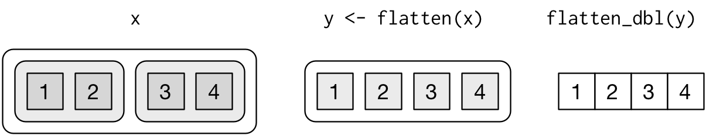
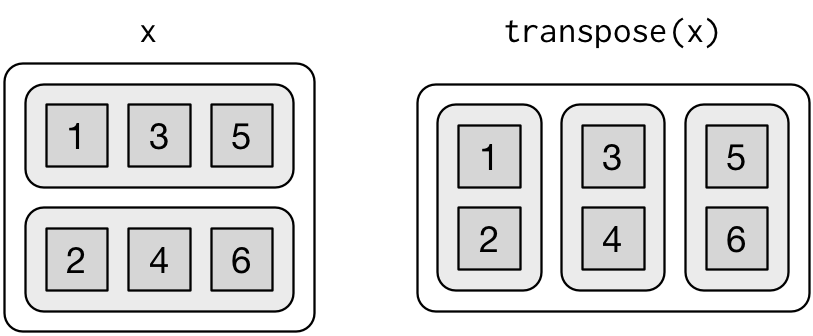

# Lists

```{r setup-lists, include=FALSE}
library(purrr)
source("common.R")
```

In this chapter, you'll learn how to handle lists, the data structure R uses for complex, hierarchical objects. You've already familiar with vectors, R's data structure for 1d objects. Lists extend these ideas to model objects that are like trees. You can create a hierarchical structure with a list because unlike vectors, a list can contain other lists.

If you've worked with list-like objects before, you're probably familiar with the for loop. I'll talk a little bit about for loops here, but the focus will be functions from the __purrr__ package. purrr makes it easier to work with lists by eliminating common for loop boilerplate so you can focus on the specifics. The apply family of functions in base R (`apply()`, `lapply()`, `tapply()`, etc) solve a similar problem, but purrr is more consistent and easier to learn.

The goal of using purrr functions instead of for loops is to allow you break common list manipulation challenges into independent pieces: 

1. How can you solve the problem for a single element of the list? Once
   you've solved that problem, purrr takes care of generalising your
   solution to every element in the list.

1. If you're solving a complex problem, how can you break it down into
   bite sized pieces that allow you to advance one small step towards a 
   solution? With purrr, you get lots of small pieces that you can
   combose together with the pipe.

This structure makes it easier to solve new problems. It also makes it easier to understand your solutions to old problems when you re-read your old code.

In later chapters you'll learn how to apply these ideas when modelling. You can often use multiple simple models to help understand a complex dataset, or you might have multiple models because you're bootstrapping or cross-validating. The techniques you learn in this chapter will be invaluable.

<!--
## Warm ups

* What does this for loop do?
* How is a data frame like a list?
* What does `mean()` mean? What does `mean` mean?
* How do you get help about the $ function? How do you normally write
`[[`(mtcars, 1) ?
* Argument order
-->

## List basics

You create a list with `list()`:

```{r}
x <- list(1, 2, 3)
str(x)

x_named <- list(a = 1, b = 2, c = 3)
str(x)
```

Unlike atomic vectors, `lists()` can contain a mix of objects:

```{r}
y <- list("a", 1L, 1.5, TRUE)
str(y)
```

Lists can even contain other lists!

```{r}
z <- list(list(1, 2), list(3, 4))
str(z)
```

`str()` is very helpful when looking at lists because it focusses on the structure, not the contents.

### Visualising lists

To explain more complicated list manipulation functions, it's helpful to have a visual representation of lists. For example, take these three lists:

```{r}
x1 <- list(c(1, 2), c(3, 4))
x2 <- list(list(1, 2), list(3, 4))
x3 <- list(1, list(2, list(3)))
```

I draw them as follows:

```{r, echo = FALSE}
knitr::include_graphics("diagrams/lists-structure.png")
```

* Lists are rounded rectangles that contain their children.
  
* I draw each child a little darker than its parent to make it easier to see 
  the hierarchy.
  
* The orientation of the children (i.e. rows or columns) isn't important, 
  so I pick a row or column orientation to either save space or illustrate 
  an important property in the example.

### Subsetting

There are three ways to subset a list, which I'll illustrate with `a`:

```{r}
a <- list(a = 1:3, b = "a string", c = pi, d = list(-1, -5))
```

*   `[` extracts a sub-list. The result will always be a list.

    ```{r}
    str(a[1:2])
    str(a[4])
    ```
    
    Like subsetting vectors, you can use an integer vector to select by 
    position, or a character vector to select by name.
    
*   `[[` extracts a single component from a list. It removes a level of 
    hierarchy from the list.

    ```{r}
    str(y[[1]])
    str(y[[4]])
    ```

*   `$` is a shorthand for extracting named elements of a list. It works
    similarly to `[[` except that you don't need to use quotes.
    
    ```{r}
    a$a
    a[["b"]]
    ```

Or visually:

```{r, echo = FALSE}
knitr::include_graphics("diagrams/lists-subsetting.png")
```

### Lists of condiments

It's easy to get confused between `[` and `[[`, but it's important to understand the difference. A few months ago I stayed at a hotel with a pretty interesting pepper shaker that I hope will help remember these differences:

```{r, echo = FALSE} 
knitr::include_graphics("images/pepper.jpg")
```

If this pepper shaker is your list `x`, then, `x[1]` is a pepper shaker containing a single pepper packet:

```{r, echo = FALSE} 
knitr::include_graphics("images/pepper-1.jpg")
```

`x[2]` would look the same, but would contain the second packet. `x[1:2]` would be a pepper shaker containing two pepper packets. 

`x[[1]]` is:

```{r, echo = FALSE} 
knitr::include_graphics("images/pepper-2.jpg")
```

If you wanted to get the content of the pepper package, you'd need `x[[1]][[1]]`:

```{r, echo = FALSE} 
knitr::include_graphics("images/pepper-3.jpg")
```

### Exercises

1.  Draw the following lists as nested sets.

1.  Generate the lists corresponding to these nested set diagrams.

1.  What happens if you subset a data frame as if you're subsetting a list?
    What are the key differences between a list and a data frame?

## For loops

To illustrate for loops, we'll start by creating a stereotypical list: an eight element list where each element contains a random vector of random length. (You'll learn about `rerun()` later.)

```{r}
x <- rerun(8, runif(sample(5, 1)))
str(x)
```

Imagine we want to compute the length of each element in this list. One way to do that is with a for loop:

```{r}
results <- vector("integer", length(x))
for (i in seq_along(x)) {
  results[i] <- length(x[[i]])
}
results
```

There are three parts to a for loop:

1.  The __results__: `results <- vector("integer", length(x))`. 
    This creates an integer vector the same length as the input. It's important
    to enough space for all the results up front, otherwise you have to grow the 
    results vector at each iteration, which is very slow for large loops.

1.  The __sequence__: `i in seq_along(x)`. This determines what to loop over:
    each run of the for loop will assign `i` to a different value from 
    `seq_along(x)`, shorthand for `1:length(x)`. It's useful to think of `i`
    as a pronoun.
    
1.  The __body__: `results[i] <- length(x[[i]])`. This code is run repeatedly, 
    each time with a different value in `i`. The first iteration will run 
    `results[1] <- length(x[[1]])`, the second `results[2] <- length(x[[2]])`, 
    and so on.
    
This loop used a function you might not be familiar with: `seq_along()`. This is a safe version of the more familiar `1:length(l)`. There's one important difference in behaviour. If you have a zero-length vector, `seq_along()` does the right thing:

```{r}
y <- numeric(0)
seq_along(y)
1:length(y)
```

Figuring out the length of the elements of a list is a common operation, so it makes sense to turn it into a function so we can reuse it again and again:

```{r}
compute_length <- function(x) {
  results <- vector("numeric", length(x))
  for (i in seq_along(x)) {
    results[i] <- length(x[[i]])
  }
  results
}
compute_length(x)
```

(In fact base R has this function already: it's called `lengths()`.)

Now imagine we want to compute the `mean()` of each element. How would our function change? What if we wanted to compute the `median()`? You could create variations of `compute_lengths()` that looked like this:

```{r}
compute_mean <- function(x) {
  results <- vector("numeric", length(x))
  for (i in seq_along(x)) {
    results[i] <- mean(x[[i]])
  }
  results
}
compute_mean(x)

compute_median <- function(x) {
  results <- vector("numeric", length(x))
  for (i in seq_along(x)) {
    results[i] <- median(x[[i]])
  }
  results
}
compute_median(x)
```

But this is only two of the many functions we might want to apply to every element of a list, and there's already lot of duplication. Most of the code is for-loop boilerplate and it's hard to see the one function (`length()`, `mean()`, or `median()`) that's actually important.

What would you do if you saw a set of functions like this:

```{r}
f1 <- function(x) abs(x - mean(x)) ^ 1
f2 <- function(x) abs(x - mean(x)) ^ 2
f3 <- function(x) abs(x - mean(x)) ^ 3
```

Hopefully, you'd notice that there's a lot of duplication, and extract it out into an additional argument:

```{r}
f <- function(x, i) abs(x - mean(x)) ^ i
```

You've reduce the chance of bugs (because you now have 1/3 less code), and made it easy to generalise to new situations. We can do exactly the same thing with `compute_length()`, `compute_median()` and `compute_mean()`:

```{r}
compute_summary <- function(x, f) {
  results <- vector("numeric", length(x))
  for (i in seq_along(x)) {
    results[i] <- f(x[[i]])
  }
  results
}
compute_summary(x, mean)
```  

Instead of hardcoding the summary function, we allow it to vary, by adding an additional argument that is a function. It can take a while to wrap your head around this, but it's very powerful technique. This is one of the reasons that R is known as a "functional" programming language.

### Exercises

1.  Read the documentation for `apply()`. In the 2d case, what two for loops
    does it generalise?
    
1.  It's common to see for loops that don't preallocate the output and instead
    increase the length of a vector at each step:
    
    ```{r}
    results <- vector("integer", 0)
    for (i in seq_along(x)) {
      results <- c(results, lengths(x[[i]]))
    }
    results
    ```
    
    How does this affect performance? 

## The map functions

This pattern of looping over a list and doing something to each element is so common that the purrr package provides a family of functions to do it for you. Each function always returns the same type of output so there are six variations based on what sort of result you want:

* `map()`     returns a list.
* `map_lgl()` returns a logical vector.
* `map_int()` returns a integer vector.
* `map_dbl()` returns a double vector.
* `map_chr()` returns a character vector.
* `map_df()`  returns a data frame.
* `walk()`    returns nothing. Walk is a little different to the others because 
  it's called exclusively for its side effects, so it's described in more detail 
  later in [walk](#walk).

Each functions takes a list as input, applies a function to each piece, and then returns a new vector that's the same length as the input. The type of the vector is determine by the specific map function. Usually you want to use the most specific avaiable; using `map()` only as a fallback when there is no specialised equivalent available.

We can use these functions to perform the same computations as the previous for loops:

```{r}
map_int(x, length)
map_dbl(x, mean)
map_dbl(x, median)
```

Compared to using a for loop, focus is on the operation being performed (i.e. `length()`, `mean()`, or `median()`), not the book-keeping required to loop over every element and store the results.

There are a few differences between `map_*()` and `compute_summary()`:

*   All purrr functions are implemented in C. This means you can't easily 
    understand their code, but it makes them a little faster.
    
*   The second argument, `.f`, the function to apply, can be a formula, a 
    character vector, or an integer vector. You'll learn about those handy 
    shortcuts in the next section.
    
*   Any arguments after `.f` will be passed on to it each time its called:

    ```{r}
    map_dbl(x, mean, trim = 0.5)
    ```

*   The map functions also preserve names:

    ```{r}
    z <- list(x = 1:3, y = 4:5)
    map_int(z, length)
    ```

### Shortcuts

There are a few shortcuts that you can use with `.f` in order to save a little typing. Imagine you want to fit a linear model to each individual in a dataset. The following toy example splits the up the `mtcars` dataset in to three pieces (only for each value of cylinder) and fits the same linear model to each piece:  

```{r}
models <- mtcars %>% 
  split(.$cyl) %>% 
  map(function(df) lm(mpg ~ wt, data = df))
```

The syntax for creating an anonymous function in R is quite verbose so purrr provides a convenient shortcut: a one-sided formula.

```{r}
models <- mtcars %>% 
  split(.$cyl) %>% 
  map(~lm(mpg ~ wt, data = .))
```

Here I've used `.` as a pronoun: it refers to the "current" list element (in the same way that `i` referred to the number in the for loop). You can also use `.x` and `.y` to refer to up to two arguments. If you want to create an function with more than two arguments, do it the regular way!

When you're looking at many models, you might want to extract a summary statistic like the $R^2$. To do that we need to first run `summary()` and then extract the component called `r.squared`. We could do that using the shorthand for anonymous funtions:

```{r}
models %>% 
  map(summary) %>% 
  map_dbl(~.$r.squared)
```

But extracting named components is a common operation, so purrr provides an even shorter shortcut: you can use a string.

```{r}
models %>% 
  map(summary) %>% 
  map_dbl("r.squared")
```

You can also use a numeric vector to select elements by position: 

```{r}
x <- list(list(1, 2, 3), list(4, 5, 6), list(7, 8, 9))
x %>% map_dbl(2)
```

### Base R
  
If you're familiar with the apply family of functions in base R, you might have noticed some similarities with the purrr functions:

*   `lapply()` is basically identical to `map()`. There's no advantage to using 
    `map()` over `lapply()` except that it's consistent with all the other 
    functions in purrr.

*   The base `sapply()` is a wrapper around `lapply()` that automatically tries 
    to simplify the results. This is useful for interactive work but is 
    problematic in a function because you never know what sort of output
    you'll get:
    
    ```{r}
    x1 <- list(
      c(0.27, 0.37, 0.57, 0.91, 0.20),
      c(0.90, 0.94, 0.66, 0.63, 0.06), 
      c(0.21, 0.18, 0.69, 0.38, 0.77)
    )
    x2 <- list(
      c(0.50, 0.72, 0.99, 0.38, 0.78), 
      c(0.93, 0.21, 0.65, 0.13, 0.27), 
      c(0.39, 0.01, 0.38, 0.87, 0.34)
    )
    
    threshhold <- function(x, cutoff = 0.8) x[x > cutoff]
    str(sapply(x1, threshhold))
    str(sapply(x2, threshhold))
    ```

*   `vapply()` is a safe alternative to `sapply()` because you supply an additional
    argument that defines the type. The only problem with `vapply()` is that 
    it's a lot of typing: `vapply(df, is.numeric, logical(1))` is equivalent to 
    `map_lgl(df, is.numeric)`.
    
    One of advantage of `vapply()` over the map functions is that it can also 
    produce matrices - the map functions only ever produce vectors.

*   `map_df(x, f)` is effectively the same as `do.call("rbind", lapply(x, f))` 
    but under the hood is much more efficient.

### Exercises

1.  How can you determine which columns in a data frame are factors? 
    (Hint: data frames are lists.)

1.  What happens when you use the map functions on vectors that aren't lists?
    What does `map(1:5, runif)` do? Why?
    
1.  What does `map(-2:2, rnorm, n = 5)` do. Why?

1.  Rewrite `map(x, function(df) lm(mpg ~ wt, data = df))` to eliminate the 
    anonymous function. 

## Handling hierarchy {#hierarchy}

The map functions apply a function to every element in a list. They are the most commonly used part of purrr, but not the only part. Since lists are often used to represent complex hierarchies, purrr also provides tools to work with hierarchy:

* You can extract deeply nested elements in a single call by supplying
  a character vector to the map functions.

* You can remove a level of the hierarchy with the flatten functions.

* You can flip levels of the hierarchy with the transpose function.

### Extracting deeply nested elements

Some times you get data structures that are very deeply nested. A common source of sych data is JSON from a web API. I've previously downloaded a list of GitHub issues related to this book and saved it as `issues.json`. Now I'm going to load it into a list with jsonlite. By default `fromJSON()` tries to be helpful and simplifies the structure a little for you. Here I'm going to show you how to do it with purrr, so I set `simplifyVector = FALSE`:

```{r}
# From https://api.github.com/repos/hadley/r4ds/issues
issues <- jsonlite::fromJSON("issues.json", simplifyVector = FALSE)
```

There are eight issues, and each issue is a nested list:

```{r}
length(issues)
str(issues[[1]])
```

To work with this sort of data, you typically want to turn it into a data frame by extracting the related vectors that you're most interested in:

```{r}
issues %>% map_int("id")
issues %>% map_lgl("locked")
issues %>% map_chr("state")
```

You can use the same technique to extract more deeply nested structure. For example, imagine you want to extract the name and id of the user. You could do that in two steps:

```{r}
users <- issues %>% map("user")
users %>% map_chr("login")
users %>% map_int("id")
```

But by supplying a character _vector_ to `map_*`, you can do it in one:

```{r}
issues %>% map_chr(c("user", "login"))
issues %>% map_int(c("user", "id"))
```

### Removing a level of hierarchy

As well as indexing deeply into hierarchy, it's sometimes useful to flatten it. That's the job of the flatten family of functions: `flatten()`, `flatten_lgl()`, `flatten_int()`, `flatten_dbl()`, and `flatten_chr()`. In the code below we take a list of lists of double vectors, then flatten it to a list of double vectors, then to a double vector.

```{r}
x <- list(list(a = 1, b = 2), list(c = 3, d = 4))
str(x)

y <- flatten(x) 
str(y)
flatten_dbl(y)
```

Graphically, that sequence of operations looks like:

```{r, echo = FALSE}

````

Whenever I get confused about a sequence of flattening operations, I'll often draw a diagram like this to help me understand what's going on.

Base R has `unlist()`, but I recommend avoiding it for the same reason I recommend avoiding `sapply()`: it always succeeds. Even if your data structure accidentally changes, `unlist()` will continue to work silently the wrong type of output. This tends to create problems that are frustrating to debug.

### Switching levels in the hierarchy

Other times the hierarchy feels "inside out". You can use `transpose()` to flip the first and second levels of a list: 

```{r}
x <- list(
  x = list(a = 1, b = 3, c = 5),
  y = list(a = 2, b = 4, c = 6)
)
x %>% str()
x %>% transpose() %>% str()
```

Graphically, this looks like:

```{r, echo = FALSE}

```

You'll see an example of this in the next section, as `transpose()` is particularly useful in conjunction with adverbs like `safely()` and `quietly()`.

It's called transpose by analogy to matrices. When you subset a transposed matrix, you switch indices: `x[i, j]` is the same as `t(x)[j, i]`. It's the same idea when transposing a list, but the subsetting looks a little different: `x[[i]][[j]]` is equivalent to `transpose(x)[[j]][[i]]`. Similarly, a transpose is its own inverse so `transpose(transpose(x))` is equal to `x`.

Transpose is also useful when working with JSON apis. Many JSON APIs represent data frames in a row-based format, rather than R's column-based format. `transpose()` makes it easy to switch between the two:

```{r}
df <- dplyr::data_frame(x = 1:3, y = c("a", "b", "c"))
df %>% transpose() %>% str()
```

### Exercises

## Dealing with failure

When you do many operations on a list, sometimes one will fail. When this happens, you'll get an error message, and no output. This is annoying: why does one failure prevent you from accessing all the other successes? How do you ensure that one bad apple doesn't ruin the whole barrel?

In this section you'll learn how to deal this situation with a new function: `safely()`. `safely()` is an adverb: it takes a function (a verb) and returns a modified version. In this case, the modified function will never throw an error. Instead, it always returns a list with two elements:

1. `result` is original result. If there was an error, this will be `NULL`.

1. `error` is an error object. If the operation was successful this will be 
   `NULL`.

(You might be familiar with the `try()` function in base R. It's similar, but because it sometimes returns the original result and it sometimes returns an error object it's more difficult to work with.)

Let's illustrate this with a simple example: `log()`:

```{r}
safe_log <- safely(log)
str(safe_log(10))
str(safe_log("a"))
```

When the function succeeds the `result` element contains the result and the error element is `NULL`. When the function fails, the result element is `NULL` and the error element contains an error object.

`safely()` is designed to work with map:

```{r}
x <- list(1, 10, "a")
y <- x %>% map(safely(log))
str(y)
```

This would be easier to work with if we had two lists: one of all the errors and one of all the results. That's easy to get with `transpose()`.

```{r}
y <- y %>% transpose()
str(y)
```

It's up to you how to deal with the errors, but typically you'll either look at the values of `x` where `y` is an error or work with the values of y that are ok:

```{r}
is_ok <- y$error %>% map_lgl(is_null)
x[!is_ok]
y$result[is_ok] %>% flatten_dbl()
```

Purrr provides two other useful adverbs:

*   Like `safely()`, `possibly()` always succeeds. It's simpler than `safely()`, 
    because you give it a default value to return when there is an error. 
    
    ```{r}
    x <- list(1, 10, "a")
    x %>% map_dbl(possibly(log, NA_real_))
    ```
    
*   `quietly()` performs a similar role to `safely()`, but instead of capturing
    errors, it captures printed output, messages, and warnings:
    
    ```{r}
    x <- list(1, -1)
    x %>% map(quietly(log)) %>% str()
    ```

### Exercises

1.  Challenge: read all the csv files in this directory. Which ones failed
    and why? 

    ```{r, eval = FALSE}
    files <- dir("data", pattern = "\\.csv$")
    files %>%
      set_names(., basename(.)) %>%
      map_df(safely(readr::read_csv), .id = "filename") %>%
    ```

## Parallel maps

So far we've mapped along a single list. But often you have mutliple related lists that you need iterate along in parallel. That's the job of the `map2()` and `pmap()` functions. For example, imagine you want to simulate some random normals with different means. You know how to do that with `map()`:

```{r}
mu <- list(5, 10, -3)
mu %>% map(rnorm, n = 10)
```

What if you also want to vary the standard deviation? You need to iterate along a vector of means and a vector of standard deviations in parallel. That's a job for `map2()` which works with two parallel sets of inputs:

```{r}
sigma <- list(1, 5, 10)
map2(mu, sigma, rnorm, n = 10)
```

`map2()` generates this series of function calls:

```{r, echo = FALSE}
knitr::include_graphics("diagrams/lists-map2.png")
```

The arguments that vary for each call come before the function name, and arguments that are the same for every function call come afterwards.

Like `map()`, `map2()` is just a wrapper around a for loop:

```{r}
map2 <- function(x, y, f, ...) {
  out <- vector("list", length(x))
  for (i in seq_along(x)) {
    out[[i]] <- f(x[[i]], y[[i]], ...)
  }
  out
}
```

You could also imagine `map3()`, `map4()`, `map5()`, `map6()` etc, but that would get tedious quickly. Instead, purrr provides `pmap()` which takes a list of arguments. You might use that if you wanted to vary the mean, standard deviation, and number of samples:

```{r}
n <- list(1, 3, 5)
args1 <- list(n, mu, sigma)
args1 %>% pmap(rnorm) %>% str()
```

That looks like:

```{r, echo = FALSE}
knitr::include_graphics("diagrams/lists-pmap-unnamed.png")
```

However, instead of relying on position matching, it's better to name the arguments. This is more verbose, but it makes the code clearer.

```{r}
args2 <- list(mean = mu, sd = sigma, n = n)
args2 %>% pmap(rnorm) %>% str()
```

That generates longer, but safer, calls:

```{r, echo = FALSE}
knitr::include_graphics("diagrams/lists-pmap-named.png")
```

Since the arguments are all the same length, it makes sense to store them in a data frame:

```{r}
params <- dplyr::data_frame(mean = mu, sd = sigma, n = n)
params$result <- params %>% pmap(rnorm)
params
```

As soon as your code gets complicated, I think a data frame is a good approach because it ensures that each column has a name and is the same length as all the other columns. We'll come back to this idea when we explore the intersection of dplyr, purr, and model fitting.

### Invoking different functions

There's one more step up in complexity - as well as varying the arguments to the function you might also vary the function itself:

```{r}
f <- c("runif", "rnorm", "rpois")
param <- list(
  list(min = -1, max = 1), 
  list(sd = 5), 
  list(lambda = 10)
)
```

To handle this case, you can use `invoke_map()`:

```{r}
invoke_map(f, param, n = 5) %>% str()
```

```{r, echo = FALSE}
knitr::include_graphics("diagrams/lists-invoke.png")
```

The first argument is a list of functions or character vector of function names. The second argument is a list of lists giving the arguments that vary for each function. The subsequent arguments are passed on to every function.

You can use `dplyr::frame_data()` to make creating these matching pairs a little easier:

```{r, eval = FALSE}
# Needs dev version of dplyr
sim <- dplyr::frame_data(
  ~f,      ~params,
  "runif", list(min = -1, max = -1),
  "rnorm", list(sd = 5),
  "rpois", list(lambda = 10)
)
sim %>% dplyr::mutate(
  samples = invoke_map(f, params, n = 10)
)
```

## Walk {#walk}

Walk is an alternative to map that you use when you want to call a function for its side effects, rather than for its return value. You typically do this because you want to render output to the screen or saving files to disk - the important thing is the action, not the return value. Here's a very simple example:

```{r}
x <- list(1, "a", 3)

x %>% 
  walk(print)
```

`walk()` is generally not that useful compared to `walk2()` or `pwalk()`. For example, if you had a list of plots and a vector of file names, you could use `pwalk()` to save each file to the corresponding location on disk:

```{r}
library(ggplot2)
plots <- mtcars %>% 
  split(.$cyl) %>% 
  map(~ggplot(., aes(mpg, wt)) + geom_point())
paths <- paste0(names(plots), ".pdf")

pwalk(list(paths, plots), ggsave, path = tempdir())
```

`walk()`, `walk2()` and `pwalk()` all invisibly return the `.x`, the first argument. This makes them suitable for use in the middle of pipelines. 

## Predicates

Imagine we want to summarise each numeric column of a data frame. We could do it in two steps:

1. Find all numeric columns.
1. Sumarise summarise each column.

In code, that would look like:

```{r}
col_sum <- function(df, f) {
  is_num <- df %>% map_lgl(is_numeric)
  df[is_num] %>% map_dbl(f)
}
```

`is_numeric()` is a __predicate__: a function that returns either `TRUE` or `FALSE`. There are a number of of purrr functions designed to work specifically with predicates:

* `keep()` and `discard()` keeps/discards list elements where the predicate is 
  true.
  
* `head_while()` and `tail_while()` keep the first/last elements of a list until
  you get the first element where the predicate is true.
  
* `some()` and `every()` determine if the predicate is true for any or all of
  the elements.

* `detect()` and `detect_index()`

We could use `keep()` to simplify the summary function to:

```{r}
col_sum <- function(df, f) {
  df %>%
    keep(is.numeric) %>%
    map_dbl(f)
}
```

I like this formulation because you can easily read the sequence of steps.

### Built-in predicates

Purrr comes with a number of predicate functions built-in:

|                  | lgl | int | dbl | chr | list | null |
|------------------|-----|-----|-----|-----|------|------|
| `is_logical()`   |  x  |     |     |     |      |      |
| `is_integer()`   |     |  x  |     |     |      |      |
| `is_double()`    |     |     |  x  |     |      |      |
| `is_numeric()`   |     |  x  |  x  |     |      |      |
| `is_character()` |     |     |     |  x  |      |      |
| `is_atomic()`    |  x  |  x  |  x  |  x  |      |      |
| `is_list()`      |     |     |     |     |  x   |      |
| `is_vector()`    |  x  |  x  |  x  |  x  |  x   |      |
| `is_null()`      |     |     |     |     |      | x    |

Compared to the base R functions, they only inspect the type of the object, not its attributes. This means they tend to be less suprising: 

```{r}
is.atomic(NULL)
is_atomic(NULL)

is.vector(factor("a"))
is_vector(factor("a"))
```

Each predicate also comes with "scalar" and "bare" versions. The scalar version checks that the length is 1 and the bare version checks that the object is a bare vector with no S3 class.

```{r}
y <- factor(c("a", "b", "c"))
is_integer(y)
is_scalar_integer(y)
is_bare_integer(y)
```

### Exercises

1.  A possible base R equivalent of `col_sum()` is:

    ```{r}
    col_sum3 <- function(df, f) {
      is_num <- sapply(df, is.numeric)
      df_num <- df[, is_num]

      sapply(df_num, f)
    }
    ```
    
    But it has a number of bugs as illustrated with the following inputs:
    
    ```{r, eval = FALSE}
    df <- data.frame(z = c("a", "b", "c"), x = 1:3, y = 3:1)
    # OK
    col_sum3(df, mean)
    # Has problems: don't always return numeric vector
    col_sum3(df[1:2], mean)
    col_sum3(df[1], mean)
    col_sum3(df[0], mean)
    ```
    
    What causes the bugs?

1.  Carefully read the documentation of `is.vector()`. What does it actually
    test for?
