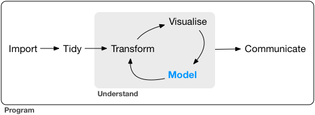

# (PART) Model {-}

# Introduction {#model-intro}

Now that you are equipped with powerful programming tools we can finally return to modelling. You'll use your new tools of data wrangling and programming, to fit many models and understand how they work. The focus of this book is on exploration, not confirmation or formal inference. But you'll learn a few basic tools that help you understand the variation within your models.

```{r echo = FALSE, out.width = "75%"}

```

The goal of a model is to provide a simple low-dimensional summary of a dataset. Ideally, the model will capture true "signals" (i.e. patterns generated by the phenomenon of interest), and ignore "noise" (i.e. random variation that you're not interested in). Here we only cover "predictive" models, which, as the name suggests, generate predictions. There is another type of model that we're not going to discuss: "data discovery" models. These models don't make predictions, but instead help you discover interesting relationships within your data. (These two categories of models are sometimes called supervised and unsupervised, but I don't think that terminology is particularly illuminating.)

This book is not going to give you a deep understanding of the mathematical theory that underlies models. It will, however, build your intuition about how statistical models work, and give you a family of useful tools that allow you to use models to better understand your data:

* In [model basics], you'll learn how models work mechanistically, focussing on
  the important family of linear models. You'll learn general tools for gaining
  insight into what a predictive model tells you about your data, focussing on
  simple simulated datasets.

* In [model building], you'll learn how to use models to pull out known
  patterns in real data. Once you have recognised an important pattern
  it's useful to make it explicit in a model, because then you can
  more easily see the subtler signals that remain.

* In [many models], you'll learn how to use many simple models to help 
  understand complex datasets. This is a powerful technique, but to access
  it you'll need to combine modelling and programming tools.

These topics are notable because of what they don't include: any tools for quantitatively assessing models. That is deliberate: precisely quantifying a model requires a couple of big ideas that we just don't have the space to cover here. For now, you'll rely on qualitative assessment and your natural scepticism. In [Learning more about models], we'll point you to other resources where you can learn more.

## Hypothesis generation vs. hypothesis confirmation

In this book, we are going to use models as a tool for exploration, completing the trifecta of the tools for EDA that were introduced in Part 1. This is not how models are usually taught, but as you will see, models are an important tool for exploration. Traditionally, the focus of modelling is on inference, or for confirming that an hypothesis is true. Doing this correctly is not complicated, but it is hard. There is a pair of ideas that you must understand in order to do inference correctly:

1. Each observation can either be used for exploration or confirmation, 
   not both.

1. You can use an observation as many times as you like for exploration,
   but you can only use it once for confirmation. As soon as you use an 
   observation twice, you've switched from confirmation to exploration.
   
This is necessary because to confirm a hypothesis you must use data independent of the data that you used to generate the hypothesis. Otherwise you will be over optimistic. There is absolutely nothing wrong with exploration, but you should never sell an exploratory analysis as a confirmatory analysis because it is fundamentally misleading. 

If you are serious about doing an confirmatory analysis, one approach is to split your data into three pieces before you begin the analysis:

1.  60% of your data goes into a __training__ (or exploration) set. You're 
    allowed to do anything you like with this data: visualise it and fit tons 
    of models to it.
  
1.  20% goes into a __query__ set. You can use this data to compare models 
    or visualisations by hand, but you're not allowed to use it as part of
    an automated process.

1.  20% is held back for a __test__ set. You can only use this data ONCE, to 
    test your final model. 
    
This partitioning allows you to explore the training data, occasionally generating candidate hypotheses that you check with the query set. When you are confident you have the right model, you can check it once with the test data.

(Note that even when doing confirmatory modelling, you will still need to do EDA. If you don't do any EDA you will remain blind to the quality problems with your data.)
