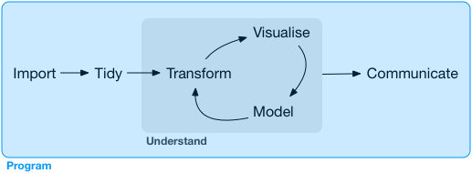

# (PART) Program {-}

# Introduction {#program-intro}

In this part of the book, you'll improve your programming skills. Programming is a cross-cutting skill needed for all data science work: you must use a computer to do data science; you cannot do it in your head, or with pencil and paper. 

```{r echo = FALSE, out.width = "75%"}

```

Programming produces code, and code is a tool of communication. Obviously code tells the computer what you want it to do. But it also communicates meaning to other humans. Thinking about code as a vehicle for communication is important because every project you do is fundamentally collaborative. Even if you're not working with other people, you'll definitely be working with future-you! Writing clear code is important so that others (like future-you) can understand why you tackled an analysis in the way you did. That means getting better at programming also involves getting better at communicating. Over time, you want your code to become not just easier to write, but easier for others to read. 

Writing code is similar in many ways to writing prose. One parallel which I find particularly useful is that in both cases rewriting is the key to clarity. The first expression of your ideas is unlikely to be particularly clear, and you may need to rewrite multiple times. After solving a data analysis challenge, it's often worth looking at your code and thinking about whether or not it's obvious what you've done. If you spend a little time rewriting your code while the ideas are fresh, you can save a lot of time later trying to recreate what your code did. But this doesn't mean you should rewrite every function: you need to balance what you need to achieve now with saving time in the long run. (But the more you rewrite your functions the more likely your first attempt will be clear.)

In the following four chapters, you'll learn skills that will allow you to both tackle new programs and to solve existing problems with greater clarity and ease: 

1.  In [pipes], you will dive deep into the __pipe__, `%>%`, and learn more 
    about how it works, what the alternatives are, and when not to use it.

1.  Copy-and-paste is a powerful tool, but you should avoid doing it more than
    twice. Repeating yourself in code is dangerous because it can easily lead 
    to errors and inconsistencies. Instead, in [functions], you'll learn
    how to write __functions__ which let you extract out repeated code so that 
    it can be easily reused.

1.  As you start to write more powerful functions, you'll need a solid
    grounding in R's __data structures__, provided by [vectors]. You must master 
    the four common atomic vectors, the three important S3 classes built on 
    top of them, and understand the mysteries of the list and data frame. 

1.  Functions extract out repeated code, but you often need to repeat the
    same actions on different inputs. You need tools for __iteration__ that
    let you do similar things again and again. These tools include for loops 
    and functional programming, which you'll learn about in [iteration].

## Learning more

The goal of these chapters is to teach you the minimum about programming that you need to practice data science, which turns out to be a reasonable amount. Once you have mastered the material in this book, I strongly believe you should invest further in your programming skills. Learning more about programming is a long-term investment: it won't pay off immediately, but in the long term it will allow you to solve new problems more quickly, and let you reuse your insights from previous problems in new scenarios.

To learn more you need to study R as a programming language, not just an interactive environment for data science. We have written two books that will help you do so:

* [_Hands on Programming with R_](https://amzn.com/1449359019),
  by Garrett Grolemund. This is an introduction to R as a programming language 
  and is a great place to start if R is your first programming language. It 
  covers similar material to these chapters, but with a different style and
  different motivation examples (based in the casino). It's a useful complement 
  if you find that these four chapters go by too quickly.
  
* [_Advanced R_](https://amzn.com/1466586966) by Hadley Wickham. This dives into the
  details of R the programming language. This is a great place to start if you
  have existing programming experience. It's also a great next step once you've 
  internalised the ideas in these chapters. You can read it online at
  <http://adv-r.had.co.nz>.
