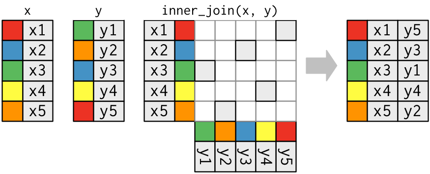
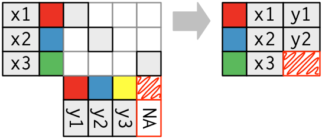
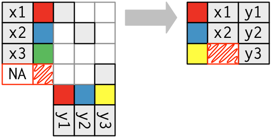
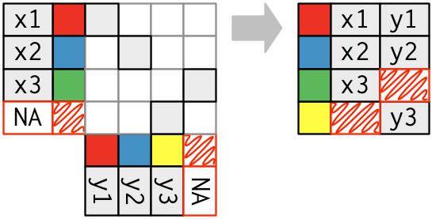

# Relational data {#relation-data}

```{r setup-transform, include = FALSE}
library(dplyr)
library(nycflights13)
library(ggplot2)
source("common.R")
options(dplyr.print_min = 6, dplyr.print_max = 6)
knitr::opts_chunk$set(fig.path = "figures/", cache = TRUE)
```

It's rare that a data analysis involves only a single table of data. You often have many tables that contribute to an analysis, and you need flexible tools to combine them. This type of data is called relational because it concerns the relations between multiple dataset.

There are three families of verbs design to work with relational data:

* Mutating joins, which add new variables to one data frame from matching rows 
  in another.

* Filtering joins, which filter observations from one data frame based on 
  whether or not they match an observation in the other table.

* Set operations, which treat observations like they were set elements.

If you've used SQL before you're probably familiar with the mutating joins (these are the classic left join, right join, etc), but you might not know about the filtering joins (semi and anti joins) or the set operations.

All two-table verbs work similarly. The first two arguments are the two data frames to combine, and the output is always a new data frame. If you don't specify the details of the join, dplyr will guess based on the common variables, and will print a message. If you want to suppress that message, supply more arguments.

## nycflights13 {#nycflights13-relational}

We're going to continue to work with the nycflights13 package. We start by selecting just some of the variables. This will make it easier to see what's going on when we join on other tables. Like mutating, joins tend to add on variables to the right-hand side, so you might not see them if you have a lot of variables.

```{r}
# Drop unimportant variables so it's easier to understand the join results.
flights2 <- flights %>% select(year:day, hour, origin, dest, tailnum, carrier)
flights2
```

There are four additional data frames that contain useful additional metadata about the `flights`:

*   `airlines` lets you look up the full carrier name from its abbreviated 
    code.
    
    ```{r}
    airlines
    ```

*   `planes` gives information about each plane, identified by its `tailnum`.

    ```{r}
    planes
    ```

*   `airports` gives information about each airport, identified by the `faa`
    airport code.
    
    ```{r}
    airports
    ```
  
*   `weather` gives the weather at each airport at each hour.

    ```{r}
    weather
    ```

We could illustrate this with a diagram:

```{r, echo = FALSE, out.width = "75%"}
knitr::include_graphics("diagrams/relational-nycflights.png")
```

This diagram is a little overwhelming, but the key to understanding it is to reminder it's pairs of tables that are related. All join operations only ever work a pair of tables. Don't try and understand the whole thing, just use it as a reference when you want to understand how a pair of tables are related; you're unlikely to ever need to join together all of the tables simultaneously. 

The diagram shows how each pair of tables is connected.

* `flights` connects to `planes` and `airlines` via single variable, `tailnum`,
  and `carrier` respectively.

* `flights` connects to `airports` in two ways: via the `origin` or the 
  `dest` variable.
  
* `flights` connects to `weather` via `origin` (the location), and
  `year`, `month`, `day` and `hour` (the time).

The variables used to connect each pair of tables are called the __keys__. The __primary keys__ are the refer to the set of variables that uniquely identify an observation in a data frame. Each plane has a single variable that identifies it, it's tail number (`tailnum`). Weather is more complicated: it needs five variables to uniquely identify each observation: `year`, `month`, `day`, `hour`, and `origin`. Primary keys are coloured grey.

Arrows define a __relation__ between a pair of tables. A relation connects the primary key from one table to a __foreign key__ (or keys) in another table. Relations are almost always 1-to-many. For example, each airport, plane, and airline has multiple correspond flights. In other data, you'll occassionaly see a 1-to-1 relationship. You can think of this as a special case of 1-to-many. 

It's possible to model many-to-many relations with a n-1 relation and a 1-n relation. Unfortunately, that's beyond the scope of this book. If you do encountered in practice, remember it can always be broken down into pairs.

## Mutating joins {#mutating-joins}

Mutating joins allow you to combine variables from multiple tables. For example, imagine you want to add the full airline name to the `flights` data. You can join the `airlines` and `carrier` data frames:

```{r}

flights2 %>% 
  inner_join(airlines)
```

The result of joining airlines on to flights is an additional variable: carrier. This is why I call this type of join a mutating join.

There are three important things you need to understand about how joins work:

* The different types of matches (1-to-1, 1-to-many, many-to-many).

* What happens when a row doesn't match.

* How you control what variables used to generate the match.

These are described in the following sections using a visual abstraction and code. The following diagram shows a schematic of a data frame. The coloured column represents the "key" variable: these are used to match the rows between the tables. The labelled column represents the "value" columns that are carried along for the ride.

```{r, echo = FALSE, out.width = "10%"}
knitr::include_graphics("diagrams/join-setup.png")
```
```{r}
data_frame(key = 1:5, value = paste0("x", 1:5))
```

## Matches {#join-matches}

There are three ways that the keys might match: one-to-one, one-to-many, and many-to-many.

*    In a one-to-one match, each key in `x` matches one key in `y`. This sort of
     match is useful when you two tables that have data about the same thing and
     you want to align the rows.

    ```{r, echo = FALSE, out.width = "100%"}
    
    ```
    
    ```{r}
    x <- data_frame(key = 1:5, val_x = paste0("x", 1:5))
    y <- data_frame(key = c(3, 5, 2, 4, 1), val_y = paste0("y", 1:5))
    inner_join(x, y, by = "key")
    ```
    
*   In a one-to-many match, each key in `y` matches multiple keys in `x`. This
    is useful when you want to add in additional information.
    
    ```{r, echo = FALSE, out.width = "100%"}
    knitr::include_graphics("diagrams/join-one-to-many.png")
    ```
    
    ```{r}
    x <- data_frame(key = c(3, 3, 1, 4, 4), val_x = paste0("x", 1:5))
    y <- data_frame(key = 1:4, val_y = paste0("y", 1:4))
    inner_join(x, y, by = "key")
    ```

*   Finally, you can have a many-to-many match, where there are duplicated
    keys in `x` and duplicate keys in `y`. When this happens, every possible
    combination is created in the output.

    ```{r, echo = FALSE, out.width = "100%"}
    knitr::include_graphics("diagrams/join-many-to-many.png")
    ```
    ```{r}
    x <- data_frame(key = c(1, 2, 2, 4), val_x = paste0("x", 1:4))
    y <- data_frame(key = c(1, 2, 2, 4), val_y = paste0("y", 1:4))
    inner_join(x, y, by = "key")
    ```    

### Missing matches {#join-types}

You might also wonder what happens when there isn't a match. This is controlled by the type of "join": inner, left, right, or outer. I'll show each type of join with a picture, and the corresponding R code. Here are the tables we will use:

```{r, echo = FALSE, out.width = "25%"}
knitr::include_graphics("diagrams/join-setup2.png")
```
```{r}
(x <- data_frame(key = c(1, 2, 3), val_x = c("x1", "x2", "x3")))
(y <- data_frame(key = c(1, 2, 4), val_y = c("y1", "y2", "y3")))
```

*   In an inner join, only rows that have matching keys are retained:

    ```{r, echo = FALSE, out.width = "50%"}
    knitr::include_graphics("diagrams/join-inner.png")
    ```
    
    ```{r}
    x %>% inner_join(y, by = "key")
    ```

*   In a left join, every row in `x` is kept.  A left join effectively works
    by adding a "default" match: if a row in `x` doesn't match a row in `y`, 
    it falls back to matching a row that contains only missing values.

    ```{r, echo = FALSE, out.width = "50%"}
    
    ```
    ```{r}
    x %>% left_join(y, by = "key")
    ```

    This is the most commonly used join because it ensures that you don't lose
    observations from your primary table.

*   A right join is the complement of a left join: every row in `y` is kept.

    ```{r, echo = FALSE, out.width = "50%"}
    
    ```
    ```{r}
    x %>% right_join(y, by = "key")
    ```

*   A full join is combines a left join and a right join, keeping every 
    row in both `x` and `y`.

    ```{r, echo = FALSE, out.width = "50%"}
    
    ```
    ```{r}
    x %>% full_join(y, by = "key")
    ```

The left, right and full joins are collectively known as __outer joins__. When a row doesn't match in an outer join, the new variables are filled in with missing values. You can also think about joins heuristically as set operations on the rows of the tables:

```{r, echo = FALSE}
knitr::include_graphics("diagrams/join-venn.png")
```

--------------------------------------------------------------------------------

`base::merge()` can perform all four types of mutating join: 

dplyr              | merge
-------------------|-------------------------------------------
`inner_join(x, y)` | `merge(x, y)`
`left_join(x, y)`  | `merge(x, y, all.x = TRUE)`
`right_join(x, y)` | `merge(x, y, all.y = TRUE)`,
`full_join(x, y)`  | `merge(x, y, all.x = TRUE, all.y = TRUE)`

The advantages of the specific dplyr verbs is that they more clearly convey the intent of your code: the difference between the joins is really important but concealed in the arguments of `merge()`. dplyr's joins are considerably faster and don't mess with the order of the rows.

--------------------------------------------------------------------------------

### Controlling how the tables are matched {#join-by}

When joining multiple tables of data, it's useful to think about the "key", the combination of variables that uniquely identifies each observation. Sometimes that's a single variable. For example each airport is uniquely identified by a three letter `faa` code, each carrier is uniquely identified by its two letter abbreviation, and each plane by its `tailnum`. `weather` is more complex: to uniquely identify an observation you need to know when (`year`, `month`, `day`, `hour`) and where it happened (`origin`).

When you combine two tables of data, you do so by matching the keys in each table. You can control the matching behaviour using the `by` argument:

  * The default, `by = NULL`, uses all variables that appear in both tables, 
    the so called __natural__ join. For example, the flights and weather tables 
    match on their common variables: `year`, `month`, `day`, `hour` and
    `origin`.
    
    ```{r}
    flights2 %>% left_join(weather)
    ```
    
  * A character vector, `by = "x"`. This is like a natural join, but uses only 
    some of the common variables. For example, `flights` and `planes` have 
    `year` variables, but they mean different things so we only want to join by 
    `tailnum`.
    
    ```{r}
    flights2 %>% left_join(planes, by = "tailnum")
    ```
    
    Note that the `year` variables (which appear in both input data frames,
    but are not constrained to be equal) are disambiguated in the output with 
    a suffix.

  * A named character vector: `by = c("a" = "b")`. This will
    match variable `a` in table `x` to variable `y` in table `b`. The 
    variables from `x` will be used in the output.
    
    For example, if we want to draw a map we need to combine the flights data
    with the airports data which contains the location (`lat` and `long`) of
    each airport. Each flight has an origin and destination `airport`, so we 
    need to specify which one we want to join to:
    
    ```{r}
    flights2 %>% left_join(airports, c("dest" = "faa"))
    flights2 %>% left_join(airports, c("origin" = "faa"))
    ```

### Exercises

1.  Compute the average delay by destination, then join on the `airports`
    data frame so you can show the spatial distribution of delays. Here's an
    easy way to draw a map of the United States:
    
    ```{r, include = FALSE}
    airports %>% 
      semi_join(flights, c("faa" = "dest")) %>% 
      ggplot(aes(lon, lat)) + 
        borders("state") +
        geom_point() +
        coord_quickmap()
    ```
    
    You might want to use the `size` or `colour` of the points to display
    the average delay for each airport.

1.  Is there a relationship between the age of a plane and its delays?

1.  What weather conditions make it more likely to see a delay?
    
1.  What happened on June 13 2013? Display the spatial pattern of delays,
    and then use google to cross-reference with the weather.
    
    ```{r, eval = FALSE, include = FALSE}
    worst <- filter(not_cancelled, month == 6, day == 13)
    worst %>% 
      group_by(dest) %>% 
      summarise(delay = mean(arr_delay), n = n()) %>% 
      filter(n > 5) %>% 
      inner_join(airports, by = c("dest" = "faa")) %>% 
      ggplot(aes(lon, lat)) +
        borders("state") +
        geom_point(aes(size = n, colour = delay)) +
        coord_quickmap()
    ```

## Filtering joins {#filtering-joins}

Filtering joins match obserations in the same way as mutating joins, but affect the observations, not the variables. There are two types:

* `semi_join(x, y)` __keeps__ all observations in `x` that have a match in `y`.
* `anti_join(x, y)` __drops__ all observations in `x` that have a match in `y`.

Semi joins are useful for matching filtered summary tables back to the original rows. For example, imagine you've found the top ten most popular destinations:

```{r}
top_dest <- flights %>% 
  count(dest, sort = TRUE) %>%
  head(10)
top_dest
```

Now you want to find each flight that went to one of those destinations. You could construct a filter yourself:

```{r}
flights %>% filter(dest %in% top_dest$dest)
```

But it's difficult to extend that approach to multiple variables. For example, imagine that you'd found the 10 days with highest average delays. How would you construct the filter statement that used `year`, `month`, and `day` to match it back to `flights`?

Instead you can use a semi join, which connects the two tables like a mutating join, but instead of adding new columns, only keeps the rows in `x` that have a match in `y`:

```{r}
flights %>% semi_join(top_dest)
```

The inverse of a semi join is an anti join. An anti join keeps the rows that _don't_ have a match, and are useful for diagnosing join mismatches. For example, when connecting `flights` and `planes`, you might be interested to know that there are many `flights` that don't have a match in `planes`:

```{r}
flights %>% 
  anti_join(planes, by = "tailnum") %>% 
  count(tailnum, sort = TRUE)
```

### Exercises

1.  What does it mean for a flight to have a missing `tailnum`? What do the 
    tail numbers that don't have a matching record in `planes` have in common?
    (Hint: one variable explains ~90% of the problem.)

1.  Find the 48 hours (over the course of the whole year) that have the worst
    delays. Cross-reference it with the `weather` data. Can you see any 
    patterns? 
    
1.  What does `anti_join(flights, airports, by = c("dest" = "faa"))` tell you?
    What does `anti_join(airports, flights, by = c("dest" = "faa"))` tell you?

## Set operations {#set-operations}

The final type of two-table verb is set operations. Generally, I use these the least frequnetly, but they are occassionally useful when you want to break a single complex filter into simpler pieces that you then combine.

All these operations work with a complete row, comparing the values of every variable. These expect the `x` and `y` inputs to have the same variables, and treat the observations like sets:

* `intersect(x, y)`: return only observations in both `x` and `y`.
* `union(x, y)`: return unique observations in `x` and `y`.
* `setdiff(x, y)`: return observations in `x`, but not in `y`.

Given this simple data:

```{r}
(df1 <- data_frame(x = 1:2, y = c(1L, 1L)))
(df2 <- data_frame(x = 1:2, y = 1:2))
```

The four possibilities are:

```{r}
intersect(df1, df2)
# Note that we get 3 rows, not 4
union(df1, df2)
setdiff(df1, df2)
setdiff(df2, df1)
```
