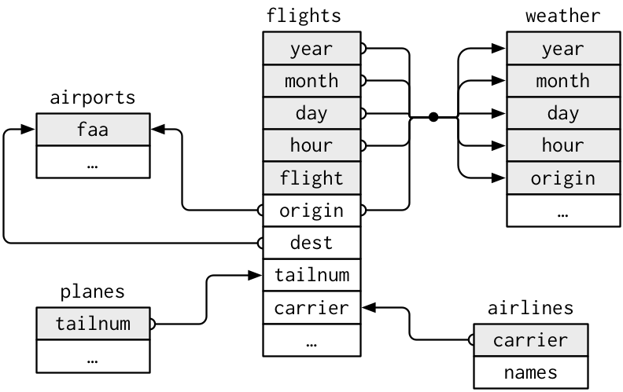
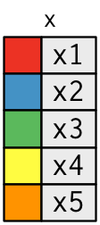
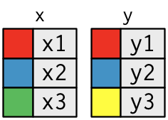
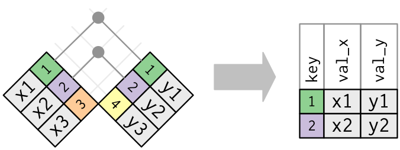
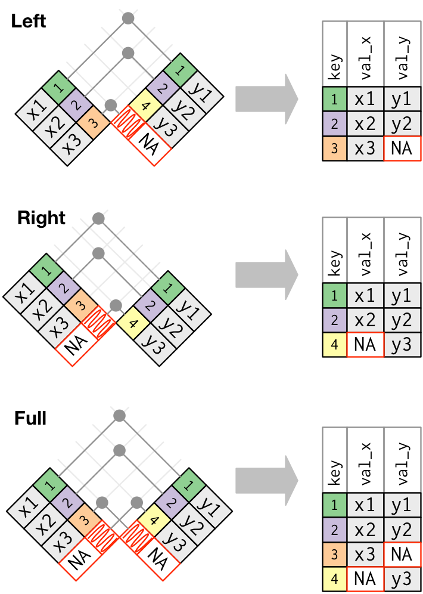
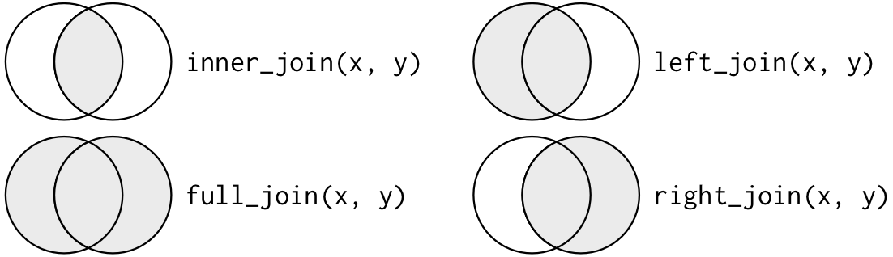
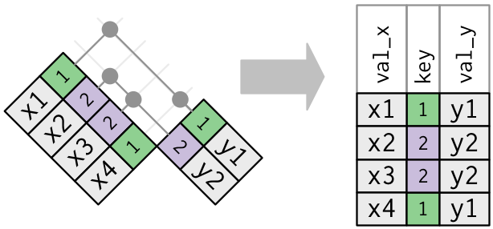
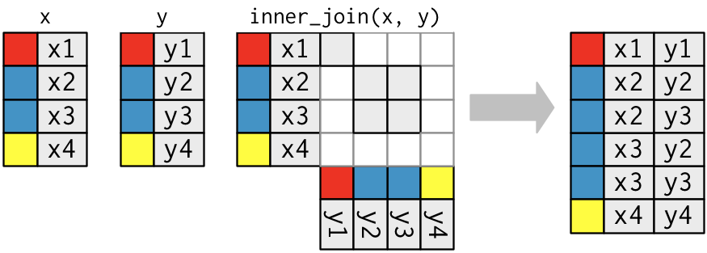

# Relational data {#relation-data}

```{r setup-relation, include = FALSE}
library(dplyr)
library(nycflights13)
library(ggplot2)
source("common.R")
options(dplyr.print_min = 6, dplyr.print_max = 6)
knitr::opts_chunk$set(fig.path = "figures/", cache = TRUE)
```

It's rare that a data analysis involves only a single table of data. Typically you have many tables of data, and you have to combine them to answer the questions that you're interested in. This type of data is called __relational__ because it concerns the relations between multiple datasets. 

Relations are always defined between a pair of tables. (But that pair might be the same table, a so called self-join.) The relationships of three or more tables are always a property of the relations between each pair. To work with relational data you need verbs that work with pairs of tables. There are three families of verbs design to work with relational data:

* __Mutating joins__, which add new variables to one data frame from matching 
  rows in another.

* __Filtering joins__, which filter observations from one data frame based on 
  whether or not they match an observation in the other table.

* __Set operations__, which treat observations like they were set elements.

The most common place to find relational data _relational_ database management system, which encompasses almost all modern databases. If you've used a database before, you've almost certainly used SQL. If so, you should find the concepts in this chapter familiar, although their expression in dplyr is little different. Generally, dplyr is a little easier to use than SQL because it's specialised to data analysis: it makes common data analysis operations easier, at the expense of making it difficult to do other things.

## nycflights13 {#nycflights13-relational}

You'll learn about relational data with other data from nycflights13.  As well as the `flights` table that you've worked with so far, nycflights13 contains a four related data frames:

*   `airlines` lets you look up the full carrier name from its abbreviated 
    code:
    
    ```{r}
    airlines
    ```

*   `airports` gives information about each airport, identified by the `faa`
    airport code:
    
    ```{r}
    airports
    ```

*   `planes` gives information about each plane, identified by its `tailnum`:

    ```{r}
    planes
    ```
  
*   `weather` gives the weather at each NYC airport for each hour:

    ```{r}
    weather
    ```

One way to show the relationships between the different tables is with a drawing:

```{r, echo = FALSE, out.width = "75%"}

```

This diagram is a little overwhelming, and it's simple compared to some you'll see in the wild! The key to understanding diagrams like this is to remember each relation always concerns a pair of tables. You don't need to understand the whole thing; you just need the understand the chain of relations between the tables that you are interested in. 

For nycflights13:

* `flights` connects to `planes` via single variable, `tailnum`. `flights`
  connect `airlines` with the `carrier` variable.

* `flights` connects to `airports` in two ways: via the `origin` or the 
  `dest`.
  
* `flights` connects to `weather` via `origin` (the location), and
  `year`, `month`, `day` and `hour` (the time).

The variables used to connect each pair of tables are called __keys__:

* The __primary key__ uniquely identifies an observation in the current table. 

* The __foreign key__ uniquely identifies an observation in another table.

In simple cases, a single variable is sufficient to identify an observation. For example, each plane is uniquely identified by its `tailnum`. In other cases, multiple variables may be needed. For example, to identify an observation in `weather` you need five variables: `year`, `month`, `day`, `hour`, and `origin`.

Each relation (an arrow) matches a primary keys (coloured grey) with the corresponding foreign key (the arrowhead) in another table. 

Relations are implicitly one-to-many. For example, each flight has one plane, but each plane has many flights. In other data, you'll occassionaly see a 1-to-1 relationship. You can think of this as a special case of 1-to-many. It's possible to model many-to-many relations with a many-to-1 relation plus a 1-to-many relation. For example, in this data there's a many-to-many relationship between airlines and airports: each airport flies to many airlines; each airport hosts many airlines. 

### Exercises

1.  Imagine you want to draw (approximately) the route each plane flies from
    its origin to its destination. What variables would you need? What tables
    would you need to combine?

1.  I forgot to draw the a relationship between `weather` and `airports`.
    What is the relationship and what should it look like in the diagram?
    
1.  `weather` only contains information for the origin (NYC) airports. If
    it contained weather records for all airports in the USA, what additional
    relation would it define with `flights`?

1.  You might expect that there's an implicit relationship between plane
    and airline, because each plane is flown by a single airline. Confirm
    or reject this hypothesis using data.

1.  We know that some days of the year are "special", and fewer people than
    usual fly on them. How might you represent that data as a data frame? 
    What would be the primary keys of that table? How would it connect to the
    existing tables?

## Mutating joins {#mutating-joins}

The first tool we'll look at for combining a pair of tables is the __mutating join__. A mutating join allows you to combine variables from two tables. It first matches observations by their keys, then copies across variables from one table to the other. 

Like `mutate()`, the join functions add variables to the right, so if you have a lot of variables already, the new variables won't get printed out. For these examples, we'll make it easier to see what's going on in the examples by creating a narrower dataset:

```{r}
(flights2 <- flights %>% select(year:day, hour, origin, dest, tailnum, carrier))
```

(When you're in RStudio, you can use `View()` to avoid this problem). 

For example, imagine you want to add the full airline name to the `flights` data. You can combine the `airlines` and `carrier` data frames with `left_join()`:

```{r}
flights2 %>% 
  left_join(airlines, by = "carrier")
```

The result of joining airlines to flights is an additional variable: `carrier`. This is why I call this type of join a mutating join. In this case, you could have got to the same place using `mutate()` and basic subsetting:

```{r}
flights2 %>% 
  mutate(carrier = airlines$name[match(carrier, airlines$carrier)])
```

But this is hard to generalise when you need to match multiple variables, and takes close reading to figure out the overall intent.

The following sections explain, in detail, how mutating joins work. You'll start by learning a useful visual representation of joins. We'll then use that to explain the four mutating join functions: the inner join, and the three outer joins. When working with real data, keys don't always uniquely identify observations, so next we'll talk about what happens when there isn't a unique match. Finally, you'll learn how to tell dplyr which variables are the keys for a given join.

### Understanding joins

To help you learn how joins work, I'm going to represent data frames visually:

```{r, echo = FALSE, out.width = "25%"}

```
```{r}
(x <- data_frame(key = c(1, 2, 3), val_x = c("x1", "x2", "x3")))
(y <- data_frame(key = c(1, 2, 4), val_y = c("y1", "y2", "y3")))
```

The coloured column represents the "key" variable: these are used to match the rows between the tables. The grey column represents the "value" column that is carried along for the ride. In these examples I'll show a single key variable and single value variable, but idea generalises in a straightforward way to multiple keys and multiple values.

A join is a way of connecting each row in `x` to zero, one, or more rows in `y`. The following diagram shows each potential match as an intersection of a pair of lines.

```{r, echo = FALSE, out.width = "35%"}

```

(If you look closely, you might notice that we've switched the order of the keys and values in `x`. This is to emphasise that joins match based on the key variable; value variable is just carried along for the ride.)

### Inner join {#inner-join}

The simplest type of join is the __inner join__. An inner join matches pairs of observations whenever their keys are equal:

```{r, echo = FALSE, out.width = "70%"}

```

(To be precise, this is an inner __equijoin__ because the keys are matched using the equality operator. Since most joins are equijoins we usually drop that condition.)

The output of an inner join is a new data frame that contains the key, the x values, and the y values. We use `by` to tell dplyr which variable is the key:

```{r}
x %>% inner_join(y, by = "key")
```

The most important property of an inner join is that unmatched rows are dropped. This means that generally inner joins are not appropriate for use in analysis because it's too easy to lose observations.

### Outer joins {#outer-join}

An inner join keeps observations that appear in both tables. An __outer join__ keeps observations that appear in at least one of the tables. There are three types of outer joins:

* A __left join__ keeps all observations in `x`.
* A __right join__ keeps all observations in `y`.
* A __full join__ keeps all observations in `x` and `y`.

These joins work by adding an additional "virtual" observation to each table. This observation has a key that always matches (if no other key matches), and a value filled with `NA`.

Graphically, that looks like:

```{r, echo = FALSE, out.width = "75%"}

```

The most commonly used join is the left join: you use this when ever you lookup additional data out of another table, becasuse it preserves the original observations even when there isn't a match. The left join should be your default join: use it unless you have a strong reason to prefer one of the others.

Another way to depict the different types of joins is with a Venn diagram:

```{r, echo = FALSE}

```

However, this is not a great representation. It might jog your memory about which join preserves the observations in which table, but it suffers from a major limitation. A Venn diagram can't show what happens when keys don't uniquely identify an observation. 

### Duplicate keys {#join-matches}

So far all the diagrams have assumed that the keys are unique. But obviously that's not always the case. This section explains what happens when the keys are not unique. There are two possibilities:

1.  There are duplicate foreign keys. This is useful when you want to
    add in additional information as there is typically a one-to-many
    relationship.
    
    ```{r, echo = FALSE, out.width = "75%"}
    
    ```

    Note that I've put the key column in a slightly different position
    in the output. This reflects that the key is a primary key in `y`
    and a foreign key in `x`.

    ```{r}
    x <- data_frame(key = c(1, 2, 2, 1), val_x = paste0("x", 1:4))
    y <- data_frame(key = 1:2, val_y = paste0("y", 1:2))
    left_join(x, y, by = "key")
    ```

1.  There are duplicate primary keys. This means that the keys do not uniquely
    identify an observation. Technically, that means the variable is not a 
    primary key. However, that often happens because of a data entry error.
    It's _supposed_ to be primary key, so its still useful to call it that.
    
    When the primary key is duplicated, you get all possible combinations,
    the Cartesian product:
    
    ```{r, echo = FALSE, out.width = "75%"}
    
    ```
    
    ```{r}
    x <- data_frame(key = c(1, 2, 2, 3), val_x = paste0("x", 1:4))
    y <- data_frame(key = c(1, 2, 2, 3), val_y = paste0("y", 1:4))
    left_join(x, y, by = "key")
    ```

Once you've identified the primary keys in your tables, it's good practice to verify that they do indeed uniquely identify each observation. One way to do that is `count()` the primary keys and look for entries where `n` is greater than one:

```{r}
planes %>% count(tailnum) %>% filter(n > 1)
weather %>% count(year, month, day, hour, origin) %>% filter(n > 1)
```

### Defining the key columns {#join-by}

So far, the pairs of tables have always been joined by a single variable, and that variable has the same name in both tables. That constraint was encoded by `by = "key"`.  You can use other values for `by` to connect the tables in other ways:

  * The default, `by = NULL`, uses all variables that appear in both tables, 
    the so called __natural__ join. For example, the flights and weather tables 
    match on their common variables: `year`, `month`, `day`, `hour` and
    `origin`.
    
    ```{r}
    flights2 %>% left_join(weather)
    ```
    
  * A character vector, `by = "x"`. This is like a natural join, but uses only 
    some of the common variables. For example, `flights` and `planes` have 
    `year` variables, but they mean different things so we only want to join by 
    `tailnum`.
    
    ```{r}
    flights2 %>% left_join(planes, by = "tailnum")
    ```
    
    Note that the `year` variables (which appear in both input data frames,
    but are not constrained to be equal) are disambiguated in the output with 
    a suffix.

  * A named character vector: `by = c("a" = "b")`. This will
    match variable `a` in table `x` to variable `y` in table `b`. The 
    variables from `x` will be used in the output.
    
    For example, if we want to draw a map we need to combine the flights data
    with the airports data which contains the location (`lat` and `long`) of
    each airport. Each flight has an origin and destination `airport`, so we 
    need to specify which one we want to join to:
    
    ```{r}
    flights2 %>% left_join(airports, c("dest" = "faa"))
    flights2 %>% left_join(airports, c("origin" = "faa"))
    ```

### Exercises

1.  Compute the average delay by destination, then join on the `airports`
    data frame so you can show the spatial distribution of delays. Here's an
    easy way to draw a map of the United States:
    
    ```{r, include = FALSE}
    airports %>% 
      semi_join(flights, c("faa" = "dest")) %>% 
      ggplot(aes(lon, lat)) + 
        borders("state") +
        geom_point() +
        coord_quickmap()
    ```
    
    You might want to use the `size` or `colour` of the points to display
    the average delay for each airport.

1.  Is there a relationship between the age of a plane and its delays?

1.  What weather conditions make it more likely to see a delay?
    
1.  What happened on June 13 2013? Display the spatial pattern of delays,
    and then use google to cross-reference with the weather.
    
    ```{r, eval = FALSE, include = FALSE}
    worst <- filter(not_cancelled, month == 6, day == 13)
    worst %>% 
      group_by(dest) %>% 
      summarise(delay = mean(arr_delay), n = n()) %>% 
      filter(n > 5) %>% 
      inner_join(airports, by = c("dest" = "faa")) %>% 
      ggplot(aes(lon, lat)) +
        borders("state") +
        geom_point(aes(size = n, colour = delay)) +
        coord_quickmap()
    ```

### Other implementations

`base::merge()` can perform all four types of mutating join: 

dplyr              | merge
-------------------|-------------------------------------------
`inner_join(x, y)` | `merge(x, y)`
`left_join(x, y)`  | `merge(x, y, all.x = TRUE)`
`right_join(x, y)` | `merge(x, y, all.y = TRUE)`,
`full_join(x, y)`  | `merge(x, y, all.x = TRUE, all.y = TRUE)`

The advantages of the specific dplyr verbs is that they more clearly convey the intent of your code: the difference between the joins is really important but concealed in the arguments of `merge()`. dplyr's joins are considerably faster and don't mess with the order of the rows.

SQL is the inspiration for dplyr's conventions, so the translation is straightforward:

dplyr                        | SQL
-----------------------------|-------------------------------------------
`inner_join(x, y, by = "z")` | `SELECT * FROM x INNER JOIN y USING (z)`
`left_join(x, y, by = "z")`  | `SELECT * FROM x LEFT OUTER JOIN USING (z)`
`right_join(x, y, by = "z")` | `SELECT * FROM x RIGHT OUTER JOIN USING (z)`
`full_join(x, y, by = "z")`  | `SELECT * FROM x FULL OUTER JOIN USING (z)`

Note that "INNER" and "OUTER" are optional, and often ommitted. 

Joining different variables between the tables, e.g. `inner_join(x, y, by = c("a" = "b"))` uses a slightly different syntax in SQL: `SELECT * FROM x INNER JOIN y ON x.a = y.b`. As this syntax suggests SQL supports a wide range of join types than dplyr because you can connect the tables using constraints other than equiality (sometimes called non-equijoins).

## Filtering joins {#filtering-joins}

Filtering joins match obserations in the same way as mutating joins, but affect the observations, not the variables. There are two types:

* `semi_join(x, y)` __keeps__ all observations in `x` that have a match in `y`.
* `anti_join(x, y)` __drops__ all observations in `x` that have a match in `y`.

Semi-joins are useful for matching filtered summary tables back to the original rows. For example, imagine you've found the top ten most popular destinations:

```{r}
top_dest <- flights %>% 
  count(dest, sort = TRUE) %>%
  head(10)
top_dest
```

Now you want to find each flight that went to one of those destinations. You could construct a filter yourself:

```{r}
flights %>% filter(dest %in% top_dest$dest)
```

But it's difficult to extend that approach to multiple variables. For example, imagine that you'd found the 10 days with highest average delays. How would you construct the filter statement that used `year`, `month`, and `day` to match it back to `flights`?

Instead you can use a semi-join, which connects the two tables like a mutating join, but instead of adding new columns, only keeps the rows in `x` that have a match in `y`:

```{r}
flights %>% semi_join(top_dest)
```

The inverse of a semi-join is an anti-join. An anti-join keeps the rows that _don't_ have a match, and are useful for diagnosing join mismatches. For example, when connecting `flights` and `planes`, you might be interested to know that there are many `flights` that don't have a match in `planes`:

```{r}
flights %>% 
  anti_join(planes, by = "tailnum") %>% 
  count(tailnum, sort = TRUE)
```

### Exercises

1.  What does it mean for a flight to have a missing `tailnum`? What do the 
    tail numbers that don't have a matching record in `planes` have in common?
    (Hint: one variable explains ~90% of the problem.)

1.  Find the 48 hours (over the course of the whole year) that have the worst
    delays. Cross-reference it with the `weather` data. Can you see any 
    patterns? 
    
1.  What does `anti_join(flights, airports, by = c("dest" = "faa"))` tell you?
    What does `anti_join(airports, flights, by = c("dest" = "faa"))` tell you?

## Set operations {#set-operations}

The final type of two-table verb is set operations. Generally, I use these the least frequently, but they are occassionally useful when you want to break a single complex filter into simpler pieces that you then combine.

All these operations work with a complete row, comparing the values of every variable. These expect the `x` and `y` inputs to have the same variables, and treat the observations like sets:

* `intersect(x, y)`: return only observations in both `x` and `y`.
* `union(x, y)`: return unique observations in `x` and `y`.
* `setdiff(x, y)`: return observations in `x`, but not in `y`.

Given this simple data:

```{r}
(df1 <- data_frame(x = 1:2, y = c(1L, 1L)))
(df2 <- data_frame(x = 1:2, y = 1:2))
```

The four possibilities are:

```{r}
intersect(df1, df2)
# Note that we get 3 rows, not 4
union(df1, df2)
setdiff(df1, df2)
setdiff(df2, df1)
```
