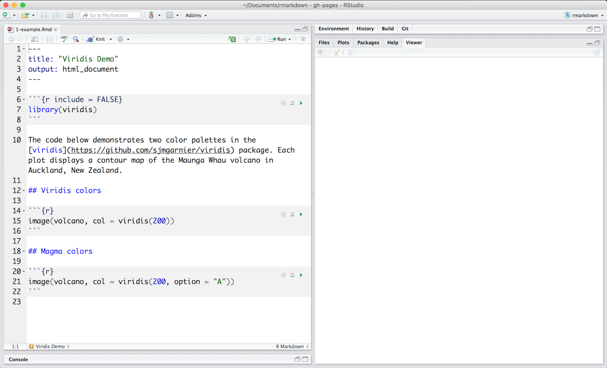
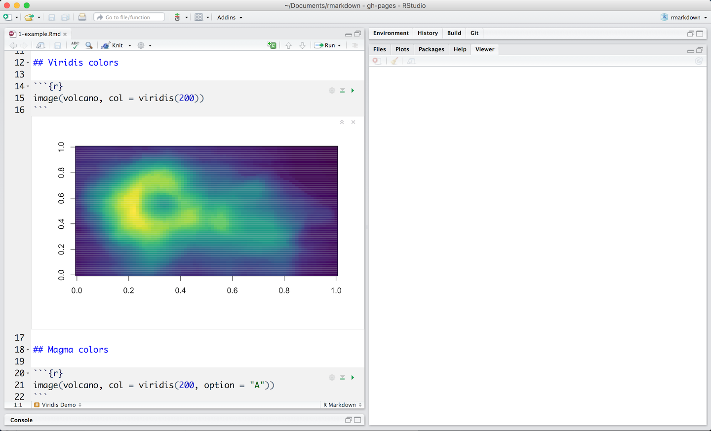
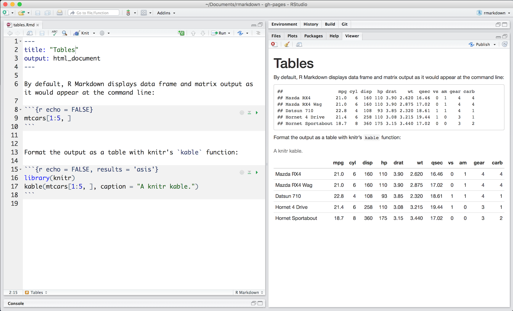
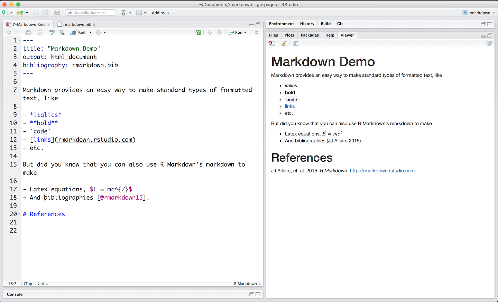

# R Markdown

The rmarkdown package provides an authoring framework for data science. You can use a single R Markdown file to both 

* save and execute code, and 
* generate high quality reports that can be shared with an audience 

R Markdown documents are fully reproducible and support dozens of output formats, like PDFs, Word files, slideshows, and more. They also provide a useful notebook interface for R and are easy to track with version control software like git.

This chapter will show you how to use R Markdown to organize your work as a data scientist.

### Installation

Like the rest of R, R Markdown is free and open source. You can install the rmarkdown package from CRAN with:

```r
install.packages("rmarkdown")
```

## Basics

[This](http://github.com/hadley/r4ds/tree/master/rmarkdown-demos/1-example.Rmd) is an R Markdown file, a plain text file that has the extension `.Rmd`. Notice that it contains three types of content:

* An (optional) YAML header surrounded by `---`s
* code chunks surrounded by <code>```</code>s
* text mixed with simple text formatting

```{r echo = FALSE, comment = ""}
cat(htmltools::includeText("rmarkdown-demos/1-example.Rmd"))
```

### A Notebook Interface

When you open the file in the RStudio IDE, it becomes a notebook interface for R. You can run each code chunk by clicking the Run icon (it looks like a play button at the top of the chunk). RStudio executes the code and displays the results inline with your file.

```{r, echo = FALSE, out.width = "100%"}

```

### Rendering output

To generate a report from an R Markdown file, run the `render()` command:

```{r eval = FALSE}
library(rmarkdown)
render("1-example.Rmd")
```

Better still, use the "Knit" button in the RStudio IDE to render the file and preview the output with a single click or keyboard shortcut (&#8679;&#8984;K).

R Markdown generates a new file that contains selected text, code, and results from the .Rmd file. The new file can be a finished web page, PDF, MS Word document, slide show, notebook, handout, book, dashboard, package vignette, or interactive document.

```{r, echo = FALSE, out.width = "100%"}

```

### How it works

When you run `render()`, R Markdown feeds the .Rmd file to [knitr](http://yihui.name/knitr/), which executes all of the code chunks and creates a new markdown (.md) document which includes the code and it's output. The markdown file generated by knitr is then processed by [pandoc](http://pandoc.org/) which is responsible for creating the finished format.

```{r, echo = FALSE, out.width = "100%"}
knitr::include_graphics("images/RMarkdownFlow.png")
```

This may sound complicated, but R Markdown makes it extremely simple by encapsulating all of the above processing into a single `render()` function.

## Get Started

To open a new .Rmd file, open the RStudio IDE and select *File > New File > R Markdown...* in the menubar. RStudio will launch a wizard that you can use to pre-populate your file with useful content. You can erase or add to the content as you wish.

## Code Chunks

You can quickly insert code chunks into your file with 

* the keyboard shortcut **Ctrl + Alt + I** (OS X: **Cmd + Option + I**)
* the Add Chunk icon in the editor toolbar (it looks like a green box with a C in it)
* or by typing the chunk delimiters ` ```{r} ` and ` ``` `.

Test code as you write by clicking the "Run Current Chunk" and "Run All Chunks Above" icons at the top of each chunk. R Markdown will run the code in the chunks in your current environment and display the results in your file editor. To turn off this behavior, click the gear icon at the top of the .Rmd file and select "Chunk Output in the Console." RStudio will then run code chunks at the command line as if your .Rmd file were an R Script.

When you render your .Rmd file, R Markdown will create a fresh environment to run the code chunks in. It will run each chunk, in order, and embed the results beneath the chunk in your final report.

### Chunk Options

Chunk output can be customized with [knitr options](http://yihui.name/knitr/options/), arguments set in the `{}` of a chunk header. For example, the above file (1-example.Rmd) uses five arguments:

* `include = FALSE` prevents code and results from appearing in the finished file. R Markdown still runs the code in the chunk, and the results can be used by other chunks.
* `echo = FALSE` prevents code, but not the results from appearing in the finished file. This is a useful way to embed figures.
* `message = FALSE` prevents messages that are generated by code from appearing in the finished file.
* `warning = FALSE` prevents warnings that are generated by code from appearing in the finished.
* `fig.cap = "..."` adds a caption to graphical results.

Knitr provides almost 60 options that you can use to customize your code chunks. Since the options are not associated with an R function, it can be difficult to figure out where to learn about them. The best place is the knitr options web page at <http://yihui.name/knitr/options/>.

You can also find a list of knitr options with concise descriptions in the *R Markdown Reference Guide*, which is available in the RStudio IDE under *Help > Cheatsheets > R Markdown Reference Guide*.

Here are some of the most useful options not listed above.

* `cache = TRUE` caches code results to minimize future computation (caching is explained further below).
* `child = "file.Rmd"` renders a file and inserts the results into the main document at the chunk location.
* `comment = "##"` changes the prefix to put before each line of output.
* `error = FALSE` causes the render to stop if code returns an error.
* `eval = FALSE` prevents code from being evaluated. Useful for displaying example code.
* `out.width = "50%"` adjusts the width of the plot in the final output file.
* `results = 'hide'` prevents the results, but not the code, from appearing in the final document. Knitr still runs the code.

### Global Options

To set global options that apply to every chunk in your file, call `knitr::opts_chunk$set` in a code chunk, e.g. 

```{r eval = FALSE}
knitr::opts_chunk$set(echo = FALSE, cache = TRUE)
```

Knitr will treat each option that you pass to `knitr::opts_chunk$set` as a global default that applies to all chunks. You can overwrite global options locally in individual chunk headers.

### Caching

If document rendering becomes time consuming due to long computations, you can use knitr caching to improve performance. 

Knitr will save the output of any chunk that contains the option `cache = TRUE` along with a MD5 digest of its contents to a folder alongside your .Rmd file. On subsequent renders, knitr will check the digest to see if the chunk contents have changed. If they have not, knitr will skip the chunk and insert the cached contents. If they have changed (i.e. if the chunk has been modified) Knitr will execute the chunk, embed the results, and save the new results to use for future renders.

Knitr's caching system is straightforward but can become complicated when one code chunk depends on the contents of another. For example, here chunk 2 depends on chunk 1.

```{r eval = FALSE}
# chunk 1
```{r}
a <- 1
```

# chunk 2
```{r cached=TRUE}
a + 1
```
```

To ensure that caching works properly in this situation, give each chunk a chunk label (Knitr assumes that the first unnamed option in the chunk header is a label). Then set the `dependson` option of the cached chunk.

```{r eval = FALSE}
# chunk 1
```{r chunk1}
a <- 1
```

# chunk 2
```{r chunk2, cached = TRUE, dependson = "chunk1"}
a + 1
```
```

`dependson` should contain a character vector of *every* chunk that the cached chunk depends on. Knitr will update the results for the cached chunk whenever it detects that one of its dependencies have changed.

## Inline code

Code results can be inserted directly into the *text* of a .Rmd file by enclosing the code with `` `r `  ``. The [file below](http://github.com/hadley/r4ds/tree/master/rmarkdown-demos/3-inline.Rmd) uses `` `r `  `` twice to call `colorFunc`, which returns "heat.colors." This makes it easy to update the report to refer to another function. 

```{r, echo = FALSE, out.width = "100%"}
knitr::include_graphics("images/inline-1-heat.png")
```

Inline expressions do not take knitr options. When processing inline code, R Markdown will always 

* display the results of inline code, but not the code
* apply relevant text formatting to the results

As a result, inline output is indistinguishable from the surrounding text. 

## Code Languages

[knitr](http://yihui.name/knitr/) can execute code in many languages besides R, which makes it easy to write R Markdown files that use multiple languages. Some of the available language engines include:

* Python
* SQL
* Bash
* Rcpp
* Stan
* JavaScript
* CSS

To process a code chunk using an alternate language engine, replace the `r` at the start of your chunk declaration with the name of the language:

```{r eval = FALSE}
```{python}
x = 'hello, python world!'
print(x.split(' '))
```
```

Note that chunk options like `echo` and `results` are all valid when using a language engine like python. 

## Parameters

R Markdown documents can include one or more parameters whose values can be set when you render the report. Parameters are useful when you want to re-render the same report with distinct values for various key inputs, for example, to run:

* a report specific to a department or geographic region.

* a report that covers a specific period in time.

* multiple versions of a report for distinct sets of core assumptions.

To declare one or more parameters for your file, use the `params` field within the YAML header of the document. For example, the [file below](http://github.com/hadley/r4ds/tree/master/rmarkdown-demos/5-parameters.Rmd) uses a `data` parameter that determines which data set to plot.

```{r, echo = FALSE, out.width = "100%"}
knitr::include_graphics("images/params-1-hawaii.png")
```

R Markdown recognizes the atomic data types: numerics, character strings, logicals, etc. You can also pass an R expression as a parameter by prefacing the parameter value with `!R`, e.g.

```{r eval = FALSE}
---
params:
  start: !r as.Date("2015-01-01")
  snapshot: !r as.POSIXct("2015-01-01 12:30:00")
---
```

Parameters are available within the knit environment as a read-only list named `params`. To access a parameter in code, call `params$<parameter name>`.

### Setting Parameter values

Add a `params` argument to `render()` to create a report that uses a different set of parameter values. Here we modify our report to use the `aleutians` data set with 

```{r eval = FALSE}
render("5-parameters.Rmd", params = list(data = "aleutians"))
```

```{r, echo = FALSE, out.width = "100%"}
knitr::include_graphics("images/params-2-aleutians.png")
```

Better yet, click the "Knit with Parameters" option in the dropdown menu next to the RStudio IDE knit button to set parameters, render, and preview the report in a single user friendly step.

```{r, echo = FALSE, out.width = "100%"}
knitr::include_graphics("images/params-3-florida.png")
```

## Tables

By default, R Markdown displays data frames and matrixes as they would be in the R terminal (in a monospaced font). If you prefer that data be displayed with additional formatting you can use the `knitr::kable` function, as in the [.Rmd file below](http://github.com/hadley/r4ds/tree/master/rmarkdown-demos/6-tables.Rmd). 

Note the use of the `results='asis'` chunk option. This is required to ensure that the raw table output isn’t processed further by knitr.

```{r, echo = FALSE, out.width = "100%"}

```

If you'd like to customize your tables at a deeper level, consider the xtable, stargazer, pander, tables, and ascii packages. Each provides a set of tools for returning formatted tables from R code.

## Formatted Text

Format the text in your R Markdown files with Markdown, a set of markup annotations for plain text files. When you render your file, Pandoc transforms the marked up text into formatted text in your final file format:

```{r, echo = FALSE, out.width = "100%"}

```

Markdown is designed to be easy to read and easy to write. It is also very easy to learn. The guide below shows how to use Pandoc's Markdown, a slightly extended version of Markdown that R Markdown understands.

#### Text formatting

```markdown
*italic*   _italic_

**bold**   __bold__

`code`

superscript^2^

subscript~2~

~~strikethrough~~
```

#### Headers

```markdown
# 1st Level Header

## 2nd Level Header

### 3rd Level Header

#### 4th Level Header

##### 5th Level Header

###### 6th Level Header
```

#### Lists

Unordered List:

```markdown
* Item 1
* Item 2
    + Item 2a
    + Item 2b
```

Ordered List:

```markdown
1. Item 1
2. Item 2
3. Item 3
    + Item 3a
    + Item 3b
```

#### Links

Use a plain http address or add a link to a phrase:

```markdown
http://example.com

[linked phrase](http://example.com)
```

#### Images

Images on the web or local files in the same directory:

```markdown


```

#### Footnotes

```markdown
A [linked phrase][id].
```

At the bottom of the document:

```markdown
[id]: text of the note
```

#### Blockquotes

```markdown
As George Box said:

> All models are wrong
> but some are useful.
```

#### Plain Code Blocks

Plain code blocks are displayed in a fixed-width font but not evaulated

<pre class="markdown"><code>&#96;&#96;&#96;
This text is displayed verbatim / preformatted
&#96;&#96;&#96;
</code></pre>

#### LaTeX Equations

Use latex math syntax to create formatted equations.

Inline equation:
```markdown
$E = mc^{2}$
```

Display equation:
```markdown
$$E = mc^{2}$$
```

#### Manual Line Breaks

End a line with two or more spaces:

```markdown
Roses are red,
Violets are blue.
```

#### Paragraphs

Insert a blank line at the end of a paragraph:

```markdown
Paragraph 1.

Paragraph 2.
Still paragraph 2.
```

#### Horizontal Rule / Page Break

Three or more asterisks or dashes:

```markdown
***

---
```

#### Tables

```markdown
First Header  | Second Header
------------- | -------------
Content Cell  | Content Cell
Content Cell  | Content Cell
Reference Style Links and Images
```

### Bibliographies and Citations

Pandoc can automatically generate citations and a bibliography in a number of styles. To use this feature, specify a bibliography file using the `bibliography` field in your file's header. The field should contain a filepath from the directory that contains your .Rmd file to the file that contains the bibliography file:

```yaml
---
title: "Markdown Demo"
output: html_document
bibliography: rmarkdown.bib
---
```

You can use any of the following formats: .bib (BibLaTeX), .bibtex (BibTeX), .copac (Copac), .enl (EndNote), .json (JSON citeproc), .medline (MEDLINE), .mods (MODS), .ris (RIS), 
.wos (ISI), .xml (XML).

To create a citation within your .Rmd file, use a key composed of ‘@’ + the citation identifier from the bibliography file. Then place the citation in square brackets. Here are some example citations from rmarkdown.rstudio.com. Notice that you can

* Separate multiple citations with a `;`
* Remove the square brackets to create an in-text citation
* Add a `-` before the citation to supress the author's name

```markdown
Blah blah [see @doe99, pp. 33-35; also @smith04, ch. 1].

Blah blah [@doe99, pp. 33-35, 38-39 and *passim*].

Blah blah [@smith04; @doe99].

@smith04 says blah.

@smith04 [p. 33] says blah.

Smith says blah [-@smith04].
```

When R Markdown renders your file, it will build and append a bibliography to the end of your document. The bibliography will contain each of the cited references from your bibiliography file, but it will not contain a section heading. As a result it is common practice to end your file with a section header for the bibliography, such as `# References` or `# Bibliography`.

You can change the style of your citations and bibliography by adding a CSL 1.0 style file to the `csl` field of your file's header.

```yaml
---
title: "Markdown Demo"
output: html_document
bibliography: rmarkdown.bib
csl: apa.csl
---
```

As with the bibliography field, your csl file should contain a filepath to the file (here I assume that the csl file is in the same directory as the .Rmd file). http://github.com/citation-style-language/styles contains a useful repository of CSL style files.


## Output Formats

Set the `output_format` argument of `render()` to render your .Rmd file into any of R Markdown's supported formats. For example, the code below renders [1-example.Rmd](http://github.com/hadley/r4ds/tree/master/rmarkdown-demos/1-example.Rmd) to a Microsoft Word document: 

```{r eval = FALSE}
library(rmarkdown)
render("1-example.Rmd", output_format = "word_document")
```

If you do not select a format, R Markdown renders the file to its default format, which you can set in the `output` field of a .Rmd file's header. The header of [1-example.Rmd](http://github.com/hadley/r4ds/tree/master/rmarkdown-demos/1-example.Rmd) shows that it renders to an HTML file by default:

```{r eval = FALSE}
---
title: "Viridis Demo"
output: html_document
---
```

RStudio's knit button renders a file to the first format listed in its `output` field. You can render to additional formats by clicking the dropdown menu beside the knit button:

```{r, echo = FALSE, out.width = "100%"}
knitr::include_graphics("images/outputs-2-pdf.png")
```

The menu contains a list of formats that are similar to the default format. To update the list, change the default format in your YAML. The following output formats are available to use with R Markdown.

### Documents

* `html_notebook` - Interactive R Notebooks
* `html_document` - HTML document w/ Bootstrap CSS
* `pdf_document` - PDF document (via LaTeX template)
* `word_document` - Microsoft Word document (docx)
* `odt_document` - OpenDocument Text document
* `rtf_document` - Rich Text Format document
* `md_document` - Markdown document (various flavors)

### Presentations (slides)

* `ioslides_presentation` - HTML presentation with ioslides
* `revealjs::revealjs_presentation` - HTML presentation with reveal.js. Requires the revealjs package.
* `slidy_presentation` - HTML presentation with W3C Slidy
* `beamer_presentation` - PDF presentation with LaTeX Beamer

### More

* `flexdashboard::flex_dashboard` - Administrative dashboards. Requires the flexdashboard package.
* `tufte::tufte_handout` - PDF handouts in the style of Edward Tufte. Requires the tufte package.
* `tufte::tufte_html` - HTML handouts in the style of Edward Tufte. Requires the tufte package.
* `tufte::tufte_book` - PDF books in the style of Edward Tufte. Requires the tufte package.
* `html_vignette` - R package vignette (HTML)
* `github_document` - GitHub Flavored Markdown document

You can also build books, websites, and interactive documents with R Markdown, as described in the sections below.

### Output Options

Each output format is implemented as a function in R, e.g. `html_document()`. To customize a format, pass arguments to the output function as sub-values of the `output` field. For example, we can change [1-example.Rmd](http://github.com/hadley/r4ds/tree/master/rmarkdown-demos/1-example.Rmd) to render with a floating table of contents,

```{r, echo = FALSE, out.width = "100%"}
knitr::include_graphics("images/outputs-3-toc.png")
```

To learn which arguments a format takes, read the format's help page in R, e.g. `?html_document`.

## HTML Notebooks

In How It Works, you learned that R Markdown files provide a notebook interface for editing that makes it easy to test and iterate your code. 

To share this experience with colleagues, simply share your .Rmd file for them to open in their RStudio IDE. If your colleagues do not use R, you can recreate the notebook interface by rendering your file to an HTML notebook with `output: html_notebook`.

R Markdown will create a `nb.html` version of your file; a self-contained HTML file that contains all current chunk outputs (suitable for display on a website). You can view the .nb.html file in any ordinary web browser, or open it in RStudio. In this case, RStudio will extract and open the .Rmd file that underlies the nb.html file.

###  Version Control

One of the major advantages of R Markdown notebooks compared to other notebook systems is that they are plain-text files and therefore work well with version control. I recommend checking in both the .Rmd and .nb.html files into version control so that both your source code and output are available to collaborators. However, you can choose to include only the .Rmd file (with a .gitignore that excludes the .nb.html) if you want each collaborator to work with their own private copies of the output.

## Slide Presentations

R Markdown renders to four presentation formats:

* beamer_presentation - PDF presentations with beamer
* ioslides_presentation - HTML presentations with ioslides
* slidy_presentation - HTML presentations with slidy
* revealjs::revealjs_presentation - HTML presentations with reveal.js (requires the revealjs package)

Each format will intuitively divide your content into slides, with a new slide beginning at each first or second level header.

Insert a horizontal rule (`***`) into your document to create a manual slide break. Create bullet points that display incrementally with `>-`. Here is a version of 1-example.Rmd displayed as a reveal.js slide presentation.

```{r, echo = FALSE, out.width = "100%"}
knitr::include_graphics("images/slides-1-viridis.png")
```


## Dashboards

Dashboards are a useful way to communicate large amounts of information visually and quickly. Create one with the `flex_dashboard` output format of the flexdashboard package, as in the [.Rmd file below](http://github.com/hadley/r4ds/tree/master/rmarkdown-demos/11-dashboard.Rmd):

Flexdashboard makes it easy to organize your content into a visual layout:

* Each Level 1 Header (`#`) begins a new page in the dashboard.
* Each Level 2 Header (`##`) begins a new column.
* Each Level 3 Header (`###`) begins a new box.

You can further modify elements with attributes, as in the `{.sidebar}` above.

Flexdashboard also provides simple tools for creating tabsets, value boxes, and gauges. To learn more about flexdashboard visit <http://rmarkdown.rstudio.com/flexdashboard/>.

## Websites

Use `rmarkdown::render_site()` to render collections of R Markdown documents into a website. Each website requires, in a single directory, 

* a YAML file named `_site.yml`, which provides the navigation for the site, e.g.

    ```{r echo = FALSE, comment = ""}
    cat(htmltools::includeText("rmarkdown-demos/12-website/_site.yml"))
    ```

* a .Rmd file named `index.Rmd`, which provides the content for the home page of your website

* other .Rmd files to include in the site. Each .Rmd file becomes a page in the website

* any support material

Execute `rmarkdown::render_site("<path to directory>")` to build `_site`, a directory of files ready to deploy as a standalone static website.

Better yet, create an [RStudio Project](https://support.rstudio.com/hc/en-us/articles/200526207-Using-Projects) for your website directory. RStudio will add a Build tab to the IDE that you can use to build and preview your site. [This collection of files](http://github.com/hadley/r4ds/tree/master/rmarkdown-demos/12-website.zip) creates the simple site below

```{r, echo = FALSE, out.width = "100%"}
knitr::include_graphics("images/website-2-website.png")
```


## Interactive Documents

R Markdown documents are a useful platform for interactive content. You can make your documents interactive in two ways. Add:

1. Interactive JavaScript visualizations based on [htmlwidgets](http://www.htmlwidgets.org/), or
2. Reactive components made with [Shiny](http://shiny.rstudio.com/)

### htmlwidgets

[Htmlwidgets](http://www.htmlwidgets.org/) are R functions that return JavaScript visualizations. You do not need to know any JavaScript to use htmlwidgets. The R functions take care of all of the coding for you. The [document below](http://github.com/hadley/r4ds/tree/master/rmarkdown-demos/13-htmlwidget.Rmd) uses a [leaflet](http://rstudio.github.io/leaflet/) htmlwidget to create an interactive map. 

```{r, echo = FALSE, out.width = "100%"}
knitr::include_graphics("images/interactive-1-htmlwidget.png")
```

Htmlwidgets create *client side* interactions. Since htmlwidgets are exported in JavaScript, any common web browser can execute the interactions.

Learn more about packages that build htmlwidgets at [www.htmlwidgets.org](http://www.htmlwidgets.org/showcase_leaflet.html).

### Shiny

The [Shiny](http://shiny.rstudio.com/) package helps developers build interactive web apps powered by R. You can use components from the Shiny package to turn your R Markdown into such an app. To call Shiny code from an R Markdown document, add `runtime: shiny` to the header, like in [this document](http://github.com/hadley/r4ds/tree/master/rmarkdown-demos/14-shiny.Rmd).

```{r, echo = FALSE, out.width = "100%"}
knitr::include_graphics("images/interactive-2-shiny.png")
```

Since web browsers cannot execute R code, Shiny interactions occur on the *server side*. This has several benefits:

* you can control access to the app
* you can keep private the data used in the app
* you can increase processing speed by augmenting the server

But it also introduces a logistical issue: Shiny apps require a special server, known as a Shiny Server, when hosted online. You can also run Shiny powered documents on your local computer by rendering them in your local R session.

Learn more about Shiny at the [Shiny Development Center](http://shiny.rstudio.com/).

## Books

The bookdown package extends R Markdown to create book length documents, like *R for Data Science*, which was written with R Markdown and bookdown. To learn more about bookdown, see the free ebook [Authoring Books with R Markdown](https://bookdown.org/yihui/bookdown/) or [www.bookdown.org](www.bookdown.org).

## Getting Help

R Markdown documents rely on several technologies that go beyond R functions. To help you navigate these, the developers of RStudio have placed three R Markdown references in the RStudio IDE.

* Go to *File > Help > Cheatsheets > R Markdown Cheat Sheet* to open the main *[R Markdown Cheat Sheet](http://www.rstudio.com/wp-content/uploads/2016/03/rmarkdown-cheatsheet-2.0.pdf)*.

* Go to *File > Help > Cheatsheets > R Markdown Reference Guide* to open the main *[R Markdown Reference Guide](https://www.rstudio.com/wp-content/uploads/2015/03/rmarkdown-reference.pdf)*.

* Go to *File > Help > Markdown Quick Reference* to open the *Markdown Quick Reference* in your help pane.

## Take Away

R Markdown provides a useful way to organize your data science projects. You can use an R Markdown file to create a reproducible record of how you

* Import
* Tidy
* Transform
* Visualize, and
* Model data

and then generate a report from your .Rmd file to communicate your results. This process is very efficient: you can write your report once and then deploy it many times in different formats or with different parameters. Moreover, by creating an R Markdown file, you participate in two movements that are leading to better scientific practices: 

1. **Reproducible Research** - The familiar scientific report format (*Introduction*, *Methods and Materials*, *Results*, *Discussion* and *Conclusion*) helps experimental scientists report their results in a reproducible way. Embedded in the format are the details that a scientist would need to reproduce the experiment. 

    R Markdown files provide the same service for data science. Embedded in the file is the code that a data scientist would need to repeat your analysis. 

2. **Literate Programming** - [literate programs](https://en.wikipedia.org/wiki/Literate_programming) intermingle code with human-readable text to build a program that is easy to understand and easy to debug (and often more streamlined than a program written in a non-literate way).

    R Markdown documents do not build a program, but they do build a data analysis. By intermingling your code with text, you create an artifact of Literate Data Science. Your work becomes easier to understand and easier to check.
