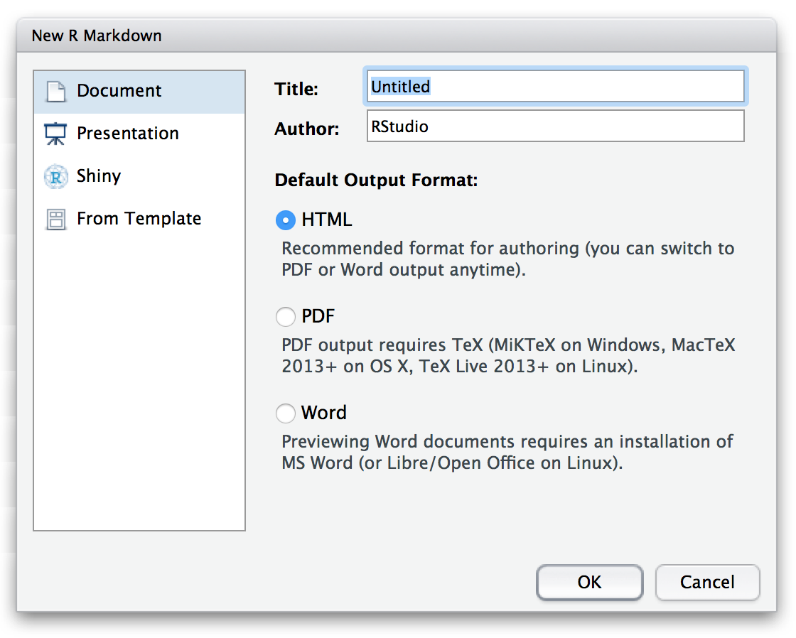

# R Markdown

R Markdown is an authoring framework that provides a versatile file format for data science. You can use a single R Markdown file to do everything that you do in your data analyses, from importing data, to tidying it, to visualizing, transforming, and modeling it, to communicating your results to an audience. Once you have done these things, your R Markdown file remains as a reproducible record of your work, easy to track in a version control system like Git. 

R Markdown files are also seamlessly integrated into the RStudio IDE, wherethey create a noteboook interface for R (with multi-language support).

This chapter will show you how to use R Markdown. Section 1 provides a quick tour of the basic features in R Markdown. This section is all that you need to read to get started. The remainder of the chapter will show you how to customize details of the R Markdown workflow.

## Basics

An R Markdown file is a plain text file saved with the extension .Rmd. >rmd files contain three types of content:

* An optional header of meta-data (written in YAML)
* Text formatted with Markdown syntax
* Executable code embedded into the document as knitr code chunks

Think of a .Rmd file as the data science equivalent of [literate programming](https://en.wikipedia.org/wiki/Literate_programming), an idea promulgated by Donald Knuth. A literate program contains code that creates the program, intermixed with human-readable text that explains what the code does in the context of the program. A .Rmd file contains code that runs an analysis, intermixed with human-readable text that explains what the code does in the context of the analysis and what the results of the code mean, i.e. literate data science.

To open a .Rmd file, open the RStudio IDE and select File > New File > R Markdown... in the menubar. RStudio will launch a wizard that you can use to pre-populate your file with useful content. 

```{r, eval = FALSE, echo = FALSE, out.width = "65%"}

```

Since this is our first time using R Markdown, just click OK. RStudio will open a new file and place into it the text below.

```{r echo = FALSE, comment = ""}
cat(htmltools::includeText("diagrams/sample-rmarkdown.Rmd"))
```

The file contains everything that you need to reproduce a (here trivial) analysis, as well as everything you need to generate a finished report about the analysis to export.

### Running code

Notice that chunks of executable R code appear in the file. Each chunk begins and ends with a line that contains three backticks (knitr::inline_expr(```)). A pair of braces follows the first set of brackets, which provides a space to set chunk parameters.

You can create a new chunk by typing code and surrounding it with these lines in your document. Or, you can click the "Insert a new chunk" icon at the top of the .Rmd file, which will insert the lines for you at your cursor's location.

```{r, eval = FALSE, echo = FALSE, out.width = "65%"}
knitr::include_graphics("images/rmarkdown-new-chunk.png")
```

You can run the chunks in your document one at a time by clicking the "Run Current Chunk" icon, which looks like a play button, at the top of the chunk. RStudio will run the code in the chunk in your current environment and display the results in the R Markdown file editor, turning the file editor into a code notebook.

```{r, eval = FALSE, echo = FALSE, out.width = "65%"}
knitr::include_graphics("images/rmarkdown-run-chunk.png")
```

To turn off this behavior, click the gear icon at the top of the .Rmd file and select "Chunk Output in the Console". RStudio will then run code chunks at the command line as if your .Rmd file were an R Script.

```{r, eval = FALSE, echo = FALSE, out.width = "65%"}
knitr::include_graphics("images/rmarkdown-chunk-console.png")
```

You can run all of the chunks that precede a code chunk, in order, by clicking the "Run All Chunks Above" icon that appears to the left of the "Run Current Chunk" icon.

```{r, eval = FALSE, echo = FALSE, out.width = "65%"}
knitr::include_graphics("images/rmarkdown-run-above-chunks.png")
```

You can every chunk in your document, in order, at the command line by selecting Run All in the Run menu that appears at the top of your .Rmd file.

```{r, eval = FALSE, echo = FALSE, out.width = "65%"}
knitr::include_graphics("images/rmarkdown-run-all.png")
```


### Generating reports

To generate a report of this analysis that you would feel comfortable presenting to a non-technical audience, click the knit button at the top of the file. 

```{r, eval = FALSE, echo = FALSE, out.width = "65%"}
knitr::include_graphics("images/rmarkdown-knit.png")
```

When you do this, two things will happen in the background.

```{r, eval = FALSE, echo = FALSE, out.width = "100%"}
knitr::include_graphics("images/rmarkdown-flow.png")
```

1. R Markdown will invoke the knitr package to run the code chunks in your document. Knitr will execute the code in a fresh R environment and then create a new markdown document. This document will contain the same text as in your .Rmd file, but each code chunk will be replaced by the markdown equivalent of the code chunk followed by the results of the code embedded into the document. If you choose to export your report as a pdf, knitr will return a tex version of your report instead of a markdown document.

2. R markdown will invoke the pandoc program to convert the markdown file that knitr returns into a finished document. Here this is the html document seen below. Pandoc will remove the markdown markup contained in your text, replacing the text with formatted text. Pandoc will also use the meta-data in your file to customize your report when sensible. For example, here it adds a title, author, and date to the beginning of your report. If you choose to output your report as a pdf, R Markdown will use your computer's installation of Tex to generate a pdf from the tex file supplied by knitr.

R Markdown saves the output file in the same directory as your .Rmd file, and RStudio opens a preview of the file in your IDE. Use the drop down menu accessible in the gear icon to select where in the IDE to display the preview.

```{r, eval = FALSE, echo = FALSE, out.width = "100%"}
knitr::include_graphics("images/rmarkdown-html.png")
```

#### Output formats

To generate a report in a different output format, change the output field in your file's header and then re-knit. R Markdown will repeat the process above re-executing your code each time you render a report (you can cache results if this is expensive).

R markdown recognizes the following output fields, and more are available from other packages.

TO DO

You can also use the knitr dropdown menu to quickly knit to several different formats. The menu will display options that are similar to the current setting for `output:`, updating if you save the file with a new output value.

#### Generating reports from the command line

To generate a finished report from the command line, run the `render()` command from the `rmarkdown` package. The first argument of `render()` is the filepath to the .Rmd file that you wish to render. You can set the name and directory of the output file with the `output_file` and `output_dir` arguments. You can use `output_format` to select the format of the exported report. The code below supplies a vector of formats, creating several documents at once.

```{r eval = FALSE}
library(rmarkdown)

render("untitled.Rmd", 
  output_format = c("pdf_document", "word_document"), 
  output_dir = "reports", output_file = "untitled-report")
```

Behind the scenes, R Markdown does the exact same thing whether you use `render()` or the knit button. However, the RStudio IDE will not automatically open a preview of the document when you use `render()`.

`render()` provides an easy way to generate multiple documents from the same .Rmd file; you can call render from a for loop or a purr function. If your .Rmd file uses parameters, you can supply a new set of parametes to `render()` for each version of the document (see PARAMETERS).

You can also call render from a chron job to create an R Markdown report that automatically updates on a scheduled basis.

## Executing code

### Code display

### Caching

### Languages

### Inline code

### Parameters

## Formatting text

### Markdown

### Tables

### Citations

### Equations

## Output formats

### Customizing output

### R Markdown extensions


