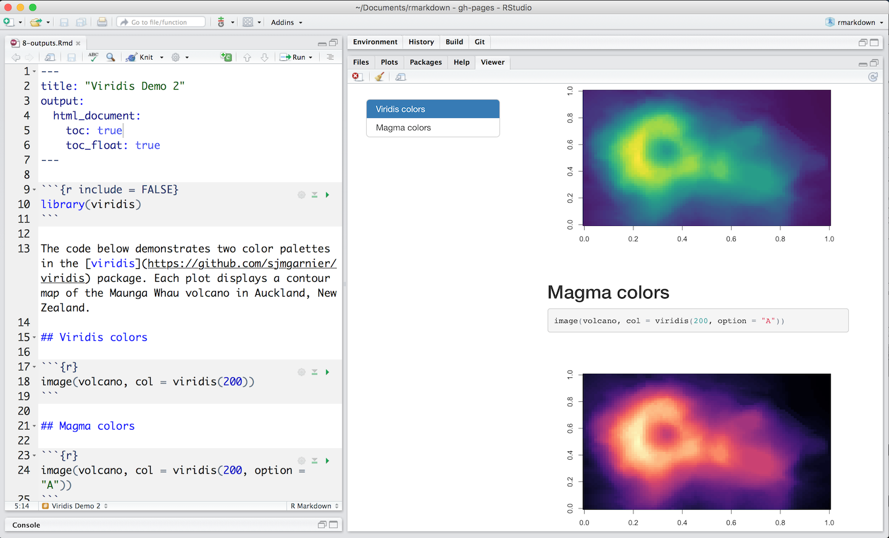

# Extensions

```{r setup, include = FALSE}
chunk <- "```"
```

## Output Formats

Set the `output_format` argument of `render()` to render your .Rmd file into any of R Markdown's supported formats. For example, the code below renders [1-example.Rmd](http://github.com/hadley/r4ds/tree/master/rmarkdown-demos/1-example.Rmd) to a Microsoft Word document: 

```{r eval = FALSE}
library(rmarkdown)
render("1-example.Rmd", output_format = "word_document")
```

If you do not select a format, R Markdown renders the file to its default format, which you can set in the `output` field of a .Rmd file's header. The header of [1-example.Rmd](http://github.com/hadley/r4ds/tree/master/rmarkdown-demos/1-example.Rmd) shows that it renders to an HTML file by default:

```{r eval = FALSE}
---
title: "Viridis Demo"
output: html_document
---
```

RStudio's knit button renders a file to the first format listed in its `output` field. You can render to additional formats by clicking the dropdown menu beside the knit button:

```{r, echo = FALSE, out.width = "100%"}
knitr::include_graphics("images/outputs-2-pdf.png")
```

The menu contains a list of formats that are similar to the default format. To update the list, change the default format in your YAML. The following output formats are available to use with R Markdown.

### Documents

* `html_notebook` - Interactive R Notebooks
* `html_document` - HTML document w/ Bootstrap CSS
* `pdf_document` - PDF document (via LaTeX template)
* `word_document` - Microsoft Word document (docx)
* `odt_document` - OpenDocument Text document
* `rtf_document` - Rich Text Format document
* `md_document` - Markdown document (various flavors)

### Presentations (slides)

* `ioslides_presentation` - HTML presentation with ioslides
* `revealjs::revealjs_presentation` - HTML presentation with reveal.js. Requires the revealjs package.
* `slidy_presentation` - HTML presentation with W3C Slidy
* `beamer_presentation` - PDF presentation with LaTeX Beamer

### More

* `flexdashboard::flex_dashboard` - Administrative dashboards. Requires the flexdashboard package.
* `tufte::tufte_handout` - PDF handouts in the style of Edward Tufte. Requires the tufte package.
* `tufte::tufte_html` - HTML handouts in the style of Edward Tufte. Requires the tufte package.
* `tufte::tufte_book` - PDF books in the style of Edward Tufte. Requires the tufte package.
* `html_vignette` - R package vignette (HTML)
* `github_document` - GitHub Flavored Markdown document

You can also build books, websites, and interactive documents with R Markdown, as described in the sections below.

### Output Options

Each output format is implemented as a function in R, e.g. `html_document()`. To customize a format, pass arguments to the output function as sub-values of the `output` field. For example, we can change [1-example.Rmd](http://github.com/hadley/r4ds/tree/master/rmarkdown-demos/1-example.Rmd) to render with a floating table of contents,

```{r, echo = FALSE, out.width = "100%"}

```

To learn which arguments a format takes, read the format's help page in R, e.g. `?html_document`.

## HTML Notebooks

In How It Works, you learned that R Markdown files provide a notebook interface for editing that makes it easy to test and iterate your code. 

To share this experience with colleagues, simply share your .Rmd file for them to open in their RStudio IDE. If your colleagues do not use R, you can recreate the notebook interface by rendering your file to an HTML notebook with `output: html_notebook`.

R Markdown will create a `nb.html` version of your file; a self-contained HTML file that contains all current chunk outputs (suitable for display on a website). You can view the .nb.html file in any ordinary web browser, or open it in RStudio. In this case, RStudio will extract and open the .Rmd file that underlies the nb.html file.

###  Version Control

One of the major advantages of R Markdown notebooks compared to other notebook systems is that they are plain-text files and therefore work well with version control. I recommend checking in both the .Rmd and .nb.html files into version control so that both your source code and output are available to collaborators. However, you can choose to include only the .Rmd file (with a .gitignore that excludes the .nb.html) if you want each collaborator to work with their own private copies of the output.

## Slide Presentations

R Markdown renders to four presentation formats:

* beamer_presentation - PDF presentations with beamer
* ioslides_presentation - HTML presentations with ioslides
* slidy_presentation - HTML presentations with slidy
* revealjs::revealjs_presentation - HTML presentations with reveal.js (requires the revealjs package)

Each format will intuitively divide your content into slides, with a new slide beginning at each first or second level header.

Insert a horizontal rule (`***`) into your document to create a manual slide break. Create bullet points that display incrementally with `>-`. Here is a version of 1-example.Rmd displayed as a reveal.js slide presentation.

```{r, echo = FALSE, out.width = "100%"}
knitr::include_graphics("images/slides-1-viridis.png")
```


## Dashboards

Dashboards are a useful way to communicate large amounts of information visually and quickly. Create one with the `flex_dashboard` output format of the flexdashboard package, as in the [.Rmd file below](http://github.com/hadley/r4ds/tree/master/rmarkdown-demos/11-dashboard.Rmd):

Flexdashboard makes it easy to organize your content into a visual layout:

* Each Level 1 Header (`#`) begins a new page in the dashboard.
* Each Level 2 Header (`##`) begins a new column.
* Each Level 3 Header (`###`) begins a new box.

You can further modify elements with attributes, as in the `{.sidebar}` above.

Flexdashboard also provides simple tools for creating tabsets, value boxes, and gauges. To learn more about flexdashboard visit <http://rmarkdown.rstudio.com/flexdashboard/>.

## Websites

Use `rmarkdown::render_site()` to render collections of R Markdown documents into a website. Each website requires, in a single directory, 

* a YAML file named `_site.yml`, which provides the navigation for the site, e.g.

    ```{r echo = FALSE, comment = ""}
    cat(htmltools::includeText("rmarkdown-demos/12-website/_site.yml"))
    ```

* a .Rmd file named `index.Rmd`, which provides the content for the home page of your website

* other .Rmd files to include in the site. Each .Rmd file becomes a page in the website

* any support material

Execute `rmarkdown::render_site("<path to directory>")` to build `_site`, a directory of files ready to deploy as a standalone static website.

Better yet, create an [RStudio Project](https://support.rstudio.com/hc/en-us/articles/200526207-Using-Projects) for your website directory. RStudio will add a Build tab to the IDE that you can use to build and preview your site. [This collection of files](http://github.com/hadley/r4ds/tree/master/rmarkdown-demos/12-website.zip) creates the simple site below

```{r, echo = FALSE, out.width = "100%"}
knitr::include_graphics("images/website-2-website.png")
```


## Interactive Documents

R Markdown documents are a useful platform for interactive content. You can make your documents interactive in two ways. Add:

1. Interactive JavaScript visualizations based on [htmlwidgets](http://www.htmlwidgets.org/), or
2. Reactive components made with [Shiny](http://shiny.rstudio.com/)

### htmlwidgets

[Htmlwidgets](http://www.htmlwidgets.org/) are R functions that return JavaScript visualizations. You do not need to know any JavaScript to use htmlwidgets. The R functions take care of all of the coding for you. The [document below](http://github.com/hadley/r4ds/tree/master/rmarkdown-demos/13-htmlwidget.Rmd) uses a [leaflet](http://rstudio.github.io/leaflet/) htmlwidget to create an interactive map. 

```{r, echo = FALSE, out.width = "100%"}
knitr::include_graphics("images/interactive-1-htmlwidget.png")
```

Htmlwidgets create *client side* interactions. Since htmlwidgets are exported in JavaScript, any common web browser can execute the interactions.

Learn more about packages that build htmlwidgets at [www.htmlwidgets.org](http://www.htmlwidgets.org/showcase_leaflet.html).

### Shiny

The [Shiny](http://shiny.rstudio.com/) package helps developers build interactive web apps powered by R. You can use components from the Shiny package to turn your R Markdown into such an app. To call Shiny code from an R Markdown document, add `runtime: shiny` to the header, like in [this document](http://github.com/hadley/r4ds/tree/master/rmarkdown-demos/14-shiny.Rmd).

```{r, echo = FALSE, out.width = "100%"}
knitr::include_graphics("images/interactive-2-shiny.png")
```

Since web browsers cannot execute R code, Shiny interactions occur on the *server side*. This has several benefits:

* you can control access to the app
* you can keep private the data used in the app
* you can increase processing speed by augmenting the server

But it also introduces a logistical issue: Shiny apps require a special server, known as a Shiny Server, when hosted online. You can also run Shiny powered documents on your local computer by rendering them in your local R session.

Learn more about Shiny at the [Shiny Development Center](http://shiny.rstudio.com/).


## Books

The bookdown package extends R Markdown to create book length documents, like *R for Data Science*, which was written with R Markdown and bookdown. To learn more about bookdown, see the free ebook [Authoring Books with R Markdown](https://bookdown.org/yihui/bookdown/) or [www.bookdown.org](www.bookdown.org).
