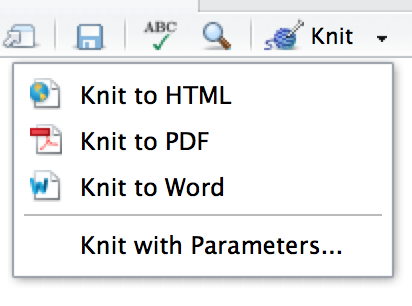
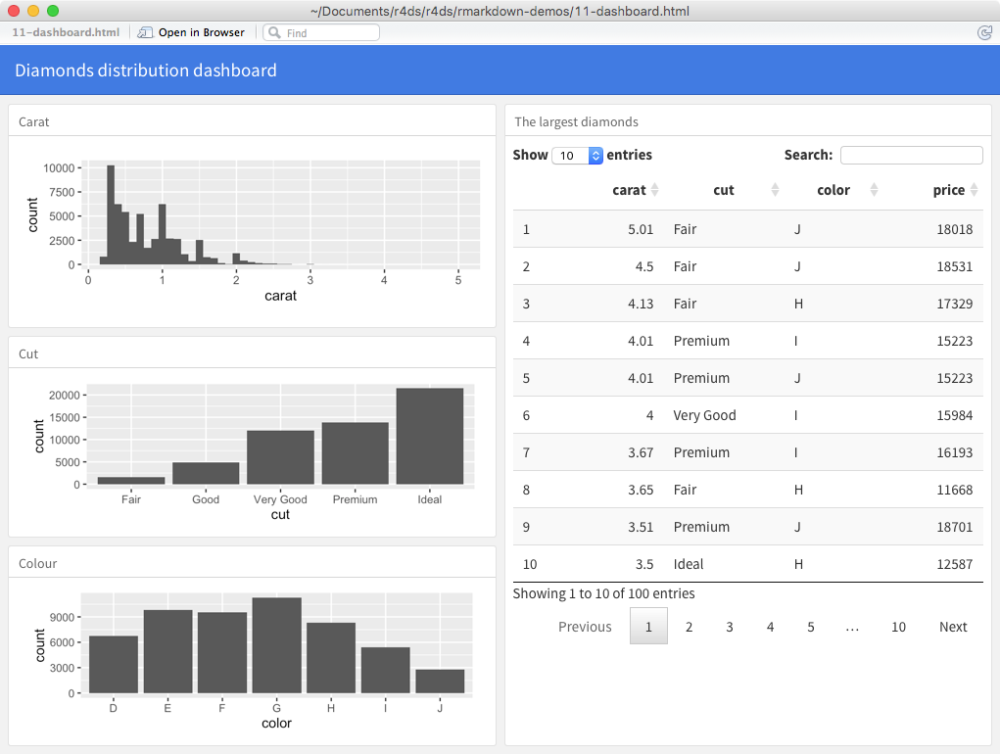
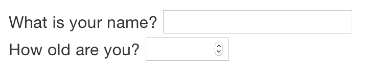

# R Markdown formats

## Introduction

So far you've seen R Markdown used to produce HTML documents. This chapter gives a brief overview of some of the many other types of output you can produce with R Markdown. There are two ways to set the output of a document:

1.  Permanently, by modifying the YAML header: 
    
    ```yaml
    title: "Viridis Demo"
    output: html_document
    ```
    
1.  Transiently, by calling `rmarkdown::render()` by hand:
    
    ```{r eval = FALSE}
    rmarkdown::render("diamond-sizes.Rmd", output_format = "word_document")
    ```
    
    This is useful if you want to programmatically produce multiple types of
    output.

RStudio's knit button renders a file to the first format listed in its `output` field. You can render to additional formats by clicking the dropdown menu beside the knit button.

```{r, echo = FALSE, out.width = NULL}

```

## Output options

Each output format is associated with an R function. You can either write `foo` or `pkg::foo`. If you omit `pkg`, the default is assumed to be rmarkdown. It's important to know the name of the function that makes the output because that's where you get help. For example, to figure out what parameters you can set with `html_document`, look at `?rmarkdown::html_document`.

To override the default parameter values, you need to use an expanded `output` field. For example, if you wanted to render an `html_document` with a floating table of contents, you'd use:

```yaml
output:
  html_document:
    toc: true
    toc_float: true
```

You can even render to multiple outputs by supplying a list of formats:

```yaml
output:
  html_document:
    toc: true
    toc_float: true
  pdf_document: default
```

Note the special syntax if you don't want to override any of the default options.

## Documents

The previous chapter focused on the default `html_document` output. There are a number of basic variations on that theme, generating different types of documents:

*   `pdf_document` makes a PDF with LaTeX (an open source document layout 
    system), which you'll need to install. RStudio will prompt you if you 
    don't already have it.
  
*   `word_document` for Microsoft Word documents (`.docx`).
  
*   `odt_document` for OpenDocument Text documents (`.odt`).
  
*   `rtf_document` for Rich Text Format (`.rtf`) documents.
  
*   `md_document` for a Markdown document. This isn't typically useful by 
    itself, but you might use it if, for example, your corporate CMS or
    lab wiki uses markdown.
    
*   `github_document`: this is a tailored version of `md_document` 
    designed for sharing on GitHub. 

Remember, when generating a document to share with decision makers, you can turn off the default display of code by setting global options in the setup chunk:

```{r, eval = FALSE}
knitr::opts_chunk$set(echo = FALSE)
```

For `html_document`s another option is to make the code chunks hidden by default, but visible with a click:

```yaml
output:
  html_document:
    code_folding: hide
```

## Notebooks

A notebook, `html_notebook`, is a variation on a `html_document`. The rendered outputs are very similar, but the purpose is different. A `html_document` is focused on communicating with decision makers, while a notebook is focused on collaborating with other data scientists. These different purposes lead to using the HTML output in different ways. Both HTML outputs will contain the fully rendered output, but the notebook also contains the full source code. That means you can use the `.nb.html` generated by the notebook in two ways:

1. You can view it in a web browser, and see the rendered output. Unlike
   `html_document`, this rendering always includes an embedded copy of 
   the source code that generated it.

1. You can edit it in RStudio. When you open an `.nb.html` file, RStudio will
   automatically recreate the `.Rmd` file that generated it. In the future, you 
   will also be able to include supporting files (e.g. `.csv` data files), which 
   will be automatically extracted when needed. 

Emailing `.nb.html` files is a simple way to share analyses with your colleagues. But things will get painful as soon as they want to make changes. If this starts to happen, it's a good time to learn Git and GitHub. Learning Git and GitHub is definitely painful at first, but the collaboration payoff is huge. As mentioned earlier, Git and GitHub are outside the scope of the book, but there's one tip that's useful if you're already using them: use both `html_notebook` and `github_document` outputs:

```yaml
output:
  html_notebook: default
  github_document: default
```

`html_notebook` gives you a local preview, and a file that you can share via email. `github_document` creates a minimal md file that you can check into git. You can easily see how the results of your analysis (not just the code) change over time, and GitHub will render it for you nicely online.

## Presentations

You can also use R Markdown to produce presentations. You get less visual control than with a tool like Keynote or PowerPoint, but automatically inserting the results of your R code into a presentation can save a huge amount of time. Presentations work by dividing your content into slides, with a new slide beginning at each first (`#`) or second (`##`) level header. You can also insert a horizontal rule (`***`) to create a new slide without a header. 

R Markdown comes with three presentation formats built-in:

1.  `ioslides_presentation` - HTML presentation with ioslides

1.  `slidy_presentation` - HTML presentation with W3C Slidy

1.  `beamer_presentation` - PDF presentation with LaTeX Beamer.

Two other popular formats are provided by packages:

1.  `revealjs::revealjs_presentation` - HTML presentation with reveal.js. 
    Requires the __revealjs__ package.

1.  __rmdshower__, <https://github.com/MangoTheCat/rmdshower>, provides a 
    wrapper around the __shower__, <https://github.com/shower/shower>, 
    presentation engine

## Dashboards

Dashboards are a useful way to communicate large amounts of information visually and quickly. Flexdashboard makes it particularly easy to create dashboards using R Markdown and a convention for how the headers affect the layout:

* Each level 1 header (`#`) begins a new page in the dashboard.
* Each level 2 header (`##`) begins a new column.
* Each level 3 header (`###`) begins a new row.

For example, you can produce this dashboard:

```{r, echo = FALSE, out.width = "75%"}

```

Using this code:

```{r comment = "", echo = FALSE}
cat(readr::read_file("rmarkdown/dashboard.Rmd"))
```

Flexdashboard also provides simple tools for creating sidebars, tabsets, value boxes, and gauges. To learn more about flexdashboard visit <http://rmarkdown.rstudio.com/flexdashboard/>.

## Interactivity

Any HTML format (document, notebook, presentation, or dashboard) can contain interactive components.

### htmlwidgets

HTML is an interactive format, and you can take advantage of that interactivity with __htmlwidgets__, R functions that produce interactive HTML visualisations. For example, take the __leaflet__ map below. If you're viewing this page on the web, you can drag the map around, zoom in and out, etc. You obviously can't do that in a book, so rmarkdown automatically inserts a static screenshot for you.

```{r}
library(leaflet)
leaflet() %>%
  setView(174.764, -36.877, zoom = 16) %>% 
  addTiles() %>%
  addMarkers(174.764, -36.877, popup = "Maungawhau") 
```

The great thing about htmlwidgets is that you don't need to know anything about HTML or JavaScript to use them. All the details are wrapped inside the package, so you don't need to worry about it.  

There are many packages that provide htmlwidgets, including:

* __dygraphs__, <http://rstudio.github.io/dygraphs/>, for interactive time 
  series visualisations.

* __DT__, <http://rstudio.github.io/DT/>, for interactive tables.

* __threejs__, <https://github.com/bwlewis/rthreejs> for interactive 3d plots.

* __DiagrammeR__, <http://rich-iannone.github.io/DiagrammeR/> for diagrams
  (like flow charts and simple node-link diagrams).

To learn more about htmlwidgets and see a more complete list of packages that provide them visit <http://www.htmlwidgets.org/>.

### Shiny

htmlwidgets provide __client-side__ interactivity --- all the interactivity happens in the browser, independently of R. On one hand, that's great because you can distribute the HTML file without any connection to R. However, that fundamentally limits what you can do to things that have been implemented in HTML and JavaScript.  An alternative approach is to use __shiny__, a package that allows you to create interactivity using R code, not JavaScript.

To call Shiny code from an R Markdown document, add `runtime: shiny` to the header:

```yaml
title: "Shiny Web App"
output: html_document
runtime: shiny
```

Then you can use the "input" functions to add interactive components to the document:

```{r, eval = FALSE}
library(shiny)

textInput("name", "What is your name?")
numericInput("age", "How old are you?", NA, min = 0, max = 150)
```
```{r, echo = FALSE, out.width = NULL}

```
You can then refer to the values with `input$name` and `input$age`, and the code that uses them will be automatically re-run whenever they change. 

I can't show you a live shiny app here because shiny interactions occur on the __server-side__. This means that you can write interactive apps without knowing JavaScript, but you need a server to run them on. This introduces a logistical issue: Shiny apps need a Shiny server to be run online. When you run shiny apps on your own computer, shiny automatically sets up a shiny server for you, but you need a public facing shiny server if you want to publish this sort of interactivity online. That's the fundamental trade-off of shiny: you can do anything in a shiny document that you can do in R, but it requires someone to be running R.

Learn more about Shiny at <http://shiny.rstudio.com/>.

## Websites

With a little additional infrastructure you can use R Markdown to generate a complete website:

*   Put your `.Rmd` files in a single directory. `index.Rmd` will become 
    the home page.

*   Add a YAML file named `_site.yml` provides the navigation for the site.
    For example:

    ```{r echo = FALSE, comment = ""}
    cat(readr::read_file("rmarkdown/example-site.yml"))
    ```

Execute `rmarkdown::render_site()` to build `_site`, a directory of files ready to deploy as a standalone static website, or if you use an RStudio Project for your website directory. RStudio will add a Build tab to the IDE that you can use to build and preview your site. 

Read more at <http://rmarkdown.rstudio.com/rmarkdown_websites.html>.

## Other formats

Other packages provide even more output formats:

*   The __bookdown__ package, <https://github.com/rstudio/bookdown>, 
    makes it easy to write books, like this one. To learn more, read 
    [_Authoring Books with R Markdown_](https://bookdown.org/yihui/bookdown/),
    by Yihui Xie, which is, of course, written in bookdown. Visit
    <http://www.bookdown.org> to see other bookdown books written by the 
    wider R community.

*   The __prettydoc__ package, <https://github.com/yixuan/prettydoc/>, 
    provides lightweight document formats with a range of attractive
    themes.

*   The __rticles__ package, <https://github.com/rstudio/rticles>, compiles a
    selection of formats tailored for specific scientific journals.

See <http://rmarkdown.rstudio.com/formats.html> for a list of even more formats.  You can also create your own by following the instructions at <http://rmarkdown.rstudio.com/developer_custom_formats.html>.

## Learning more

To learn more about effective communication in these different formats I recommend the following resources:

* To improve your presentation skills, I recommend 
  [_Presentation Patterns_](https://amzn.com/0321820800), by Neal Ford,
  Matthew McCollough, and Nathaniel Schutta. It provides a set of effective
  patterns (both low- and high-level) that you can apply to improve your 
  presentations.
  
* If you give academic talks, I recommend reading the [_Leek group guide
  to giving talks_](https://github.com/jtleek/talkguide).
  
* I haven't taken it myself, but I've heard good things about Matt 
  McGarrity's online course on public speaking: 
  <https://www.coursera.org/learn/public-speaking>.

* If you are creating a lot of dashboards, make sure to read Stephen Few's
  [Information Dashboard Design: The Effective Visual Communication 
  of Data](https://amzn.com/0596100167). It will help you create dashboards
  that are truly useful, not just pretty to look at.

* Effectively communicating your ideas often benefits from some
  knowledge of graphic design. [_The Non-Designer's Design
  Book_](http://amzn.com/0133966151) is a great place to start.

