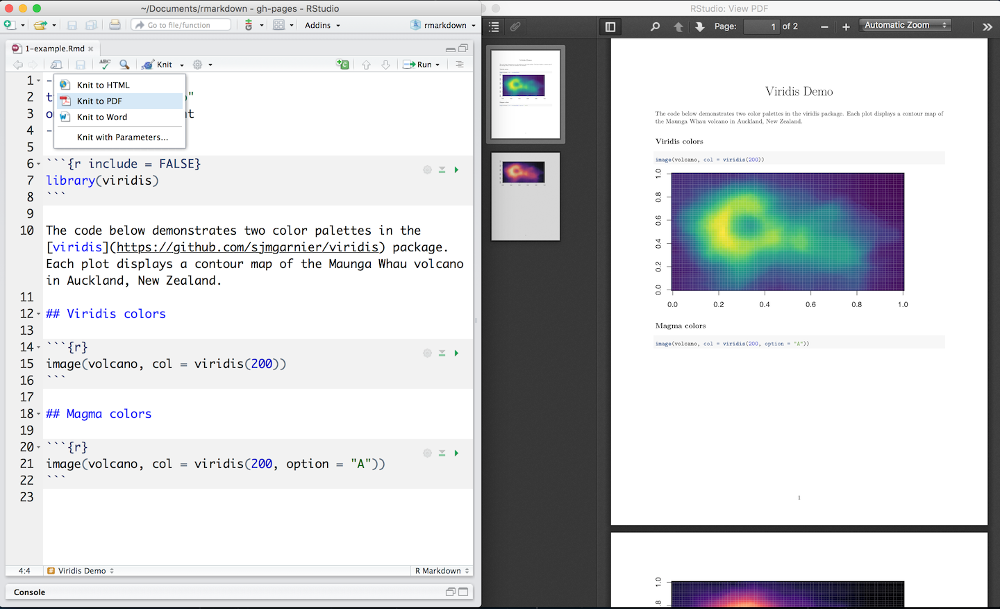
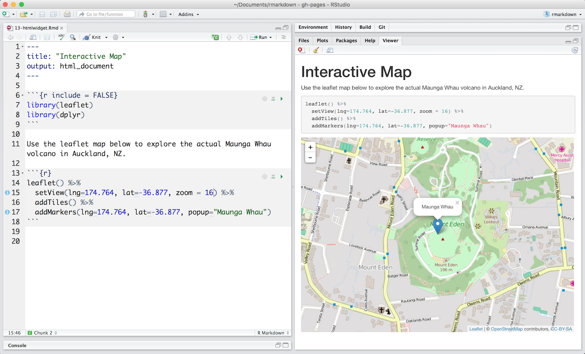
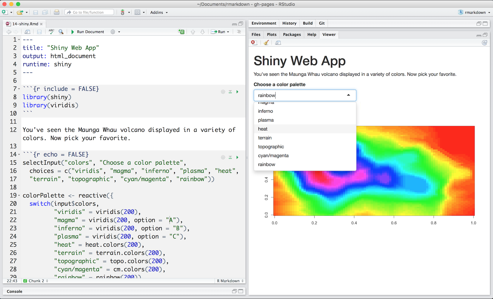
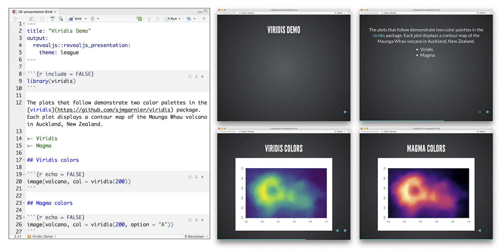

# R Markdown formats

So far you've seen R Markdown used to produce long-format HTML documents. But there are many other types of output that you can make. This chapter gives a brief overview of some of the most important alternate formats. Even more are available in add-on packages, some of which are listed at <http://rmarkdown.rstudio.com/formats.html> (or will be by the time the book is published).

There are two ways to set the output of a document:

1.  Permanently, by modifying the the YAML header: 
    
    ```yaml
    title: "Viridis Demo"
    output: html_document
    ```
    
1.  Transiently, by calling `rmarkdown::render()` by hand:
    
    ```{r eval = FALSE}
    rmarkdown::render("1-example.Rmd", output_format = "word_document")
    ```
    
    This is useful if you want to programmatically produce multiple types of
    output.

RStudio's knit button renders a file to the first format listed in its `output` field. You can render to additional formats by clicking the dropdown menu beside the knit button.

```{r, echo = FALSE, out.width = "70%"}

```

## Output options
    
Each output format is an R function. If you don't specify a package, the default is assumed to be `rmarkdown`. That means you can get help about the parameters to the format with, e.g., `?rmarkdown:html_document()`

You can customize a format, pass arguments to the output function as sub-values of the `output` field. For example, we can change [1-example.Rmd](http://github.com/hadley/r4ds/tree/master/rmarkdown-demos/1-example.Rmd) to render with a floating table of contents,

Change the default output from:

```yaml
output: html_document
```

To:

```yaml
output:
  html_document:
    toc: true
    toc_float: true
```

You can even render to multiple outputs at one time:

```yaml
output:
  html_document:
    toc: true
    toc_float: true
  pdf_document: default
```

Note the special syntax if you don't' want to override any of the default options.

## Documents and notebooks

The previous chapter focussed on the default `html_document` output. There are number of basic variations on that theme, generating different types of documents:

* `pdf_document` makes a PDF. That happens via LaTeX (another open 
  source document layout system), which you'll need to install. RStudio will
  prompt you if you don't already have it.

* `word_document` for Microsoft Word documents (`.docx`).

* `odt_document` for OpenDocument Text documents (`.odt`).

* `rtf_document` for Rich Text Format (`.rtf`) documents.

* `md_document` for a Markdown document. This isn't typically useful by itself,
  but you can (for example), commit it to git and share on github. GitHub will
  automatically render the markdown to HTML for you.

### Notebooks

The chief difference between `html_document` and `html_notebook` is that `html_notebok` also generates `.nb.html` file. This is a self-contained HTML file that contains code and outputs. You can publish it to a website, or share it with other RStudio users. If you open it from RStudio, it will extract and open the .Rmd file that underlies the nb.html file.

To share this experience with colleagues, simply share your .Rmd file for them to open in their RStudio IDE. If your colleagues do not use R, you can recreate the notebook interface by rendering your file to an HTML notebook with `output: html_notebook`.

I consider good practice to check in both the input (i.e. the `.Rmd` file) and the output (i.e. the `.html` file) when using git for data analysis. That makes it easier to see when the outputs of the analyis change. That's particularly important if you're rerunning analyses as the data changes. 

### Interactivity

HTML is an interactive format and you can take advantage of that interactivty from R Markdown in two ways:

1. Interactive JavaScript visualizations based on htmlwidgets.

1. Reactive components made with Shiny.

#### htmlwidgets

[Htmlwidgets](http://www.htmlwidgets.org/) are R functions that return JavaScript visualizations. You do not need to know any JavaScript to use htmlwidgets. The R functions take care of all of the coding for you. The [document below](http://github.com/hadley/r4ds/tree/master/rmarkdown-demos/13-htmlwidget.Rmd) uses a [leaflet](http://rstudio.github.io/leaflet/) htmlwidget to create an interactive map. 

```{r, echo = FALSE, out.width = "100%"}

```

Htmlwidgets create *client side* interactions. Since htmlwidgets are exported in JavaScript, any common web browser can execute the interactions.

Learn more about packages that build htmlwidgets at [www.htmlwidgets.org](http://www.htmlwidgets.org/showcase_leaflet.html).

#### Shiny

The [Shiny](http://shiny.rstudio.com/) package helps developers build interactive web apps powered by R. You can use components from the Shiny package to turn your R Markdown into such an app. To call Shiny code from an R Markdown document, add `runtime: shiny` to the header, like in [this document](http://github.com/hadley/r4ds/tree/master/rmarkdown-demos/14-shiny.Rmd).

```{r, echo = FALSE, out.width = "100%"}

```

Since web browsers cannot execute R code, Shiny interactions occur on the *server side*. This has several benefits:

* you can control access to the app
* you can keep private the data used in the app
* you can increase processing speed by augmenting the server

But it also introduces a logistical issue: Shiny apps require a special server, known as a Shiny Server, when hosted online. You can also run Shiny powered documents on your local computer by rendering them in your local R session.

Learn more about Shiny at the [Shiny Development Center](http://shiny.rstudio.com/).

## Presentations (slides)

R Markdown can generate four presentations formats:

1.  `ioslides_presentation` - HTML presentation with ioslides

1.  `revealjs::revealjs_presentation` - HTML presentation with reveal.js. 
    Requires the revealjs package.

1.  `slidy_presentation` - HTML presentation with W3C Slidy

1.  `beamer_presentation` - PDF presentation with LaTeX Beamer.

Each format will intuitively divide your content into slides, with a new slide beginning at each first (`#`) or second (`##`) level header.  You can also insert a horizontal rule (`***`) to create a new slide without a header. 

Create bullet points that display incrementally with `>-`. Here is a version of 1-example.Rmd displayed as a reveal.js slide presentation.

```{r, echo = FALSE, out.width = "100%"}

```

## Dashboards

Dashboards are a useful way to communicate large amounts of information visually and quickly. Flexdashboard makes it particularly easy to create dashboards using R Markdown and a convention for how the headers affect the layout:

* Each level 1 header (`#`) begins a new page in the dashboard.
* Each level 2 header (`##`) begins a new column.
* Each level 3 header (`###`) begins a new row.

For example, you can produce this dashboard:

```{r, echo = FALSE, out.width = NULL}
knitr::include_graphics("screenshots/rmarkdown-flexdashboard.png")
```

Using this code:

```{r comment = "", echo = FALSE, out.width = "70%"}
cat(readr::read_file("rmarkdown-demos/11-dashboard.Rmd"))
```

Flexdashboard also provides simple tools for creating sidebars, tabsets, value boxes, and gauges. To learn more about flexdashboard visit <http://rmarkdown.rstudio.com/flexdashboard/>.

## Websites

Use `rmarkdown::render_site()` to render collections of R Markdown documents into a website. Each website requires, in a single directory, 

* a YAML file named `_site.yml`, which provides the navigation for the site, e.g.

    ```{r echo = FALSE, comment = ""}
    cat(htmltools::includeText("rmarkdown-demos/12-website/_site.yml"))
    ```

* a .Rmd file named `index.Rmd`, which provides the content for the home page of your website

* other .Rmd files to include in the site. Each .Rmd file becomes a page in the website

* any support material

Execute `rmarkdown::render_site("<path to directory>")` to build `_site`, a directory of files ready to deploy as a standalone static website.

Better yet, create an [RStudio Project](https://support.rstudio.com/hc/en-us/articles/200526207-Using-Projects) for your website directory. RStudio will add a Build tab to the IDE that you can use to build and preview your site. [This collection of files](http://github.com/hadley/r4ds/tree/master/rmarkdown-demos/12-website.zip) creates the simple site below

```{r, echo = FALSE, out.width = "100%"}
knitr::include_graphics("images/website-2-website.png")
```

## Other formats

The bookdown package extends R Markdown to create book length documents, like *R for Data Science*, which was written with R Markdown and bookdown. To learn more about bookdown, see the free ebook [Authoring Books with R Markdown](https://bookdown.org/yihui/bookdown/) or [www.bookdown.org](www.bookdown.org).

## Learning more


* To improve your presentation skills, I recommend 
  [_Presentation Patterns_](https://amzn.com/0321820800), by Neal Ford,
  Matthew McCollough, and Nathaniel Schutta. It provides a set of effective
  patterns (both low- and high-level) that you can imply to improve your 
  presentations.
  
* If you give academic talks, I recommend reading the [_Leek group guide
  to giving talks_](https://github.com/jtleek/talkguide).
  
* I haven't taken it personally, but I've heard good things about Matt 
  McGarrity's online course on public speaking: 
  <https://www.coursera.org/learn/public-speaking>.

* Finally, effectively communicating your ideas often benefits from some
  knowledge of graphic design. [_The Non-Designer's Design
  Book_](http://amzn.com/0133966151) is a great place to start.

