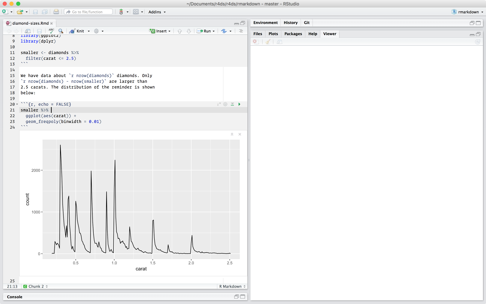
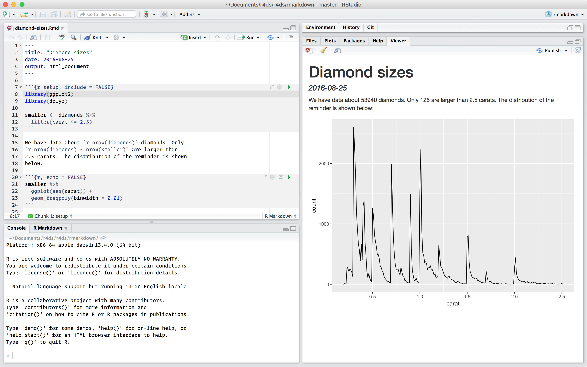
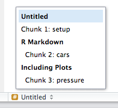

# R Markdown

## Introduction

R Markdown provides an unified authoring framework for data science, combining your code, its results, and your prose commentary. R Markdown documents are fully reproducible and support dozens of output formats, like PDFs, Word files, slideshows, and more. 

R Markdown files are designed to be used in three ways:

1.  For communicating to decision makers, who want to focus on the conclusions,
    not the code behind the analysis.

1.  For collaborating with other data scientists (including future you!), who
    are interested in both your conclusions, and how you reached them (i.e.
    the code).
    
1.  As an environment in which to _do_ data science, as a modern day lab 
    notebook where you can capture not only what you did, but also what you
    were thinking.

R Markdown integrates a number of R packages and external tools. This means that help is, by-and-large, not available through `?`. Instead, as you work through this chapter, and use R Markdown in the future, keep these resources close to hand:

*   R Markdown Cheat Sheet: _Help > Cheatsheets > R Markdown Cheat Sheet_,

*   R Markdown Reference Guide: _Help > Cheatsheets > R Markdown Reference 
    Guide_.

Both cheatsheets are also available at <http://rstudio.com/cheatsheets>.

### Prerequisites

You need the __rmarkdown__ package, but you don't need to explicitly install it or load it, as RStudio automatically does both when needed.

```{r setup, include = FALSE}
chunk <- "```"
inline <- function(x = "") paste0("`` `r ", x, "` ``")
library(tidyverse)
```

## R Markdown basics

This is an R Markdown file, a plain text file that has the extension `.Rmd`:

```{r echo = FALSE, comment = ""}
cat(htmltools::includeText("rmarkdown/diamond-sizes.Rmd"))
```

It contains three important types of content:

1.  An (optional) __YAML header__ surrounded by `---`s.
1.  __Chunks__ of R code surrounded by ```` ``` ````.
1.  Text mixed with simple text formatting like `# heading` and `_italics_`.

When you open an `.Rmd`, you get a notebook interface where code and output are interleaved. You can run each code chunk by clicking the Run icon (it looks like a play button at the top of the chunk), or by pressing Cmd/Ctrl + Shift + Enter. RStudio executes the code and displays the results inline with the code:

```{r, echo = FALSE, out.width = "75%"}

```

To produce a complete report containing all text, code, and results, click "Knit" or press Cmd/Ctrl + Shift + K.  You can also do this programmatically with `rmarkdown::render("1-example.Rmd")`. This will display the report in the viewer pane, and create a self-contained HTML file that you can share with others.

```{r, echo = FALSE, out.width = "75%"}

```

When you __knit__ the document, R Markdown sends the .Rmd file to __knitr__, http://yihui.name/knitr/, which executes all of the code chunks and creates a new markdown (.md) document which includes the code and its output. The markdown file generated by knitr is then processed by __pandoc__, <http://pandoc.org/>, which is responsible for creating the finished file. The advantage of this two step workflow is that you can create a very wide range of output formats, as you'll learn about in [R markdown formats].

```{r, echo = FALSE, out.width = "75%"}
knitr::include_graphics("images/RMarkdownFlow.png")
```

To get started with your own `.Rmd` file, select *File > New File > R Markdown...* in the menubar. RStudio will launch a wizard that you can use to pre-populate your file with useful content that reminds you how the key features of R Markdown work. 

The following sections dive into the three components of an R Markdown document in more details: the markdown text, the code chunks, and the YAML header.

### Exercises

1.  Create a new notebook using _File > New File > R Notebook_. Read the 
    instructions. Practice running the chunks. Verify that you can modify
    the code, re-run it, and see modified output.
    
1.  Create a new R Markdown document with _File > New File > R Markdown..._
    Knit it by clicking the appropriate button. Knit it by using the 
    appropriate keyboard short cut. Verify that you can modify the
    input and see the output update.
    
1.  Compare and contrast the R notebook and R markdown files you created
    above. How are the outputs similar? How are they different? How are
    the inputs similar? How are they different? What happens if you
    copy the YAML header from one to the other?

1.  Create one new R Markdown document for each of the three built-in
    formats: HTML, PDF and Word. Knit each of the three documents.
    How does the output differ? How does the input differ? (You may need
    to install LaTeX in order to build the PDF output --- RStudio will
    prompt you if this is necessary.)

## Text formatting with Markdown

Prose in `.Rmd` files is written in Markdown, a lightweight set of conventions for formatting plain text files. Markdown is designed to be easy to read and easy to write. It is also very easy to learn. The guide below shows how to use Pandoc's Markdown, a slightly extended version of Markdown that R Markdown understands.

```{r, echo = FALSE, comment = ""}
cat(readr::read_file("rmarkdown/markdown.Rmd"))
```

The best way to learn these is simply to try them out. It will take a few days, but soon they will become second nature, and you won't need to think about them. If you forget, you can get to a handy reference sheet with *Help > Markdown Quick Reference*.

### Exercises

1.  Practice what you've learned by creating a brief CV. The title should be
    your name, and you should include headings for (at least) education or
    employment. Each of the sections should include a bulleted list of
    jobs/degrees. Highlight the year in bold.
    
1.  Using the R Markdown quick reference, figure out how to:

    1.  Add a footnote.
    1.  Add a horizontal rule.
    1.  Add a block quote.
    
1.  Copy and paste the contents of `diamond-sizes.Rmd` from
    <https://github.com/hadley/r4ds/tree/master/rmarkdown> in to a local
    R markdown document. Check that you can run it, then add text after the 
    frequency polygon that describes its most striking features.

## Code chunks

To run code inside an R Markdown document, you need to insert a chunk. There are three ways to do so:

1. The keyboard shortcut Cmd/Ctrl + Alt + I

1. The "Insert" button icon in the editor toolbar.

1. By manually typing the chunk delimiters ` ```{r} ` and ` ``` `.

Obviously, I'd recommend you learn the keyboard shortcut. It will save you a lot of time in the long run!

You can continue to run the code using the keyboard shortcut that by now (I hope!) you know and love: Cmd/Ctrl + Enter. However, chunks get a new keyboard shortcut: Cmd/Ctrl + Shift + Enter, which runs all the code in the chunk. Think of a chunk like a function. A chunk should be relatively self-contained, and focussed around a single task. 

The following sections describe the chunk header which consists of ```` ```{r ````, followed by an optional chunk name, followed by comma separated options, followed by `}`. Next comes your R code and the chunk end is indicated by a final ```` ``` ````.

### Chunk name

Chunks can be given an optional name: ```` ```{r by-name} ````. This has three advantages:

1.  You can more easily navigate to specific chunks using the drop-down
    code navigator in the bottom-left of the script editor:

    ```{r, echo = FALSE, out.width = "30%"}
    
    ```

1.  Graphics produced by the chunks will have useful names that make
    them easier to use elsewhere. More on that in [other important options].
    
1.  You can set up networks of cached chunks to avoid re-performing expensive
    computations on every run. More on that below.

There is one chunk name that imbues special behaviour: `setup`. When you're in a notebook mode, the chunk named setup will be run automatically once, before any other code is run.

### Chunk options

Chunk output can be customised with __options__, arguments supplied to chunk header. Knitr provides almost 60 options that you can use to customize your code chunks. Here we'll cover the most important chunk options that you'll use frequently. You can see the full list at <http://yihui.name/knitr/options/>. 

The most important set of options controls if your code block is executed and what results are inserted in the finished report:
  
*   `eval = FALSE` prevents code from being evaluated. (And obviously if the
    code is not run, no results will be generated). This is useful for 
    displaying example code, or for disabling a large block of code without 
    commenting each line.

*   `include = FALSE` runs the code, but doesn't show the code or results 
    in the final document. Use this for setup code that you don't want
    cluttering your report.

*   `echo = FALSE` prevents code, but not the results from appearing in the 
    finished file. Use this when writing reports aimed at people who don't
    want to see the underlying R code.
    
*   `message = FALSE` or `warning = FALSE` prevents messages or warnings 
    from appearing in the finished file.

*   `results = 'hide'` hides printed output; `fig.show = 'hide'` hides
    plots.

*   `error = TRUE` causes the render to continue even if code returns an error.
    This is rarely something you'll want to include in the final version
    of your report, but can be very useful if you need to debug exactly
    what is going on inside your `.Rmd`. It's also useful if you're teaching R
    and want to deliberately include an error. The default, `error = FALSE` causes 
    knitting to fail if there is a single error in the document.
    
The following table summarises which types of output each option supressess:

Option             | Run code | Show code | Output | Plots | Messages | Warnings 
-------------------|----------|-----------|--------|-------|----------|---------
`eval = FALSE`     | -        |           | -      | -     | -        | -
`include = FALSE`  |          | -         | -      | -     | -        | -
`echo = FALSE`     |          | -         |        |       |          |
`results = "hide"` |          |           | -      |       |          | 
`fig.show = "hide"`|          |           |        | -     |          |
`message = FALSE`  |          |           |        |       | -        |
`warning = FALSE`  |          |           |        |       |          | -

### Table

By default, R Markdown prints data frames and matrices as you'd see them in the console:

```{r}
mtcars[1:5, ]
```

If you prefer that data be displayed with additional formatting you can use the `knitr::kable` function. The code below generates Table \@ref(tab:kable).

```{r kable}
knitr::kable(
  mtcars[1:5, ], 
  caption = "A knitr kable."
)
```

Read the documentation for `?knitr::kable` to see the other ways in which you can customise the table. For even deeper customisation, consider the __xtable__, __stargazer__, __pander__, __tables__, and __ascii__ packages. Each provides a set of tools for returning formatted tables from R code.

There is also a rich set of options for controlling how figures are embedded. You'll learn about these in [saving your plots].

### Caching

Normally, each knit of a document starts from a completely clean slate. This is great for reproducibility, because it ensures that you've captured every important computation in code. However, it can be painful if you have some computations that take a long time. The solution is `cache = TRUE`. When set, this will save the output of the chunk to a specially named file on disk. On subsequent runs, knitr will check to see if the code has changed, and if it hasn't, it will reuse the cached results.

The caching system must be used with care, because by default it is based on the code only, not its dependencies. For example, here the `processed_data` chunk depends on the `raw_data` chunk:

    `r chunk`{r raw_data}
    rawdata <- readr::read_csv("a_very_large_file.csv")
    `r chunk`
    
    `r chunk`{r processed_data, cache = TRUE}
    processed_data <- rawdata %>% 
      filter(!is.na(import_var)) %>% 
      mutate(new_variable = complicated_transformation(x, y, z))
    `r chunk`

Caching the `processed_data` chunk means that it will get re-run if the dplyr pipeline is changed, but it won't get rerun if the `read_csv()` call changes. You can avoid that problem with the `dependson` chunk option:

    `r chunk`{r processed_data, cache = TRUE, dependson = "raw_data"}
    processed_data <- rawdata %>% 
      filter(!is.na(import_var)) %>% 
      mutate(new_variable = complicated_transformation(x, y, z))
    `r chunk`

`dependson` should contain a character vector of *every* chunk that the cached chunk depends on. Knitr will update the results for the cached chunk whenever it detects that one of its dependencies have changed.

Note that the chunks won't update if `a_very_large_file.csv` changes, because knitr caching only tracks changes within the `.Rmd` file. If you want to also track changes to that file you can use the `cache.extra` option. This is an arbitrary R expression that will invalidate the cache whenever it changes. A good function to use is `file.info()`: it returns a bunch of information about the file including when it was last modified. Then you can write:

    `r chunk`{r raw_data, cache.extra = file.info("a_very_large_file.csv")}
    rawdata <- readr::read_csv("a_very_large_file.csv")
    `r chunk`

As your caching strategies get progressively more complicated, it's a good idea to regularly clear out all your caches with `knitr::clean_cache()`.

I've used the advice of [David Robinson](https://twitter.com/drob/status/738786604731490304) to name these chunks: each chunk is named after the primary object that it creates. This makes it easier to understand the `dependson` specification.

### Global options

As you work more with knitr, you will discover that some of the default chunk options don't fit your needs and you want to change them. You can do this by calling `knitr::opts_chunk$set()` in a code chunk. For example, when writing books and tutorials I set:

```{r, eval = FALSE}
knitr::opts_chunk$set(
  comment = "#>",
  collapse = TRUE
)
```

This uses my preferred comment formatting, and ensures that the code and output are kept closely entwined. On the other hand, if you were preparing a report, you might set:

```{r eval = FALSE}
knitr::opts_chunk$set(
  echo = FALSE
)
```

That will hide the code by default, so only showing the chunks you deliberately choose to show (with `echo = TRUE`). You might consider setting `message = FALSE` and `warning = FALSE`, but that would make it harder to debug problems because you wouldn't see any messages in the final document.

### Inline code

There is one other way to embed R code into an R Markdown document: directly into the text, with:  `r inline()`. This can be very useful if you mention properties of your data in the text. For example, in the example document I used at the start of the chapter I had:

> We have data about `r inline('nrow(diamonds)')` diamonds. 
> Only `r inline('nrow(diamonds) - nrow(smaller)')` are larger 
> than 2.5 carats. The distribution of the remainder is shown below:

When the report is knit, the results of these computations are inserted into the text:

> We have data about 53940 diamonds. Only 126 are larger than 
> 2.5 carats. The distribution of the remainder is shown below:

When inserting numbers into text, `format()` is your friend. It allows you to set the number of `digits` so you don't print to a ridiculous degree of accuracy, and a `big.mark` to make numbers easier to read. I'll often combine these into a helper function:

```{r}
comma <- function(x) format(x, digits = 2, big.mark = ",")
comma(3452345)
comma(.12358124331)
```

### Exercises

1.  Add a section that explores how diamond sizes vary by cut, colour,
    and clarity. Assume you're writing a report for someone who doesn't know
    R, and instead of setting `echo = FALSE` on each chunk, set a global 
    option.

1.  Download `diamond-sizes.Rmd` from
    <https://github.com/hadley/r4ds/tree/master/rmarkdown>. Add a section
    that describes the largest 20 diamonds, including a table that displays
    their most important attributes.

1.  Modify `diamonds-sizes.Rmd` to use `comma()` to produce nicely
    formatted output. Also include the percentage of diamonds that are
    larger than 2.5 carats.

1.  Set up a network of chunks where `d` depends on `c` and `b`, and
    both `b` and `c` depend on `a`. Have each chunk print `lubridate::now()`,
    set `cache = TRUE`, then verify your understanding of caching.

## Troubleshooting

Troubleshooting R Markdown documents can be challenging because you are no longer in an interactive R environment, and you will need to learn some new tricks. The first thing you should always try is to recreate the problem in an interactive session. Restart R, then "Run all chunks" (either from Code menu, under Run region), or with the keyboard shortcut Ctrl + Alt + R. If you're lucky, that will recreate the problem, and you can figure out what's going on interactively.

If that doesn't help, there must be something different between your interactive environment and the R markdown environment. You're going to need to systematically explore the options. The most common difference is the working directory: the working directory of an R Markdown is the directory in which it lives. Check the working directory is what you expect by including `getwd()` in a chunk.

Next, brainstorm all the things that might cause the bug. You'll need to systematically check that they're the same in your R session and your R markdown session. The easiest way to do that is to set `error = TRUE` on the chunk causing the problem, then use `print()` and `str()` to check that settings are as you expect.

## YAML header

You can control many other "whole document" settings by tweaking the parameters of the YAML header.  You might wonder what YAML stands for: it's "yet another markup language", which is designed for representing hierarchical data in a way that's easy for humans to read and write. R Markdown uses it to control many details of the output. Here we'll discuss two: document parameters and bibliographies.

### Parameters

R Markdown documents can include one or more parameters whose values can be set when you render the report. Parameters are useful when you want to re-render the same report with distinct values for various key inputs. For example, you might be producing sales reports per branch, exam results by student, or demographic summaries by country. To declare one or more parameters, use the `params` field. 

This example uses a `my_class` parameter to determine which class of cars to display:

```{r, echo = FALSE, out.width = "100%", comment = ""}
cat(readr::read_file("rmarkdown/fuel-economy.Rmd"))
```

As you can see, parameters are available within the code chunks as a read-only list named `params`.

You can write atomic vectors directly into the YAML header. You can also run arbitrary R expressions by prefacing the parameter value with `!r`. This is a good way to specify date/time parameters.

```yaml
params:
  start: !r lubridate::ymd("2015-01-01")
  snapshot: !r lubridate::ymd_hms("2015-01-01 12:30:00")
```

In RStudio, you can click the "Knit with Parameters" option in the Knit dropdown menu to set parameters, render, and preview the report in a single user friendly step. You can customise the dialog by setting other options in the header. See <http://rmarkdown.rstudio.com/developer_parameterized_reports.html#parameter_user_interfaces> for more details.

Alternatively, if you need to produce many such paramterised reports, you can call `rmarkdown::render()` with a list of `params`:

```{r eval = FALSE}
rmarkdown::render("fuel-economy.Rmd", params = list(my_class = "suv"))
```

This is particularly powerful in conjunction with `purrr:pwalk()`. The following example creates a report for each value of `class` found in `mpg`. First we create a data frame that has one row for each class, giving the `filename` of the report and the `params`:

```{r}
reports <- tibble(
  class = unique(mpg$class),
  filename = stringr::str_c("fuel-economy-", class, ".html"),
  params = purrr::map(class, ~ list(my_class = .))
)
reports
```

Then we match the column names to the argument names of `render()`, and use purrr's **parallel** walk to call `render()` once for each row:

```{r, eval = FALSE}
reports %>% 
  select(output_file = filename, params) %>% 
  purrr::pwalk(rmarkdown::render, input = "fuel-economy.Rmd")
```

### Bibliographies and Citations

Pandoc can automatically generate citations and a bibliography in a number of styles. To use this feature, specify a bibliography file using the `bibliography` field in your file's header. The field should contain a path from the directory that contains your .Rmd file to the file that contains the bibliography file:

```yaml
bibliography: rmarkdown.bib
```

You can use many common bibliography formats including BibLaTeX, BibTeX, endnote, medline.

To create a citation within your .Rmd file, use a key composed of ‘@’ + the citation identifier from the bibliography file. Then place the citation in square brackets. Here are some examples:

```markdown
Separate multiple citations with a `;`: Blah blah [@smith04; @doe99].

You can add arbitrary comments inside the square brackets: 
Blah blah [see @doe99, pp. 33-35; also @smith04, ch. 1].

Remove the square brackets to create an in-text citation: @smith04 
says blah, or @smith04 [p. 33] says blah.

Add a `-` before the citation to suppress the author's name: 
Smith says blah [-@smith04].
```

When R Markdown renders your file, it will build and append a bibliography to the end of your document. The bibliography will contain each of the cited references from your bibliography file, but it will not contain a section heading. As a result it is common practice to end your file with a section header for the bibliography, such as `# References` or `# Bibliography`.

You can change the style of your citations and bibliography by referencing a CSL (citation style language) file in the `csl` field:

```yaml
bibliography: rmarkdown.bib
csl: apa.csl
```

As with the bibliography field, your csl file should contain a path to the file. Here I assume that the csl file is in the same directory as the .Rmd file. A good place to find CSL style files for common bibliography styles is  <http://github.com/citation-style-language/styles>.

## Learning more

R Markdown is still relatively young, and is still growing rapidly. The best place to stay on top of innovations is the official R Markdown website: <http://rmarkdown.rstudio.com>.

There are two important topics that we haven't covered here: collaboration, and the details of accurately communicating your ideas to other humans. Collaboration is a vital part of modern data science, and you can make your life much easier by using version control tools, like Git and GitHub. We recommend two free resources that will teach you about Git:

1.  "Happy Git with R": a user friendly introduction to Git and GitHub from 
    R users, by Jenny Bryan. The book is freely available online:
    <http://happygitwithr.com>
    
1.  The "Git and GitHub" chapter of _R Packages_, by Hadley. You can also 
    read it for free online: <http://r-pkgs.had.co.nz/git.html>.

I have also not touched on what you should actually write in order to clearly communicate the results of your analysis. To improve your writing, I highly recommend reading either [_Style: Lessons in Clarity and Grace_](https://amzn.com/0134080416) by Joseph M. Williams & Joseph Bizup, or [_The Sense of Structure: Writing from the Reader's Perspective_](https://amzn.com/0205296327) by George Gopen. Both books will help you understand the structure of sentences and paragraphs, and give you the tools to make your writing more clear. (These books are rather expensive if purchased new, but they're used by many English classes so there are plenty of cheap second-hand copies). George Gopen also has a number of short articles on writing at <https://www.georgegopen.com/the-litigation-articles.html>. They are aimed at lawyers, but almost everything applies to data scientists too. 
  
