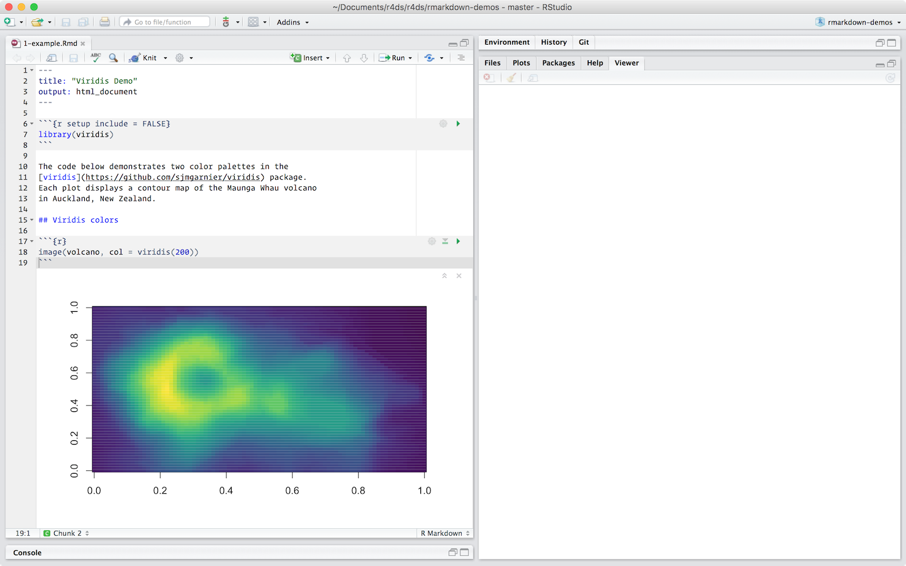
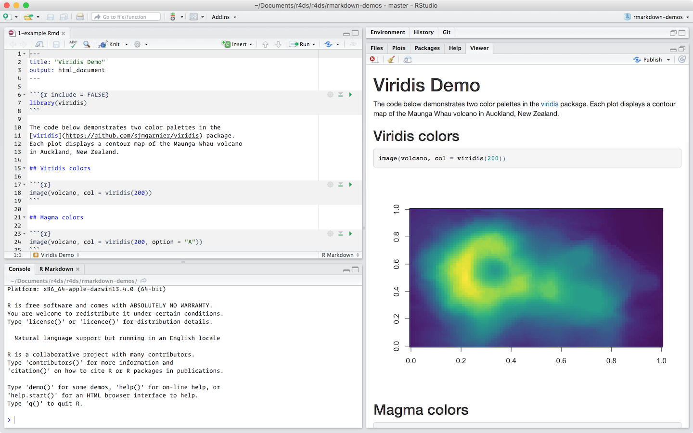
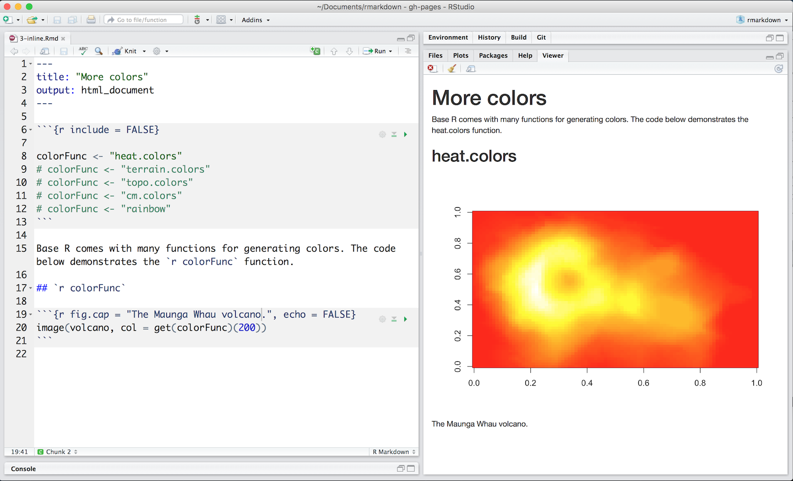
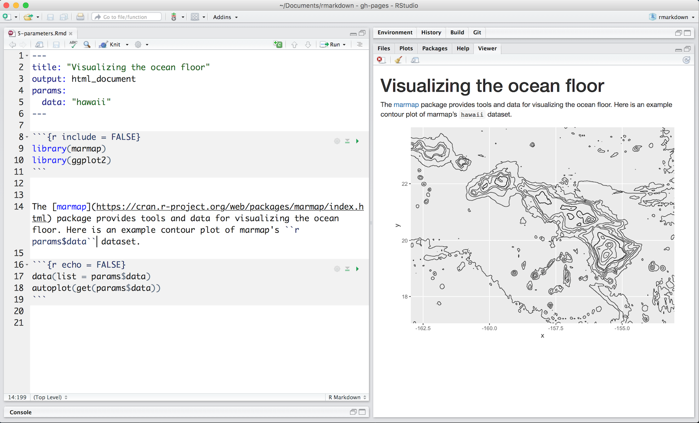
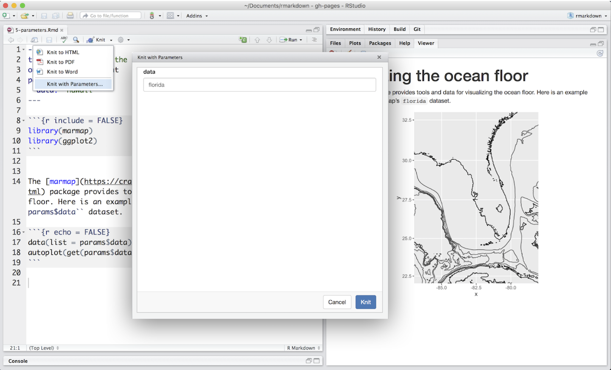

```{r include=FALSE, cache=FALSE}
set.seed(1014)
options(digits = 3)

knitr::opts_chunk$set(
  comment = "#>",
  collapse = TRUE,
  cache = TRUE,
  out.width = "70%",
  fig.align = 'center',
  fig.width = 6,
  fig.asp = 0.618,  # 1 / phi
  fig.show = "hold"
)

options(dplyr.print_min = 6, dplyr.print_max = 6)
```
```{r include=FALSE, cache=FALSE}
set.seed(1014)
options(digits = 3)

knitr::opts_chunk$set(
  comment = "#>",
  collapse = TRUE,
  cache = TRUE,
  out.width = "70%",
  fig.align = 'center',
  fig.width = 6,
  fig.asp = 0.618,  # 1 / phi
  fig.show = "hold"
)

options(dplyr.print_min = 6, dplyr.print_max = 6)
```
```{r include=FALSE, cache=FALSE}
set.seed(1014)
options(digits = 3)

knitr::opts_chunk$set(
  comment = "#>",
  collapse = TRUE,
  cache = TRUE,
  out.width = "70%",
  fig.align = 'center',
  fig.width = 6,
  fig.asp = 0.618,  # 1 / phi
  fig.show = "hold"
)

options(dplyr.print_min = 6, dplyr.print_max = 6)
```
# R Markdown

## Introduction

R Markdown provides an unified authoring framework for data science, combining your code, its results, and your prose commentary. R Markdown documents are fully reproducible and support dozens of output formats, like PDFs, Word files, slideshows, and more. RMarkdown files are designed to be used in two ways:

1.  To produce a final report that you can share with others.

1.  As a notebook, which allows yout to mingle prose, code, and output during 
    your own analyses.

The name R Markdown is slightly misleading because you can use it with other languages, not just R. R Markdown has recently added support for Python and SQL, and that support will improve over time. To use a different language in code chunk, just replace the `r` in  ```` ```{r} ```` with `python` or `sql`. We'll focus on R here, for obvious reasons!

R Markdown integrates a number of R packages and external tools. This means that helps is, by-and-large, not available through `?`. Instead, as you work through chapter, and use R Markdown in the future, keep these resouces close to hand:

* R Markdown Cheat Sheet: *File > Help > Cheatsheets > R Markdown Cheat Sheet*,
* R Markdown Reference Guide: *File > Help > Cheatsheets > R Markdown Reference Guide*.
* Markdown Quick Reference: *File > Help > Markdown Quick Reference*.

You can also download these from <http://rstudio.com/cheatsheets>.

### Prerequisites

You need the __rmarkdown__ package, but you don't need to explicit install it or load it, as RStudio automatically does both when needed.

```{r setup, include = FALSE}
chunk <- "```"
inline <- function(x = "") paste0("`` `r ", x, "` ``")
```

## R Markdown basics

This is an R Markdown file, a plain text file that has the extension `.Rmd`:

```{r echo = FALSE, comment = ""}
cat(htmltools::includeText("rmarkdown-demos/1-example.Rmd"))
```

It contains three important types of content:

1.  An (optional) __YAML header__ surrounded by `---`s.
1.  __Chunks__ of R code surrounded by ```` ``` ````.
1.  Text mixed with simple text formatting like `##` and .

When you open an `.Rmd` you get a notebook interface for R. You can run each code chunk by clicking the Run icon (it looks like a play button at the top of the chunk), or by pressing Cmd/Ctrl + Shift + Enter. RStudio executes the code and displays the results inline with your file.

```{r, echo = FALSE, out.width = "100%"}

```

To produce a complete report containing all text, code, and results click "Knit" or press Cmd/Ctrl + Shift + K.  You can also do programmatically with `rmarkdown::render("1-example.Rmd")`. For the `.Rmd` above, this creates:

```{r, echo = FALSE, out.width = "100%"}

```

When you __knit__ the document R Markdown sends the .Rmd file to [knitr](http://yihui.name/knitr/), which executes all of the code chunks and creates a new markdown (.md) document which includes the code and its output. The markdown file generated by knitr is then processed by [pandoc](http://pandoc.org/) which is responsible for creating the finished format. The big advantage of this two step workflow is that you can create a very wide range of output formats, as you'll learn about in XYZ. Knitting is performed in a fresh instance of R which ensures that your reports are completely reproducible.

```{r, echo = FALSE, out.width = "100%"}
knitr::include_graphics("images/RMarkdownFlow.png")
```

To get started with your own `.Rmd` file, select *File > New File > R Markdown...* in the menubar. RStudio will launch a wizard that you can use to pre-populate your file with useful content thatreminds you how the key features of R Markdown work. 

The following sections dives into the three components of an R Markdown document in more details: the markdown text, the code chunks, and the YAML header.

### Exercises

1.  Create a new notebook using File | New File | R Notebook. Read the 
    instructions. Practice running the chunks. Verify that you can modify
    the code, re-run it, and see modified output.
    
1.  Create a new R Markdown document with File | New File | R Markdown...
    Knit it by clicking the appropriate button. Knit it by using the 
    appropriate keyboard short cut. Verify that you can modify the
    input and see the output update.
    
1.  Compare and contrast the R notebook and R markdown files you created
    above. How are the outputs similar? How are they different? How are
    the inputs similar? How are they different? What happens if you
    copy the YAML heading from one to the other?

1.  Create one new R Markdown document for each of the three build in
    formats: HTML, PDF and word. Knit each of the three documents.
    How does the output differ? How does the input differ? (You may need
    to install MikTex in order to build the PDF output.)

## Text formatting

Prose in `.Rmd` files is written in Markdown, a light weight set of conventions for formatting plan text files. Markdown is designed to be easy to read and easy to write. It is also very easy to learn. The guide below shows how to use Pandoc's Markdown, a slightly extended version of Markdown that R Markdown understands.

The following code shows you the most important R Markdown commands:

```{r, echo = FALSE, comment = ""}
cat(readr::read_file("rmarkdown-demos/markdown.Rmd"))
```

The best way to learn these is simply to try them out. It will take a few days, but soon they will become second nature, and you won't need to think about them.

### Exercises

1.  Practice what you've learned by creating a brief CV. The title should be
    your name, and you should include headings for (at least) education or
    employment. Each of the sections should include a bulleted list of
    jobs/degrees. Highlight the year in bold.
    
1.  Using the R Markdown cheatsheet, figure out how to:

    1.  Add a footnote.
    1.  Add a horizontal rule.
    1.  Add a block quote.

## Code chunks

To run code inside an R Markdown document, you need to insert a chunk. There are three ways to do so:

1. The keyboard shortcut Cmd/Ctrl + Alt + I.

1. The "Insert" button icon in the editor toolbar.

1. By manually typing the chunk delimiters ` ```{r} ` and ` ``` `.

Obviously, I'd recommend you learn the keyboard shortcut. It will save you a lot of time in the long run!

You can continue to run code using the keyboard shortcut that by now (I hope!) you know and love: Cmd/Ctrl + Enter. However, chunks get a new keyboard shortcut: Cmd/Ctrl + Shift + Enter. That's often more convenient because it runs the complete chunk, in even fewer keypresses than before.

Think of a chunk like a function. A chunk should be relatively self-contained, and focussed around a single task. You can iterate quickly in the script editor, and then run the whole thing with a single keyboard shortcut.

### Chunk name

Chunks can be given an optional name: ```` ```{r by-name} ````. This has three advantages:

1.  You can more easily navigate to specific chunks using the drop-down
    code navigator in the bottom-left of the script editor:

    ```{r, echo = FALSE, out.width = NULL}
    knitr::include_graphics("screenshots/rmarkdown-chunk-nav.png")
    ```

1.  Graphics produced by the chunks will have useful names that make
    them easier to use elsewhere. More on that in [other important options].
    
1.  You can setup chains of cached chunks to avoid re-performing expensive
    computations on every run. More on that below.

There is one chunk name that imbues special behaviour: `setup`. When you're in a notebook mode, the chunk named setup will be run automatically once before you run any other code.

### Chunk options

Chunk output can be customized with __options__, arguments supplied to chunk header. Knitr provides almost 60 options that you can use to customize your code chunks. Here we'll cover some of the most important chunk options that you're likely to need frequently. You can see the full list at <http://yihui.name/knitr/options/>. 

The most important set of options controls if your code block is executed and what results are inserted in the finished report:
  
*   `eval = FALSE` prevents code from being evaluated. (And obviously if the
     code is not run, no results will be generated). Useful for displaying 
    example code, or for disabling a large block of code without commenting
    each line.

*   `include = FALSE` runs the code, but doesn't show the code or results 
    in the final document. Use this for setup code that you don't want
    cluttering your report.

*   `echo = FALSE` prevents code, but not the results from appearing in the 
    finished file. Use this to create reports which don't show the R
    code that generates them.
    
*   `message = FALSE` and `warning = FALSE` prevents messages and warnings 
    generated by code from  appearing in the finished file.

*   `error = TRUE` causes the render to continue even if code returns an error.
    This is rarely useful for data analysis reports, but it's useful for 
    teaching so that you can illustrate important errors. The default,
    `error = FALSE` causes knitting to failure if there is a single error
    in the document.

*   `results = 'hide'` hides printed output; `fig.show = 'hide'` hides
    plots.
    
The following table summarises the options:

Option             | Run code | Show code | Output | Plots | Messages | Warnings 
-------------------|----------|-----------|--------|-------|----------|---------
`eval = FALSE`     | -        |           | -      | -     | -        | -
`include = FALSE`  |          | -         | -      | -     | -        | -
`echo = FALSE`     |          | -         |        |       |          |
`results = "hide"` |          |           | -      |       |          | 
`fig.show = "hide"`|          |           |        | -     |          |
`message = FALSE`  |          |           |        |       | -        |
`warning = FALSE`  |          |           |        |       |          | -

### Table

By default, R Markdown displays data frames and matrixes as they would be in the R terminal (in a monospaced font):

```{r}
mtcars[1:5, ]
```

If you prefer that data be displayed with additional formatting you can use the `knitr::kable` function: 

```{r}
knitr::kable(
  mtcars[1:5, ], 
  caption = "A knitr kable."
)
```

Read the documentation at `?knitr::kable` to see the other ways that you can customise the table.

If you'd like to customize your tables at a deeper level, consider the __xtable__, __stargazer__, __pander__, __tables__, and __ascii__ packages. Each provides a set of tools for returning formatted tables from R code.

There are also a rich set of options for controlling how figures embedded. You'll learn about those in [saving your plots].

### Caching

Normally, each knit of a document starts from a completely clean slate. This is great for reproducibility, because it ensures that you've captured every important computation in code. However, it can be painful if you have some computations that take a long time. The solution is `cache = TRUE`. When set, this will save the output of the chunk to a speically named file on disk. On subsequent runs, knitr will check the to see if the code has changed, and if it hasn't, it will re-use the cached results.

The caching system must be used with care, because it is based on only the code itself, not its dependencies. For example, here the `processed_data` chunk depends on the `raw_data` chunk:

    # chunk 1
    `r chunk`{r raw_data}
    rawdata <- readr::read_csv("a_very_large_file.csv")
    `r chunk`
    
    # chunk 2
    `r chunk`{r processed_data, cached = TRUE}
    processed_data <- rawdata %>% 
      filter(!is.na(import_var)) %>% 
      mutate(new_variable = complicated_transformation(x, y, z))
    `r chunk`

Caching the `processed_data` chunk means that it will get re-run if the dplyr pipeline is changed, but it won't get rerun if the `read_csv()` call changes. You can avoid that problem with the `dependson` chunk option:

    # chunk 2
    `r chunk`{r processed_data, cached = TRUE, dependson = "raw_data"}
    processed_data <- rawdata %>% 
      filter(!is.na(import_var)) %>% 
      mutate(new_variable = complicated_transformation(x, y, z))
    `r chunk`

`dependson` should contain a character vector of *every* chunk that the cached chunk depends on. Knitr will update the results for the cached chunk whenever it detects that one of its dependencies have changed.

Note that the chunks won't update if `a_very_large_file.csv` changes, because knitr caching only tracks changes within the `.Rmd` file. That means it's a good idea to periodically clear out all your caches and start from scratch by running `knitr::clean_cache()`.

Note that I've used the advice of [David Robinson](https://twitter.com/drob/status/738786604731490304) for naming these chunks. It's a good idea to name chunks that create objects after the primary object that they create. That makes it easier to understand the `dependson` specification.

### Global options

As you work more with knitr, you will discover that some of the default chunk options don't fit with your workflow and you want to change them. You can do by calling `knitr::opts_chunk$set()` in a code chunk. For example, when writing books and tutorial I set:

```{r, eval = FALSE}
knitr::opts_chunk$set(
  comment = "#>",
  collapse = TRUE
)
```

This uses my preferred comment formatting, and ensures that the code and output are kept closely entwined.

If you were preparing a report, you might set:

```{r eval = FALSE}
knitr::opts_chunk$set(
  echo = FALSE
)
```

That will hide the code by default, so only showing the chunks you deliberately choose to show (with `echo = TRUE`). You could consider setting `message = FALSE`, `warning = FALSE`, and `results = "hide"` too, but that would make it harder to debug problems because you wouldn't see any messages in the final document.

### Inline code

There is one other way to embed R code into an R Markdown document: directly into the text, with:  `r inline()`. This can be very useful if you want to reduce duplication in the text. For example, the following `.Rmd` uses `r inline("colorFunc")` in the text, making it easier to update if you switch to another colour palette:

```{r echo = FALSE, comment = "", out.width = "100%"}
cat(htmltools::includeText("rmarkdown-demos/1-example.Rmd"))

```

```{r, echo = FALSE, out.width = "100%"}
```

Inline expressions do not take knitr options. When processing inline code, R Markdown will always display the results of inline code, so that inline output is indistinguishable from the surrounding text. 

## YAML header

You can control many other "whole document" settings by tweaking the parameters of the YAML header.  You might wonder what YAML stands for: it's "yet another markup language", which is designed for representing hierarchical data in a way that's easy for humans to read and write. R Markdown uses it to control many details of the output. Here we'll discuss two: document parameters, and bibliographies.

### Parameters

R Markdown documents can include one or more parameters whose values can be set when you render the report. Parameters are useful when you want to re-render the same report with distinct values for various key inputs, for example, to run:

* A report specific to a department or geographic region.
* A report that covers a specific period in time.
* Multiple versions of a report for distinct sets of core assumptions.

To declare one or more parameters for your file, use the `params` field in the header. This example use a `data` parameter to determines which data set to plot:

```{r, echo = FALSE, out.width = "100%", comment = ""}
cat(readr::read_file("rmarkdown-demos/5-parameters.Rmd"))

```

Parameters are available within the knit environment as a read-only list named `params`. To access a parameter in code, call `params$<parameter name>`.

You can write the atomic vectors directly into the YAML header. You can also run an arbitrary R expression by prefacing the parameter value with `!R`. This is a good way to use date and time data.

```yaml
params:
  start: !r lubridate::ymd("2015-01-01")
  snapshot: !r lubridate::ymd_hms("2015-01-01 12:30:00")
```

In RStudio, you can click the "Knit with Parameters" option in the Knit dropdown menu to set parameters, render, and preview the report in a single user friendly step:

```{r, echo = FALSE, out.width = "100%"}

```

You can provide even more options in the header if you want to control exactly how that dialog appears. See <http://rmarkdown.rstudio.com/developer_parameterized_reports.html#parameter_user_interfaces> for more details.

Alternatively, if you need to produce many such paramterised reports, you can call `rmarkdown::render()` with a list of `params`:

```{r eval = FALSE}
rmarkdown::render("5-parameters.Rmd", params = list(data = "aleutians"))
```

### Bibliographies and Citations

Pandoc can automatically generate citations and a bibliography in a number of styles. To use this feature, specify a bibliography file using the `bibliography` field in your file's header. The field should contain a path from the directory that contains your .Rmd file to the file that contains the bibliography file:

```yaml
bibliography: rmarkdown.bib
```

You can many common bibliography foramts including BibLaTeX, BibTeX, endnote, medline.

To create a citation within your .Rmd file, use a key composed of ‘@’ + the citation identifier from the bibliography file. Then place the citation in square brackets. Here are some example citations from <rmarkdown.rstudio.com>:

```markdown
Blah blah [see @doe99, pp. 33-35; also @smith04, ch. 1].

Blah blah [@doe99, pp. 33-35, 38-39 and *passim*].

Blah blah [@smith04; @doe99].

@smith04 says blah.

@smith04 [p. 33] says blah.

Smith says blah [-@smith04].
```

Notice that you can:

* Separate multiple citations with a `;`.
* Remove the square brackets to create an in-text citation.
* Add a `-` before the citation to supress the author's name.

When R Markdown renders your file, it will build and append a bibliography to the end of your document. The bibliography will contain each of the cited references from your bibiliography file, but it will not contain a section heading. As a result it is common practice to end your file with a section header for the bibliography, such as `# References` or `# Bibliography`.

You can change the style of your citations and bibliography by reference a CSL (citation style language) file to the `csl` field:

```yaml
bibliography: rmarkdown.bib
csl: apa.csl
```

As with the bibliography field, your csl file should contain a path to the file. Here I assume that the csl file is in the same directory as the .Rmd file. <http://github.com/citation-style-language/styles> contains many useful CSL style files.
