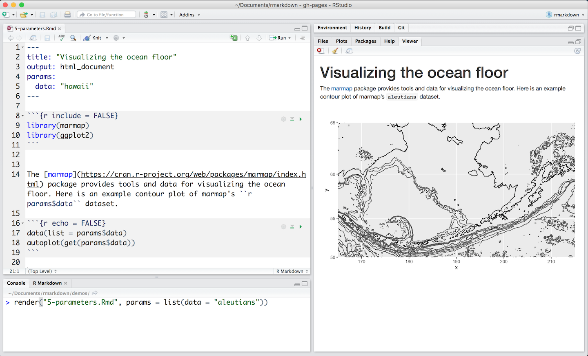

# R Markdown

## Introduction

R Markdown provides an unified authoring framework for data science, combining your code, its results, and your prose commentary. R Markdown documents are fully reproducible and support dozens of output formats, like PDFs, Word files, slideshows, and more. RMarkdown files are designed to be used in two ways:

1.  To produce a final report that you can share with others.

1.  As a notebook, which allows yout to mingle prose, code, and output during 
    your own analyses.

The name R Markdown is slightly misleading because you can use it with other languages, not just R. R Markdown has recently added support for Python and SQL, and that support will improve over time. To use a different language in code chunk, just replace the `r` in  ```` ```{r} ```` with `python` or `sql`. We'll focus on R here, for obvious reasons!

R Markdown integrates a number of R packages and external tools. This means that helps is, by-and-large, not available through `?`. Instead, as you work through chapter, and use R Markdown in the future, keep these resouces close to hand:

* R Markdown Cheat Sheet: *File > Help > Cheatsheets > R Markdown Cheat Sheet*,
* R Markdown Reference Guide: *File > Help > Cheatsheets > R Markdown Reference Guide*.
* Markdown Quick Reference: *File > Help > Markdown Quick Reference*.

You can also download these from <http://rstudio.com/cheatsheets>.

### Prerequisites

You need the __rmarkdown__ package, but you don't need to explicit install it or load it, as RStudio automatically does both when needed.

```{r setup, include = FALSE}
chunk <- "```"
```

## R Markdown basics

This is an R Markdown file, a plain text file that has the extension `.Rmd`:

```{r echo = FALSE, comment = ""}
cat(htmltools::includeText("rmarkdown-demos/1-example.Rmd"))
```

It contains three important types of content:

1.  An (optional) __YAML header__ surrounded by `---`s.
1.  __Chunks__ of R code surrounded by ```` ``` ````.
1.  Text mixed with simple text formatting like `##` and .

When you open an `.Rmd` you get a notebook interface for R. You can run each code chunk by clicking the Run icon (it looks like a play button at the top of the chunk), or by pressing Cmd/Ctrl + Shift + Enter. RStudio executes the code and displays the results inline with your file.

```{r, echo = FALSE, out.width = "100%"}
knitr::include_graphics("screenshots/rmarkdown-notebook.png")
```

To produce a complete report containing all text, code, and results click "Knit" or press Cmd/Ctrl + Shift + K.  You can also do programmatically with `rmarkdown::render("1-example.Rmd")`. For the `.Rmd` above, this creates:

```{r, echo = FALSE, out.width = "100%"}
knitr::include_graphics("screenshots/rmarkdown-report.png")
```

When you __knit__ the document R Markdown sends the .Rmd file to [knitr](http://yihui.name/knitr/), which executes all of the code chunks and creates a new markdown (.md) document which includes the code and its output. The markdown file generated by knitr is then processed by [pandoc](http://pandoc.org/) which is responsible for creating the finished format. The big advantage of this two step workflow is that you can create a very wide range of output formats, as you'll learn about in XYZ.

```{r, echo = FALSE, out.width = "100%"}
knitr::include_graphics("images/RMarkdownFlow.png")
```

To get started with your own `.Rmd` file, select *File > New File > R Markdown...* in the menubar. RStudio will launch a wizard that you can use to pre-populate your file with useful content thatreminds you how the key features of R Markdown work. 

The following sections dives into the three components of an R Markdown document in more details: the code chunks, the text, and the YAML header.

## Code chunks

You can quickly insert code chunks into your file in three ways:

1. The keyboard shortcut Cmd/Ctrl + Alt + I.
2. The Add Chunk icon in the editor toolbar (it looks like a green box with a C in it).
3. By manually typing the chunk delimiters ` ```{r} ` and ` ``` `.

Test code as you write by clicking the "Run Current Chunk"  icons at the top of each chunk, or by pressing Cmd/Ctrl + Shift + Enter (Cmd/Ctrl + Enter still also works if you just want to run a single command). R Markdown will run the code in the chunks in your current environment and display the results in your file editor. To turn off this behavior, click the gear icon at the top of the .Rmd file and select "Chunk Output in the Console." RStudio will then run code chunks at the command line as if your .Rmd file were an R Script.

When you render your .Rmd file, R Markdown will create a fresh environment to run the code chunks in. It will run each chunk, in order, and embed the results beneath the chunk in your final report.

### Chunk name

`setup` chunk will be run automatically by RStudio.  Typically set `include = FALSE`

### Chunk options

Chunk output can be customized with __options__, arguments supplied to chunk header.  Knitr provides almost 60 options that you can use to customize your code chunks. Since the options are not associated with an R function, it can be difficult to figure out where to learn about them. The best place is the knitr options web page at <http://yihui.name/knitr/options/>. You can also find a list of knitr options with concise descriptions in the *R Markdown Reference Guide*, which is available in the RStudio IDE under *Help > Cheatsheets > R Markdown Reference Guide*.

Here are some of the most useful options not listed above.

*   `child = "file.Rmd"` renders a file and inserts the results into the main 
     document at the chunk location.
  
*   `comment = "#>"` changes the prefix to put before each line of output.
  
*   `error = TRUE` causes the render to continue even if code returns an error.
    This is rarely useful for data analysis reports, but it's useful for 
    teaching so that you can illustrate important errors.

### Controlling output
  
*   `eval = FALSE` prevents code from being evaluated. (And obviously if the
     code is not run, no results will be generated). Useful for displaying 
    example code.

*   `include = FALSE` runs the code, but doesn't show the code or results 
    in the final document.

*   `echo = FALSE` prevents code, but not the results from appearing in the 
    finished file. This is a useful way to embed figures.
    
*   `message = FALSE` and `warning = FALSE` prevents messages and warnings 
    generated by code from  appearing in the finished file.

*   `results = 'hide'` prevents the results, but not the code, from 
    appearing in the final document. Knitr still runs the code.

Option             | Run code | Show code | Output | Plots | Messages | Warnings 
-------------------|----------|-----------|--------|-------|----------|---------
`eval = FALSE`     | -        |           | -      | -     | -        | -
`include = FALSE`  |          | -         | -      | -     | -        | -
`echo = FALSE`     |          | -         |        |       |          |
`results = "hide"` |          |           | -      |       |          | 
`fig.show = "hide"`|          |           |        | -     |          |
`message = FALSE`  |          |           |        |       | -        |
`warning = FALSE`  |          |           |        |       |          | -

There are also a rich set of options for controlling how figures embedded. You'll learn about those in [saving your plots].

### Global options

To set global options that apply to every chunk in your file, call `knitr::opts_chunk$set` in a code chunk. When writing books and tutorial I set:

```{r, eval = FALSE}
knitr::opts_chunk$set(
  comment = "#>",
  collapse = TRUE
)
```

This uses my preferred comment formatting, and ensures that the code and output are kept closely entwined.

If you were preparing a report, you might set:

```{r eval = FALSE}
knitr::opts_chunk$set(
  echo = FALSE, 
  cache = TRUE
)
```

You could consider setting `message = FALSE`, `warning = FALSE`, and `results = "hide"` too, but that would make it harder to debug problems because you wouldn't see any messages in the final document.

### Tables

By default, R Markdown displays data frames and matrixes as they would be in the R terminal (in a monospaced font):

```{r}
mtcars[1:5, ]
```

If you prefer that data be displayed with additional formatting you can use the `knitr::kable` function: 

```{r}
knitr::kable(
  mtcars[1:5, ], 
  caption = "A knitr kable."
)
```

Read the documentation at `?knitr::kable` to see the other ways that you can customise the table.

If you'd like to customize your tables at a deeper level, consider the __xtable__, __stargazer__, __pander__, __tables__, and __ascii__ packages. Each provides a set of tools for returning formatted tables from R code.

### Caching

If document rendering becomes time consuming due to long computations, you can use knitr caching to improve performance.  Knitr will save the output of any chunk that contains the option `cache = TRUE` along with a MD5 digest of its contents to a folder alongside your .Rmd file. On subsequent renders, knitr will check the digest to see if the chunk contents have changed. If they have not, knitr will skip the chunk and insert the cached contents. If they have changed (i.e. if the chunk has been modified) Knitr will execute the chunk, embed the results, and save the new results to use for future renders.

Knitr's caching system is straightforward but can become complicated when one code chunk depends on the contents of another. For example, here chunk 2 depends on chunk 1.

    # chunk 1
    `r chunk`{r}
    a <- 1
    `r chunk`
    
    # chunk 2
    `r chunk`{r cached=TRUE}
    a + 1
    `r chunk`

To ensure that caching works properly in this situation, give each chunk a chunk label (Knitr assumes that the first unnamed option in the chunk header is a label). Then set the `dependson` option of the cached chunk.

    # chunk 1
    `r chunk`{r chunk1}
    a <- 1
    `r chunk`
    
    # chunk 2
    `r chunk`{r chunk2, cached = TRUE, dependson = "chunk1"}
    a + 1
    `r chunk`

`dependson` should contain a character vector of *every* chunk that the cached chunk depends on. Knitr will update the results for the cached chunk whenever it detects that one of its dependencies have changed.

## Text formatting

Format the text in your R Markdown files with Markdown, a set of markup annotations for plain text files. When you render your file, Pandoc transforms the marked up text into formatted text in your final file format.  Markdown is designed to be easy to read and easy to write. It is also very easy to learn. The guide below shows how to use Pandoc's Markdown, a slightly extended version of Markdown that R Markdown understands.

```{r, echo = FALSE, comment = ""}
cat(readr::read_file("rmarkdown-demos/markdown.Rmd"))
```

### Inline code

Code results can be inserted directly into the *text* of a .Rmd file by enclosing the code with `` `r `  ``. The [file below](http://github.com/hadley/r4ds/tree/master/rmarkdown-demos/3-inline.Rmd) uses `` `r `  `` twice to call `colorFunc`, which returns "heat.colors." This makes it easy to update the report to refer to another function. 

```{r, echo = FALSE, out.width = "100%"}
knitr::include_graphics("images/inline-1-heat.png")
```

Inline expressions do not take knitr options. When processing inline code, R Markdown will always display the results of inline code, but not the code, and apply relevant text formatting to the results. As a result, inline output is indistinguishable from the surrounding text. 


## YAML header

### Parameters

R Markdown documents can include one or more parameters whose values can be set when you render the report. Parameters are useful when you want to re-render the same report with distinct values for various key inputs, for example, to run:

* a report specific to a department or geographic region.

* a report that covers a specific period in time.

* multiple versions of a report for distinct sets of core assumptions.

To declare one or more parameters for your file, use the `params` field within the YAML header of the document. For example, the [file below](http://github.com/hadley/r4ds/tree/master/rmarkdown-demos/5-parameters.Rmd) uses a `data` parameter that determines which data set to plot.

```{r, echo = FALSE, out.width = "100%"}
knitr::include_graphics("images/params-1-hawaii.png")
```

R Markdown recognizes the atomic data types: numerics, character strings, logicals, etc. You can also pass an R expression as a parameter by prefacing the parameter value with `!R`, e.g.

```{r eval = FALSE}
---
params:
  start: !r lubridate::ymd("2015-01-01")
  snapshot: !r lubridate::ymd_hms("2015-01-01 12:30:00")
---
```

Parameters are available within the knit environment as a read-only list named `params`. To access a parameter in code, call `params$<parameter name>`.

Add a `params` argument to `render()` to create a report that uses a different set of parameter values. Here we modify our report to use the `aleutians` data set with:

```{r eval = FALSE}
render("5-parameters.Rmd", params = list(data = "aleutians"))
```

```{r, echo = FALSE, out.width = "100%"}

```

Better yet, click the "Knit with Parameters" option in the dropdown menu next to the RStudio IDE knit button to set parameters, render, and preview the report in a single user friendly step.

```{r, echo = FALSE, out.width = "100%"}
knitr::include_graphics("images/params-3-florida.png")
```

### Bibliographies and Citations

Pandoc can automatically generate citations and a bibliography in a number of styles. To use this feature, specify a bibliography file using the `bibliography` field in your file's header. The field should contain a filepath from the directory that contains your .Rmd file to the file that contains the bibliography file:

```yaml
---
title: "Markdown Demo"
output: html_document
bibliography: rmarkdown.bib
---
```

You can use any of the following formats: .bib (BibLaTeX), .bibtex (BibTeX), .copac (Copac), .enl (EndNote), .json (JSON citeproc), .medline (MEDLINE), .mods (MODS), .ris (RIS), 
.wos (ISI), .xml (XML).

To create a citation within your .Rmd file, use a key composed of ‘@’ + the citation identifier from the bibliography file. Then place the citation in square brackets. Here are some example citations from rmarkdown.rstudio.com. Notice that you can

* Separate multiple citations with a `;`
* Remove the square brackets to create an in-text citation
* Add a `-` before the citation to supress the author's name

```markdown
Blah blah [see @doe99, pp. 33-35; also @smith04, ch. 1].

Blah blah [@doe99, pp. 33-35, 38-39 and *passim*].

Blah blah [@smith04; @doe99].

@smith04 says blah.

@smith04 [p. 33] says blah.

Smith says blah [-@smith04].
```

When R Markdown renders your file, it will build and append a bibliography to the end of your document. The bibliography will contain each of the cited references from your bibiliography file, but it will not contain a section heading. As a result it is common practice to end your file with a section header for the bibliography, such as `# References` or `# Bibliography`.

You can change the style of your citations and bibliography by adding a CSL 1.0 style file to the `csl` field of your file's header.

```yaml
---
title: "Markdown Demo"
output: html_document
bibliography: rmarkdown.bib
csl: apa.csl
---
```

As with the bibliography field, your csl file should contain a filepath to the file (here I assume that the csl file is in the same directory as the .Rmd file). http://github.com/citation-style-language/styles contains a useful repository of CSL style files.
