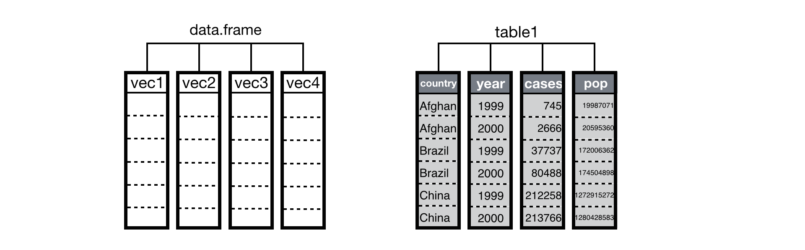
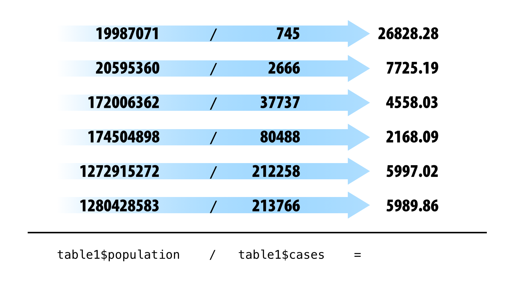
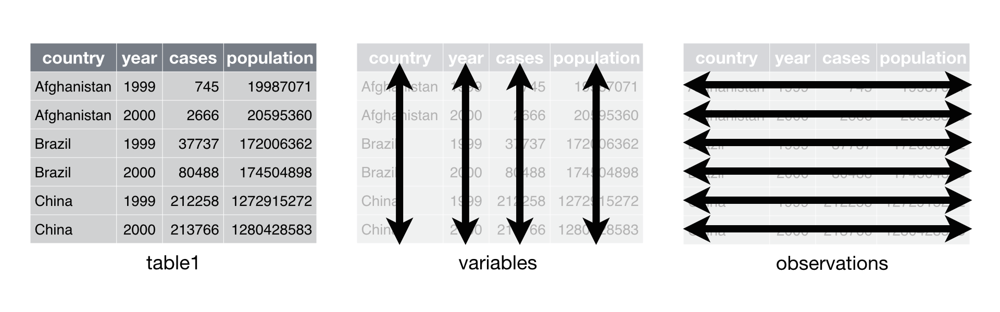
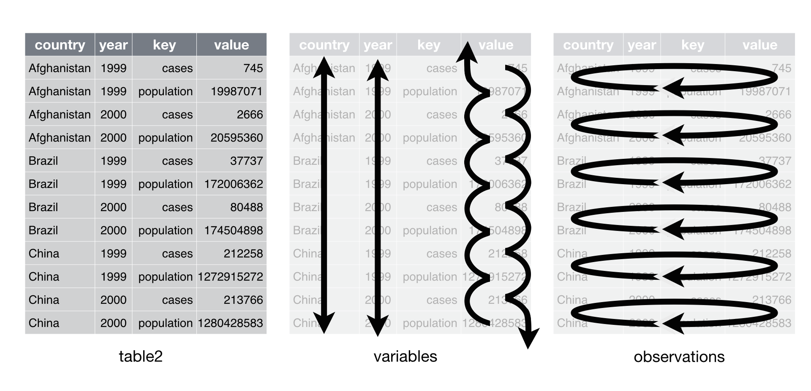
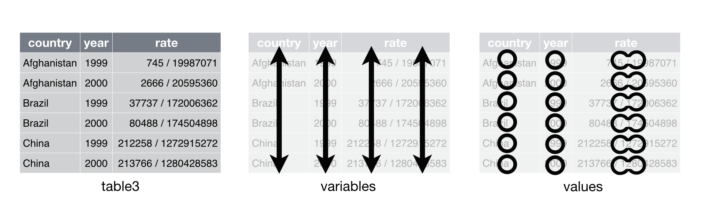
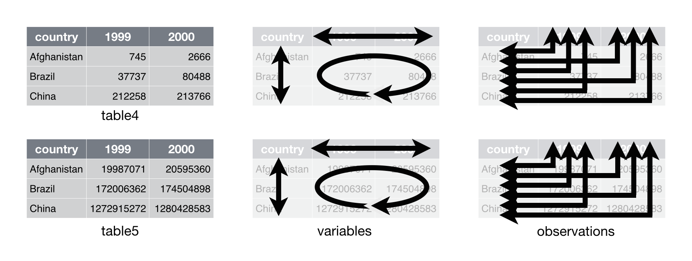

# Tidy data

> "Tidy datasets are all alike but every messy dataset is messy in its
> own way." --– Hadley Wickham

Data science, at its heart, is a computer programming exercise. Data scientists use computers to store, transform, visualize, and model their data. Each computer program will expect your data to be organized in a predetermined way, which may vary from program to program. To be an effective data scientist, you will need to be able to reorganize your data to match the format required by your program.

In this chapter, you will learn the best way to organize your data for R, a task that we call data tidying. Tidying your data will save you hours of time and make your data much easier to visualize, transform, and model with R.

Note that this chapter explains how to change the format, or layout, of tabular data. You will learn how to use different file formats with R in the next chapter, Import Data.

## Outline

In *Section 4.1*, you will learn how the features of R determine the best way to layout your data. This section introduces "tidy data," a way to organize your data that works particularly well with R.

*Section 4.2* teaches the basic method for making untidy data tidy. In this section, you will learn how to reorganize the values in your dataset with the `spread()` and `gather()` functions of the `tidyr` package.

*Section 4.3* explains how to split apart and combine values in your dataset to make them easier to access with R.

*Section 4.4* concludes the chapter, combining everything you've learned about `tidyr` to tidy a real dataset on tuberculosis epidemiology collected by the *World Health Organization*.

## Prerequisites

```{r message=FALSE}
library(tidyr)
library(dplyr)
```

## Tidy data

You can organize tabular data in many ways. For example, the datasets below show the same data organized in four different ways. Each dataset shows the same values of four variables *country*, *year*, *population*, and *cases*, but each dataset organizes the values into a different layout . You can access the datasets in tidyr.

```{r}
# dataset one
table1

# dataset two
table2

# dataset three
table3
```

The last dataset is a collection of two tables.

```{r}
# dataset four
table4  # cases
table5  # population
```

You might think that these datasets are interchangeable since they display the same information, but one dataset will be much easier to work with in R than the others.

Why should that be?

R follows a set of conventions that makes one layout of tabular data much easier to work with than others. Your data will be easier to work with in R if it follows three rules

1.  Each variable in the dataset is placed in its own column
2.  Each observation is placed in its own row
3.  Each value is placed in its own cell\*

Data that satisfies these rules is known as *tidy data*. Notice that `table1` is tidy data.

```{r, echo = FALSE}
knitr::include_graphics("images/tidy-1.png")
```

*In `table1`, each variable is placed in its own column, each observation in its own row, and each value in its own cell.*

Tidy data builds on a premise of data science that datasets contain *both values and relationships*. Tidy data displays the relationships in a dataset as consistently as it displays the values in a dataset.

At this point, you might think that tidy data is so obvious that it is trivial. Surely, most datasets come in a tidy format, right? Wrong. In practice, raw data is rarely tidy and is much harder to work with as a result. *Section 2.4* provides a realistic example of data collected in the wild.

Tidy data works well with R because it takes advantage of R's traits as a vectorized programming language. Data structures in R are organized around vectors, and R's functions are optimized to work with vectors. Tidy data takes advantage of both of these traits.

Tidy data arranges values so that the relationships between variables in a dataset will parallel the relationship between vectors in R's storage objects. R stores tabular data as a data frame, a list of atomic vectors arranged to look like a table. Each column in the table is an atomic vector in the list. In tidy data, each variable in the dataset is assigned to its own column, i.e., its own vector in the data frame.

```{r, echo = FALSE}

```

*A data frame is a list of vectors that R displays as a table. When your data is tidy, the values of each variable fall in their own column vector.*

As a result, you can extract all the values of a variable in a tidy dataset by extracting the column vector that contains the variable. You can do this easily with R's list syntax, i.e.

```{r}
table1$cases
```

R will return the values as an atomic vector, one of the most versatile data structures in R. Many functions in R are written to take atomic vectors as input, as are R's mathematical operators. This adds up to an easy user experience; you can extract and manipulate the values of a variable in tidy data with concise, simple code, e.g.,

```{r}
mean(table1$cases)
table1$cases / table1$population * 10000
```

Tidy data also takes advantage of R's vectorized operations. In R, you often supply one or more vectors of values as input to a function or mathematical operator. Often, the function or operator will use the vectors to create a new vector of values as output, e.g.

```{r eval = FALSE}
table1$population # a vector
table1$cases # a vector

# people per case
table1$population / table1$cases # a vector of output
```

```{r echo = FALSE}
table1$population / table1$cases
```

To create the output, R applies the function in element-wise fashion: R first applies the function (or operation) to the first elements of each vector involved. Then R applies the function (or operation) to the second elements of each vector involved, and so on until R reaches the end of the vectors. If one vector is shorter than the others, R will recycle its values as needed (according to a set of recycling rules).

```{r, echo = FALSE}

```

If your data is tidy, element-wise execution will ensure that observations are preserved across functions and operations. Each value will only be paired with other values that appear in the same row of the data frame. In a tidy data frame, these values will be values of the same observation.

Do these small advantages matter in the long run? Yes. Consider what it would be like to do a simple calculation with each of the datasets from the start of this section.

Assume that in these datasets, `cases` refers to the number of people diagnosed with TB per country per year. To calculate the *rate* of TB cases per country per year (i.e, the number of people per 10,000 diagnosed with TB), you will need to do four operations with the data. You will need to:

1.  Extract the number of TB cases per country per year
2.  Extract the population per country per year (in the same order as
    above)
3.  Divide cases by population
4.  Multiply by 10000

If you use basic R syntax, your calculations will look like the code below. If you'd like to brush up on basic R syntax, see Appendix A: Getting Started.

#### Dataset one

```{r, echo = FALSE}

```

Since `table1` is organized in a tidy fashion, you can calculate the rate like this,

```{r eval = FALSE}
# Dataset one
table1$cases / table1$population * 10000
```

#### Dataset two

```{r, echo = FALSE}

```

Dataset two intermingles the values of *population* and *cases* in the same column, *value*. As a result, you will need to untangle the values whenever you want to work with each variable separately.

You'll need to perform an extra step to calculate the rate.

```{r eval = FALSE}
# Dataset two
case_rows <- c(1, 3, 5, 7, 9, 11, 13, 15, 17)
pop_rows <- c(2, 4, 6, 8, 10, 12, 14, 16, 18)
table2$value[case_rows] / table2$value[pop_rows] * 10000
```

#### Dataset three

```{r, echo = FALSE}

```

Dataset three combines the values of cases and population into the same cells. It may seem that this would help you calculate the rate, but that is not so. You will need to separate the population values from the cases values if you wish to do math with them. This can be done, but not with "basic" R syntax.

```{r eval = FALSE}
# Dataset three
# No basic solution
```

#### Dataset four

```{r, echo = FALSE}

```

Dataset four stores the values of each variable in a different format: as a column, a set of column names, or a field of cells. As a result, you will need to work with each variable differently. This makes code written for dataset four hard to generalize. The code that extracts the values of *year*, `names(table4)[-1]`, cannot be generalized to extract the values of population, `c(table5$1999, table5$2000, table5$2001)`. Compare this to dataset one. With `table1`, you can use the same code to extract the values of year, `table1$year`, that you use to extract the values of population. To do so, you only need to change the name of the variable that you will access: `table1$population`.

The organization of dataset four is inefficient in a second way as well. Dataset four separates the values of some variables across two separate tables. This is inconvenient because you will need to extract information from two different places whenever you want to work with the data.

After you collect your input, you can calculate the rate.

```{r eval = FALSE}
# Dataset four
cases <- c(table4$1999, table4$2000, table4$2001)
population <- c(table5$1999, table5$2000, table5$2001)
cases / population * 10000
```

Dataset one, the tidy dataset, is much easier to work with than with datasets two, three, or four. To work with datasets two, three, and four, you need to take extra steps, which makes your code harder to write, harder to understand, and harder to debug.

Keep in mind that this is a trivial calculation with a trivial dataset. The energy you must expend to manage a poor layout will increase with the size of your data. Extra steps will accumulate over the course of an analysis and allow errors to creep into your work. You can avoid these difficulties by converting your data into a tidy format at the start of your analysis.

The next sections will show you how to transform untidy datasets into tidy datasets.

Tidy data was popularized by Hadley Wickham, and it serves as the basis for many R packages and functions. You can learn more about tidy data by reading *Tidy Data* a paper written by Hadley Wickham and published in the Journal of Statistical Software. *Tidy Data* is available online at [www.jstatsoft.org/v59/i10/paper](http://www.jstatsoft.org/v59/i10/paper).

##  `spread()` and `gather()`

The `tidyr` package by Hadley Wickham is designed to help you tidy your data. It contains four functions that alter the layout of tabular datasets, while preserving the values and relationships contained in the datasets.

The two most important functions in `tidyr` are `gather()` and `spread()`. Each relies on the idea of a key value pair.

### key value pairs

A key value pair is a simple way to record information. A pair contains two parts: a *key* that explains what the information describes, and a *value* that contains the actual information. So for example, this would be a key value pair:

    Password: 0123456789

`0123456789` is the value, and it is associated with the key `Password`.

Data values form natural key value pairs. The value is the value of the pair and the variable that the value describes is the key. So for example, you could decompose `table1` into a group of key value pairs, like this:

    Country: Afghanistan
    Country: Brazil
    Country: China
    Year: 1999
    Year: 2000
    Year: 2001
    Population:   19987071
    Population:   20595360
    Population:  172006362
    Population:  174504898
    Population: 1272915272
    Population: 1280428583
    Cases:    745
    Cases:   2666
    Cases:  37737
    Cases:  80488
    Cases: 212258
    Cases: 213766

However, the key value pairs would cease to be a useful dataset because you no longer know which values belong to the same observation.

Every cell in a table of data contains one half of a key value pair, as does every column name. In tidy data, each cell will contain a value and each column name will contain a key, but this doesn't need to be the case for untidy data. Consider `table2`.

```{r}
table2
```

In `table2`, the `key` column contains only keys (and not just because the column is labeled `key`). Conveniently, the `value` column contains the values associated with those keys.

You can use the `spread()` function to tidy this layout.

### `spread()`

`spread()` turns a pair of key:value columns into a set of tidy columns. To use `spread()`, pass it the name of a data frame, then the name of the key column in the data frame, and then the name of the value column. Pass the column names as they are; do not use quotes.

To tidy `table2`, you would pass `spread()` the `key` column and then the `value` column.

```{r}
spread(table2, key, value)
```

`spread()` returns a copy of your dataset that has had the key and value columns removed. In their place, `spread()` adds a new column for each unique key in the key column. These unique keys will form the column names of the new columns. `spread()` distributes the cells of the former value column across the cells of the new columns and truncates any non-key, non-value columns in a way that prevents duplication.

```{r, echo = FALSE}
knitr::include_graphics("images/tidy-8.png")
```

*`spread()` distributes a pair of key:value columns into a field of cells. The unique keys in the key column become the column names of the field of cells.*

You can see that `spread()` maintains each of the relationships expressed in the original dataset. The output contains the four original variables, *country*, *year*, *population*, and *cases*, and the values of these variables are grouped according to the original observations. As a bonus, now the layout of these relationships is tidy.

`spread()` takes three optional arguments in addition to `data`, `key`, and `value`:

-   **`fill`** - If the tidy structure creates combinations of variables that do not exist in the original dataset, `spread()` will place an `NA` in the resulting cells. `NA` is R's missing value symbol. You can change this behaviour by passing `fill` an alternative value to use.

-   **`convert`** - If a value column contains multiple types of data, its elements will be saved as a single type, usually character strings. As a result, the new columns created by `spread()` will also contain character strings. If you set `convert = TRUE`, `spread()` will run `type.convert()` on each new column, which will convert strings to doubles (numerics), integers, logicals, complexes, or factors if appropriate.

-   **`drop`** - The `drop` argument controls how `spread()` handles factors in the key column. If you set `drop = FALSE`, spread will keep factor levels that do not appear in the key column, filling in the missing combinations with the value of `fill`.

### `gather()`

`gather()` does the reverse of `spread()`. `gather()` collects a set of column names and places them into a single "key" column. It also collects the field of cells associated with those columns and places them into a single value column. You can use `gather()` to tidy `table4`.

```{r}
table4  # cases
```

To use `gather()`, pass it the name of a data frame to reshape. Then pass `gather()` a character string to use for the name of the "key" column that it will make, as well as a character string to use as the name of the value column that it will make. Finally, specify which columns `gather()` should collapse into the key value pair (here with integer notation).

```{r}
gather(table4, "year", "cases", 2:3)
```

`gather()` returns a copy of the data frame with the specified columns removed. To this data frame, `gather()` has added two new columns: a "key" column that contains the former column names of the removed columns, and a value column that contains the former values of the removed columns. `gather()` repeats each of the former column names (as well as each of the original columns) to maintain each combination of values that appeared in the original dataset. `gather()` uses the first string that you supplied as the name of the new "key" column, and it uses the second string as the name of the new value column. In our example, these were the strings "year" and "cases."

We've placed "key" in quotation marks because you will usually use `gather()` to create tidy data. In this case, the "key" column will contain values, not keys. The values will only be keys in the sense that they were formally in the column names, a place where keys belong.

```{r, echo = FALSE}
knitr::include_graphics("images/tidy-9.png")
```

Just like `spread()`, gather maintains each of the relationships in the original dataset. This time `table4` only contained three variables, *country*, *year* and *cases*. Each of these appears in the output of `gather()` in a tidy fashion.

`gather()` also maintains each of the observations in the original dataset, organizing them in a tidy fashion.

We can use `gather()` to tidy `table5` in a similar fashion.

```{r}
table5  # population
gather(table5, "year", "population", 2:3)
```

In this code, I identified the columns to collapse with a series of integers. `2:3` describes the second and third columns of the data frame. You can identify the same columns with each of the commands below.

```{r eval = FALSE}
gather(table5, "year", "population", c(2, 3))
gather(table5, "year", "population", -1)
```

You can also identify columns by name with the notation introduced by the `select` function in `dplyr`, see Section 3.1.

You can easily combine the new versions of `table4` and `table5` into a single data frame because the new versions are both tidy. To combine the datasets, use the `left_join()` function from Section 3.6.

```{r}
tidy4 <- gather(table4, "year", "cases", 2:3)
tidy5 <- gather(table5, "year", "population", 2:3)
left_join(tidy4, tidy5)
```

## `separate()` and `unite()`

You may have noticed that we skipped `table3` in the last section. `table3` is untidy too, but it cannot be tidied with `gather()` or `spread()`. To tidy `table3`, you will need two new functions, `separate()` and `unite()`.

`separate()` and `unite()` help you split and combine cells to place a single, complete value in each cell.

### `separate()`

`separate()` turns a single character column into multiple columns by splitting the values of the column wherever a separator character appears.


So, for example, we can use `separate()` to tidy `table3`, which combines values of *cases* and *population* in the same column.

```{r}
table3
```

To use `separate()` pass separate the name of a data frame to reshape and the name of a column to separate. Also give `separate()` an `into` argument, which should be a vector of character strings to use as new column names. `separate()` will return a copy of the data frame with the untidy column removed. The previous values of the column will be split across several columns, one for each name in `into`.

```{r}
separate(table3, rate, into = c("cases", "population"))
```

By default, `separate()` will split values wherever a non-alphanumeric character appears. Non-alphanumeric characters are characters that are neither a number nor a letter. For example, in the code above, `separate()` split the values of `rate` at the forward slash characters.

If you wish to use a specific character to separate a column, you can pass the character to the `sep` argument of `separate()`. For example, we could rewrite the code above as

```{r eval=FALSE}
separate(table3, rate, into = c("cases", "population"), sep = "/")
```

You can also pass an integer or vector of integers to `sep`. `separate()` will interpret the integers as positions to split at. Positive values start at 1 on the far-left of the strings; negative value start at -1 on the far-right of the strings. When using integers to separate strings, the length of `sep` should be one less than the number of names in `into`. You can use this arrangement to separate the last two digits of each year.

```{r}
separate(table3, year, into = c("century", "year"), sep = 2)
```

You can further customize `separate()` with the `remove`, `convert`, and `extra` arguments:

-   **`remove`** - Set `remove = FALSE` to retain the column of values that were separated in the final data frame.
-   **`convert`** - By default, `separate()` will return new columns as character columns. Set `convert = TRUE` to convert new columns to double (numeric), integer, logical, complex, and factor columns with `type.convert()`.
-   **`extra`** - `extra` controls what happens when the number of new values in a cell does not match the number of new columns in `into`. If `extra = error` (the default), `separate()` will return an error. If `extra = drop`, `separate()` will drop new values and supply `NA`s as necessary to fill the new columns. If `extra = merge`, `separate()` will split at most `length(into)` times.

### `unite()`

`unite()` does the opposite of `separate()`: it combines multiple columns into a single column.


We can use `unite()` to rejoin the *century* and *year* columns that we created in the last example. That data is saved as `tidyr::table6`.

```{r}
table6
```

Give `unite()` the name of the data frame to reshape, the name of the new column to create (as a character string), and the names of the columns to unite. `unite()` will place an underscore (\_) between values from separate columns. If you would like to use a different separator, or no separator at all, pass the separator as a character string to `sep`.

```{r}
unite(table6, "new", century, year, sep = "")
```

`unite()` returns a copy of the data frame that includes the new column, but not the columns used to build the new column. If you would like to retain these columns, add the argument `remove = FALSE`.

You can also use integers or the syntax of the `dplyr::select()` function to specify columns to unite in a more concise way.

## Case Study

The `who` dataset in tidyr contains cases of tuberculosis (TB) reported between 1995 and 2013 sorted by country, age, and gender. The data comes in the *2014 World Health Organization Global Tuberculosis Report*, available for download at [www.who.int/tb/country/data/download/en/](http://www.who.int/tb/country/data/download/en/). The data provides a wealth of epidemiological information, but it would be difficult to work with the data as it is.

```{r}
who
```

`who` provides a realistic example of tabular data in the wild. It contains redundant columns, odd variable codes, and many missing values. In short, `who` is messy.

------------------------------------------------------------------------

*TIP*

The `View()` function opens a data viewer in the RStudio IDE. Here you can examine the dataset, search for values, and filter the display based on logical conditions. Notice that the `View()` function begins with a capital V.

------------------------------------------------------------------------

The most unique feature of `who` is its coding system. Columns five through sixty encode four separate pieces of information in their column names:

1.  The first three letters of each column denote whether the column contains new or old cases of TB. In this dataset, each column contains new cases.

2.  The next two letters describe the type of case being counted. We will treat each of these as a separate variable.
    -   `rel` stands for cases of relapse
    -   `ep` stands for cases of extrapulmonary TB
    -   `sn` stands for cases of pulmonary TB that could not be diagnosed by a pulmonary smear (smear negative)
    -   `sp` stands for cases of pulmonary TB that could be diagnosed be a pulmonary smear (smear positive)

3.  The sixth letter describes the sex of TB patients. The dataset groups cases by males (`m`) and females (`f`).

4.  The remaining numbers describe the age group of TB patients. The dataset groups cases into seven age groups:
    -   `014` stands for patients that are 0 to 14 years old
    -   `1524` stands for patients that are 15 to 24 years old
    -   `2534` stands for patients that are 25 to 34 years old
    -   `3544` stands for patients that are 35 to 44 years old
    -   `4554` stands for patients that are 45 to 54 years old
    -   `5564` stands for patients that are 55 to 64 years old
    -   `65` stands for patients that are 65 years old or older

Notice that the `who` dataset is untidy in multiple ways. First, the data appears to contain values in its column names, coded values such as male, relapse, and 0 - 14 years of age. We can move the names into their own column with `gather()`. This will make it easy to separate the values combined in each column name.

```{r}
who <- gather(who, "code", "value", 5:60)
who
```

We can separate the values in each code with two passes of `separate()`. The first pass will split the codes at each underscore.

```{r}
who <- separate(who, code, c("new", "var", "sexage"))
who
```

The second pass will split `sexage` after the first character to create two columns, a sex column and an age column.

```{r}
who <- separate(who, sexage, c("sex", "age"), sep = 1)
who
```

The `rel`, `ep`, `sn`, and `sp` keys are all contained in the same column. We can now move the keys into their own column names with `spread()`.

```{r}
who <- spread(who, var, value)
who
```

The `who` dataset is now tidy. It is far from sparkling (for example, it contains several redundant columns and many missing values), but it will now be much easier to work with in R.
