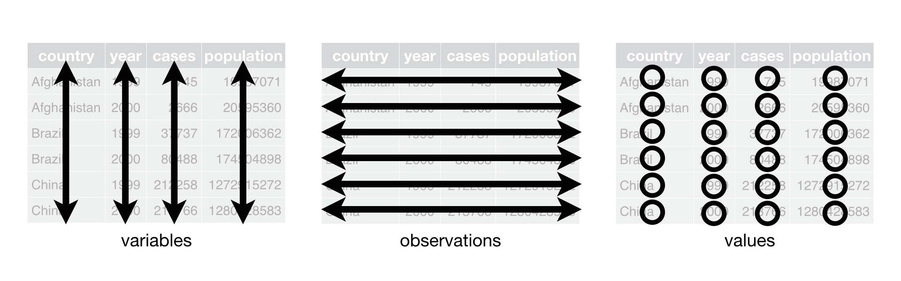
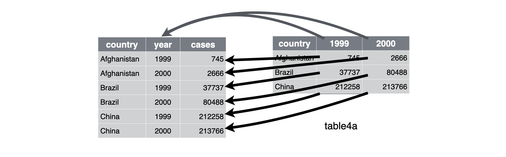
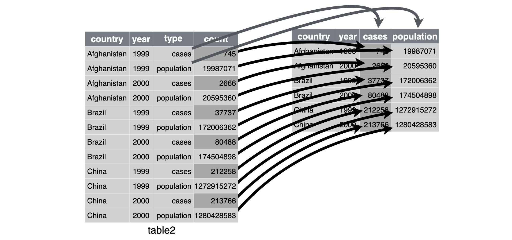
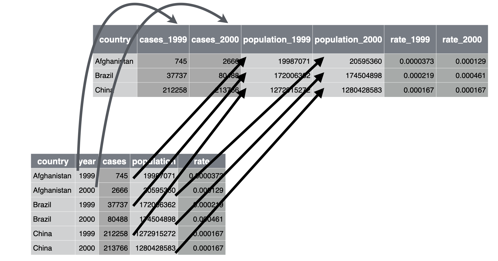
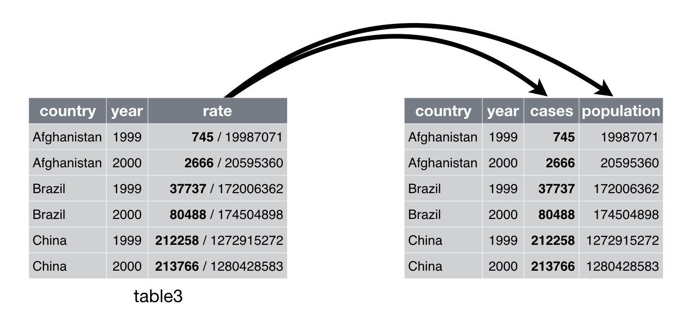
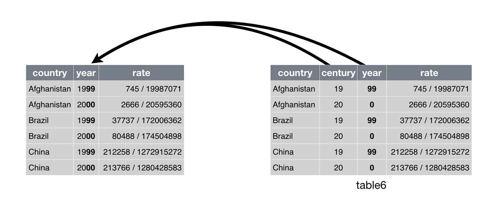

# Tidy data

## Introduction

> "Happy families are all alike; every unhappy family is unhappy in its
> own way." --– Leo Tolstoy

> "Tidy datasets are all alike, but every messy dataset is messy in its
> own way." --– Hadley Wickham

In this chapter, you will learn a consistent way to organise your data in R, an organisation called __tidy data__. Getting your data into this format requires some upfront work, but that work pays off in the long term. Once you have tidy data and the tidy tools provided by packages in the tidyverse, you will spend much less time munging data from one representation to another, allowing you to spend more time on the analytic questions at hand.

This chapter will give you a practical introduction to tidy data and the accompanying tools in the __tidyr__ package. If you'd like to learn more about the underlying theory, you might enjoy the *Tidy Data* paper published in the Journal of Statistical Software, <http://www.jstatsoft.org/v59/i10/paper>.

### Prerequisites

In this chapter we'll focus on tidyr, a package that provides a bunch of tools to help tidy up your messy datasets. tidyr is a member of the core tidyverse.

```{r setup, message = FALSE}
library(tidyverse)
```

## Tidy data

You can represent the same underlying data in multiple ways. The example below shows the same data organised in four different ways. Each dataset shows the same values of four variables *country*, *year*, *population*, and *cases*, but each dataset organises the values in a different way.

```{r}
table1
table2
table3

# Spread across two tibbles
table4a  # cases
table4b  # population
```

These are all representations of the same underlying data, but they are not equally easy to use. One dataset, the tidy dataset, will be much easier to work with inside the tidyverse. 

There are three interrelated rules which make a dataset tidy:

1.  Each variable must have its own column.
1.  Each observation must have its own row.
1.  Each value must have its own cell.

Figure \@ref(fig:tidy-structure) shows the rules visually.

```{r tidy-structure, echo = FALSE, out.width = "100%", fig.cap = "Following three rules makes a dataset tidy: variables are in columns, observations are in rows, and values are in cells.", fig.alt = "Three panels, each representing a tidy data frame. The first panel shows that each variable has its own column. The second panel shows that each observation has its own row. The third panel shows that each value has its own cell."}

```

These three rules are interrelated because it's impossible to only satisfy two of the three. That interrelationship leads to an even simpler set of practical instructions:

1.  Put each dataset in a tibble.
1.  Put each variable in a column.

In this example, only `table1` is tidy. It's the only representation where each column is a variable.

Why ensure that your data is tidy? There are two main advantages:

1.  There's a general advantage to picking one consistent way of storing
    data. If you have a consistent data structure, it's easier to learn the
    tools that work with it because they have an underlying uniformity.
    
1.  There's a specific advantage to placing variables in columns because
    it allows R's vectorised nature to shine. As you learned in 
    Sections \@ref(mutate-funs) and \@ref(summarise-funs), most 
    built-in R functions work with vectors of values. That makes transforming 
    tidy data feel particularly natural.

dplyr, ggplot2, and all the other packages in the tidyverse are designed to work with tidy data. Here are a couple of small examples showing how you might work with `table1`.

```{r fig.width = 5, fig.alt = "This figure shows the numbers of cases in 1999 and 2000 for Afghanistan, Brazil, and China, with year on the x-axis and number of cases on the y-axis. Each point on the plot represents the number of cases in a given country in a given year. The points for each country are differentiated from others by color and shape and connected with a line, resulting in three, non-parallel, non-intersecting lines. The numbers of cases in China are highest for both 1999 and 2000, with values above 200,000 for both years. The number of cases in Brazil is approximately 40,000 in 1999 and approximately 75,000 in 2000. The numbers of cases in Afghanistan are lowest for both 1999 and 2000, with values that appear to be very close to 0 on this scale."}
# Compute rate per 10,000
table1 %>% 
  mutate(rate = cases / population * 10000)

# Compute cases per year
table1 %>% 
  count(year, wt = cases)

# Visualise changes over time
ggplot(table1, aes(year, cases)) + 
  geom_line(aes(group = country), colour = "grey50") + 
  geom_point(aes(colour = country, shape = country)) +
  scale_x_continuous(breaks = c(1999, 2000))
```

### Exercises

1.  Using prose, describe how the variables and observations are organised in
    each of the sample tables.

1.  Compute the `rate` for `table2`, and `table4a` + `table4b`. 
    You will need to perform four operations:

    1.  Extract the number of TB cases per country per year.
    1.  Extract the matching population per country per year.
    1.  Divide cases by population, and multiply by 10000.
    1.  Store back in the appropriate place.
    
    Which representation is easiest to work with? Which is hardest? Why?

1.  Recreate the plot showing change in cases over time using `table2`
    instead of `table1`. What do you need to do first?

## Pivoting

The principles of tidy data seem so obvious that you might wonder if you'll ever encounter a dataset that isn't tidy. Unfortunately, however, most data that you will encounter will be untidy. There are two main reasons:

1.  Most people aren't familiar with the principles of tidy data, and it's hard
    to derive them yourself unless you spend a _lot_ of time working with data.
    
1.  Data is often organised to facilitate some use other than analysis. For 
    example, data is often organised to make entry as easy as possible.
    
This means for most real analyses, you'll need to do some tidying. The first step is always to figure out what the variables and observations are. Sometimes this is easy; other times you'll need to consult with the people who originally generated the data. 
The second step is to resolve one of two common problems:

1. One variable might be spread across multiple columns.

1. One observation might be scattered across multiple rows.

Typically a dataset will only suffer from one of these problems; it'll only suffer from both if you're really unlucky! To fix these problems, you'll need the two most important functions in tidyr: `pivot_longer()` and `pivot_wider()`.

### Longer

A common problem is a dataset where some of the column names are not names of variables, but _values_ of a variable. Suppose you have your data in the following format.

```{r}
table4a
```

And you want to create the following visualisation where each line represents a `country`, `year` is on the x-axis, `cases` are on the y-axis, and you automatically get the legend that indicates which line represents which country.

```{r tidy-pivot-longer-plot-lines, fig.width = 5, echo = FALSE, fig.cap = "Number of cases over the years for each country.", fig.alt = "This figure shows the numbers of cases in 1999 and 2000 for Afghanistan, Brazil, and China, with year on the x-axis and number of cases on the y-axis. Each point on the plot represents the number of cases in a given country in a given year. The points for each country are differentiated from others by color and shape and connected with a line, resulting in three, non-parallel, non-intersecting lines. The numbers of cases in China are highest for both 1999 and 2000, with values above 200,000 for both years. The number of cases in Brazil is approximately 40,000 in 1999 and approximately 75,000 in 2000. The numbers of cases in Afghanistan are lowest for both 1999 and 2000, with values that appear to be very close to 0 on this scale."}
table4a %>%
  pivot_longer(
    cols = c(`1999`, `2000`),
    names_to = "year",
    names_transform = list(year = as.integer),
    values_to = "cases",
  ) %>%
  ggplot(aes(x = year, y = cases)) +
  geom_line(aes(group = country), colour = "grey50") + 
  geom_point(aes(colour = country, shape = country)) +
  scale_x_continuous(breaks = c(1999, 2000))
```

It's most straight-forward to do this starting with a data frame where `country`, `year`, and `cases` are the columns and each row represents a record from a country for a particular year.

```{r echo = FALSE}
table4a %>%
  pivot_longer(
    cols = c(`1999`, `2000`),
    names_to = "year",
    names_transform = list(year = as.integer),
    values_to = "cases"
  )
```

However in `table4a` the column names `1999` and `2000` represent values of the `year` variable, the values in the `1999` and `2000` columns represent values of the `cases` variable, and each row represents two observations, not one.

To tidy a dataset like this, we need to __pivot__ the offending columns into a new pair of variables. To describe that operation we need three parameters:

* The set of columns whose names are values, not variables. In this example, 
  those are the columns `1999` and `2000`.

* The name of the variable to move the column names to: `year`.

* The name of the variable to move the column values to: `cases`.
  
Together those parameters generate the call to `pivot_longer()`:

```{r}
table4a %>%
  pivot_longer(
    cols = c(`1999`, `2000`),
    names_to = "year",
    values_to = "cases"
  )
```

The columns to pivot are specified with `dplyr::select()` style notation in the `cols` argument. Here there are only two columns, so we list them individually. Note that `1999` and `2000` are non-syntactic names (because they don't start with a letter) so we have to surround them in backticks. To refresh your memory of the other ways to select columns, see Section \@ref(select).

`year` and `cases` do not exist in `table4a` so we put their names in quotes in `names_to` and `values_to` arguments, respectively.

In the final result, the pivoted columns are dropped, and we get new `year` and `cases` columns. Otherwise, the relationships between the original variables are preserved. Visually, this is shown in Figure \@ref(fig:tidy-pivot-longer). 

```{r tidy-pivot-longer, echo = FALSE, out.width = "100%", fig.cap = "Pivoting `table4a` into a \"longer\", tidy form.", fig.alt = "Two panels, one with a longer and the other with a wider data frame. Arrows represent how values in the 1999 and 2000 columns of the wider data frame are pivoted to a column named cases in the longer data frame and how column names from the wider data frame (1999 and 2000) are pivoted into column names in the longer data frame."}

```

There is still one issue though. Take a peek at the type of the `year` variable. We would expect `year` to be numeric (or specifically, we would expect it to be an integer), however it's showing up as a character. This is because the values in the `year` variable came from column headings in `table4a`. We can transform the type of this variable as we're pivoting the data using the `names_transform` argument in `pivot_longer()`. In this case we don't also need to transform the type of the `cases` variable, but if we did, we could simply add that to the list in `names_transform` as well.

```{r}
table4a %>%
  pivot_longer(
    cols = c(`1999`, `2000`),
    names_to = "year",
    names_transform = list(year = as.integer),
    values_to = "cases"
  )
```

Once we have our data in this longer format, we can create the visualisation that motivated this tidying exercise as follows.

```{r ref.label = "tidy-pivot-longer-plot-lines", fig.alt = "Number of cases over the years for each country.", fig.alt = "This figure shows the numbers of cases in 1999 and 2000 for Afghanistan, Brazil, and China, with year on the x-axis and number of cases on the y-axis. Each point on the plot represents the number of cases in a given country in a given year. The points for each country are differentiated from others by color and shape and connected with a line, resulting in three, non-parallel, non-intersecting lines. The numbers of cases in China are highest for both 1999 and 2000, with values above 200,000 for both years. The number of cases in Brazil is approximately 40,000 in 1999 and approximately 75,000 in 2000. The numbers of cases in Afghanistan are lowest for both 1999 and 2000, with values that appear to be very close to 0 on this scale."}
```

`pivot_longer()` makes datasets longer by increasing the number of rows and decreasing the number of columns. I don't believe it makes sense to describe a dataset as being in “long form”. Length is a relative term, and you can only say (e.g.) that dataset A is longer than dataset B.

We can use `pivot_longer()` to tidy `table4b` in a similar fashion. The only difference is the variable stored in the cell values:

```{r}
table4b %>% 
  pivot_longer(
    cols = c(`1999`, `2000`), 
    names_to = "year", 
    names_transform = list(year = as.integer),
    values_to = "population"
    )
```

To combine the tidied versions of `table4a` and `table4b` into a single tibble, we need to use `dplyr::left_join()`, which you'll learn about in [relational data].

```{r}
tidy4a <- table4b %>% 
  pivot_longer(
    cols = c(`1999`, `2000`), 
    names_to = "year", 
    names_transform = list(year = as.integer),
    values_to = "cases"
    )
tidy4b <- table4b %>% 
  pivot_longer(
    cols = c(`1999`, `2000`), 
    names_to = "year", 
    names_transform = list(year = as.integer),
    values_to = "population"
    )
left_join(tidy4a, tidy4b)
```

### Wider

`pivot_wider()` is the opposite of `pivot_longer()`. You use it when an observation is scattered across multiple rows. For example, take `table2`: an observation is a country in a year, but each observation is spread across two rows.

```{r}
table2
```

Suppose you'd like to calculate the `rate` (number of `cases` divided by `population`) for each country in a given year, and record it as a new column, resulting in the following data frame.

```{r tidy-pivot-wider-case-ratio, echo = FALSE}
table2 %>%
  pivot_wider(names_from = type, values_from = count) %>% 
  mutate(rate = cases / population)
```

This means we need a data frame with `cases` and `population` as separate columns, and in those columns, each cell will hold the values of the relevant `count`s. Let's analyse the representation in similar way to `pivot_longer()`. This time, however, we only need two parameters:

* The column to take variable names from: `type`.

* The column to take values from: `count`.

We can use `pivot_wider()`, as shown programmatically below, and visually in Figure \@ref(fig:tidy-pivot-wider).

```{r}
table2 %>%
  pivot_wider(names_from = type, values_from = count)
```

```{r tidy-pivot-wider, echo = FALSE, out.width = "100%", fig.cap = "Pivoting `table2` into a \"wider\", tidy form.", fig.alt = "Two panels, one with a longer and the other with a wider data frame. Arrows represent how values in the count column of the longer data frame are pivoted to two columns named cases and population in the wider data frame as well as how values in the type column of the longer data (cases and population) frame are pivoted into column names in the wider data frame."}

```

Once we have our data in this wider format, we can create the data frame that motivated this tidying exercise as follows.

```{r ref.label = "tidy-pivot-wider-case-ratio"}
```

Earlier we visualised case counts over the years, and this representation can be useful for visualising case rates, for example.

```{r, fig.alt = "This figure shows the case rate in 1999 and 2000 for Afghanistan, Brazil, and China, with year on the x-axis and number of cases on the y-axis. Each point on the plot represents the case rate in a given country in a given year. The points for each country are differentiated from others by color and shape and connected with a line, resulting in three, non-parallel, non-intersecting lines. The case rates in Brazil are highest for both 1999 and 2000; approximately 0.0002 in 1999 and approximately 0.00045 in 2000. The case rates in China are slightly below 0.0002 in both 1999 and 2000. The case rates in Afghanistan are lowest for both 1999 and 2000; pretty close to 0 in 1999 and approximately 0.0001 in 2000."}
table2 %>%
  pivot_wider(names_from = type, values_from = count) %>% 
  mutate(rate = cases / population) %>%
  ggplot(aes(x = year, y = rate)) +
  geom_line(aes(group = country), colour = "grey50") + 
  geom_point(aes(colour = country, shape = country)) +
  scale_x_continuous(breaks = c(1999, 2000))
```

Now let's go one step further and widen the data to record `cases`, `population`, and `rate` for 1999 and 2000 in separate columns, such as the following.

```{r tidy-pivot-even-wider-case-ratio, echo = FALSE}
table2 %>%
  pivot_wider(names_from = type, values_from = count) %>%
  mutate(rate = cases / population) %>%
  pivot_wider(
    names_from = year, 
    values_from = c(cases, population, rate)
    ) %>%
  relocate(country, contains("1999"))
```

This representation is rarely useful for data analysis but it might be useful as the basis of a table for communication of results in a data analysis report. 

To achieve this we need to add year information in column headings for `cases`, `population`, and `rate` as well as distribute the values that are currently under these three columns into six columns (two columns for each year we have data for). This is represented in Figure \@ref(fig:tidy-pivot-even-wider). 

```{r tidy-pivot-even-wider, echo = FALSE, out.width = "100%", fig.cap = "Pivoting `table2` into an even \"wider\" form. Arrows for `cases` and `rate` values are omitted for clarity.", fig.alt = "Two panels, one with a wider and the other with an even wider data frame. Arrows represent how population values for 1999 and 2000 that are stored in a single column in the wide data frame are spread across two columns in the data frame that is even wider. These new columns are called population_1999 and population_2000."}

```

To do so, we'll take advantage of the fact that the pivot functions can operate on multiple columns at once. The first three lines of the following code chunk is what we've already done in the previous step and we add on to the pipeline another `pivot_wider()` step where the values for the added columns come from `cases`, `population`, and `rate` and the column names are automatically suffixed with values from the `year` variable.

```{r}
table2 %>%
  pivot_wider(names_from = type, values_from = count) %>%
  mutate(rate = cases / population) %>%
  pivot_wider(
    names_from = year, 
    values_from = c(cases, population, rate)
    ) 
```

The last step for achieving our goal is to relocate columns in the resulting data frame so columns for 1999 data come before those for 2000. We can use the `relocate()` function to move the 1999 columns ahead of the 2000 columns.

```{r ref.label = "tidy-pivot-even-wider-case-ratio"}
```

As you might have guessed from their names, `pivot_wider()` and `pivot_longer()` are complements. `pivot_longer()` makes wide tables narrower and longer; `pivot_wider()` makes long tables shorter and wider.

### Exercises

1.  Why are `pivot_longer()` and `pivot_wider()` not perfectly symmetrical?  
    Carefully consider the following example:
    
    ```{r, eval = FALSE}
    stocks <- tibble(
      year   = c(2015, 2015, 2016, 2016),
      half   = c(   1,    2,     1,    2),
      return = c(1.88, 0.59, 0.92, 0.17)
    )
    stocks %>% 
      pivot_wider(names_from = year, values_from = return) %>% 
      pivot_longer(`2015`:`2016`, names_to = "year", values_to = "return")
    ```
    
    (Hint: look at the variable types and think about column _names_.)
    
    `pivot_longer()` has a `names_ptypes` argument, e.g. 
    `names_ptypes = list(year = double())`. What does it do?

1.  Why does this code fail?

    ```{r, error = TRUE}
    table4a %>% 
      pivot_longer(c(1999, 2000), names_to = "year", values_to = "cases")
    ```

1.  What would happen if you widen this table? Why? How could you add a 
    new column to uniquely identify each value?

    ```{r}
    people <- tribble(
      ~name,             ~names,  ~values,
      #-----------------|--------|-------
      "Phillip Woods",   "age",        45,
      "Phillip Woods",   "height",    186,
      "Phillip Woods",   "age",        50,
      "Jessica Cordero", "age",        37,
      "Jessica Cordero", "height",    156
    )
    ```

1.  The simple tibble below summarizes information on whether employees at a 
    small company know how to drive and whether they prefer a position where 
    they will need to drive daily for sales calls. Tidy the table to get it into 
    a format where each observation is an employee. Do you need to make it wider 
    or longer? What are the variables?

    ```{r}
    employees <- tribble(
      ~know_drive, ~prefer, ~not_prefer,
      "yes",       20,      10,
      "no",        NA,      12
    )
    ```

1.  One way of summarising the distribution of one categorical variable based 
    on the levels of another is using `dplyr::count()`, e.g. the following 
    gives the distribution of `drv` (type of drive train) for each level of 
    `cyl` (number of cylinders) for cars in the `mpg` dataset.
    
    ```{r}
    mpg %>% 
      count(cyl, drv)
    ```
    
    A contingency table is another way commonly used way of summarising this 
    information. Use one of the pivoting functions to construct the contingency 
    table shown below based on the output above.
    
    ```{r echo = FALSE}
    mpg %>% 
      count(cyl, drv) %>% 
      pivot_wider(names_from = drv, values_from = n)
    ```

## Separating

So far you've learned how to tidy `table2`, `table4a`, and `table4b`, but not `table3`. `table3` has a different problem: we have one column (`rate`) that contains two variables (`cases` and `population`). To fix this problem, we'll need the `separate()` function. You'll also learn about the complement of `separate()`: `unite()`, which you use if a single variable is spread across multiple columns.

### Separate

`separate()` pulls apart one column into multiple columns, by splitting wherever a separator character appears. Take `table3`:

```{r}
table3
```

The `rate` column contains both `cases` and `population` variables, and we need to split it into two variables. `separate()` takes the name of the column to separate, and the names of the columns to separate into, as shown in Figure \@ref(fig:tidy-separate) and the code below.

```{r}
table3 %>% 
  separate(rate, into = c("cases", "population"))
```

```{r tidy-separate, echo = FALSE, out.width = "75%", fig.cap = "Separating `rate` into `cases` and `population` to make `table3` tidy", fig.alt = "Two panels, one with a data frame with three columns (country, year, and rate) and the other with a data frame with four columns (country, year, cases, and population). Arrows show how the rate variable is separated into two variables: cases and population."}

```

By default, `separate()` will split values wherever it sees a non-alphanumeric character (i.e. a character that isn't a number or letter). For example, in the code above, `separate()` split the values of `rate` at the forward slash characters. If you wish to use a specific character to separate a column, you can pass the character to the `sep` argument of `separate()`. For example, we could rewrite the code above as:

```{r eval = FALSE}
table3 %>% 
  separate(rate, into = c("cases", "population"), sep = "/")
```

(Formally, `sep` is a regular expression, which you'll learn more about in [strings].)

Look carefully at the column types: you'll notice that `cases` and `population` are character columns. This is the default behaviour in `separate()`: it leaves the type of the column as is. Here, however, it's not very useful as those really are numbers. We can ask `separate()` to try and convert to better types using `convert = TRUE`:

```{r}
table3 %>% 
  separate(rate, into = c("cases", "population"), convert = TRUE)
```

### Unite

`unite()` is the inverse of `separate()`: it combines multiple columns into a single column. You'll need it much less frequently than `separate()`, but it's still a useful tool to have in your back pocket.

```{r tidy-unite, echo = FALSE, out.width = "75%", fig.cap = "Uniting `table5` makes it tidy"}

```

We can use `unite()` to rejoin the `cases` and `population` columns that we created in the last example. That data is saved as `tidyr::table1`. `unite()` takes a data frame, the name of the new variable to create, and a set of columns to combine, again specified in `dplyr::select()` style:

```{r}
table1 %>% 
  unite(rate, cases, population)
```

In this case we also need to use the `sep` argument. The default will place an underscore (`_`) between the values from different columns. Here we want `"/"` instead:

```{r}
table1 %>% 
  unite(rate, cases, population, sep = "/")
```

### Exercises

1.  What do the `extra` and `fill` arguments do in `separate()`? 
    Experiment with the various options for the following two toy datasets.
    
    ```{r, eval = FALSE}
    tibble(x = c("a,b,c", "d,e,f,g", "h,i,j")) %>% 
      separate(x, c("one", "two", "three"))
    
    tibble(x = c("a,b,c", "d,e", "f,g,i")) %>% 
      separate(x, c("one", "two", "three"))
    ```

1.  Both `unite()` and `separate()` have a `remove` argument. What does it
    do? Why would you set it to `FALSE`?

1.  Compare and contrast `separate()` and `extract()`.  Why are there
    three variations of separation (by position, by separator, and with
    groups), but only one unite?
    
1.  In the following example we're using `unite()` to create a `date` column 
    from `month` and `day` columns. How would you achieve the same outcome 
    using `mutate()` and `paste()` instead of unite?

    ```{r, eval = FALSE}
    events <- tribble(
      ~month, ~day,
      1     , 20,
      1     , 21,
      1     , 22
    )
    
    events %>%
      unite("date", month:day, sep = "-", remove = FALSE)
    ```
    
1.  You can also pass a vector of integers to `sep`. `separate()` will interpret 
    the integers as positions to split at. Positive values start at 1 on the 
    far-left of the strings; negative value start at -1 on the far-right of the 
    strings. Use `separate()` to represent location information in the following 
    tibble in two columns: `state` (represented by the first two characters) and 
    `county`. Do this in two ways: using a positive and a negative value for `sep`. 
    
    ```{r}
    baker <- tribble(
      ~location,
      "FLBaker County",
      "GABaker County",
      "ORBaker County",
    )
    baker
    ```
    

## Missing values

Changing the representation of a dataset brings up an important subtlety of missing values. Surprisingly, a value can be missing in one of two possible ways:

* __Explicitly__, i.e. flagged with `NA`.
* __Implicitly__, i.e. simply not present in the data.

Let's illustrate this idea with a very simple data set:

```{r}
stocks <- tibble(
  year   = c(2015, 2015, 2015, 2015, 2016, 2016, 2016),
  qtr    = c(   1,    2,    3,    4,    2,    3,    4),
  return = c(1.88, 0.59, 0.35,   NA, 0.92, 0.17, 2.66)
)
```

There are two missing values in this dataset:

* The return for the fourth quarter of 2015 is explicitly missing, because
  the cell where its value should be instead contains `NA`.
  
* The return for the first quarter of 2016 is implicitly missing, because it
  simply does not appear in the dataset.
  
One way to think about the difference is with this Zen-like koan: An explicit missing value is the presence of an absence; an implicit missing value is the absence of a presence.

The way that a dataset is represented can make implicit values explicit. For example, we can make the implicit missing value explicit by putting years in the columns:

```{r}
stocks %>% 
  pivot_wider(names_from = year, values_from = return)
```

Because these explicit missing values may not be important in other representations of the data, you can set `values_drop_na = TRUE` in `pivot_longer()` to turn explicit missing values implicit:

```{r}
stocks %>% 
  pivot_wider(names_from = year, values_from = return) %>% 
  pivot_longer(
    cols = c(`2015`, `2016`), 
    names_to = "year", 
    values_to = "return", 
    values_drop_na = TRUE
  )
```

Another important tool for making missing values explicit in tidy data is `complete()`:

```{r}
stocks %>% 
  complete(year, qtr)
```

`complete()` takes a set of columns, and finds all unique combinations. It then ensures the original dataset contains all those values, filling in explicit `NA`s where necessary.

There's one other important tool that you should know for working with missing values. Sometimes when a data source has primarily been used for data entry, missing values indicate that the previous value should be carried forward:

```{r}
treatment <- tribble(
  ~ person,           ~ treatment, ~response,
  "Derrick Whitmore", 1,           7,
  NA,                 2,           10,
  NA,                 3,           9,
  "Katherine Burke",  1,           4
)
```

You can fill in these missing values with `fill()`. It takes a set of columns where you want missing values to be replaced by the most recent non-missing value (sometimes called last observation carried forward).

```{r}
treatment %>% 
  fill(person)
```

### Exercises

1.  Compare and contrast the `fill` arguments to `pivot_wider()` and `complete()`. 

1.  What does the direction argument to `fill()` do?

## Case study

To finish off the chapter, let's pull together everything you've learned to tackle a realistic data tidying problem. The `tidyr::who` dataset contains tuberculosis (TB) cases broken down by year, country, age, gender, and diagnosis method. The data comes from the *2014 World Health Organization Global Tuberculosis Report*, available at <http://www.who.int/tb/country/data/download/en>.

There's a wealth of epidemiological information in this dataset, but it's challenging to work with the data in the form that it's provided:

```{r}
who
```

This is a very typical real-life example dataset. It contains redundant columns, odd variable names, and many missing values. In short, the `who` dataset is messy, and we'll need to be methodical about how we tidy it. With functions like `pivot_wider()` and `pivot_longer()` this generally means an iterative approach will work well -- aim to accomplish one goal at a time, run the function and examine the resulting data frame, then go back and set more arguments of the function as needed until the resulting data frame is exactly what you need.

The best place to start is to take a good look at the variable names and determine whether they are actually variables or if they contain information that should be captured as values in a new column.

```{r}
names(who)
```


* It looks like `country`, `iso2`, and `iso3` are three variables that 
  redundantly specify the country.
  
* `year` is also a variable.

* The first three letters of the variables `new_sp_m014` through `newrel_f65` 
  denote whether the column contains new or old cases of TB. In this dataset, 
  each column contains new cases, so we don't really need this information to be 
  captured in a variable. The remaining characters in encode three variables in 
  their names. You might be able to parse this out by yourself with a little thought 
  and some experimentation, but luckily we have the data dictionary handy. It tells us:

  1.  The next two or three letters describe the diagnosis of TB:
      
      *   `rel` stands for cases of relapse
      *   `ep` stands for cases of extrapulmonary TB
      *   `sn` stands for cases of pulmonary TB that could not be diagnosed by 
          a pulmonary smear (smear negative)
      *   `sp` stands for cases of pulmonary TB that could be diagnosed by 
          a pulmonary smear (smear positive)

  1.  The next letter gives the sex of TB patients. The dataset groups 
      cases by males (`m`) and females (`f`).

  1.  The remaining numbers gives the age group. The dataset groups cases into 
      seven age groups:
      
      * `014` = 0 -- 14 years old
      * `1524` = 15 -- 24 years old
      * `2534` = 25 -- 34 years old
      * `3544` = 35 -- 44 years old
      * `4554` = 45 -- 54 years old
      * `5564` = 55 -- 64 years old
      * `65` = 65 or older

We can break these variables up by specifying multiple column names in `names_to` and then either providing `names_pattern` to specify how we want to break them up with a regular expression containing groups (defined by `()`) and it puts each group in a column. You'll learn more about regular expressions in [strings], but the basic idea is that in a variable name like `new_sp_m014`, we want to capture `sp`, `m`, and `014` as separate groups, so we can think about this variable's name as `new_(sp)_(m)(014)`. In constructing the appropriate regular expression we need to keep in mind a few messy features of these variable names:

*  Some of the variables start with `new_` while some of them start with `new` without an underscore separating it from the diagnosis.
*  The diagnoses and the age groups are indicated by varying numbers of characters (e.g. `sp` vs. `rel` and `014` vs. `4554`.)

The regular expression that will capture all of these inconsistencies and extract the three groups of information we need is `new_?(.*)_(.)(.*)`.

```{r}
who %>% 
  pivot_longer(
    cols = new_sp_m014:newrel_f65,
    names_to = c("diagnosis", "gender", "age"),
    names_pattern = "new_?(.*)_(.)(.*)",
    values_to = "cases"
  )
```

This looks pretty good for a first pass, but there are some improvements we can make. First, we're seeing lots of `NA`s in the `cases` column. We can drop these observations by setting `values_drop_na` to `TRUE`.

```{r}
who %>% 
  pivot_longer(
    cols = new_sp_m014:newrel_f65,
    names_to = c("diagnosis", "gender", "age"),
    names_pattern = "new_?(.*)_(.)(.*)",
    values_to = "cases",
    values_drop_na = TRUE
  )
```

Second, `diagnosis` and `gender` are characters by default, however it's a good idea to convert them to factors since they are categorical variables with a known set of values. We'll use the `parse_factor()` function from readr to make the conversion in the `names_transform` argument of `pivot_longer()`. 

```{r}
who %>% 
  pivot_longer(
    cols = new_sp_m014:newrel_f65,
    names_to = c("diagnosis", "gender", "age"),
    names_pattern = "new_?(.*)_(.)(.*)",
    names_transform = list(
      gender = ~ readr::parse_factor(.x, levels = c("f", "m")),
      age = ~ readr::parse_factor(
        .x,
        levels = c("014", "1524", "2534", "3544", "4554", "5564", "65"),
        ordered = TRUE
      )
    ),
    values_to = "cases",
    values_drop_na = TRUE
  )
```

Finally, we might want to recode the `age` variable with level names that are a bit easier to read and a bit more informative. We'll do this with an additional `mutate()` step to our pipeline using `fct_recode()` that you'll learn more about in [factors].

```{r}
who_tidy <- who %>%
  pivot_longer(
    cols = new_sp_m014:newrel_f65,
    names_to = c("diagnosis", "gender", "age"),
    names_pattern = "new_?(.*)_(.)(.*)",
    names_transform = list(
      gender = ~ readr::parse_factor(.x, levels = c("f", "m")),
      age = ~ readr::parse_factor(
        .x,
        levels = c("014", "1524", "2534", "3544", "4554", "5564", "65"),
        ordered = TRUE
      )
    ),
    values_to = "cases",
    values_drop_na = TRUE
  ) %>%
  mutate(
    age = fct_recode(age,
      "0-14"  = "014",
      "15-24" = "1524",
      "25-34" = "2534",
      "35-44" = "3544",
      "45-54" = "4554",
      "55-64" = "5564",
      "65+"   = "65"
    )
  )
who_tidy
```

This tidy data frame allows us to explore the data with more ease than the original `who` dataset. For example, we can easily filter for a particular type of TB for a given country and sum over the number of cases to see how case numbers for this type of TB have evolved over the years.

```{r fig.alt = "A scatterplot of number of smear positive pulmonary TB cases in the US over the years, with year on the x-axis ranging from 1995 to 2013 and yearly total number of cases on the y-axis ranging from 3000 to 8000. The points on the scatterplot are overlaid with a smooth curve, which shows a strong, negative association between the two variables."}
who_tidy %>%
  filter(diagnosis == "sp", country == "United States of America") %>%
  group_by(year) %>%
  summarise(cases_total = sum(cases)) %>%
  ggplot(aes(x = year, y = cases_total)) +
  geom_point() +
  geom_smooth() +
  labs(title = "Number of smear positive pulmonary TB cases in the US")
```


### Exercises

1.  In this case study I set `values_drop_na = TRUE` just to make it easier to
    check that we had the correct values. Is this reasonable? Think about
    how missing values are represented in this dataset. Are there implicit
    missing values? What's the difference between an `NA` and zero? 

1.  I claimed that `iso2` and `iso3` were redundant with `country`. 
    Confirm this claim and think about situations where we might want to keep this 
    information in the data frame and when we might choose to discard the 
    redundant columns.

1.  For each country, year, and sex compute the total number of cases of 
    TB. Make an informative visualisation of the data.

## Non-tidy data

Before we continue on to other topics, it's worth talking briefly about non-tidy data. Earlier in the chapter, I used the pejorative term "messy" to refer to non-tidy data. That's an oversimplification: there are lots of useful and well-founded data structures that are not tidy data. There are two main reasons to use other data structures:

* Alternative representations may have substantial performance or space 
  advantages.
  
* Specialised fields have evolved their own conventions for storing data
  that may be quite different to the conventions of  tidy data.

Either of these reasons means you'll need something other than a tibble (or data frame). If your data does fit naturally into a rectangular structure composed of observations and variables, I think tidy data should be your default choice. But there are good reasons to use other structures; tidy data is not the only way.

If you'd like to learn more about non-tidy data, I'd highly recommend this thoughtful blog post by Jeff Leek: <http://simplystatistics.org/2016/02/17/non-tidy-data>.
