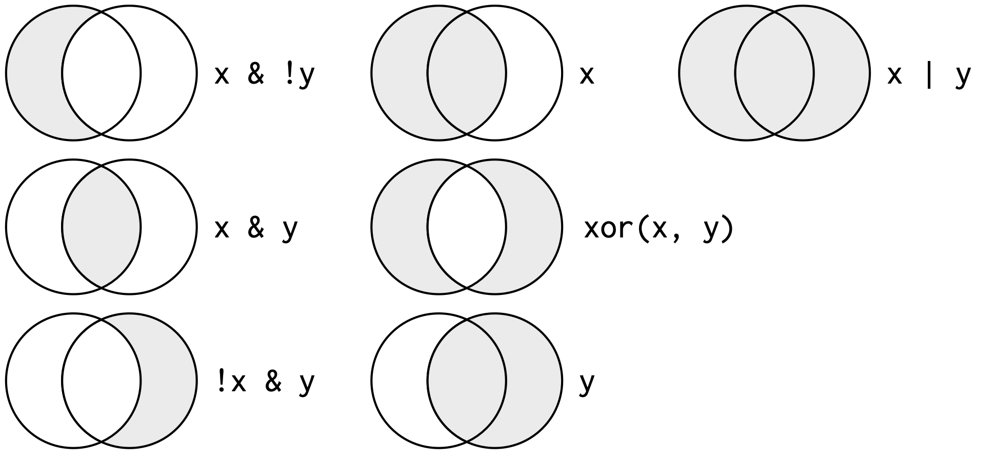

# Data transformation {#transform}

Visualisation is an important tool for insight generation, but it is rare that you get the data in exactly the right form you need for visualisation. Often you'll need to create some new variables or summaries, or maybe you just want to rename the variables or reorder the observations in order to make the data a little easier to work with. You'll learn how to do all that (and more!) in this chapter which will teach you how to transform your data using the dplyr package.

When working with data you must:

1. Figure out what you want to do.

1. Precisely describe what you want to do in such a way that the
   computer can understand it (i.e. program it).

1. Execute the program.

The dplyr package makes these steps fast and easy:

* By constraining your options, it simplifies how you can think about 
  common data manipulation tasks.

* It provides simple "verbs", functions that correspond to the most 
  common data manipulation tasks, to help you translate those thoughts 
  into code.

* It uses efficient data storage backends, so you spend less time 
  waiting for the computer.

In this chapter you'll learn the key verbs of dplyr in the context of a new dataset on flights departing New York City in 2013.

### Prerequisites

In this chapter we're going to focus on how to use dplyr. We'll illustrate the key ideas using some data in nycflight3. 

```{r}
library(dplyr)
library(nycflights13)
library(ggplot2)
```

## nycflights13

To explore the basic data manipulation verbs of dplyr, we'll use the `flights` data frame from the nycflights13 package. This data frame contains all `r format(nrow(nycflights13::flights), big.mark = ",")` flights that departed from New York City in 2013. The data comes from the US [Bureau of Transportation Statistics](http://www.transtats.bts.gov/DatabaseInfo.asp?DB_ID=120&Link=0), and is documented in `?nycflights13`.

```{r}
flights
```

You might notice that this data frame prints little differently to other data frames you might have used: it only shows the first few rows and all the columns that fit on one screen (To see the whole dataset, you can run `View(flights)` which will open the dataset in the RStudio viewer). It prints differently because it's a __tibble__. Tibbles are data frames, but slightly tweaked to work better in the tidyverse. For now, you don't need to worry about the differences; we'll come back to tibbles in more detail in [wrangle].
 
You might also have noticed the row of three letter abbreviations under the column names. These describe the type of each variable:

* lgl: logical (`TRUE` or `FALSE`).
* int: integers.
* dbl: doubles (real numbers).
* chr: character strings.

## Dplyr verbs

There are five dplyr functions that you will use to do the vast majority of data manipulations:

* reorder the rows (`arrange()`), 
* pick observations by their values (`filter()`),
* pick variables by their names (`select()`), 
* create new variables with functions of existing variables (`mutate()`), or
* collapse many values down to a single summary (`summarise()`).

These can all be used in conjunction with `group_by()` which changes the scope of each function from operating on the entire dataset to operating on it group-by-group. These six functions provide the verbs for a language of data manipulation.

All verbs work similarly: 

1.  The first argument is a data frame.

1.  The subsequent arguments describe what to do with the data frame. 
    You can refer to columns in the data frame directly without using `$`.

1.  The result is a new data frame.

Together these properties make it easy to chain together multiple simple steps to achieve a complex result.

## Filter rows with `filter()`

`filter()` allows you to subset observations. The first argument is the name of the data frame. The second and subsequent arguments are the expressions that filter the data frame. For example, we can select all flights on January 1st with:

```{r}
filter(flights, month == 1, day == 1)
```

--------------------------------------------------------------------------------

This is equivalent to the more verbose base code:

```{r, eval = FALSE}
flights[flights$month == 1 & flights$day == 1 & 
  !is.na(flights$month) & !is.na(flights$day), , drop = FALSE]
```

Or with the base `subset()` function:

```{r, eval = FALSE}
subset(flights, month == 1 & day == 1)
```

`filter()` works similarly to `subset()` except that you can give it any number of filtering conditions, which are joined together with `&`. 

--------------------------------------------------------------------------------

When you run this line of code, dplyr executes the filtering operation and returns a new data frame. dplyr functions never modify their inputs, so if you want to save the results, you'll need to use the assignment operator `<-`:

```{r}
jan1 <- filter(flights, month == 1, day == 1)
```

R either prints out the results, or saves them to a variable. If you want to do both, wrap the assignment in parentheses:

```{r}
(dec25 <- filter(flights, month == 12, day == 25))
```

### Comparisons

R provides the standard suite of numeric comparison operators: `>`, `>=`, `<`, `<=`, `!=` (not equal), and `==` (equal). 

When you're starting out with R, the easiest mistake to make is to use `=` instead of `==` when testing for equality. When this happens you'll get a somewhat uninformative error:

```{r, error = TRUE}
filter(flights, month = 1)
```

Whenever you see this message, check for `=` instead of `==`.

Beware using `==` with floating point numbers:

```{r}
sqrt(2) ^ 2 == 2
1/49 * 49 == 1
```

It's better instead to use `near()` to check that you're close:

```{r}
near(sqrt(2) ^ 2,  2)
near(1 / 49 * 49, 1)
```

### Logical operators

Multiple arguments to `filter()` are combined with "and". To get more complicated expressions, you can use Boolean operators yourself:

```{r, eval = FALSE}
filter(flights, month == 11 | month == 12)
```

Note the order isn't like English. The following expression doesn't find on months that equal 11 or 12. Instead it finds all months that equal `11 | 12`, an expression that evaluates to `TRUE`. In a numeric context (like here), `TRUE` becomes one, so this finds all flights in January, not November or December (It is the equivalent of `filter(flights, month == 1)`).

```{r, eval = FALSE}
filter(flights, month == 11 | 12)
```

Instead you can use the helpful `%in%` shortcut:

```{r}
filter(flights, month %in% c(11, 12))
```

The following figure shows the complete set of Boolean operations:

```{r bool-ops, echo = FALSE, fig.cap = "Complete set of boolean operations"}

```

Sometimes you can simplify complicated subsetting by remembering De Morgan's law: `!(x & y)` is the same as `!x | !y`, and `!(x | y)` is the same as `!x & !y`. For example, if you wanted to find flights that weren't delayed (on arrival or departure) by more than two hours, you could use either of the following two filters:

```{r, eval = FALSE}
filter(flights, !(arr_delay > 120 | dep_delay > 120))
filter(flights, arr_delay <= 120, dep_delay <= 120)
```

Note that R has both `&` and `|` and `&&` and `||`. `&` and `|` are vectorised: you give them two vectors of logical values and they return a vector of logical values. `&&` and `||` are scalar operators: you give them individual `TRUE`s or `FALSE`s. They're used in `if` statements when programming. You'll learn about that later on in Chapter ?.

Sometimes you want to find all rows after the first `TRUE`, or all rows until the first `FALSE`. The cumulative functions `cumany()` and `cumall()` allow you to find these values:

```{r}
df <- data_frame(
  x = c(FALSE, TRUE, FALSE), 
  y = c(TRUE, FALSE, TRUE)
)

filter(df, cumany(x)) # all rows after first TRUE
filter(df, cumall(y)) # all rows until first FALSE
```

Whenever you start using multipart expressions in your `filter()`, it's typically a good idea to make the expressions explicit variables with `mutate()` so that you can more easily check your work. You'll learn about `mutate()` in the next section.

### Missing values

One important feature of R that can make comparison tricky is the missing value, `NA`. `NA` represents an unknown value so missing values are "contagious": any operation involving an unknown value will also be unknown.

```{r}
NA > 5
10 == NA
NA + 10
NA / 2
```

The most confusing result is this one:

```{r}
NA == NA
```

It's easiest to understand why this is true with a bit more context:

```{r}
# Let x be Mary's age. We don't know how old she is.
x <- NA

# Let y be John's age. We don't know how old he is.
y <- NA

# Are John and Mary the same age?
x == y
# We don't know!
```

If you want to determine if a value is missing, use `is.na()`. (This is such a common mistake RStudio will remind you whenever you use `x == NA`)

`filter()` only includes rows where the condition is `TRUE`; it excludes both `FALSE` and `NA` values. If you want to preserve missing values, ask for them explicitly:

```{r}
df <- data_frame(x = c(1, NA, 3))
filter(df, x > 1)
filter(df, is.na(x) | x > 1)
```

### Exercises

1.  Find all the flights that:

    * Departed in summer.
    * That flew to Houston (`IAH` or `HOU`).
    * There were operated by United, American, or Delta.
    * That were delayed by more two hours.
    * That arrived more than two hours late, but didn't leave late.
    * Were delayed by at least an hour, but made up over 30 minutes in flight.
    * Departed between midnight and 6am.

1.  How many flights have a missing `dep_time`? What other variables are 
    missing? What might these rows represent?

## Arrange rows with `arrange()`

`arrange()` works similarly to `filter()` except that instead of filtering or selecting rows, it reorders them. It takes a data frame and a set of column names (or more complicated expressions) to order by. If you provide more than one column name, each additional column will be used to break ties in the values of preceding columns:

```{r}
arrange(flights, year, month, day)
```

Use `desc()` to re-order by a column in descending order:

```{r}
arrange(flights, desc(arr_delay))
```

Missing values always come at the end:

```{r}
df <- data_frame(x = c(5, 2, NA))
arrange(df, x)
arrange(df, desc(x))
```

--------------------------------------------------------------------------------

You can accomplish the same thing in base R using subsetting and `order()`:

```{r}
flights[order(flights$year, flights$month, flights$day), , drop = FALSE]
```

`arrange()` provides a more convenient way of sorting one variable in descending order with the `desc()` helper function.

--------------------------------------------------------------------------------

### Exercises

1.  How could you use `arrange()` to sort all missing values to the start?
    (Hint: use `is.na()`).
    
1.  Sort `flights` to find the most delayed flights. Find the flights that
    left earliest.

## Select columns with `select()`

It's not uncommon to get datasets with hundreds or even thousands of variables. In this case, the first challenge is often narrowing in on the variables you're actually interested in. `select()` allows you to rapidly zoom in on a useful subset using operations based on the names of the variables:

```{r}
# Select columns by name
select(flights, year, month, day)
# Select all columns between year and day (inclusive)
select(flights, year:day)
# Select all columns except those from year to day (inclusive)
select(flights, -(year:day))
```

There are a number of helper functions you can use within `select()`:

* `starts_with("abc")`: matches names that begin with "abc".

* `ends_with("xyz")`: matches names that end with "xyz".

* `contains("ijk")`: matches names that contain "ijk".

* `matches("(.)\\1")`: selects variables that match a regular expression.  
   This one matches any variables that contain repeated characters. You'll 
   learn more about regular expressions in Chapter XYZ.
   
*  `num_range("x", 1:3)` matches `x1`, `x2` and `x3`.
   
See `?select` for more details.

It's possible to use `select()` to rename variables:

```{r}
select(flights, tail_num = tailnum)
```

But because `select()` drops all the variables not explicitly mentioned, it's not that useful. Instead, use `rename()`, which is a variant of `select()` that keeps variables by default:

```{r}
rename(flights, tail_num = tailnum)
```

--------------------------------------------------------------------------------

The `select()` function works similarly to the `select` argument in `base::subset()`. `select()` is its own function in dplyr because the dplyr philosophy is to have small functions that each do one thing well.

--------------------------------------------------------------------------------

### Exercises

1.  Brainstorm as many ways as possible to select `dep_time`, `dep_delay`,
    `arr_time`, and `arr_delay` from `flights`.

## Add new variables with `mutate()`

Besides selecting sets of existing columns, it's often useful to add new columns that are functions of existing columns. This is the job of `mutate()`. 

`mutate()` always adds new columns at the end of your dataset so we'll start by creating a narrower dataset so we can see the new variables. Remember that when you're in RStudio, the easiest way to see all the columns is `View()`

```{r}
flights_sml <- select(flights, 
  year:day, 
  ends_with("delay"), 
  distance, 
  air_time
)
mutate(flights_sml,
  gain = arr_delay - dep_delay,
  speed = distance / air_time * 60
)
```

Note that you can refer to columns in `mutate()` that you've just created:

```{r}
mutate(flights_sml,
  gain = arr_delay - dep_delay,
  hours = air_time / 60,
  gain_per_hour = gain / hours
)
```

If you only want to keep the new variables, use `transmute()`:

```{r}
transmute(flights,
  gain = arr_delay - dep_delay,
  hours = air_time / 60,
  gain_per_hour = gain / hours
)
```

--------------------------------------------------------------------------------

`mutate()` is similar to `transform()` in base R, but in `mutate()` you can refer to variables you've just created; in `transform()` you cannot.

--------------------------------------------------------------------------------

### Useful functions

There are many functions for creating new variables that you can use with `mutate()`. The key property is that the function must be vectorised: it needs to return the same number of outputs as inputs. There's no way to list every possible function that you might use, but here's a selection of functions that are frequently useful:

*   Arithmetic operators: `+`, `-`, `*`, `/`, `^`. These are all vectorised, so 
    you can work with multiple columns. These operations use "recycling rules"
    so if one parameter is shorter than the other, it will be automatically
    extended to be the same length. This is most useful when one of the 
    arguments is a single number: `airtime / 60`, `hours * 60 + minute`, etc.
    
    Arithmetic operators are also useful in conjunction with the aggregate
    functions you'll learn about later. For example, `x / sum(x)` calculates 
    the proportion of a total and `y - mean(y)` computes the difference from 
    the mean, and so on.
    
*   Modular arithmetic: `%/%` (integer division) and `%%` (remainder), where
    `x == y * (x %/% y) + (x %% y)`. Modular arithmetic is a handy tool because 
    it allows you to break integers up into pieces. For example, in the 
    flights dataset, you can compute `hour` and `minute` from `dep_time` with:
    
    ```{r}
    transmute(flights,
      dep_time,
      hour = dep_time %/% 100,
      minute = dep_time %% 100
    )
    ```
  
*   Logs: `log()`, `log2()`, `log10()`. Logarithms are an incredibly useful
    transformation for dealing with data that ranges over multiple orders of
    magnitude. They also convert multiplicative relationships to additive, a
    feature we'll come back to in modelling.
    
    All else being equal, I recommend using `log2()` because it's easy to
    interpret: an difference of 1 on the log scale corresponds to doubling on
    the original scale and a difference of -1 corresponds to halving.

*   Offsets: `lead()` and `lag()` allow you to refer to leading or lagging 
    values. This allows you to compute running differences (e.g. `x - lag(x)`) 
    or find when values change (`x != lag(x))`. They are most useful in 
    conjunction with `group_by()`, which you'll learn about shortly.
    
    ```{r}
    x <- 1:10
    x
    lag(x)
    lead(x)
    ```
  
*   Cumulative and rolling aggregates: R provides functions for running sums,
    products, mins and maxes: `cumsum()`, `cumprod()`, `cummin()`, `cummax()`.
    dplyr provides `cummean()` for cumulative means. If you need rolling
    aggregates (i.e. a sum computed over a rolling window), try the RcppRoll
    package.
    
    ```{r}
    x
    cumsum(x)
    cummean(x)
    ```

*   Logical comparisons, `<`, `<=`, `>`, `>=`, `!=`, which you learned about
    earlier. If you're doing a complex sequence of logical operations it's 
    often a good idea to store the interim values in new variables so you can
    check that each step is doing what you expect.

*   Ranking: there are a number of ranking functions, but you should 
    start with `min_rank()`. It does the most usual type of ranking 
    (e.g. 1st, 2nd, 2nd, 4th). The default gives smallest values the small
    ranks; use `desc(x)` to give the largest values the smallest ranks. 
    
    ```{r}
    y <- c(1, 2, 2, NA, 3, 4)
    data_frame(
      row_number(y),
      min_rank(y),
      dense_rank(y),
      percent_rank(y),
      cume_dist(y)
    ) %>% knitr::kable()
    ```

    If `min_rank()` doesn't do what you need, look at the variants 
    `row_number()`, `dense_rank()`, `cume_dist()`, `percent_rank()`, 
    `ntile()`.

### Exercises

```{r, eval = FALSE, echo = FALSE}
flights <- flights %>% mutate(
  dep_time = hour * 60 + minute,
  arr_time = (arr_time %/% 100) * 60 + (arr_time %% 100),
  airtime2 = arr_time - dep_time,
  dep_sched = dep_time + dep_delay
)

ggplot(flights, aes(dep_sched)) + geom_histogram(binwidth = 60)
ggplot(flights, aes(dep_sched %% 60)) + geom_histogram(binwidth = 1)
ggplot(flights, aes(air_time - airtime2)) + geom_histogram()
```

1.  Currently `dep_time` and `arr_time` are convenient to look at, but
    hard to compute with because they're not really continuous numbers. 
    Convert them to a more convenient representation of number of minutes
    since midnight.
    
1.  Compute the scheduled time by adding `dep_delay` to `dep_time`. Plot
    the distribution of departure times. What do you think causes the 
    interesting pattern?
  
1.  Compare `airtime` with `arr_time - dep_time`. What do you expect to see?
    What do you see? Why?

1.  Find the 10 most delayed flights each day using a ranking function. 
    How do you want to handle ties? Carefully read the documentation for
    `min_rank()`.

## Grouped summaries with `summarise()`

The last verb is `summarise()`. It collapses a data frame to a single row:

```{r}
summarise(flights, delay = mean(dep_delay, na.rm = TRUE))
```

That's not terribly useful unless we pair it with `group_by()`. This changes the unit of analysis from the complete dataset to individual groups. When you use the dplyr verbs on a grouped data frame they'll be automatically applied "by group". For example, if we applied exactly the same code to a data frame grouped by date, we get the average delay per date:

```{r}
by_day <- group_by(flights, year, month, day)
summarise(by_day, delay = mean(dep_delay, na.rm = TRUE))
```

Together `group_by()` and `summarise()` provide one of the tools that you'll use most commonly when working with dplyr: grouped summaries. But before we go any further with this, we need to introduce a powerful new idea: the pipe.

### Combining multiple operations with the pipe

Imagine that we want to explore the relationship between the distance and average delay for each location. Using what you already know about dplyr, you might write code like this:

```{r, fig.width = 6}
by_dest <- group_by(flights, dest)
delay <- summarise(by_dest,
  count = n(),
  dist = mean(distance, na.rm = TRUE),
  delay = mean(arr_delay, na.rm = TRUE))
delay <- filter(delay, count > 20, dest != "HNL")

# Interesting it looks like delays increase with distance up to 
# ~750 miles and then decrease. Maybe as flights get longer there's
# more ability to make up delays in the air?
ggplot(delay, aes(dist, delay)) +
  geom_point(aes(size = count), alpha = 1/3) +
  geom_smooth(se = FALSE)
```

There are three steps to prepare this data:

1. Group flights by destination

2. Summarise to compute distance, average delay, and number of flights.

3. Filter to remove noisy points and Honolulu airport, which is almost
  twice as far away as the next closest airport.

This code is a little frustrating to write because we have to give each intermediate data frame a name, even though we don't care about it. Naming things well is hard, so this slows us down. 

There's another way to tackle the same problem with the pipe, `%>%`:

```{r}
delays <- flights %>% 
  group_by(dest) %>% 
  summarise(
    count = n(),
    dist = mean(distance, na.rm = TRUE),
    delay = mean(arr_delay, na.rm = TRUE)
  ) %>% 
  filter(count > 20, dest != "HNL")
```

This focuses on the transformations, not what's being transformed, which makes the code easier to read. You can read it as a series of imperative statements: group, then summarise, then filter. As suggested by this reading, a good way to pronounce `%>%` when reading code is "then".

Behind the scenes, `x %>% f(y)` turns into `f(x, y)`, and `x %>% f(y) %>% g(z)` turns into `g(f(x, y), z)` and so on. You can use the pipe to rewrite multiple operations in a way that you can read left-to-right, top-to-bottom. We'll use piping frequently from now on because it considerably improves the readability of code, and we'll come back to it in more detail in Chapter XYZ.

Most of the packages you'll learn through this book have been designed to work with the pipe (tidyr, dplyr, stringr, purrr, ...). The only exception is ggplot2: it was developed considerably before the pipe was discovered. Unfortunately the next iteration of ggplot2, ggvis, which does use the pipe, isn't ready for prime time yet. 

### Missing values

You may have wondered about the `na.rm` argument we used above. What happens if we don't set it?

```{r}
flights %>% 
  group_by(year, month, day) %>% 
  summarise(mean = mean(dep_delay))
```

We get a lot of missing values! That's because aggregation functions obey the usual rule of missing values: if there's any missing value in the input, the output will be a missing value. `x %>% f(y)` turns into `f(x, y)` you'll learn more about aggregation functions in Section 5.7.4. Fortunately, all aggregation functions have an `na.rm` argument which removes the missing values prior to computation:

```{r}
flights %>% 
  group_by(year, month, day) %>% 
  summarise(mean = mean(dep_delay, na.rm = TRUE))
```

In this case, where missing values represent cancelled flights, we could also tackle the problem by first removing the cancelled flights:

```{r}
not_cancelled <- filter(flights, !is.na(dep_delay), !is.na(arr_delay))

not_cancelled %>% 
  group_by(year, month, day) %>% 
  summarise(mean = mean(dep_delay))
```

### Counts

Whenever you do any aggregation, it's always a good idea to include either a count (`n()`), or a count of non-missing values (`sum(!is.na(x))`). That way you can check that you're not drawing conclusions based on very small amounts of non-missing data.

For example, let's look at the planes (identified by their tail number) that have the highest average delays:

```{r}
delays <- not_cancelled %>% 
  group_by(tailnum) %>% 
  summarise(
    delay = mean(arr_delay), n()
  )

ggplot(delays, aes(delay)) + 
  geom_histogram(binwidth = 10)
```

Wow, there are some planes that have an _average_ delay of 5 hours!

The story is actually a little more nuanced. We can get more insight if we draw a scatterplot of number of flights vs. average delay:

```{r}
delays <- not_cancelled %>% 
  group_by(tailnum) %>% 
  summarise(
    delay = mean(arr_delay, na.rm = TRUE),
    n = n()
  )

ggplot(delays, aes(n, delay)) + 
  geom_point()
```

Not surprisingly, there is much more variation in the average delay when there are few flights. The shape of this plot is very characteristic: whenever you plot a mean (or many other summaries) vs. number of observations, you'll see that the variation decreases as the sample size increases.

When looking at this sort of plot, it's often useful to filter out the groups with the smallest numbers of observations, so you can see more of the pattern and less of the extreme variation in the smallest groups. This is what the following code does, and also shows you a handy pattern for integrating ggplot2 into dplyr flows. It's a bit painful that you have to switch from `%>%` to `+`, but once you get the hang of it, it's quite convenient.

```{r}
delays %>% 
  filter(n > 25) %>% 
  ggplot(aes(n, delay)) + 
    geom_point()
```

--------------------------------------------------------------------------------

RStudio tip: useful keyboard shortcut is Cmd + Shift + P. This resends the previously sent chunk from the editor to the console. This is very convenient when you're (e.g.) exploring the value of `n` in the example above. You send the whole block once with Cmd + Enter, then you modify the value of `n` and press Cmd + Shift + P to resend the complete block.

--------------------------------------------------------------------------------

There's another common variation of this type of pattern. Let's look at how the average performance of batters in baseball is related to the number of times they're at bat. Here I use the Lahman package to compute the batting average (number of hits / number of attempts) of every major league baseball player.  When I plot the skill of the batter against the number of times batted, you see two patterns:

1.  As above, the variation in our aggregate decreases as we get more 
    data points.
    
2.  There's a positive correlation between skill and n. This is because teams
    control who gets to play, and obviously they'll pick their best players.

```{r}
batting <- tbl_df(Lahman::Batting)

batters <- batting %>% 
  group_by(playerID) %>% 
  summarise(
    ba = sum(H) / sum(AB),
    ab = sum(AB)
  )

batters %>% 
  filter(ab > 100) %>% 
  ggplot(aes(ab, ba)) +
    geom_point() + 
    geom_smooth(se = FALSE)
```

This also has important implications for ranking. If you naively sort on `desc(ba)`, the people with the best batting averages are clearly lucky, not skilled:

```{r}
batters %>% arrange(desc(ba))
```

You can find a good explanation of this problem at <http://varianceexplained.org/r/empirical_bayes_baseball/> and <http://www.evanmiller.org/how-not-to-sort-by-average-rating.html>.

### Other summary functions

Just using means, counts, and sum can get you a long way, but R provides many other useful summary functions:

*   Measure of location: we've used `mean(x)`, but `median(x)` is also
    useful. The mean is the sum divided by the length; the median is a value 
    where 50% of `x` is above, and 50% is below.
    
    It's sometimes useful to combine aggregation with logical subsetting:
    
    ```{r}
    not_cancelled %>% 
      group_by(year, month, day) %>% 
      summarise(
        avg_delay1 = mean(arr_delay),
        avg_delay2 = mean(arr_delay[arr_delay > 0]) # the average positive delay
      )
    ```

*   Measure of spread: `sd(x)`, `IQR(x)`, `mad(x)`. The mean squared deviation,
    or standard deviation or sd for short, is the standard measure of spread.
    The interquartile range `IQR()` and median absolute deviation `mad(x)`
    are robust equivalents that maybe more useful if you have outliers.
    
    ```{r}
    # Why is distance to some destinations more variable than to others?
    not_cancelled %>% 
      group_by(dest) %>% 
      summarise(distance_sd = sd(distance)) %>% 
      arrange(desc(distance_sd))
    ```
  
*   Measures of rank: `min(x)`, `quantile(x, 0.25)`, `max(x)`.

    ```{r}
    # When do the first and last flights leave each day?
    not_cancelled %>% 
      group_by(year, month, day) %>% 
      summarise(
        first = min(dep_time),
        last = max(dep_time)
      )
    ```
  
*   Measures of position: `first(x)`, `nth(x, 2)`, `last(x)`. These work similarly to 
    `x[1]`, `n <- 2; x[n]`, and `x[length(x)]` but let you set a default value if that
    position does not exist (i.e. you're trying to get the 3rd element from a 
    group that only has two elements). 
    
    These functions are complementary to filtering on ranks. Filtering gives
    you all variables, with each observation in a separate row. Summarising
    gives you one row per group, with multiple variables:
    
    ```{r}
    not_cancelled %>% 
      group_by(year, month, day) %>% 
      mutate(r = rank(desc(dep_time))) %>% 
      filter(r %in% c(1, n()))
    
    not_cancelled %>% 
      group_by(year, month, day) %>% 
      summarise(first_dep = first(dep_time), last_dep = last(dep_time))
    ```

*   Counts: You've seen `n()`, which takes no arguments, and returns the 
    size of the current group. To count the number of non-missing values, use
    `sum(!is.na(x))`. To count the number of distinct (unique) values, use
    `n_distinct(x)`.
    
    ```{r}
    # Which destinations have the most carriers?
    not_cancelled %>% 
      group_by(dest) %>% 
      summarise(carriers = n_distinct(carrier)) %>% 
      arrange(desc(carriers))
    ```
    
    Counts are so useful that dplyr provides a helper if all you want is a 
    count:
    
    ```{r}
    not_cancelled %>% count(dest)
    ```
    
    You can optionally provide a weight variable. For example, you could use 
    this to "count" (sum) the total number of miles a plane flew:
    
    ```{r}
    not_cancelled %>% 
      count(tailnum, wt = distance)
    ```
  
*   Counts and proportions of logical values: `sum(x > 10)`, `mean(y == 0)`.
    When used with numeric functions, `TRUE` is converted to 1 and `FALSE` to 0. 
    This makes `sum()` and `mean()` particularly useful: `sum(x)` gives the
    number of `TRUE`s in `x`, and `mean(x)` gives the proportion.
    
    ```{r}
    # How many flights left before 5am? (these usually indicate delayed
    # flights from the previous day)
    not_cancelled %>% 
      group_by(year, month, day) %>% 
      summarise(n_early = sum(dep_time < 500))
    
    # What proportion of flights are delayed by more than an hour?
    not_cancelled %>% 
      group_by(year, month, day) %>% 
      summarise(hour_perc = mean(arr_delay > 60, na.rm = TRUE))
    ```

### Grouping by multiple variables

When you group by multiple variables, each summary peels off one level of the grouping. That makes it easy to progressively roll-up a dataset:

```{r}
daily <- group_by(flights, year, month, day)
(per_day   <- summarise(daily, flights = n()))
(per_month <- summarise(per_day, flights = sum(flights)))
(per_year  <- summarise(per_month, flights = sum(flights)))
```

Be careful when progressively rolling up summaries: it's OK for sums and counts, but you need to think about weighting for means and variances, and it's not possible to do it exactly for rank-based statistics like the median (i.e. the sum of groupwise sums is the overall sum, but the median of groupwise medians is not the overall median).

### Ungrouping

If you need to remove grouping, and return to operations on ungrouped data, use `ungroup()`. 

```{r}
daily %>% 
  ungroup() %>%             # no longer grouped by date
  summarise(flights = n())  # all flights
```

### Exercises

1.  Brainstorm at least 5 different ways to assess the typical delay 
    characteristics of a group of flights. Consider the following scenarios:
    
    * A flight is 15 minutes early 50% of the time, and 15 minutes late 50% of 
      the time.
      
    * A flight is always 10 minutes late.

    * A flight is 30 minutes early 50% of the time, and 30 minutes late 50% of 
      the time.
      
    * 99% of the time a flight is on time. 1% of the time it's 2 hours late.
    
    Which is more important: arrival delay or departure delay?

1.  Look at the number of cancelled flights per day. Is there are pattern?
    Is the proportion of cancelled flights related to the average delay?

1.  Which carrier has the worst delays? Challenge: can you disentangle the
    effects of bad airports vs. bad carriers? Why/why not? (Hint: think about
    `flights %>% group_by(carrier, dest) %>% summarise(n())`)

## Grouped mutates (and filters)

Grouping is most useful in conjunction with `summarise()`, but you can also do convenient operations with `mutate()` and `filter()`:

*   Find the worst members of each group:

    ```{r}
    flights %>% 
      group_by(year, month, day) %>%
      filter(rank(arr_delay) < 10)
    ```

*   Find all groups bigger than a threshold:

    ```{r}
    popular_dests <- flights %>% 
      group_by(dest) %>% 
      filter(n() > 365)
    ```

*   Standardise to compute per group metrics:

    ```{r}
    popular_dests %>% 
      filter(arr_delay > 0) %>% 
      mutate(prop_delay = arr_delay / sum(arr_delay))
    ```

A grouped filter is a grouped mutate followed by an ungrouped filter. I generally avoid them except for quick and dirty manipulations: otherwise it's hard to check that you've done the manipulation correctly.

Functions that work most naturally in grouped mutates and filters are known as  window functions (vs. summary functions used for summaries). You can learn more about useful window functions in the corresponding vignette: `vignette("window-functions")`.

### Exercises

1.  Refer back to the table of useful mutate and filtering functions. 
    Describe how each operation changes when you combine it with grouping.

1.  Which plane (`tailnum`) has the worst on-time record?

1.  What time of day should you fly if you want to avoid delays as much
    as possible?
    
1.  Delays are typically temporally correlated: even once the problem that
    caused the initial delay has been resolved, later flights are delayed 
    to allow earlier flights to leave. Using `lag()` explore how the delay
    of a flight is related to the delay of the flight that left just
    before.
    
1.  Look at each destination. Can you find flights that are suspiciously
    fast? (i.e. flights that represent a potential data entry error). Compute
    the air time a flight relative to the shortest flight to that destination.
    Which flights were most delayed in the air?
    
1.  Find all destinations that are flown by at least two carriers. Use that
    information to rank the carriers.
