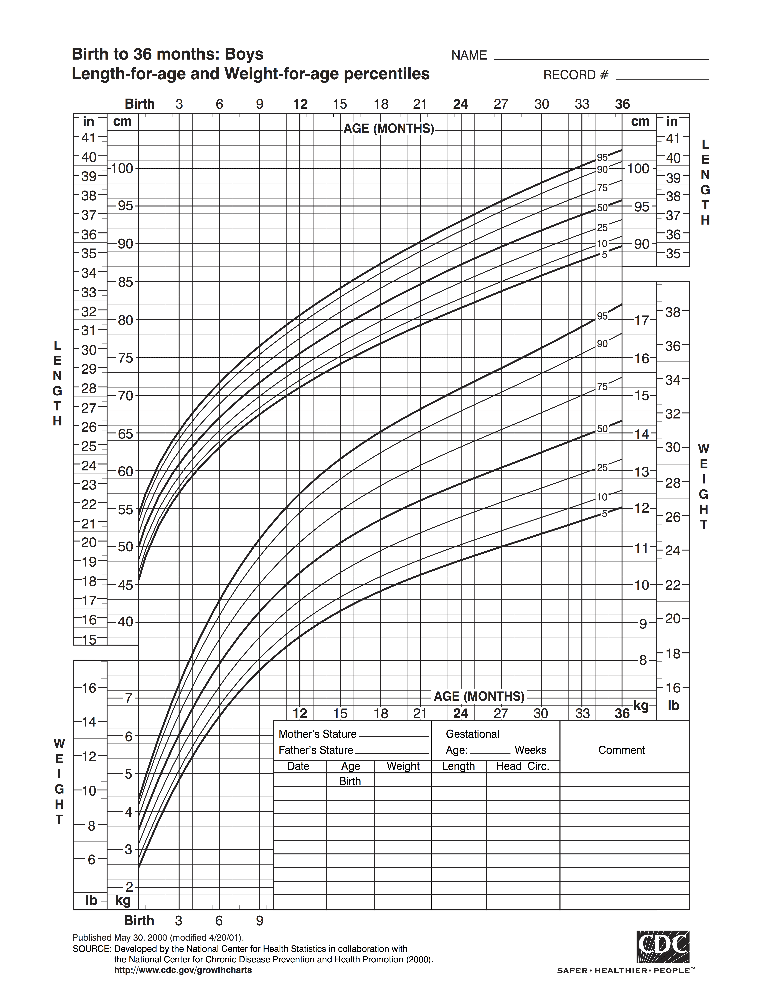
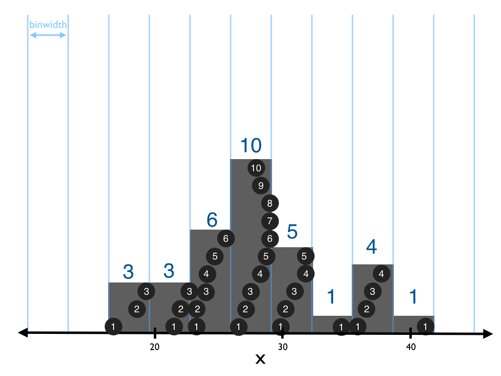

# Exploratory Data Analysis (EDA)

```{r, include = FALSE}
library(ggplot2)
```

If you are like most humans, your brain isn't built to process tables of raw data. Instead, you are more likely to make discoveries if you visualize or transform your data. This chapter will show you the best ways to work with your data to make discoveries, a process known as Exploratory Data Analysis (EDA).

## The challenge of data

The human working memory can only attend to a few values at a time. This makes it difficult to discover patterns in raw data because patterns involve many values. To discover even a simple pattern, you must consider many values _at the same time_, which is difficult to do. For example, a simple pattern exists between $X$ and $Y$ in the table below, but it is very difficult to spot.

```{r data, echo=FALSE}
x <- rep(seq(0.2, 1.8, length = 5), 2) + runif(10, -0.15, 0.15)
X <- c(0.02, x, 1.94)
Y <- sqrt(1 - (X - 1)^2)
Y[1:6] <- -1 * Y[1:6]
Y <- Y - 1
order <- sample(1:10)
knitr::kable(round(data.frame(X = X[order], Y = Y[order]), 2))
```

While your mind may stumble over raw data, you can easily process visual information. Within your mind is a visual processing system that has been fine-tuned by thousands of years of evolution. As a result, the quickest way to understand your data is to visualize it. Once you plot your data, you can instantly see the relationships between values. Here, we see that the values above fall on a circle.

```{r echo=FALSE, dependson=data}
ggplot2::qplot(X, Y) + ggplot2::coord_fixed(ylim = c(-2.5, 2.5), xlim = c(-2.5, 2.5))
```

Visualization works because it bypasses the bottle neck in your working memory. Your brain processes visual information in a different (and much wider) channel than it processes symbolic information, like words and numbers. However, you can also comprehend data in a second way.

You can comprehend data if you reduce it to a small set of summary values that you can attend to with your working memory. This is why it feels natural to work with averages, e.g. how tall is the average basketball player? How educated is the average politician? An average is a single number that you can attend to. Although averages are quite popular, you can also compare data sets on other summary values, such as the maximum, minimum, median, and so on. Another way to summarize your data is to replace it with a model, a function that describes the realtionship between two or more variables.

These two tactics, visualizing and summarizing your data, are the main tools of Exploratory Data Analysis. Before we look at how to visualize and summarise your data, let's consider what types of information you can hope to find. Data carries two types of useful information: information about _variation_ and information about _covariation_.

Let's define some terms that will make these concepts easier to describe:

* A _variable_ is a quantity, quality, or property that you can measure. 

* A _value_ is the state of a variable when you measure it. The value of a variable may change from measurement to measurement.
  
* An _observation_ is a set of measurements you make under similar conditions (you usually make all of the measurements at the same time on the same object). Observations contain values that you measure on different variables. 

## Variation

Variation is to the tendency for the values of a variable to change from measurement to measurement. 

Variation is easy to encounter in real life; if you measure any continuous quantity twice---and precisely enough, you will get two different results. Since every measurement includes a small amount of error, this will be true even if you measure quantities that should be constant, like the speed of light (below).

Discrete and quantitative variables can also vary if you measure across different subjects (e.g. the eye colors of different people), or different times (e.g. the energy levels of an electron).

```{r, variation, echo = FALSE}

mat <- as.data.frame(matrix(morley$Speed + 299000, ncol = 10))

knitr::kable(mat, caption = "*The speed of light is a universal constant, but variation obscures its value. In 1879, Albert Michelson measured the speed of light 100 times and observed 30 different values (in km/sec).*", col.names = rep("", ncol(mat)))
```

Variation is a source of uncertainy. Since values vary from measurement to measurement, you cannot assume that what you measure in one context will be true in another context. 

Variation can also be a tool. Every variable exhibits a pattern of variation. If you comprehend the pattern, you can determine which values of the variable are likely to occur, which are unlikely to occur, and which are impossible. 

## Covariation

Covariation occurs when the values of two or more variables vary in systematic ways.

You can understand covariation by picturing the growth charts that doctors use with young children (below). The ages and heights of young children covary since a child is likely to be born small and then to grow taller. As a result, a large value of height is unlikely to occur without being associated with a large value of age (and vice versa). In fact, the covariation between age and height is so regular that a doctor can tell if something has gone wrong by comparing the two.



Webs of covariation can be quite complex. Multiple variables can covary together as income, education, and home ownership do. Also, two variables can covary in an inverse relationship as unemployment and presidential approval ratings do. Presidential approval ratings are reliably low at times when unemployment is high, and vice versa.

If variation creates uncertainty, covariation dispells it. You can make an accurate guess about an unobserved variable, if you observe the values of variables that it covaries with.

Covariation is also the first clue that a causal relationship may exist between two variables (or that a hidden causal variable may exist that affects the two).

## Understanding Variation
### Distributions describe variation
### Visualizing distributions

***

*Tip*: Throughout this section, we will rely on a distinction between two types of variables: 

* A variable is **continuous** if you can arrange its values in order _and_ an infinite number of values can exist between any two values of the variable. For example, numbers and date-times are continuous variables. `ggplot2` will treat your variable as continuous if it is a numeric, integer, or a recognizable date-time class (but not a factor, see `?factor`). 

* A variable is **discrete** if it is not continuous. Discrete variables can only contain a finite (or countably infinite) set of unique values. For example, character strings and boolean values are discrete variables. `ggplot2` will treat your variable as discrete if it is not a numeric, integer, or recognizable date-time class. 

***

### Visualizing Distributions

The first group of geoms visualizes the _distribution_ of the values in a variable.

Recall that a variable is a quantity, quality, or property whose value can change between measurements. This unique property---that the values of a variable can vary---gives the word "variable" its name. It also motivates all of data science. Scientists attempt to understand what determines the value of a variable. They then use that information to predict or control the value of the variable under a variety of circumstances.

One of the most useful tools in this quest are the values themselves, the values that you have already observed for a variable. These values reveal which states of the variable are common, which are rare, and which are seemingly impossible. The pattern of values that emerges as you collect large amounts of data is known as the variable's _distribution_.

The distribution of a variable reveals information about the probabilities associated with the variable. As you collect more data, the proportion of observations that occur at a value (or in an interval) will match the probability that the variable will take that value (or take a value in that interval) in a future measurement.

In theory, it is easy to visualize the distribution of a variable: simply display how many observations occur at each value of the variable. In practice, how you do this will depend on the type of variable that you wish to visualize.

##### Discrete distributions

Use `geom_bar()` to visualize the distribution of a discrete variable. `geom_bar()` counts the number of observations that are associated with each value of the variable, and it displays the results as a series of bars. The height of each bar reveals the count of observations that are associated with the x value of the bar.

```{r}
ggplot(data = diamonds) +
  geom_bar(mapping = aes(x = cut))
```

***

*Tip* - Since each of the geoms in this subsection visualizes the values of a single variable, you do not need to provide a $y$ aesthetic.

***

Useful aesthetics for `geom_bar()` are:

* x (required)
* alpha
* color
* fill
* linetype
* size
* weight

Useful position adjustments for `geom_bar()` are

* "stack" (default)
* "dodge"
* "fill"

Useful stats for `geom_bar()` are 

* "bin" (default)
* "identity" (to map bar heights to a y variable)

The `width` argument of `geom_bar()` controls the width of each bar. The bars will touch when you set `width = 1`. 

```{r}
ggplot(data = diamonds) +
  geom_bar(mapping = aes(x = cut), width = 1)
```

***

*Tip*: You can compute the counts of a discrete variable quickly with R's `table()` function. These are the numbers that `geom_bar()` visualizes.

```{r}
table(diamonds$cut)
```

***

##### Continuous distributions

The strategy of counting the number of observations at each value breaks down for continuous data. If your data is truly continuous, then no two observations will have the same value---so long as you measure the data precisely enough (e.g. without rounding to the _n_th decimal place).

To get around this, data scientists divide the range of a continuous variable into equally spaced intervals, a process called _binning_. 

```{r, echo = FALSE}
# knitr::include_graphics("images/visualization-17.png")
```

They then count how many observations fall into each bin.

```{r, echo = FALSE}
# knitr::include_graphics("images/visualization-18.png")
```

And display the count as a bar, or some other object.

```{r, echo = FALSE}
# knitr::include_graphics("images/visualization-19.png")
```

This method is temperamental because the appearance of the distribution can change dramatically if the bin size changes. As no bin size is "correct," you should explore several bin sizes when examining data.

```{r, echo = FALSE}
# 
```

Several geoms exist to help you visualize continuous distributions. They almost all use the "bin" stat to implement the above strategy. For each of these geoms, you can set the following arguments for "bin" to use:

* `binwidth` - the width to use for the bins in the same units as the x variable
* `origin` - origin of the first bin interval
* `right` - if `TRUE` bins will be right closed (e.g. points that fall on the border of two bins will be counted with the bin to the left)
* `breaks` - a vector of actual bin breaks to use. If you set the breaks argument, it will override the binwidth and origin arguments.

Use `geom_histogram()` to make a traditional histogram. The height of each bar reveals how many observations fall within the width of the bar. 

```{r}
ggplot(data = diamonds) +
  geom_histogram(aes(x = carat))
```

By default, `geom_histogram()` will divide the range of the variable into 30 equal length bins. The quickest way to change this behavior is to set the binwidth argument.

```{r}
ggplot(data = diamonds) +
  geom_histogram(aes(x = carat), binwidth = 1)
```

Notice how different binwidths reveal different information. The plot above shows that the availability of diamonds decreases quickly as carat size increases. The plot below shows that there are more diamonds than you would expect at whole carat sizes (and common fractions of carat sizes). Moreover, for each popular size, there are more diamonds slightly larger than the size than diamonds slightly smaller than the size.


```{r}
ggplot(data = diamonds) +
  geom_histogram(aes(x = carat), binwidth = 0.01)
```

Useful aesthetics for `geom_histogram()` are:

* x (required)
* alpha
* color
* fill
* linetype
* size
* weight

Useful position adjustments for `geom_histogram()` are

* "stack" (default)
* "fill"

`geom_freqpoly()` uses a line to display the same information as `geom_histogram()`. You can think of `geom_freqpoly()` as drawing a line that connects the tops of the bars that would appear in a histogram.

```{r message = FALSE, fig.show='hold', fig.width=4, fig.height=4}
ggplot(data = diamonds) +
  geom_freqpoly(aes(x = carat))

ggplot(data = diamonds) +
  geom_histogram(aes(x = carat))
```

It is easier to compare levels of a third variable with `geom_freqpoly()` than with `geom_histogram()`. `geom_freqpoly()` displays the shape of the distribution faithfully for each subgroup because you can plot multiple lines in the same graph without adjusting their position. Notice that `geom_histogram()` must stack each new subgroup on top of the others, which obscures the shape of the distributions. 

```{r message = FALSE, fig.show='hold', fig.width=4, fig.height=4}
ggplot(data = diamonds) +
  geom_freqpoly(aes(x = carat, color = cut))

ggplot(data = diamonds) +
  geom_histogram(aes(x = carat, fill = cut))
```

Useful aesthetics for `geom_freqpoly()` are:

* x (required)
* y
* alpha
* color
* linetype
* size

Although the name of `geom_freqpoly()` suggests that it draws a polygon, it actually draws a line. You can draw the same information as a true polygon (and thus fill in the area below the line) if you combine `geom_area()` with `stat = "bin"`. You will learn more about `geom_area()` in _Visualizing functions between two variables_.

```{r}
ggplot(data = diamonds) +
  geom_area(aes(x = carat, fill = cut), stat = "bin", position = "stack")
```

`geom_density()` plots a one dimensional kernel density estimate of a variable's distribution. The result is a smooth version of the information contained in a histogram or a freqpoly.

```{r}
ggplot(data = diamonds) +
  geom_density(aes(x = carat))
```

`geom_density()` displays $density$---not $count$---on the y axis, which makes it easier to compare the shape of the distributions of multiple subgroups; the area under each curve will be normalized to one, no matter how many total observations occur in the subgroup.

`geom_density()` does not use the binwidth argument. You can control the smoothness of the density with `adjust`, and you can select the kernel to use to estimate the density with `kernel`. Set kernel to one of "gaussian" (default), "epanechikov", "rectangular", "triangular", "biweight", "cosine", "optcosine".

```{r}
ggplot(data = diamonds) +
  geom_density(aes(x = carat, color = cut), kernel = "gaussian", adjust = 4)
```

Useful aesthetics for `geom_density()` are:

* x (required)
* y
* alpha
* color
* fill
* linetype
* size

Useful position adjustments for `geom_density()` are

* "identity" (default)
* "stack" (when using the fill aesthetic)
* "fill" (when using the fill aesthetic)

`geom_dotplot()` provides a final way to visualize distributions. This unique geom displays a point for each observation, but it stacks points that appear in the same bin on top of each other. The result is similar to a histogram, the height of each stack reveals the number of points in the stack.

```{r}
ggplot(data = mpg) +
  geom_dotplot(aes(x = displ), binwidth = 0.2)
```

Useful aesthetics for `geom_dotplot()` are:

* x (required)
* y
* alpha
* color
* fill

Useful arguments that apply to `geom_dotplot()`

* `binaxis` - the axis to bin along ("x" or "y")
* `binwidth` - the interval width to use when binning
* `dotsize` - diameter of dots relative to binwidth
* `stackdir` - which direction to stack the dots ("up" (default), "down", "center", "centerwhole")
* `stackgroups` - Has the equivalent of `position = "stack"` when set to true.
* `stackratio` - how close to stack the dots. Values less than 1 cause dots to overlap, which shortens stacks.

In practice, I find that `geom_dotplot()` works best with small data sets and takes a lot of tweaking of the binwidth, dotsize, and stackratio arguments to fit the dots within the graph (the stack heights depend entirely on the organization of the dots, which renders the y axis ambiguous). That said, dotplots can be useful as a learning aid. They provide an intuitive representation of a histogram.

### Summarizing distributions
## Understanding Covariation
### Visualizing covariation

### Visualize Covariation

### Compare Distributions

#### Visualize functions between two variables

Distributions provide useful information about variables, but the information is general. By itself, a distribution cannot tell you how the value of a variable in one set of circumstances will differ from the value of the same variable in a different set of circumstances.

_Covariation_ can provide more specific information. Covariation is a relationship between the values of two or more variables. 

To see how covariation works, consider two variables: the $volume$ of an object and its $temperature$. If the $volume$ of the object usually increases when the $temperature$ of the object increases, then you could use the value of $temperature$ to help predict the value of $volume$. 

You've probably heard that "correlation (covariation) does not prove causation." This is true, two variables can covary without one causing the other. However, covariation is often the first clue that two variables have a causal relationship.

Visualization is one of the best ways to spot covariation. How you look for covariation will depend on the structural relationship between two variables. The simplest structure occurs when two continuous variables have a functional relationship, where each value of one variable corresponds to a single value of the second variable. 

In this scenario, covariation will appear as a pattern in the relationship. If two variables do not covary, their functional relationship will look like a random walk.

The variables `date` and `unemploy` in the `economics` data set have a functional relationship. The `economics` data set comes with `ggplot2` and contains various economic indicators for the United States between 1967 and 2007. The `unemploy` variable measures the number of unemployed individuals in the United States in thousands.

A scatterplot of the data reveals the functional relationship between `date` and `unemploy`.

```{r}
ggplot(data = economics) +
  geom_point(aes(x = date, y = unemploy))
```

`geom_line()` makes the relationship clear. `geom_line()` creates a line chart, one of the most used---and most efficient---devices for visualizing a function.

```{r}
ggplot(data = economics) +
  geom_line(aes(x = date, y = unemploy))
```

Useful aesthetics for `geom_line()` are:

* x (required)
* y (required)
* alpha
* color
* linetype
* size

Use `geom_step()` to turn a line chart into a step function. Here, the result will be easier to see with a subset of data.

```{r}
ggplot(data = economics[1:150, ]) +
  geom_step(aes(x = date, y = unemploy))
```

Control the step direction by giving `geom_step()` a direction argument. `direction = "hv"` will make stairs that move horizontally then vertically to connect points. `direction = "vh"` will do the opposite.

Useful aesthetics for `geom_step()` are:

* x (required)
* y (required)
* alpha
* color
* linetype
* size

`geom_area()` creates a line chart with a filled area under the line.

```{r}
ggplot(data = economics) +
  geom_area(aes(x = date, y = unemploy))
```

Useful aesthetics for `geom_area()` are:

* x (required)
* y (required)
* alpha
* color
* fill
* linetype
* size

##### Visualize correlations between two variables

Many variables do not have a functional relationship. As a result, a single value of one variable can correspond to multiple values of another variable. 

Height and weight are two variables that are often related, but do not have a functional relationship. You could examine a classroom of students and notice that three different students, with three different weights all have the same height, 5'4". In this case, there is not a one to one relationship between height and weight.

The easiest way to plot the relationship between two variables is with a scatterplot, i.e. `geom_point()`. If the variables covary, a pattern will appear in the points. If they do not, the points will look like a random cloud of points.

```{r}
ggplot(data = mpg) +
  geom_point(mapping = aes(x = displ, y = hwy))
```

Useful aesthetics for `geom_point()` are:

* x (required)
* y (required)
* alpha
* color
* fill (for some shapes)
* shape
* size

Useful position adjustments for `geom_point()` are:

* "identity" (default)
* "jitter"

In fact, the jitter adjustment is so useful that `ggplot2` provides the `geom_jitter()`, which is identical to `geom_point()` but comes with `position = "jitter"` by default.

```{r}
ggplot(data = mpg) +
  geom_jitter(mapping = aes(x = displ, y = hwy))
```

`geom_jitter()` can be a useful way to visualize the distribution between two discrete variables. Can you tell why `geom_point()` would be less useful here?

```{r}
ggplot(data = mpg) +
  geom_jitter(mapping = aes(x = cyl, y = fl, color = fl))
```

Use `geom_rug()` to visualize the distribution of each variable in the scatterplot. `geom_rug()` adds a tickmark along each axis for each value observed in the data. `geom_rug()` works best as a second layer in the plot (see Section 3 for more info on layers).

```{r}
ggplot(data = mpg) +
  geom_point(mapping = aes(x = displ, y = hwy)) +
  geom_rug(mapping = aes(x = displ, y = hwy), position = "jitter")
```

Use the `sides` argument to control which axes to place a "rug" on.

* `sides = "bl"` - (default) Places a rug on each axis
* `sides = "b"` - Places a rug on the bottom axis
* `sides = "l"` - Places a rug on the left axis

Useful aesthetics for `geom_rug()` are:

* x (required)
* y (required)
* alpha
* color
* linetype
* size

Useful position adjustments for `geom_rug()` are:

* "identity" (default)
* "jitter"

Use `geom_text()` to display a label, instead of a point, for each observation in a scatterplot. `geom_text()` lets you add information to the scatterplot, but is less effective when you have many data points.

```{r}
ggplot(data = mpg[sample(1:234, 10), ]) +
  geom_text(mapping = aes(x = displ, y = hwy, label = class))
```

Useful aesthetics for `geom_text()` are:

* x (required)
* y (required)
* alpha
* angle
* color
* family
* fontface
* hjust
* label (`geom_text()` displays the values of this variable)
* lineheight
* linetype
* size
* vjust

Control the appearance of the labels with the following arguments. You can also use each of these arguments as an aesthetic. To do so, set them inside the `aes()` call in `geom_text()`'s mapping argument.

* `angle` - angle of text
* `family` - font family of text
* `fontface` - bold, italic, etc.
* `hjust` - horizontal adjustment
* `vjust`- vertical adjustment

Scatterplots do not work well with large data sets because individual points will begin to occlude each other. As a result, you cannot tell where the mass of the data lies. Does a black region contain a single layer of points? Or hundreds of points stacked on top of each other?

You can see this type of plotting in the `diamonds` data set. The data set only contains 53,940 points, but the points overplot each other in a way that we cannot fix with jittering.

```{r}
ggplot(data = diamonds) +
  geom_point(mapping = aes(x = carat, y = price))
```

For large data, it is more useful to plot summary information that describes the raw data than it is to plot the raw data itself. Several geoms can help you do this.

The simplest way to summarise covariance between two variables is with a model line. The model line displays the trend of the relationship between the variables. 

Use `geom_smooth()` to display a model line between any two variables. As with `geom_rug()`, `geom_smooth()` works well as a second layer for a plot (See Section 3 for details).

```{r}
ggplot(data = diamonds) +
  geom_point(mapping = aes(x = carat, y = price)) +
  geom_smooth(mapping = aes(x = carat, y = price))
```

`geom_smooth()` will add a loess line to your data if the data contains less than 1000 points, otherwise it will fit a general additive model to your data with a cubic regression spline, and plot the resulting model line. In either case, `geom_smooth()` will display a message in the console to tell you what it is doing. This is not a warning message; you do not need to worry when you see it.

`geom_smooth()` will also plot a standard error band around the model line. You can remove the standard error band by setting the `se` argument of `geom_smooth()` to `FALSE`. 

Use the `method` argument of `geom_smooth()` to add a specific type of model line to your data. `method` takes the name of an R modeling function. `geom_smooth()` will use the function to calculate the model line. For example, the code below uses R's `lm()` function to fit a linear model line to the data.

```{r}
ggplot(data = diamonds) +
  geom_point(mapping = aes(x = carat, y = price)) +
  geom_smooth(mapping = aes(x = carat, y = price), method = lm)
```

By default, `geom_smooth()` will use the formula `y ~ x` to model your data. You can modify this formula by setting the `formula` argument to a different formula. If you do this, be sure to refer to the variable on your $x$ axis as `x` and the variable on your $y$ axis as `y`, e.g.

```{r}
ggplot(data = diamonds) +
  geom_point(mapping = aes(x = carat, y = price)) +
  geom_smooth(mapping = aes(x = carat, y = price), 
    method = lm, formula = y ~ poly(x, 4))
```

Useful aesthetics for `geom_smooth()` are:

* x (required)
* y (required)
* alpha
* color
* fill
* linetype
* size
* weight

Useful arguments for `geom_smooth()` are:

* `formula` - the formula to use in the smoothing function
* `fullrange` - Should the fit span the full range of the plot, or just the data?
* `level` - Confidence level to use for standard error ribbon
* `method` - Smoothing function to use, a model function in R
* `n` - The number of points to evaluate smoother at (defaults to 80)
* `se` - If `TRUE` (the default), `geom_smooth()` will include a standard error ribbon

Be careful, `geom_smooth()` will overlay a trend line on every data set, even if the underlying data is uncorrelated. You can avoid being fooled by also inspecting the raw data or calculating the correlation between your variables, e.g. `cor(diamonds$carat, diamonds$price)`.

`geom_quantile()` fits a different type of model to your data. Use it to display the results of a quantile regression (see `?rq` for details). Like `geom_smooth()`, `geom_quantile()` takes a formula argument that describes the relationship between $x$ and $y$.

```{r}
ggplot(data = diamonds) +
  geom_point(mapping = aes(x = carat, y = price)) +
  geom_quantile(mapping = aes(x = carat, y = price),
                quantiles = c(0.05, 0.5, 0.95), 
                formula = y ~ poly(x, 2))
```

Useful aesthetics for `geom_quantile()` are:

* x (required)
* y (required)
* alpha
* color
* linetype
* size
* weight

Useful arguments for `geom_quantile()` are:

* `formula` - the formula to use in the smoothing function
* `quantiles` - Conditional quantiles of $y$ to display. Each quantile is displayed with a line.

`geom_smooth()` and `geom_quantile()` summarise the relationship between two variables as a function, but you can also summarise the relationship as a bivariate distribution. 

`geom_bin2d()` divides the coordinate plane into a two dimensional grid and then displays the number of observations that fall into each bin in the grid. This technique let's you see where the mass of the data lies; bins with a light fill color contain more data than bins with a dark fill color. Bins with no fill contain no data at all. 

```{r}
ggplot(data = diamonds) +
  geom_bin2d(mapping = aes(x = carat, y = price), binwidth = c(0.1, 500))
```

Useful aesthetics for `geom_bin2d()` are:

* x (required)
* y (required)
* alpha
* color
* fill
* size
* weight

Useful arguments for `geom_bin2d()` are:

* `bins` - A vector like `c(30, 40)` that gives the number of bins to use in the horizontal and vertical directions.
* `binwidth` - A vector like `c(0.1, 500)` that gives the binwidths to use in the horizontal and vertical directions. Overrides `bins` when set.
* `drop` - If `TRUE` (default) `geom_bin2d()` removes the fill from all bins that contain zero observations.

`geom_hex()` works similarly to `geom_bin2d()`, but it divides the coordinate plane into hexagon shaped bins. This can reduce visual artifacts that are introduced by the aligning edges of rectangular bins. 

```{r}
ggplot(data = diamonds) +
  geom_hex(mapping = aes(x = carat, y = price), binwidth = c(0.1, 500))
```

`geom_hex()` requires the `hexbin` package, which you can install with `install.packages("hexbin")`.

`geom_density2d()` uses density contours to display similar information. It is the two dimensional equivalent of `geom_density()`. Interpret a two dimensional density plot the same way you would interpret a contour map. Each line connects points of equal density, which makes changes of slope easy to see.

As with other summary geoms, `geom_density2d()` makes a useful second layer.

```{r}
ggplot(data = diamonds) +
  geom_point(mapping = aes(x = carat, y = price)) +
  geom_density2d(mapping = aes(x = carat, y = price))
```

Useful aesthetics for `geom_density2d()` are:

* x (required)
* y (required)
* alpha
* color
* linetype
* size

Useful arguments for `geom_density2d()` are:

* `h` - A vector like `c(0.2, 500)` that gives the bandwiths to use to estimate the density in the horizontal and vertical directions.
* `n` - number of gridpoints to use when estimating the density (defaults to 100).

##### Visualize correlations between three variables

There are two ways to add three (or more) variables to a two dimensional plot. You can map additional variables to aesthetics within the plot, or you can use a geom that is designed to visualize three variables. 

`ggplot2` provides three geoms that are designed to display three variables: `geom_raster()`, `geom_tile()` and `geom_contour()`. These geoms generalize `geom_bin2d()` and `geom_density()` to display a third variable instead of a count, or a density.

`geom_raster()` and `geom_tile()`

### Summarizing covariation: statistics
### Summarizing covariation: models
#### Models have one of the richest literatures of how to select and test, so we've reserved them for their own section. Modelling brings together the various components of data science more so than any other data science task. So we'll postpone its coverage until you can program and wrangle data, two skills that will aid your ability to select models.


