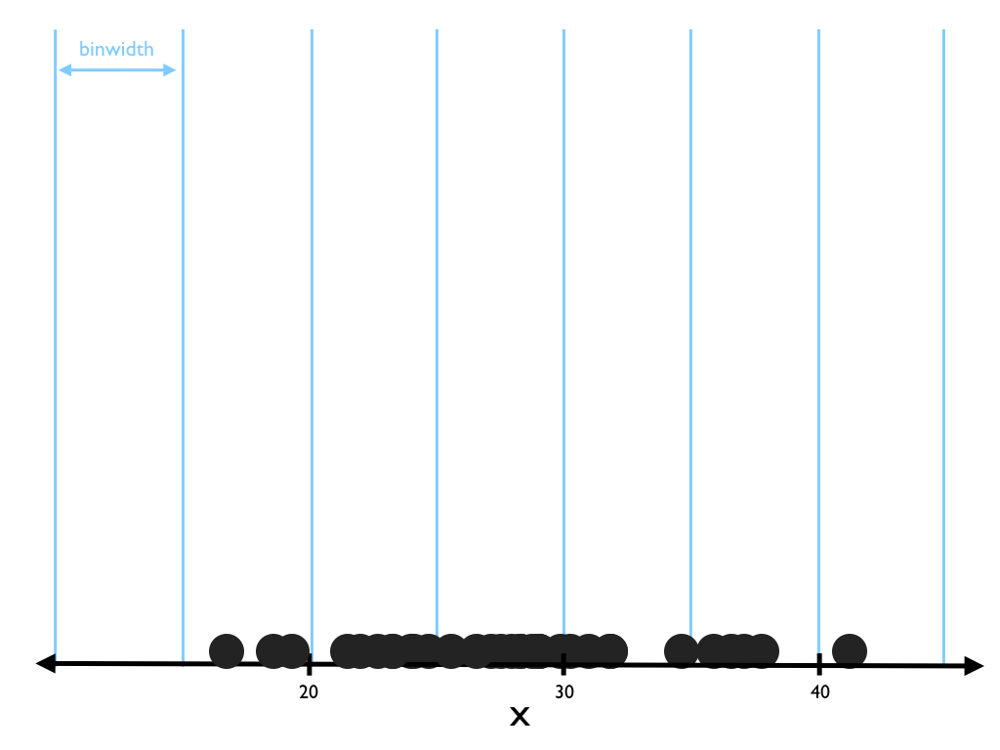
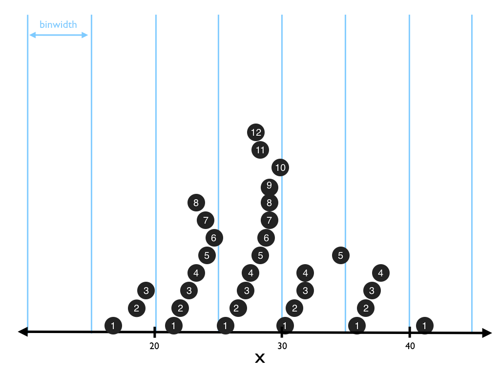
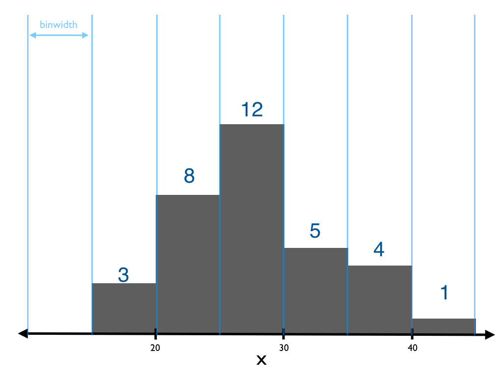

# Exploratory Data Analysis (EDA)

```{r, include = FALSE}
library(ggplot2)
library(dplyr)
```

If you are like most humans, your brain isn't built to process tables of raw data. You can understand your raw data better if you first visualize it or transform it. This chapter will show you the best ways to visualize and transform your data to make discoveries, a process known as Exploratory Data Analysis (EDA).

## The challenge of data

The human working memory can only attend to a few values at a time. This makes it difficult to discover patterns in raw data because patterns involve many values. To discover even a simple pattern, you must consider many values _at the same time_, which is difficult to do. For example, a simple pattern exists between $X$ and $Y$ in the table below, but it is very difficult to spot.

```{r data, echo=FALSE}
x <- rep(seq(0.2, 1.8, length = 5), 2) + runif(10, -0.15, 0.15)
X <- c(0.02, x, 1.94)
Y <- sqrt(1 - (X - 1)^2)
Y[1:6] <- -1 * Y[1:6]
Y <- Y - 1
order <- sample(1:10)
knitr::kable(round(data.frame(X = X[order], Y = Y[order]), 2))
```

While your mind may stumble over raw data, you can easily process visual information. Within your mind is a visual processing system that has been fine-tuned by thousands of years of evolution. As a result, the quickest way to understand your data is to visualize it. Once you plot your data, you can instantly see the relationships between values. Here, we see that the values above fall on a circle.

```{r echo=FALSE}
ggplot2::qplot(X, Y) + ggplot2::coord_fixed(ylim = c(-2.5, 0.5), xlim = c(-0.5, 2.5))
```

Visualization works because it bypasses the bottle neck in your working memory. Your brain processes visual information in a different (and much wider) channel than it processes symbolic information, like words and numbers. However, visualization is not the only way to comprehend data.

You can also comprehend your data if you reduce it to a small set of summary values. Your working memory can easily attend to just a few values, which lets you absorb important information about the data. This is why it feels natural to work with things like averages, e.g. how tall is the average basketball player? How educated is the average politician? An average is a single number that you can attend to. Although averages are quite popular, you can also compare data sets on other summary values, such as maximums, minimums, medians, and so on. Another way to summarize your data is to replace it with a model, a function that describes the relationship between two or more variables.

These two tactics, visualizing and summarizing your data, are the main tools of Exploratory Data Analysis. Before we begin to use the tools, let's consider what types of information you can hope to find in your data. 

## Variation

Data carries two types of useful information: information about _variation_ and information about _covariation_. These concepts will be easier to describe if we first define some basic terms:

* A _variable_ is a quantity, quality, or property that you can measure. 

* A _value_ is the state of a variable when you measure it. The value of a variable may change from measurement to measurement.
  
* An _observation_ is a set of measurements that you make under similar conditions (you usually make all of the measurements in an observation at the same time and on the same object). An observation will contain several values, each associated with a different variable. I'll sometimes refer to an observation as a data point.

_Variation_ is the tendency of the values of a variable to change from measurement to measurement. 

Variation is easy to encounter in real life; if you measure any continuous variable twice---and precisely enough, you will get two different results. This is true even if you measure quantities that should be constant, like the speed of light (below); each of your measurements will include a small amount of error that varies from measurement to measurement.

```{r, variation, echo = FALSE}

mat <- as.data.frame(matrix(morley$Speed + 299000, ncol = 10))

knitr::kable(mat, caption = "*The speed of light is a universal constant, but variation due to measurement error obscures its value. In 1879, Albert Michelson measured the speed of light 100 times and observed 30 different values (in km/sec).*", col.names = rep("", ncol(mat)))
```

Discrete and quantitative variables can also vary if you measure across different subjects (e.g. the eye colors of different people), or different times (e.g. the energy levels of an electron).

Variation is a source of uncertainy in data science. Since values vary from measurement to measurement, you cannot assume that what you measure in one context will be true in another context. However, variation can also be a tool. Every variable exhibits a pattern of variation. If you comprehend the pattern, you can determine which values of the variable are likely to occur, which are unlikely to occur, and which are impossible. You can also use the pattern to quickly spot outliers, data points that behave differently from other observations of a variable, and clusters, groups of data points that share similar values.

## Covariation

The second type of information contained in data is information about covariation. _Covariation_ occurs when two or more variables vary together in a systematic way.

You can understand covariation if you picture the growth charts that doctors use with young children (below). The ages and heights of children covary since a child is likely to be born small and to grow taller over time. As a result, you can expect a large value of age to be accompanied by a large value of height and a small value of age to be accompanied by a small value of height. In fact, the covariation between age and height is so regular that a doctor can tell if something has gone wrong by comparing a child's height to his or her age.

Systems of covariation can be very complex. Multiple variables can covary together, as do age, height, weight, bone density, etc., and two variables can covary in an inverse relationship, as do unemployment and presidential approval ratings (presidential approval ratings are reliably low at times when unemployment is high, and vice versa). Covariation can also occur between categorical variables. In that case observations in one category will be linked to certain values more often than observations in other categories.

Covariation provides a way to reduce the uncertainty created by variation. You can make an accurate guess about the value of an unobserved variable if you observe the values of variables that it covaries with. The covariation that occurs between variables will also occur between the values of those variables whenever the values belong in the same observation.

Covariation also provides clues about causal relationships. If one variable causes the value of a second, the two variables will covary. The inverse does not logically follow; i.e. if two variables covary, one does not necessarily cause the other. However, you can use patterns of covariation to direct your attention as you search for causal relationships.

Now that you have a sense of what to look for in data, how do you find it?

## Exploratory Data Analysis

Exploratory Data Analysis is a loosely defined task that deepens your understanding of a data set. EDA involves iteratively

* forming questions about your data 
* searching for answers by visualizing and summarizing your data
* refining your questions about the data, or choosing new questions to investigate, based on what you discover

There is no formal way to do Exploratory Data Analysis. You must be free to investigate every insight that occurs to you. The remainder of the chapter will teach you ways to visualize and summarise your data that you can use in any part of your exploration. I've organized these methods into two groups: methods for

1. Understanding variation. These methods elucidate the question, "What type of uncertainty exists in the processes that my data describe?"

2. Understanding covariation. These methods elucidate the question, "How can the data help me reduce the uncertainty that exists in the processes that my data describe?"

As you use these methods, it is important to keep an eye out for any signals that can lead to better questions about your data, and then scrutinize them. Things like outliers, missing values, gaps in your data coverage, and patterns can all tip you of to important aspects of your data set. Often the discoveries that you make during Exploratory Data Analysis will be the most valuable results of your data analysis. Many useful scientific discoveries, like the discovery of the hole in the ozone layer, were made by simply exploring data.

## Understanding variation - Distributions

The most useful tool for understanding the variation associated with a variable is the variable's _empirical distribution_, the pattern of values that emerges as you take many measurements of the variable. 

### Visualizing distributions

If a variable is categorical, you can display its empirical distribution with a simple bar graph. **Categorical** variables are variables that can only contain a finite (or countably infinite) set of unique values, like the cut rating of a diamond. In R, categorical variables are usually saved as factors or character strings. 

```{r}
ggplot(data = diamonds) +
  geom_bar(mapping = aes(x = cut))
```

By default, `geom_bar()` counts the number of observations that are associated with each value of a variable, and it displays the results as a series of bars. You do not need to provide a $y$ aesthetic to `geom_bar()`.

The height of each bar in a bar graph reveals the number of observations that are associated with the $x$ value of the bar. You can use the heights to estimate the frequency that different values will appear as you measure the variable. $x$ values that have a tall bar occur often, and $x$ values with small bars occur rarely.

***

*Tip*: You can compute the counts of a categorical variable quickly with R's `table()` function. These are the numbers that `geom_bar()` visualizes.

```{r}
table(diamonds$cut)
```

***

To compare the distributions of different subgroups in a bar chart, 

1. set the fill and grouping aesthetics to a grouping variable 
2. set the position adjustment to "dodge" for side by side bars
3. set $y$ to `..prop..` to compare proportions instead of raw counts (as raw counts will depend on group sizes which may differ)

```{r}
ggplot(data = diamonds) +
  geom_bar(mapping = aes(x = cut, y = ..prop.., group = carat > 1, fill = carat > 1), position = "dodge")
```

What if your variable is not categorical but continuous? A variable is **continuous** if you can arrange its values in order _and_ an infinite number of unique values can exist between any two values of the variable. Numbers and date-times are two examples of continuous variables.

The strategy of counting the number of observations at each value breaks down for continuous data, because if your data is truly continuous, then no two observations will have the same value.

To get around this, you can divide the range of a continuous variable into equally spaced intervals, a process called _binning_. 

```{r, echo = FALSE}
# 
```

Then count how many observations fall into each bin.

```{r, echo = FALSE}
# 
```

And display the count as a bar.

```{r, echo = FALSE}
# 
```

The result is called a *histogram*. The height of each bar reveals how many observations fall within the width of the bar. Tall bars reveal common values of the variable, short bars reveal uncommon values, and the absence of bars suggests rare or impossible values. As with bar charts, you can use this information to estimate the probabilities that different values will appear in future measurements of the variable.

To make a histogram of a continuous variable, like the carat size of a diamond, use `geom_histogram()`. As with `geom_bar()`, you do not need to supply a $y$ variable.

```{r message = FALSE}
ggplot(data = diamonds) +
  geom_histogram(aes(x = carat))
```

Binning is a temperamental process because the appearance of a distribution can change dramatically if the bin size changes. As no bin size is "correct," you should explore several bin sizes when examining data.

By default, `geom_histogram()` will divide the range of your variable into 30 equal length bins. The quickest way to change this behavior is to set the binwidth argument.

```{r message = FALSE}
ggplot(data = diamonds) +
  geom_histogram(aes(x = carat), binwidth = 1)
```

Different binwidths reveal different information. For example, the plot above shows that the availability of diamonds decreases quickly as carat size increases. The plot below shows that there are more diamonds than you would expect at whole carat sizes (and common fractions of carat sizes). Moreover, for each popular size, there are more diamonds that are slightly larger than the size than there are diamonds that are slightly smaller than the size.

```{r message = FALSE}
ggplot(data = diamonds) +
  geom_histogram(aes(x = carat), binwidth = 0.01)
```

Histograms give you a quick sense of the variation in your variable. Often you can immediately tell what the typical value of a variable is and what range of values you can expect (the wider the range, the more uncertainty you will encounter when making predictions about the variable). However, histograms have a downside. 

It is difficult to compare multiple histograms. The solid bars of a histogram will occlude other histograms when you arrenage them in layers. You could stack histograms on top of each other, but this invites error because you cannot compare the bars against a common baseline.

```{r message = FALSE}
ggplot(data = diamonds) +
  geom_histogram(aes(x = price, fill = cut))
```

`geom_freqpoly()` and `geom_density()` provide better ways to compare multiple distributions in the same plot. You can think of `geom_freqpoly()` as a line that connects the tops of the bars that would appear in a histogram.

```{r message = FALSE, fig.show='hold', fig.width=4, fig.height=4}
ggplot(data = diamonds) +
  geom_freqpoly(aes(x = carat))

ggplot(data = diamonds) +
  geom_histogram(aes(x = carat))
```

`geom_density()` plots a one dimensional kernel density estimate of a variable's distribution. The result is a smooth version of the information contained in a histogram or a freqpoly.

```{r}
ggplot(data = diamonds) +
  geom_density(aes(x = carat))
```

`geom_density()` displays $density$---not $count$---on the y axis, which makes it easy to compare the shape of the distributions of multiple subgroups; the area under each curve will be normalized to one, no matter how many total observations occur in the subgroup. To achieve the same effect with `geom_freqpoly()`, set the y variable to `..density..`.

```{r message = FALSE, fig.show='hold', fig.width=4, fig.height=4}
ggplot(data = diamonds) +
  geom_freqpoly(aes(x = price, y = ..density.., color = cut ))

ggplot(data = diamonds) +
  geom_density(aes(x = price, color = cut))
```

`geom_density()` does not use the binwidth argument. You can control the smoothness of the density with `adjust`, and you can select the kernel to use to estimate the density with `kernel`. Set kernel to one of "gaussian" (default), "epanechikov", "rectangular", "triangular", "biweight", "cosine", "optcosine".

```{r}
ggplot(data = diamonds) +
  geom_density(aes(x = carat, color = cut), kernel = "gaussian", adjust = 4)
```

### Summarizing distributions

You can also make sense of a distribution by reducing it to a few summary statistics, numbers that summarize important information about the distribution. Summary statistics have an advantage over plots and raw data; it is easy to talk and write about summary statistics.

Two types of summary statistics are more useful than the rest:

* statistics that describe the typical value of a variable. These include the measures of location from Chapter 2:
    + `mean()` - the average value of a variable
    + `median()` - the 50th percentile value of a variable

* statistics that describe the range of a variable's values. These include the measures of spread from chapter 2.
    + `sd()` - the standard deviation of a variable's distribution, which is the average distance between any two values selected at random from the distribution.
    + `var()` - the variance of the distribution, which is the standard deviation squared.
    + `IQR()` - the interquartile range of the distribution, which is the distance between the 25th and 75th percentiles of a distribution.
    + `range()` - the minimum and maximum value of a distribution, use with `diff(range())` to compute the distance between the miminum and maximum values. 
    
Use dplyr's summarise function to calculate any of these statistics for a variable.

```{r}
diamonds %>% 
  summarise(mean = mean(price, na.rm = TRUE),
            sd = sd(price, na.rm = TRUE))
```

Combine `summarise()` with `group_by()` to calculate the statistics on a groupwise basis.

```{r}
diamonds %>% 
  group_by(cut) %>% 
  summarise(mean = mean(price, na.rm = TRUE),
            sd = sd(price, na.rm = TRUE))
```

## Understanding Covariation

### Visualizing covariation

### Visualize Covariation

### Compare Distributions

#### Visualize functions between two variables

Distributions provide useful information about variables, but the information is general. By itself, a distribution cannot tell you how the value of a variable in one set of circumstances will differ from the value of the same variable in a different set of circumstances.

_Covariation_ can provide more specific information. Covariation is a relationship between the values of two or more variables. 

To see how covariation works, consider two variables: the $volume$ of an object and its $temperature$. If the $volume$ of the object usually increases when the $temperature$ of the object increases, then you could use the value of $temperature$ to help predict the value of $volume$. 

You've probably heard that "correlation (covariation) does not prove causation." This is true, two variables can covary without one causing the other. However, covariation is often the first clue that two variables have a causal relationship.

Visualization is one of the best ways to spot covariation. How you look for covariation will depend on the structural relationship between two variables. The simplest structure occurs when two continuous variables have a functional relationship, where each value of one variable corresponds to a single value of the second variable. 

In this scenario, covariation will appear as a pattern in the relationship. If two variables do not covary, their functional relationship will look like a random walk.

The variables `date` and `unemploy` in the `economics` data set have a functional relationship. The `economics` data set comes with `ggplot2` and contains various economic indicators for the United States between 1967 and 2007. The `unemploy` variable measures the number of unemployed individuals in the United States in thousands.

A scatterplot of the data reveals the functional relationship between `date` and `unemploy`.

```{r}
ggplot(data = economics) +
  geom_point(aes(x = date, y = unemploy))
```

`geom_line()` makes the relationship clear. `geom_line()` creates a line chart, one of the most used---and most efficient---devices for visualizing a function.

```{r}
ggplot(data = economics) +
  geom_line(aes(x = date, y = unemploy))
```

Use `geom_step()` to turn a line chart into a step function. Here, the result will be easier to see with a subset of data.

```{r}
ggplot(data = economics[1:150, ]) +
  geom_step(aes(x = date, y = unemploy))
```

Control the step direction by giving `geom_step()` a direction argument. `direction = "hv"` will make stairs that move horizontally then vertically to connect points. `direction = "vh"` will do the opposite.

`geom_area()` creates a line chart with a filled area under the line.

```{r}
ggplot(data = economics) +
  geom_area(aes(x = date, y = unemploy))
```


##### Visualize correlations between two variables

Many variables do not have a functional relationship. As a result, a single value of one variable can correspond to multiple values of another variable. 

Height and weight are two variables that are often related, but do not have a functional relationship. You could examine a classroom of students and notice that three different students, with three different weights all have the same height, 5'4". In this case, there is not a one to one relationship between height and weight.

The easiest way to plot the relationship between two variables is with a scatterplot, i.e. `geom_point()`. If the variables covary, a pattern will appear in the points. If they do not, the points will look like a random cloud of points.

```{r}
ggplot(data = mpg) +
  geom_point(mapping = aes(x = displ, y = hwy))
```

The jitter adjustment is so useful for scatterplots that `ggplot2` provides the `geom_jitter()`, which is identical to `geom_point()` but comes with `position = "jitter"` by default.

```{r}
ggplot(data = mpg) +
  geom_jitter(mapping = aes(x = displ, y = hwy))
```

`geom_count()` can be a useful way to visualize the distribution between two discrete variables.
```{r}
ggplot(data = diamonds) +
  geom_count(mapping = aes(x = cut, y = color))
```

Use `geom_rug()` to visualize the distribution of each variable in the scatterplot. `geom_rug()` adds a tickmark along each axis for each value observed in the data. `geom_rug()` works best as a second layer in the plot (see Section 3 for more info on layers).

```{r}
ggplot(data = mpg) +
  geom_point(mapping = aes(x = displ, y = hwy)) +
  geom_rug(mapping = aes(x = displ, y = hwy), position = "jitter")
```

Use the `sides` argument to control which axes to place a "rug" on.

* `sides = "bl"` - (default) Places a rug on each axis
* `sides = "b"` - Places a rug on the bottom axis
* `sides = "l"` - Places a rug on the left axis

Scatterplots do not work well with large data sets because individual points will begin to occlude each other. As a result, you cannot tell where the mass of the data lies. Does a black region contain a single layer of points? Or hundreds of points stacked on top of each other?

You can see this type of plotting in the `diamonds` data set. The data set only contains 53,940 points, but the points overplot each other in a way that we cannot fix with jittering.

```{r}
ggplot(data = diamonds) +
  geom_point(mapping = aes(x = carat, y = price))
```

For large data, it is more useful to plot summary information that describes the raw data than it is to plot the raw data itself. Several geoms can help you do this.

The simplest way to summarise covariance between two variables is with a model line. The model line displays the trend of the relationship between the variables. 

Use `geom_smooth()` to display a model line between any two variables. As with `geom_rug()`, `geom_smooth()` works well as a second layer for a plot (See Section 3 for details).

```{r}
ggplot(data = diamonds) +
  geom_point(mapping = aes(x = carat, y = price)) +
  geom_smooth(mapping = aes(x = carat, y = price))
```

`geom_smooth()` will add a loess line to your data if the data contains less than 1000 points, otherwise it will fit a general additive model to your data with a cubic regression spline, and plot the resulting model line. In either case, `geom_smooth()` will display a message in the console to tell you what it is doing. This is not a warning message; you do not need to worry when you see it.

`geom_smooth()` will also plot a standard error band around the model line. You can remove the standard error band by setting the `se` argument of `geom_smooth()` to `FALSE`. 

Use the `method` argument of `geom_smooth()` to add a specific type of model line to your data. `method` takes the name of an R modeling function. `geom_smooth()` will use the function to calculate the model line. For example, the code below uses R's `lm()` function to fit a linear model line to the data.

```{r}
ggplot(data = diamonds) +
  geom_point(mapping = aes(x = carat, y = price)) +
  geom_smooth(mapping = aes(x = carat, y = price), method = lm)
```

By default, `geom_smooth()` will use the formula `y ~ x` to model your data. You can modify this formula by setting the `formula` argument to a different formula. If you do this, be sure to refer to the variable on your $x$ axis as `x` and the variable on your $y$ axis as `y`, e.g.

```{r}
ggplot(data = diamonds) +
  geom_point(mapping = aes(x = carat, y = price)) +
  geom_smooth(mapping = aes(x = carat, y = price), 
    method = lm, formula = y ~ poly(x, 4))
```

Be careful, `geom_smooth()` will overlay a trend line on every data set, even if the underlying data is uncorrelated. You can avoid being fooled by also inspecting the raw data or calculating the correlation between your variables, e.g. `cor(diamonds$carat, diamonds$price)`.

`geom_quantile()` fits a different type of model to your data. Use it to display the results of a quantile regression (see `?rq` for details). Like `geom_smooth()`, `geom_quantile()` takes a formula argument that describes the relationship between $x$ and $y$.

```{r message = FALSE}
ggplot(data = diamonds) +
  geom_point(mapping = aes(x = carat, y = price)) +
  geom_quantile(mapping = aes(x = carat, y = price),
                quantiles = c(0.05, 0.5, 0.95), 
                formula = y ~ poly(x, 2))
```

`geom_smooth()` and `geom_quantile()` summarise the relationship between two variables as a function, but you can also summarise the relationship as a bivariate distribution. 

`geom_bin2d()` divides the coordinate plane into a two dimensional grid and then displays the number of observations that fall into each bin in the grid. This technique let's you see where the mass of the data lies; bins with a light fill color contain more data than bins with a dark fill color. Bins with no fill contain no data at all. 

```{r}
ggplot(data = diamonds) +
  geom_bin2d(mapping = aes(x = carat, y = price), binwidth = c(0.1, 500))
```

`geom_hex()` works similarly to `geom_bin2d()`, but it divides the coordinate plane into hexagon shaped bins. This can reduce visual artifacts that are introduced by the aligning edges of rectangular bins. 

```{r}
ggplot(data = diamonds) +
  geom_hex(mapping = aes(x = carat, y = price), binwidth = c(0.1, 500))
```

`geom_hex()` requires the `hexbin` package, which you can install with `install.packages("hexbin")`.

`geom_density2d()` uses density contours to display similar information. It is the two dimensional equivalent of `geom_density()`. Interpret a two dimensional density plot the same way you would interpret a contour map. Each line connects points of equal density, which makes changes of slope easy to see.

As with other summary geoms, `geom_density2d()` makes a useful second layer.

```{r}
ggplot(data = diamonds) +
  geom_point(mapping = aes(x = carat, y = price)) +
  geom_density2d(mapping = aes(x = carat, y = price))
```

##### Visualize correlations between three variables

There are two ways to add three (or more) variables to a two dimensional plot. You can map additional variables to aesthetics within the plot, or you can use a geom that is designed to visualize three variables. 

`ggplot2` provides three geoms that are designed to display three variables: `geom_raster()`, `geom_tile()` and `geom_contour()`. These geoms generalize `geom_bin2d()` and `geom_density()` to display a third variable instead of a count, or a density.

`geom_raster()` and `geom_tile()`

### Summarizing covariation
### Modeling covariation

Models have one of the richest literatures of how to select and test, so we've reserved them for their own section. Modelling brings together the various components of data science more so than any other data science task. So we'll postpone its coverage until you can program and wrangle data, two skills that will aid your ability to select models.

#### How to fit a model
#### How to quickly look at a model
#### How to quickly access a model's residuals
## Bias can ruin everything

## Bring it all together variables, values, observations, variation, natural laws, models.


