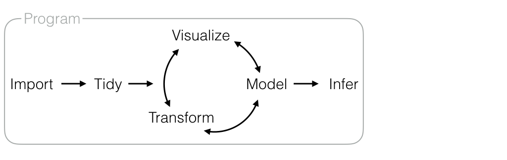
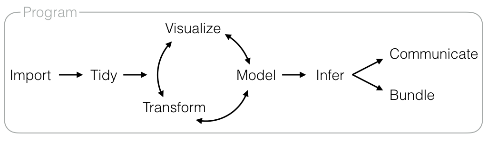
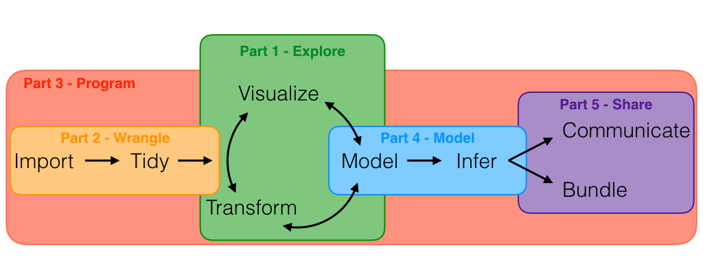

```{r include=FALSE}
knitr::opts_chunk$set(fig.height = 2)
```

# Exploratory Data Analysis (EDA)

## Introduction

This chapter will show you how to use visualization and transformation to explore your data in a systematic way, a task that statisticians call Exploratory Data Analysis, or EDA for short. EDA is an interative cycle that involves:

1. Forming questions about your data.

1. Searching for answers by visualizing, transforming, and modeling your data.

1. Using what you discover to refine your questions about the data, or 
   to choose new questions to investigate

EDA is not a formal process with a strict set of rules: you must be free to investigate every idea that occurs to you. Instead, EDA is a loose set of tactics that are more likely to lead to useful insights. This chapter will teach you a basic toolkit of these useful EDA techniques. Our discussion will lead to a model of data science itself, the model that I've built this book around. 

This chapter will point you towards many other interesting packages, more so than any other chapter in the book.

Also recommend the ggplot2 book <https://amzn.com/331924275X>. The 2nd edition was recently published so it's up-to-date. Contains a lot more details on visualisation. Unfortunately it's not free, but if you're at a university you can get electronic version for free through SpringerLink. This book doesn't contain as much visualisation as it probably should because you can use ggplot2 book as a reference as well.

### Prerequisites

In this chapter we'll combine what you've learned about dplyr and ggplot2 to iteratively ask questions, answer them with data, and then ask new questions.

```{r setup}
library(ggplot2)
library(dplyr)
```

## Questions

> "There are no routine statistical questions, only questionable statistical
> routines." --- Sir David Cox

> "Far better an approximate answer to the right question, which is often
> vague, than an exact answer to the wrong question, which can always be made
> precise." ---John Tukey

Your goal during EDA is to develop your understanding of your data. The easiest way to do this is to use questions as tools to guide your investigation. When you ask a question, the question focuses your attention on a specific part of your dataset and helps you decide which graphs, models, or transforamtions to make.

EDA is fundamentally a creative process. And like most creative processes, the key to asking _quality_ questions is to generate a large _quantity_ of questions. It is difficult to ask revealing questions at the start of your analysis because you do not know what insights are contained in your dataset. On the other hand, each new question that you ask will expose you to a new aspect of your data and increase your chance of making a discovery. You can quickly drill down into the most interesting parts of your data---and develop a set of thought provoking questions---if you follow up each question with a new question based on what you find.

There is no rule about which questions you should ask to guide your research. However, two types of questions will always be useful for making discoveries within your data. You can loosely word these questions as:

1. What type of **variation** occurs **within** my variables?

1. What type of **covariation** occurs **between** my variables?

The rest of this chapter will look at these two questions. I'll explain what variation and covariation are, and I'll show you several ways to answer each question. To make the discussion easier, let's define some terms: 

*   A __variable__ is a quantity, quality, or property that you can measure. 

*   A __value__ is the state of a variable when you measure it. The value of a
    variable may change from measurement to measurement.
  
*   An __observation__ is a set of measurements made under similar conditions
    (you usually make all of the measurements in an observation at the same 
    time and on the same object). An observation will contain several values, 
    each associated with a different variable. I'll sometimes refer to 
    an observation as a data point.

*   _tabular data_ is a set of values, each associated with a variable and an
    observation. Tabular data is _tidy_ if each value is placed in its own
    "cell", each variable in its own column, and each observation in its own 
    row. 

For now, assume all the data you see in this book is be tidy. You'll encounter lots of other data in practice, so we'll come back to these ideas again in [tidy data] where you'll learn how to tidy messy data.


## Variation

> "What type of variation occurs within my variables?"

**Variation** is the tendency of the values of a variable to change from measurement to measurement. You can see variation easily in real life; if you measure any continuous variable twice---and precisely enough, you will get two different results. This is true even if you measure quantities that are constant, like the speed of light (below). Each of your measurements will include a small amount of error that varies from measurement to measurement.

```{r, variation, echo = FALSE}
old <- options(digits = 7)
mat <- as.data.frame(matrix(morley$Speed + 299000, ncol = 10))
knitr::kable(
  mat, 
  col.names = rep("", ncol(mat)), 
  caption = "The speed of light is a universal constant, but variation due to measurement error obscures its value. In 1879, Albert Michelson measured the speed of light 100 times and observed 30 different values (in km/sec)."
)
options(old)
```

Discrete and categorical variables can also vary if you measure across different subjects (e.g. the eye colors of different people), or different times (e.g. the energy levels of an electron at different moments).

Every variable has its own pattern of variation, which can reveal interesting information. The best way to understand that pattern is to visualize the distribution of the values that you observe for the variable.

### Visualizing distributions

How you visualize the distribution of a variable will depend on whether the variable is categorical or continuous. A variable is **categorical** if it can only have a finite (or countably infinite) set of unique values. In R, categorical variables are usually saved as factors, integers, or character strings. To examine the distribution of a categorical variable, use a bar chart.

```{r}
ggplot(data = diamonds) +
  geom_bar(mapping = aes(x = cut))
```

The height of the bars displays how many observations occurred with each x value. You can compute these values manually with `dplyr::count()`. 

```{r}
diamonds %>% count(cut)
```

A variable is **continuous** if you can arrange its values in order _and_ an infinite number of unique values can exist between any two values of the variable. Numbers and date-times are two examples of continuous variables. To examine the distribution of a continuous variable, use a histogram.

```{r}
ggplot(data = diamonds) +
  geom_histogram(aes(x = carat), binwidth = 0.5)
```

A histogram divides the x axis into equally spaced intervals and then uses a bar to display how many observations fall into each interval. In the graph above, the tallest bar shows that almost 30,000 observations have a $carat$ value between 0.25 and 0.75, which are the left and right edges of the bar. 

You can set the width of the intervals in a histogram with the `binwidth` argument, which is measured in the units of the $x$ variable. You should always explore a variety of binwidths when working with histograms, as different binwidths can reveal different patterns. For example, here is how the graph above looks when we zoom into just the diamonds with a binwidth of less than three and choose a smaller binwidth.

```{r}
smaller <- diamonds %>% filter(carat < 3)
  
ggplot(data = smaller, mapping = aes(x = carat)) +
  geom_histogram(binwidth = 0.1)
```

If you wish to overlay multiple histograms in the same plot, I recommend using `geom_freqpoly()` instead of `geom_histogram()`. `geom_freqpoly()` performs the same calculation as `geom_histogram()`, but instead of displaying the counts with bars, uses lines instead. It's much easier to understand overlapping lines than bars.

```{r}
ggplot(data = smaller, mapping = aes(x = carat)) +
  geom_freqpoly(binwidth = 0.1)
```

Now that you can visualize variation, what should you look for in your plots? And what type of follow-up questions should you ask? I've put together a list below of the most useful types of information that you will find in your graphs, along with some follow up questions for each type of information. The key to asking good follow up questions will be to rely on your **curiosity** (What do you want to learn more about?) as well as your **skepticism** (How could this be misleading?).

### Typical values

In both bar charts and histograms, tall bars reveal common values of a variable. Shorter bars reveal rarer values. Places that do not have bars reveal values that were not seen in your data. To turn this information into useful questions, look for anything unexpected:

* Which values are the most common? Why?

* Which values are the rare? Why? Does that match your expectations?

* Can you see any unusual patterns? What might explain them?

As an example, the histogram below suggests several interesting questions: 

* Why are there more diamonds at whole carats and common fractions of carats?

* Why are there more diamonds slightly to the right of each peak than there 
  are slightly to the left of each peak?
  
* Why are there no diamonds bigger than 3 carats?

```{r}
ggplot(data = smaller, mapping = aes(x = carat)) +
  geom_histogram(binwidth = 0.01)
```

Clusters of similar values suggest that subgroups exist in your data. To understand the subgroups, ask:

* How are the observations within each cluster similar to each other?

* How are the observations in separate clusters different from each other?

* How can you explain or describe the clusters?

* Why might the appearance of clusters be misleading?

The histogram shows the length (in minutes) of 272 eruptions of the Old Faithful Geyser in Yellowstone National Park. Eruption times appear to be clustered in to two groups: there are short eruptions (of around 2 minutes) and long eruption (4-5 minutes), but little in between.

```{r}
ggplot(data = faithful, mapping = aes(x = eruptions)) + 
  geom_histogram(binwidth = 0.25)
```  

Many of the questions above will prompt you to explore a relationship *between* variables, for example, to see if the values of one variable can explain the behavior of another variable.

### Unusual values

Outliers are observations that are unusual; data points that are don't seem to fit the pattern. Sometimes outliers are data entry errors; other times outliers suggest important new science. When you have a lot of data, outliers are sometimes difficult to see in a histogram. 

For example, take this distribution of the `x` variable from the diamonds dataset. The only evidence of outliers is the unusually wide limits on the x-axis.

```{r}
ggplot(diamonds) + 
  geom_histogram(aes(x = y), binwidth = 0.5)
```   

This is because there are so many observations in the common bins that the rare bins are so short that you can't see them (although maybe if you stare intently at 0 you'll spot something). To make it easy to see the unusual vaues, we need to zoom into to small values of the y-axis with `coord_cartesian()`:

```{r}
ggplot(diamonds) + 
  geom_histogram(aes(x = y), binwidth = 0.5) +
  coord_cartesian(ylim = c(0, 50))
```   

(`coord_cartesian()` also has an `xlim()` argument for when you need to zoom into the x-axis. ggplot2 also has `xlim()` and `ylim()` functions that work slightly differently: they throw away the data outside the limits.)

This allows us to see that there are three unusual values: 0, ~30, and ~60. We pluck them out with dplyr: 

```{r}
unusual <- diamonds %>% 
  filter(y < 3 | y > 20) %>% 
  arrange(y)
unusual
```

The y variable measures one of the three dimensions of these diamonds in mm. We know that diamonds can't have a 0 measurement. So these must be invalid measurements. We might also suspect that measureents of 32mm and 59mm are implausible: those diamonds are over an inch long, but don't cost hundreds of thousands of dollars!

When you discover an outlier it's a good idea to trace it back as far as possible. You'll be in a much stronger analytical position if you can figure out why it happened. If you can't figure it out, and want to just move on with your analysis, it's a good idea to replace it with a missing value, which we'll discuss in the next section.

### Exercises

1.  Explore the distribution of each of the `x`, `y`, and `z` variables 
    in `diamonds`. What do you learn? Think about a diamond and how you
    might decide which dimension is the length, width, and depth.

1.  Explore the distribution of `price`. Do you discover anything unusual
    or surprising? (Hint: carefully think about the `binwidth` and make sure
    you)
    
1.  Compare and contract `coord_cartesian()` vs `xlim()`/`ylim()` when
    zooming in on a histogram. What happens if you leave `binwidth` unset?
    What happens if you try and zoom so only half a bar shows?
    
## Missing values

If you've encountered unusual values in your dataset, and simply want to move on to the rest of your analysis, you have two options.

1.  Drop the entire row with the strange values:

    ```{r}
    diamonds2 <- diamonds %>% filter(between(y, 3, 20))
    ```
    
    I don't recommend this option because just because one measurement
    is invalid, doesn't mean all the measurements are. Additionally, if you
    have very noisy data, you might find by time that you've applied this
    approach to every variable that you don't have any data left!

1.  Instead, I recommend replacing the unusual values with missing values.
    The easiest way to do this is use `mutate()` to replace the variable
    with a modified copy. You can use the `ifelse()` function to replace
    unusual values with `NA`:

    ```{r}
    diamonds2 <- diamonds %>% 
      mutate(y = ifelse(y < 3 | y > 20, NA, y))
    ```

ggplot2 subscribes to the philosophy that missing values should never silently go missing. It's not obvious where you should plot missing values, so ggplot2 doesn't include them in the plot, but does warn that they're been removed:

```{r}
ggplot(data = diamonds2, mapping = aes(x = x, y = y)) + 
  geom_point()
```

To suppress that warning, set `na.rm = TRUE`:

```{r}
ggplot(data = diamonds2, mapping = aes(x = x, y = y)) + 
  geom_point(na.rm = TRUE)
```

Other times you want to understand what makes observations with missing values different to observations with recorded values. For example, in `nycflights13::flights`, missing value in the `dep_time` variable indicate that the flight was cancelled. So you might want to compare the scheduled departure times for cancelled and non-cancelled times. You can do by making a new variable with `is.na()`.

```{r}
nycflights13::flights %>% 
  mutate(
    cancelled = is.na(dep_time),
    sched_hour = sched_dep_time %/% 100,
    sched_min =  sched_dep_time %% 100,
    sched_dep_time = sched_hour + sched_min / 60
  ) %>% 
  ggplot(mapping = aes(sched_dep_time)) + 
    geom_freqpoly(mapping = aes(colour = cancelled), binwidth = 1/4)
```

However this plot isn't great because there are many more non-cancelled flights than cancelled flights. In the next section we'll explore some techniques for making improving this comparison.

### Exercises

1.  Recall what the `na.rm = TRUE` argument does in `mean()` and `sum()`.
    Why is that a similar operation for `geom_point()`?

## Covariation

> "What type of covariation occurs between my variables?"

If variation describes the behavior _within_ a variable, covariation describes the behavior _between_ variables. **Covariation** is the tendency for the values of two or more variables to vary together in a correlated way. The best way to spot covariation is to visualize the relationship between two or more variables. How you do that should again depend on the type of variables involved.

### Visualizing one categorical variable and one continuous variable

It's common to want to explore the distribution of a continuous variable broken down by a categorical, as in the previous histogram. The default appearance of `geom_freqpoly()` is not that useful for that sort of comparison because the height is the count. That means if one of the groups is much smaller than the others, it's hard to see the differences in shape. For example, lets explore how the price of a diamond varies with its quality:

```{r}
ggplot(data = diamonds, mapping = aes(x = price)) + 
  geom_freqpoly(aes(colour = cut), binwidth = 500)
```

It's hard to see the difference in distribution because the overall counts differ so much:

```{r}
ggplot(diamonds, aes(cut)) + 
  geom_bar()
```

To make the comparison easier we need to swap what is displayed on the y-axis. Instead of display count, we'll display __density__, which is the count standardised so that the area under each frequency polygon is one.

```{r}
ggplot(data = diamonds, mapping = aes(x = price, y = ..density..)) + 
  geom_freqpoly(aes(colour = cut), binwidth = 500)
```

There's something rather surprising about this plot - it appears that fair diamonds (the lowest quality) have the highest average cut!  But maybe that's because frequency polygons are a little hard to interpret - there's a lot going on in this plot.

Another alternative to display the distribution of a continuous variable broken down by a categorical variable is the boxplot. A **boxplot** is a type of visual shorthand for a distribution of values that is popular among statisticians. Each boxplot consists of:

* A box that stretches from the 25th percentile of the distribution to the 
  75th percentile, a distance known as the Inter-Quartile Range (IQR). In the
  middle of the box is a line that displays the median, i.e. 50th percentile,
  of the distribution. These three lines give you a sense of the spread of the
  distribution and whether or not the distribution is symmetric about the
  median or skewed to one side. 

* Visual points that display observations that fall more than 1.5 times the 
  IQR from either edge of the box. These outlying points are unusual
  so are plotted individually

* A line (or whisker) that extends from each end of the box and goes to the   
  farthest non-outlier point in the distribution.

```{r, echo = FALSE}
knitr::include_graphics("images/EDA-boxplot.png")
```

Let's take a look at the distribution of price by cut using `geom_boxplot()`:

```{r fig.height = 3}
ggplot(data = diamonds, mapping = aes(x = cut, y = price)) +
  geom_boxplot()
```

We see much less information about the distribution, but the boxplots are much more compact so we can more easily compare them (and fit more on one plot). It supports the counterintuive finding that better quality diamonds are cheaper on average! In the exercises, you'll be challenged to figure out why.

`cut` is an ordered factor: fair is worse than good, which is wrose than very good and so on. Most factors are unordered, so it's fair game to reorder to display the results better. For example, take the `class` variable in the `mpg` dataset. You might be interested to know how hwy mileage varies across classes:

```{r}
ggplot(data = mpg, mapping = aes(x = class, y = hwy)) +
  geom_boxplot()
```

Covariation will appear as a systematic change in the medians or IQRs of the boxplots. To make the trend easier to see, wrap the $x$ variable with `reorder()`. The code below reorders the x axis based on the median hwy value of each group.

```{r fig.height = 3}
ggplot(data = mpg) +
  geom_boxplot(aes(x = reorder(class, hwy, FUN = median), y = hwy))
```

If you have long variable names, `geom_boxplot()` will work better if you flip it 90°. You can do that with `coord_flip()`.

```{r}
ggplot(data = mpg) +
  geom_boxplot(aes(x = reorder(class, hwy, FUN = median), y = hwy)) +
  coord_flip()
```

#### Exercises

1.  What variable in the diamonds dataset is most important for predicting
    the price of a diamond? How is that variable correlated with cut?
    Why does that combination lead to lower quality diamonds being more
    expensive.

1.  Install the ggstance pacakge, and create a horizontal boxplot.

1.  One problem with boxplots is that they were developed in an era of 
    much smaller datasets and tend to display an prohibitively large
    number of "outlying values". One approach to remedy this problem is
    the letter value plot. Install the lvplot package, and try using
    `geom_lvplot()` to display the distribution of price vs cut. What
    do you learn? How do you interpret the plots?

1.  Compare and contrast `geom_violin()` with a facetted `geom_histogram()`,
    or coloured `geom_freqpoly()`. What are the pros and cons of each 
    method?

1.  If you have a small dataset, it's sometimes useful to use `geom_jitter()`
    to see the relationship between a continuous and categorical variable.
    The ggbeeswarm package provides a number of methods similar to 
    `geom_jitter()`. List them and briefly describe what each one does.

### Visualizing two categorical variables

There are two basic techniques for visulaising covariation between categorical variables. One is to count the number of observations at each location and display the count with the size of a point. That's the job of `geom_count()`:

```{r}
ggplot(data = diamonds) +
  geom_count(mapping = aes(x = cut, y = color))
```

The size of each circle in the plot displays how many observations occurred at each combination of values. Covariation will appear as a strong correlation between specific x values and specific y values. As with bar charts, you can calculate the specific values with `count()`.

```{r}
diamonds %>% count(color, cut)
```

This allows you to reproduce `geom_count()` by hand, or instead of mapping count to `size`, you could instead use `geom_raster()` and map count to `fill`:

```{r}
diamonds %>% 
  count(color, cut) %>%  
  ggplot(mapping = aes(x = color, y = cut)) +
  geom_raster(aes(fill = n))
```

If the categorical variables are unordered, you might want to use the seriation package to simultaneously reorder the rows and columns in order to more clearly reveal interesting patterns. For larger plots, you might want to try the d3heatmap or heatmaply packages which creative interactive plots.

#### Exercises

1. How could you rescale the count dataset above to more clearly see
   the differences across colours or across cuts?

1. Use `geom_raster()` together with dplyr to explore how average flight
   delays vary by destination and month of year. 

### Vizualizing two continuous variables

You've already seen one great way to visualise the covariation between two continuous variables: a scatterplot, i.e. `geom_point()`. Covariation will appear as a structure or pattern in the data points. For example, an exponential relationship seems to exist between the carat size and price of a diamond.

```{r}
ggplot(data = diamonds) +
  geom_point(aes(x = carat, y = price))
```

Scatterplots become less useful as the size of your dataset grows, because points begin to pile up into areas of uniform black (as above). You can make patterns clear by binning the data with `geom_bin2d()` or `geom_hex()`.

`geom_bin2d()` and `geom_hex()` divide the coordinate plane into two dimensional bins and then use a fill color to display how many points fall into each bin. `geom_bin2d()` creates rectangular bins. `geom_hex()` creates hexagonal bins. You will need to install the hexbin package to use `geom_hex()`.

```{r fig.show='hold', fig.width=3}
ggplot(data = smaller) +
  geom_bin2d(aes(x = carat, y = price))

# install.packages("hexbin")
ggplot(data = smaller) +
  geom_hex(aes(x = carat, y = price))
```

Another option is to use grouping to discretize a continuous variable. Then you can use one of the techniques for visualising the combination of a discrete and a continuous variable.

```{r}
ggplot(data = smaller, mapping = aes(x = carat, y = price)) + 
  geom_boxplot(aes(group = cut_width(carat, 0.1)))
```

By default, boxplots look roughly the same (apart from number of outliers) regardless of how many observations there are. If you want the width of the boxplot to be proportional to the number of points, set `varwidth = TRUE`.

#### Exercises


## Asking questions about covariation

When you explore plots of covariation, look for the following sources of insight:

### Outliers

Two dimensional plots reveal outliers that are not visible in one dimensional plots. For example, some points in the plot below have an unusual combination of $x$ and $y$ values, which makes the points outliers even though their $x$ and $y$ values appear normal when examined separately.

```{r}
ggplot(data = diamonds) +
  geom_point(aes(x = x, y = y)) +
  coord_cartesian(xlim = c(4, 11), ylim = c(4, 11))
```

### Clusters

Two dimensional plots can also reveal clusters that may not be visible in one dimensional plots. For example, the two dimensional pattern in the plot below reveals two clusters, a separation that is not visible in the distribution of either variable by itself, as verified with a rug geom.

```{r fig.height = 3}
ggplot(data = iris, aes(y = Sepal.Length, x = Sepal.Width)) +
  geom_jitter() +
  geom_rug(position = "jitter")
```

### Patterns

Patterns in your data provide clues about relationships. If a systematic relationship exists between two variables it will appear as a pattern in the data. If you spot a pattern, ask yourself:

+ Could this pattern be due to coincidence (i.e. random chance)?

+ How can you describe the relationship implied by the pattern?

+ How strong is the relationship implied by the pattern?

+ What other variables might affect the relationship?

+ Does the relationship change if you look at individual subgroups of the data?

A scatterplot of Old Faithful eruption lengths versus the wait time between eruptions shows a pattern: longer wait times are associated with longer eruptions. The scatterplot also displays the two clusters that we noticed above.

```{r echo = FALSE, message = FALSE, fig.height = 2}
ggplot(faithful) + geom_point(aes(x = eruptions, y = waiting))
``` 

Patterns provide one of the most useful tools for data scientists because they reveal covariation. If you think of variation as a phenomenon that creates uncertainty, covariation is a phenomenon that reduces it. If two variables covary, you can use the values of one variable to make better predictions about the values of the second. If the covariation is due to a causal relationship (a special case), then you can use the value of one variable to control the value 
of the second.

## Models

Models are a rich tool for extracting patterns out of data. 

For example, consider the diamonds data. It's hard to understand the relationship between cut and price, because cut and carat, and carat and price are tightly related. It's possible to use a model to remove the very strong relationship between price and carat so we we can explore the subtleties that remain.

```{r}
library(modelr)

mod <- lm(log(price) ~ log(carat), data = diamonds)

diamonds2 <- diamonds %>% 
  add_residuals(mod) %>% 
  mutate(resid = exp(resid))

ggplot(data = diamonds2, mapping = aes(x = carat, y = resid)) + 
  geom_point()
```

```{r}
ggplot(data = diamonds2, mapping = aes(x = cut, y = resid)) + 
  geom_boxplot()
```

I'll postpone teaching you how to fit and interpret models with R until Part 4. Although models are something simple, descriptions of patterns, they are tied into the logic of statistical inference: if a model describes your data accurately _and_ your data is similar to the world at large, then your model should describe the world at large accurately. This chain of reasoning provides a basis for using models to make inferences and predictions. As a result, there is more to learn about models than we can examine here.

## A last word on variables, values, and observations

Variables, values, and observations provide a basis for EDA: _if a relationship exists between two_ variables, _then the relationship will exist between the_ values _of those variables when those values are measured in the same_ observation. As a result, relationships between variables will appear as patterns in your data.

Within any particular observation, the exact form of the relationship between variables may be obscured by mediating factors, measurement error, or random noise; which means that the patterns in your data will appear as signals obscured by noise. 

Due to a quirk of the human cognitive system, the easiest way to spot signal amidst noise is to visualize your data. The concepts of variables, values, and observations have a role to play here as well. To visualize your data, represent each observation with its own geometric object, such as a point. Then map each variable to an aesthetic property of the point, setting specific values of the variable to specific levels of the aesthetic. You could also compute group-level statistics from your data (i.e. new observations) and map them to geoms, something that `geom_bar()`, `geom_boxplot()` and other geoms do for you automatically.

You now know how to explore the variables displayed in your dataset, but you should know that these are not the only variables in your data. Nor are the observations that are displayed in your data the only observations. You can use the values in your data to compute new variables or to measure new (group-level) observations. These new variables and observations provide a further source of insights that you can explore with visualizations, clustering algorithms, and models.

## EDA and Data Science

As a term, "data science" has been used in different ways by many people. This fluidity is necessary for a term that describes a wide breadth of activity, as data science does. Nonetheless, you can use the principles in this chapter to build a general model of data science. The model requires one limit to the definition of data science: data science must rely in some way on human judgement applied to data.

To judge or interpret the information in a dataset, you must first comprehend that information, which is difficult to do. The easiest way to comprehend data is to visualize, transform, and model it, a process that we have referred to as Exploratory Data Analysis. 

```{r, echo = FALSE}

```

Once you comprehend the information in your data, you can use it to make inferences from your data. Often this involves making deductions from a model. This is what you do when you conduct a hypothesis test, make a prediction (with or without a confidence interval), or score cases in a database.

```{r, echo = FALSE}

```

But all of this work will involve a computer; you cannot do it in your head, nor on paper with a pencil. To work efficiently, you will need to know how to program in a computer language, such as R. You will also need to know how to import data to use with the computer language, and how to tidy the data into the format that works best for that computer language.

```{r, echo = FALSE}

```

Finally, if your work is meaningful at all, it will have an audience, which means that you will need to share your work in a way that your audience can understand. Your audience might be fellow scientists who will want to reproduce the work, non-scientists who will want to understand your findings in plain terms, or yourself (in the future) who will be thankful if you make your work easy to re-learn and recreate. To satisfy these audiences, you may choose to communicate your results in a report or to bundle your work into some type of useful format, like an R package or a Shiny app.

```{r, echo = FALSE}

```

This model of data science forms a road map for the rest of the book. 

* Part 1 of the book covered the central tasks of the model above, Exploratory Data Analysis. 

* Part 2 will cover the logistical tasks of working with data in a computer language: importing and tidying the data, skills I call Data Wrangling. 

* Part 3 will teach you some of the most efficient ways to program in R with data. 

* Part 4 will discuss models and how to apply them. 

* Part 5 will teach you R Markdown, the most popular format for reporting and reproducing the results of an R analysis.

```{r, echo = FALSE}

```
