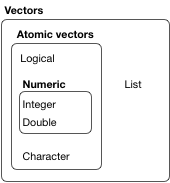
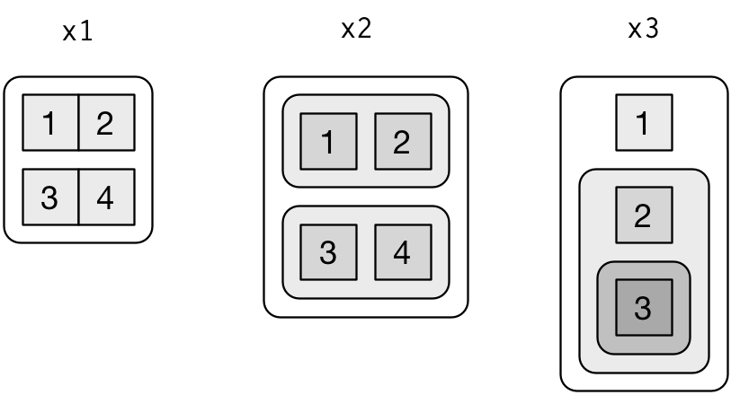
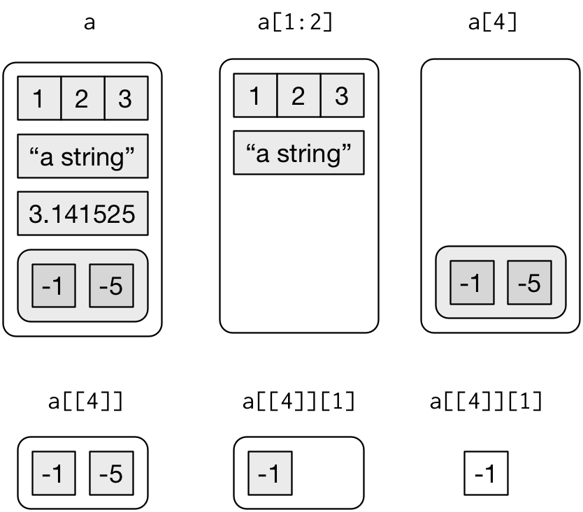
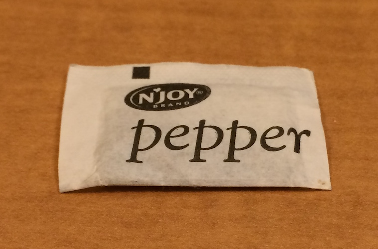

# Vectors

## Introduction

So far this book has focussed on tibbles and packages that work with them. But as you start to write your own functions, and dig deeper into R, you need to learn about vectors, the objects that underlie tibbles. If you've learned R in a more traditional way, you're probably already familiar with vectors, as most R resources start with vectors and work their way up to tibbles. I think it's better to start with tibbles because they're immediately useful, and then work your way down to the underlying components.

Vectors are particularly important as most of the functions you will write will work with vectors. It is possible to write functions that work with tibbles (like ggplot2, dplyr, and tidyr), but the tools you need to write such functions are currently idiosyncratic and immature. I am working on a better approach, <https://github.com/hadley/lazyeval>, but it will not be ready in time for the publication of the book. Even when complete, you'll still need to understand vectors, it'll just make it easier to write a user-friendly layer on top.

### Prerequisites

The focus of this chapter is on base R data structures, so it isn't essential to load any packages. We will, however, use a handful of functions from the __purrr__ package to avoid some inconsistencies in base R.

```{r setup, message = FALSE}
library(tidyverse)
```

## Vector basics

There are two types of vectors:

1. __Atomic__ vectors, of which there are six types:
  __logical__, __integer__, __double__,  __character__, __complex__, and 
  __raw__. Integer and double vectors are collectively known as
  __numeric__ vectors. 

1. __Lists__,  which are sometimes called recursive vectors because lists can 
  contain other lists. 

The chief difference between atomic vectors and lists is that atomic vectors are __homogeneous__, while lists can be __heterogeneous__. There's one other related object: `NULL`. `NULL` is often used to represent the absence of a vector (as opposed to `NA` which is used to represent the absence of a value in a vector). `NULL` typically behaves like a vector of length 0. Figure \@ref(fig:datatypes) summarises the interrelationships. 

```{r datatypes, echo = FALSE, out.width = "50%", fig.cap = "The hierarchy of R's vector types"}

```

Every vector has two key properties: 

1.  Its __type__, which you can determine with `typeof()`.

    ```{r}
    typeof(letters)
    typeof(1:10)
    ```

1. Its __length__, which you can determine with `length()`.

    ```{r}
    x <- list("a", "b", 1:10)
    length(x)
    ```

Vectors can also contain arbitrary additional metadata in the form of attributes. These attributes are used to create __augmented vectors__ which build on additional behaviour. There are three important types of augmented vector:

* Factors are built on top of integer vectors.
* Dates and date-times are built on top of numeric vectors.
* Data frames and tibbles are built on top of lists.

This chapter will introduce you to these important vectors from simplest to most complicated. You'll start with atomic vectors, then build up to lists, and finish off with augmented vectors.

## Important types of atomic vector

The four most important types of atomic vector are logical, integer, double, and character. Raw and complex are rarely used during a data analysis, so I won't discuss them here.

### Logical

Logical vectors are the simplest type of atomic vector because they can take only three possible values: `FALSE`, `TRUE`, and `NA`. Logical vectors are usually constructed with comparison operators, as described in [comparisons]. You can also create them by hand with `c()`:

```{r}
1:10 %% 3 == 0

c(TRUE, TRUE, FALSE, NA)
```

### Numeric

Integer and double vectors are known collectively as numeric vectors. In R, numbers are doubles by default. To make an integer, place an `L` after the number:

```{r}
typeof(1)
typeof(1L)
1.5L
```

The distinction between integers and doubles is not usually important, but there are two important differences that you should be aware of:

1.  Doubles are approximations. Doubles represent floating point numbers that 
    can not always be precisely represented with a fixed amount of memory. 
    This means that you should consider all doubles to be approximations. 
    For example, what is square of the square root of two?

    ```{r}
    x <- sqrt(2) ^ 2
    x
    x - 2
    ```

    This behaviour is common when working with floating point numbers: most
    calculations include some approximation error. Instead of comparing floating
    point numbers using `==`, you should use `dplyr::near()` which allows for 
    some numerical tolerance.

1.  Integers have one special value: `NA`, while doubles have four:
    `NA`, `NaN`, `Inf` and `-Inf`. All three special values `NaN`, `Inf` and `-Inf` can arise during division:
   
    ```{r}
    c(-1, 0, 1) / 0
    ```

    Avoid using `==` to check for these other special values. Instead use the 
    helper functions `is.finite()`, `is.infinite()`, and `is.nan()`:
    
    |                  |  0  | Inf | NA  | NaN |
    |------------------|-----|-----|-----|-----|
    | `is.finite()`    |  x  |     |     |     |
    | `is.infinite()`  |     |  x  |     |     |
    | `is.na()`        |     |     |  x  |  x  |
    | `is.nan()`       |     |     |     |  x  |

### Character

Character vectors are the most complex type of atomic vector, because each element of a character vector is a string, and a string can contain an arbitrary amount of data. 

You've already learned a lot about working with strings in [strings]. Here I wanted to mention one important feature of the underlying string implementation: R uses a global string pool. This means that each unique string is only stored in memory once, and every use of the string points to that representation. This reduces the amount of memory needed by duplicated strings. You can see this behaviour in practice with `pryr::object_size()`:

```{r}
x <- "This is a reasonably long string."
pryr::object_size(x)

y <- rep(x, 1000)
pryr::object_size(y)
```

`y` doesn't take up 1,000x as much memory as `x`, because each element of `y` is just a pointer to that same string. A pointer is 8 bytes, so 1000 pointers to a 136 B string is 8 * 1000 + 136 = 8.13 kB.

### Missing values

Note that each type of atomic vector has its own missing value:

```{r}
NA            # logical
NA_integer_   # integer
NA_real_      # double
NA_character_ # character
```

Normally you don't need to know about these different types because you can always use `NA` and it will be converted to the correct type using the implicit coercion rules described next. However, there are some functions that are strict about their inputs, so it's useful to have this knowledge sitting in your back pocket so you can be specific when needed.

### Exercises

1.  Describe the difference between `is.finite(x)` and  `!is.infinite(x)`.

1.  Read the source code for `dplyr::near()` (Hint: to see the source code,
    drop the `()`). How does it work? 

1.  A logical vector can take 3 possible values. How many possible
    values can an integer vector take? How many possible values can
    a double take? Use google to do some research.

1.  Brainstorm at least four functions that allow you to convert a double to an
    integer. How do they differ? Be precise.
    
1.  What functions from the readr package allow you to turn a string
    into logical, integer, and double vector?

## Using atomic vectors

Now that you understand the different types of atomic vector, it's useful to review some of the important tools for working with them. These include:

1.  How to convert from one type to another, and when that happens
    automatically.

1.  How to tell if an object is a specific type of vector.

1.  What happens when you work with vectors of different lengths.

1.  How to name the elements of a vector.

1.  How to pull out elements of interest.

### Coercion

There are two ways to convert, or coerce, one type of vector to another:

1.  Explicit coercion happens when you call a function like `as.logical()`,
    `as.integer()`, `as.double()`, or `as.character()`. Whenever you find
    yourself using explicit coercion, you should always check whether you can
    make the fix upstream, so that the vector never had the wrong type in 
    the first place. For example, you may need to tweak your readr 
    `col_types` specification.

1.  Implicit coercion happens when you use a vector in a specific context
    that expects a certain type of vector. For example, when you use a logical
    vector with a numeric summary function, or when you use a double vector
    where an integer vector is expected.
    
Because explicit coercion is used relatively rarely, and is largely easy to understand, I'll focus on implicit coercion here. 

You've already seen the most important type of implicit coercion: using a logical vector in a numeric context. In this case `TRUE` is converted to `1` and `FALSE` converted to `0`. That means the sum of a logical vector is the number of trues, and the mean of a logical vector is the proportion of trues:

```{r}
x <- sample(20, 100, replace = TRUE)
y <- x > 10
sum(y)  # how many are greater than 10?
mean(y) # what proportion are greater than 10?
```

You may see some code (typically older) that relies on implicit coercion in the opposite direction, from integer to logical:

```{r, eval = FALSE}
if (length(x)) {
  # do something
}
```

In this case, 0 is converted to `FALSE` and everything else is converted to `TRUE`. I think this makes it harder to understand your code, and I don't recommend it. Instead be explicit: `length(x) > 0`.

It's also important to understand what happens when you try and create a vector containing multiple types with `c()`: the most complex type always wins.

```{r}
typeof(c(TRUE, 1L))
typeof(c(1L, 1.5))
typeof(c(1.5, "a"))
```

An atomic vector can not have a mix of different types because the type is a property of the complete vector, not the individual elements. If you need to mix multiple types in the same vector, you should use a list, which you'll learn about shortly.

### Test functions

Sometimes you want to do different things based on the type of vector. One option is to use `typeof()`. Another is to use a test function which returns a `TRUE` or `FALSE`. Base R provides many functions like `is.vector()` and `is.atomic()`, but they often return surprising results. Instead, it's safer to use the `is_*` functions provided by purrr, which are summarised in the table below.

|                  | lgl | int | dbl | chr | list |
|------------------|-----|-----|-----|-----|------|
| `is_logical()`   |  x  |     |     |     |      |
| `is_integer()`   |     |  x  |     |     |      |
| `is_double()`    |     |     |  x  |     |      |
| `is_numeric()`   |     |  x  |  x  |     |      |
| `is_character()` |     |     |     |  x  |      |
| `is_atomic()`    |  x  |  x  |  x  |  x  |      |
| `is_list()`      |     |     |     |     |  x   |
| `is_vector()`    |  x  |  x  |  x  |  x  |  x   |

Each predicate also comes with a "scalar" version, like `is_scalar_atomic()`, which checks that the length is 1. This is useful, for example, if you want to check that an argument to your function is a single logical value.

### Scalars and recycling rules

As well as implicitly coercing the types of vectors to be compatible, R will also implicitly coerce the length of vectors. This is called vector __recycling__, because the shorter vector is repeated, or recycled, to the same length as the longer vector. 

This is generally most useful when you are mixing vectors and "scalars". I put scalars in quotes because R doesn't actually have scalars: instead, a single number is a vector of length 1. Because there are no scalars, most built-in functions are __vectorised__, meaning that they will operate on a vector of numbers. That's why, for example, this code works:

```{r}
sample(10) + 100
runif(10) > 0.5
```

In R, basic mathematical operations work with vectors. That means that you should never need to perform explicit iteration when performing simple mathematical computations.

It's intuitive what should happen if you add two vectors of the same length, or a vector and a "scalar", but what happens if you add two vectors of different lengths?

```{r}
1:10 + 1:2
```

Here, R will expand the shortest vector to the same length as the longest, so called recycling. This is silent except when the length of the longer is not an integer multiple of the length of the shorter:

```{r}
1:10 + 1:3
```

While vector recycling can be used to create very succinct, clever code, it can also silently conceal problems. For this reason, the vectorised functions in tidyverse will throw errors when you recycle anything other than a scalar. If you do want to recycle, you'll need to do it yourself with `rep()`:

```{r, error = TRUE}
tibble(x = 1:4, y = 1:2)

tibble(x = 1:4, y = rep(1:2, 2))

tibble(x = 1:4, y = rep(1:2, each = 2))
```

### Naming vectors

All types of vectors can be named. You can name them during creation with `c()`:

```{r}
c(x = 1, y = 2, z = 4)
```

Or after the fact with `purrr::set_names()`:

```{r}
set_names(1:3, c("a", "b", "c"))
```

Named vectors are most useful for subsetting, described next.

### Subsetting {#vector-subsetting}

So far we've used `dplyr::filter()` to filter the rows in a tibble. `filter()` only works with tibble, so we'll need new tool for vectors: `[`. `[` is the subsetting function, and is called like `x[a]`. There are four types of things that you can subset a vector with:

1.  A numeric vector containing only integers. The integers must either be all 
    positive, all negative, or zero.
    
    Subsetting with positive integers keeps the elements at those positions:
    
    ```{r}
    x <- c("one", "two", "three", "four", "five")
    x[c(3, 2, 5)]
    ```
    
    By repeating a position, you can actually make a longer output than 
    input:
    
    ```{r}
    x[c(1, 1, 5, 5, 5, 2)]
    ```
    
    Negative values drop the elements at the specified positions:
    
    ```{r}
    x[c(-1, -3, -5)]
    ```
    
    It's an error to mix positive and negative values:
    
    ```{r, error = TRUE}
    x[c(1, -1)]
    ```

    The error message mentions subsetting with zero, which returns no values:
    
    ```{r}
    x[0]
    ```
    
    This is not useful very often, but it can be helpful if you want to create 
    unusual data structures to test your functions with.
  
1.  Subsetting with a logical vector keeps all values corresponding to a
    `TRUE` value. This is most often useful in conjunction with the 
    comparison functions.
    
    ```{r}
    x <- c(10, 3, NA, 5, 8, 1, NA)
    
    # All non-missing values of x
    x[!is.na(x)]
    
    # All even (or missing!) values of x
    x[x %% 2 == 0]
    ```

1.  If you have a named vector, you can subset it with a character vector:
    
    ```{r}
    x <- c(abc = 1, def = 2, xyz = 5)
    x[c("xyz", "def")]
    ```
    
    Like with positive integers, you can also use a character vector to 
    duplicate individual entries.

1.  The simplest type of subsetting is nothing, `x[]`, which returns the 
    complete `x`. This is not useful for subsetting vectors, but it is useful
    when subsetting matrices (and other high dimensional structures) because
    it lets you select all the rows or all the columns, by leaving that
    index blank. For example, if `x` is 2d, `x[1, ]` selects the first row and 
    all the columns, and `x[, -1]` selects all rows and all columns except
    the first.
    
To learn more about the applications of subsetting, reading the "Subsetting" chapter of _Advanced R_: <http://adv-r.had.co.nz/Subsetting.html#applications>.

There is an important variation of `[` called `[[`. `[[` only ever extracts a single element, and always drops names. It's a good idea to use it whenever you want to make it clear that you're extracting a single item, as in a for loop. The distinction between `[` and `[[` is most important for lists, as we'll see shortly.

### Exercises

1.  What does `mean(is.na(x))` tell you about a vector `x`? What about
    `sum(!is.finite(x))`?

1.  Carefully read the documentation of `is.vector()`. What does it actually
    test for? Why does `is.atomic()` not agree with the definition of 
    atomic vectors above?
    
1.  Compare and contrast `setNames()` with `purrr::set_names()`.

1.  Create functions that take a vector as input and returns:
    
    1. The last value.  Should you use `[` or `[[`?

    1. The elements at even numbered positions.
    
    1. Every element except the last value.
    
    1. Only even numbers (and no missing values).

1.  Why is `x[-which(x > 0)]` not the same as `x[x <= 0]`? 

1.  What happens when you subset with a positive integer that's bigger
    than the length of the vector? What happens when you subset with a 
    name that doesn't exist?

## Recursive vectors (lists) {#lists}

Lists are a step up in complexity from atomic vectors, because lists can contain other lists. This makes them suitable for representing hierarchical or tree-like structures. You create a list with `list()`:

```{r}
x <- list(1, 2, 3)
x
```

A very useful tool for working with lists is `str()` because it focusses on the **str**ucture, not the contents.

```{r}
str(x)

x_named <- list(a = 1, b = 2, c = 3)
str(x_named)
```

Unlike atomic vectors, `list()` can contain a mix of objects:

```{r}
y <- list("a", 1L, 1.5, TRUE)
str(y)
```

Lists can even contain other lists!

```{r}
z <- list(list(1, 2), list(3, 4))
str(z)
```

### Visualising lists

To explain more complicated list manipulation functions, it's helpful to have a visual representation of lists. For example, take these three lists:

```{r}
x1 <- list(c(1, 2), c(3, 4))
x2 <- list(list(1, 2), list(3, 4))
x3 <- list(1, list(2, list(3)))
```

I'll draw them as follows:

```{r, echo = FALSE, out.width = "75%"}

```

There are three principles:

1.  Lists have rounded corners. Atomic vectors have square corners.
  
1.  Children are drawn inside their parent, and have a slightly darker
    background to make it easier to see  the hierarchy.
  
1.  The orientation of the children (i.e. rows or columns) isn't important, 
    so I'll pick a row or column orientation to either save space or illustrate 
    an important property in the example.

### Subsetting

There are three ways to subset a list, which I'll illustrate with a list named `a`:

```{r}
a <- list(a = 1:3, b = "a string", c = pi, d = list(-1, -5))
```

*   `[` extracts a sub-list. The result will always be a list.

    ```{r}
    str(a[1:2])
    str(a[4])
    ```
    
    Like with vectors, you can subset with a logical, integer, or character
    vector.
    
*   `[[` extracts a single component from a list. It removes a level of 
    hierarchy from the list.

    ```{r}
    str(a[[1]])
    str(a[[4]])
    ```

*   `$` is a shorthand for extracting named elements of a list. It works
    similarly to `[[` except that you don't need to use quotes.
    
    ```{r}
    a$a
    a[["a"]]
    ```

The distinction between `[` and `[[` is really important for lists, because `[[` drills down into the list while `[` returns a new, smaller list. Compare the code and output above with the visual representation in Figure \@ref(fig:lists-subsetting).

```{r lists-subsetting, echo = FALSE, out.width = "75%", fig.cap = "Subsetting a list, visually."}

```

### Lists of condiments

The difference between `[` and `[[` is very important, but it's easy to get confused. To help you remember, let me show you an unusual pepper shaker.

```{r, echo = FALSE, out.width = "25%"} 

```

If this pepper shaker is your list `x`, then, `x[1]` is a pepper shaker containing a single pepper packet:

```{r, echo = FALSE, out.width = "25%"} 

```

`x[2]` would look the same, but would contain the second packet. `x[1:2]` would be a pepper shaker containing two pepper packets. 

`x[[1]]` is:

```{r, echo = FALSE, out.width = "25%"} 

```

If you wanted to get the content of the pepper package, you'd need `x[[1]][[1]]`:

```{r, echo = FALSE, out.width = "25%"} 

```

### Exercises

1.  Draw the following lists as nested sets:

    1.  `list(a, b, list(c, d), list(e, f))`
    1.  `list(list(list(list(list(list(a))))))`

1.  What happens if you subset a tibble as if you're subsetting a list?
    What are the key differences between a list and a tibble?

## Attributes

Any vector can contain arbitrary additional metadata through its __attributes__. You can think of attributes as named list of vectors that can be attached to any object. 
You can get and set individual attribute values with `attr()` or see them all at once with `attributes()`.

```{r}
x <- 1:10
attr(x, "greeting")
attr(x, "greeting") <- "Hi!"
attr(x, "farewell") <- "Bye!"
attributes(x)
```

There are three very important attributes that are used to implement fundamental parts of R:

1. __Names__ are used to name the elements of a vector.
1. __Dimensions__ (dims, for short) make a vector behave like a matrix or array.
1. __Class__ is used to implement the S3 object oriented system.

You've seen names above, and we won't cover dimensions because we don't use matrices in this book. It remains to describe the class, which controls how __generic functions__ work. Generic functions are key to object oriented programming in R, because they make functions behave differently for different classes of input. A detailed discussion of object oriented programming is beyond the scope of this book, but you can read more about it in _Advanced R_ at <http://adv-r.had.co.nz/OO-essentials.html#s3>.

Here's what a typical generic function looks like:

```{r}
as.Date
```

The call to "UseMethod" means that this is a generic function, and it will call a specific __method__, a function, based on the class of the first argument. (All methods are functions; not all functions are methods). You can list all the methods for a generic with `methods()`:

```{r}
methods("as.Date")
```

For example, if `x` is a character vector, `as.Date()` will call `as.Date.character()`; if it's a factor, it'll call `as.Date.factor()`.

You can see the specific implementation of a method with `getS3method()`:

```{r}
getS3method("as.Date", "default")
getS3method("as.Date", "numeric")
```

The most important S3 generic is `print()`: it controls how the object is printed when you type its name at the console. Other important generics are the subsetting functions `[`, `[[`, and `$`. 

## Augmented vectors

Atomic vectors and lists are the building blocks for other important vector types like factors and dates. I call these __augmented vectors__, because they are vectors with additional __attributes__, including class. Because augmented vectors have a class, they behave differently to the atomic vector on which they are built. In this book, we make use of four important augmented vectors:

* Factors
* Dates 
* Date-times
* Tibbles

These are described below.

### Factors

Factors are designed to represent categorical data that can take a fixed set of possible values. Factors are built on top of integers, and have a levels attribute:

```{r}
x <- factor(c("ab", "cd", "ab"), levels = c("ab", "cd", "ef"))
typeof(x)
attributes(x)
```

### Dates and date-times

Dates in R are numeric vectors that represent the number of days since 1 January 1970.

```{r}
x <- as.Date("1971-01-01")
unclass(x)

typeof(x)
attributes(x)
```

Date-times are numeric vectors with class `POSIXct` that represent the number of seconds since 1 January 1970. (In case you were wondering, "POSIXct" stands for "Portable Operating System Interface", calendar time.)

```{r}
x <- lubridate::ymd_hm("1970-01-01 01:00")
unclass(x)

typeof(x)
attributes(x)
```

The `tzone` attribute is optional. It controls how the time is printed, not what absolute time it refers to.

```{r}
attr(x, "tzone") <- "US/Pacific"
x

attr(x, "tzone") <- "US/Eastern"
x
```

There is another type of date-times called POSIXlt. These are built on top of named lists:

```{r}
y <- as.POSIXlt(x)
typeof(y)
attributes(y)
```

POSIXlts are rare inside the tidyverse. They do crop up in base R, because they are needed to extract specific components of a date, like the year or month. Since lubridate provides helpers for you to do this instead, you don't need them. POSIXct's are always easier to work with, so if you find you have a POSIXlt, you should always convert it to a regular data time `lubridate::as_date_time()`.

### Tibbles

Tibbles are augmented lists: they have class "tbl_df" + "tbl" + "data.frame", and `names` (column) and `row.names` attributes:

```{r}
tb <- tibble::tibble(x = 1:5, y = 5:1)
typeof(tb)
attributes(tb)
```

The difference between a tibble and a list is that all the elements of a data frame must be vectors with the same length. All functions that work with tibbles enforce this constraint.

Traditional data.frames have a very similar structure:

```{r}
df <- data.frame(x = 1:5, y = 5:1)
typeof(df)
attributes(df)
```

The main difference is the class. The class of tibble includes "data.frame" which means tibbles inherit the regular data frame behaviour by default.

### Exercises

1.  What does `hms::hms(3600)` return? How does it print? What primitive
    type is the augmented vector built on top of? What attributes does it 
    use?
    
1.  Try and make a tibble that has columns with different lengths. What
    happens?

1.  Based on the definition above, is it ok to have a list as a
    column of a tibble?
