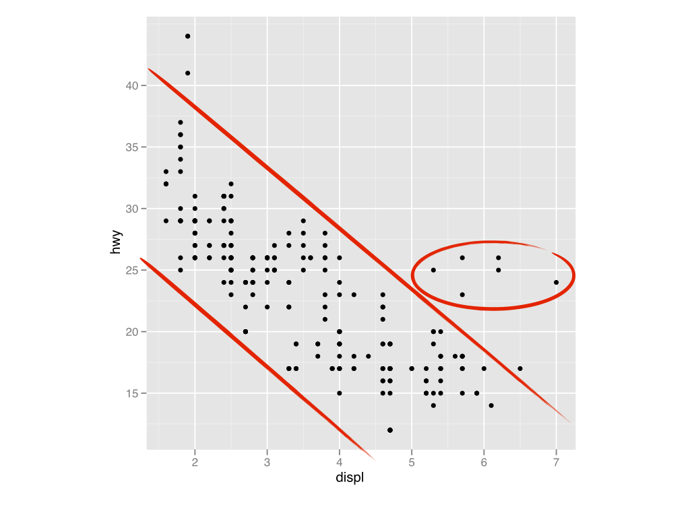
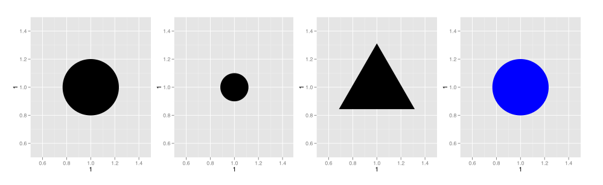

# Data visualisation

```{r setup-visualise, include = FALSE}
knitr::opts_chunk$set(
  cache = TRUE,
  fig.path = "figures/visualize/"
)
```

> "The simple graph has brought more information to the data analyst’s mind than any other device."---John Tukey

Visualization makes data decipherable. Consider what it is like to study a table of raw data. You can examine a couple of values at a time, but you cannot attend to many values at once. The data overloads your attention span, which makes it hard to spot patterns in the data. See this for yourself; can you spot the striking relationship between $X$ and $Y$ in the table below?

```{r data, echo=FALSE}
x <- rep(seq(0.2, 1.8, length = 5), 2) + runif(10, -0.15, 0.15)
X <- c(0.02, x, 1.94)
Y <- sqrt(1 - (X - 1)^2)
Y[1:6] <- -1 * Y[1:6]
Y <- Y - 1
order <- sample(1:10)
knitr::kable(round(data.frame(X = X[order], Y = Y[order]), 2))
```

Raw data is difficult to comprehend, but visualized data is easy to understand. Once you plot your data, you can see the relationships between data points---instantly. For example, the graph below shows the same data as above. Here, the relationship between the points is obvious.

```{r echo=FALSE, dependson=data}
ggplot2::qplot(X, Y) + ggplot2::coord_fixed(ylim = c(-2.5, 2.5), xlim = c(-2.5, 2.5))
```

This chapter will teach you how to visualize your data with R and the `ggplot2` package. R contains several systems for making graphs, but the `ggplot2` system is one of the most beautiful and most versatile. `ggplot2` implements the *grammar of graphics*, a coherent system for describing and building graphs. With `ggplot2`, you can do more faster by learning one system and applying it in many places.

### Outline

*Section 1* will get you started making graphs right away. You'll learn how to use the grammar of graphics to make any type of plot.

*Section 2* will show you how to prepare your plots for communication. You'll learn how to make your plots more legible with titles, labels, zooming, and default visual themes. 

### Prerequisites

To access the data sets and functions that we will use in this chapter, load the `ggplot2` package:

```{r echo = FALSE, message = FALSE, warning = FALSE}
library(ggplot2)
```

```{r eval = FALSE}
install.packages("ggplot2")
library(ggplot2)
```

## The Layered Grammar of Graphics

The grammar of graphics is a language for describing graphs. Once you learn the language, you can use it to build graphs with `ggplot2`; but how should you learn the language?

Have you ever tried to learn a language by only studying its rules, vocabulary, and syntax? That's how I tried to learn Spanish in college, and now I speak _un muy, muy, poquito_.

It is far better to learn a language by actually speaking it! And that's what we'll do here; we'll learn the grammar of graphics by making a series of plots. Don't worry if things seem confusing at first, by the end of the section everything will come together in a clear way.

Let's use our first graph to answer a question: Do cars with big engines use more fuel than cars with small engines? You probably already have an answer, but try to make your answer precise. What does the relationship between engine size and fuel efficieny look like? Is it positive? Negative? Linear? Nonlinear? Strong? Weak?

You can test your answer with the `mpg` data set in the `ggplot2` package. The data set contains observations collected by the EPA on 38 models of car. Among the variables in `mpg` are 

1. `displ` - a car's engine size in litres, and 
2. `hwy` - a car's fuel efficiency on the highway in miles per gallon (mpg). A car with a low fuel efficiency consumes more fuel than a car with a high fuel efficiency when they travel the same distance. 

To learn more about `mpg`, open its help page with the command `?mpg`.

***

*Tip*: If you have trouble loading `mpg`, its help page, or any of the functions in this chapter, you may need to reload the `ggplot2` package with the command below. You will need to reload the package each time you start a new R session.

```{r eval=FALSE}
library(ggplot2)
```

***

### Scatterplots

The easiest way to understand the `mpg` data set is to visualize it, which means that it is time to make our first plot. To do this, open an R session and run the code below. The code plots the `displ` variable of `mpg` against the `hwy` variable to make the plot below. Does the plot confirm your hypothesis about fuel efficiency and engine size? 

```{r}
ggplot(data = mpg) + 
  geom_point(mapping = aes(x = displ, y = hwy))
```

The plot shows a negative relationship between engine size (`displ`) and fuel efficiency (`hwy`). In other words, cars with big engines use more fuel. But the plot shows us something else as well. 

One group of points seems to fall outside of the linear trend. These cars have a higher mileage than you might expect. Can you tell why? Before we examine these cars, let's review the code that made our plot.

```{r, echo = FALSE}

```

#### Template

Our code is almost a template for making plots with `ggplot2`.

```{r eval=FALSE}
ggplot(data = mpg) + 
  geom_point(mapping = aes(x = displ, y = hwy))
```

With `ggplot2`, you begin a plot with the function `ggplot()`. `ggplot()` doesn't create a plot by itself; instead it initializes a new plot that you can add layers to. 

The first argument of `ggplot()` is the data set to use in the graph. So `ggplot(data = mpg)` initializes a graph that will use the `mpg` data set.

You complete your graph by adding one or more layers to `ggplot()`. Here, the function `geom_point()` adds a layer of points to the plot, which creates a scatterplot. `ggplot2` comes with other geom functions that you can use as well. Each function creates a different type of layer, and each function takes a mapping argument.

The mapping argument of your geom function explains where your points should go. You must set `mapping` to a call to `aes()`. The `x` and `y` arguments of `aes()` explain which variables to map to the x and y axes of the graph. `ggplot()` will look for those variables in your data set, `mpg`.

This code suggests a minimal template for making graphs with `ggplot2`. To make a graph, replace the bracketed sections in the code below with a data set, a geom function, or a set of mappings.

```{r eval = FALSE}
ggplot(data = <DATA>) + 
  <GEOM_FUNCTION>(mapping = aes(<MAPPINGS>))
```

#### Aesthetic Mappings

> "The greatest value of a picture is when it forces us to notice what we never expected to see."---John Tukey

Our plot above revealed a group of cars that had better than expected mileage. How can you explain these cars? 

Let's hypothesize that the cars are hybrids. One way to test this hypothesis is to look at the `class` value for each car. The `class` variable of the `mpg` data set classifies cars into groups such as compact, midsize, and suv. If the outlying points are hybrids, they should be classified as compact cars or, perhaps, subcompact cars (keep in mind that this data was collected before hybrid trucks and suvs became popular).

You can add a third value, like `class`, to a two dimensional scatterplot by mapping it to an _aesthetic_.

An aesthetic is a visual property of the points in your plot. Aesthetics include things like the size, the shape, or the color of your points. You can display a point (like the one below) in different ways by changing the values of its aesthetic properties. Since we already use the word "value" to describe data, let's use the word "level" to describe aesthetic properties. Here we change the levels of a point's size, shape, and color to make the point small, trianglular, or blue.

```{r, echo = FALSE}

```

You can convey information about your data by mapping the aesthetics in your plot to the variables in your data set. For example, we can map the colors of our points to the `class` variable. Then the color of each point will reveal its class affiliation.

```{r}
ggplot(data = mpg) + 
  geom_point(mapping = aes(x = displ, y = hwy, color = class))
```

To map an aesthetic to a variable, set the name of the aesthetic to the name of the variable, _and do this in your plot's `aes()` call_. `ggplot2` will automatically assign a unique level of the aesthetic (here a unique color) to each unique value of the variable. `ggplot2` will also add a legend that explains which levels correspond to which values.

The colors reveal that many of the unusual points are two seater cars. These cars don't seem like hybrids. In fact, they seem like sports cars---and that's what they are. Sports cars have large engines like suvs and pickup trucks, but small bodies like midsize and compact cars, which improves their gas mileage. In hindsight, these cars were unlikely to be hybrids since they have large engines.

In the above example, we mapped `class` to the color aesthetic, but we could have mapped `class` to the size aesthetic in the same way. In this case, the exact size of each point reveals its class affiliation. 

```{r}
ggplot(data = mpg) + 
  geom_point(mapping = aes(x = displ, y = hwy, size = class))
```

Or we could have mapped `class` to the _alpha_ aesthetic, which controls the transparency of the points. Now the transparency of each point corresponds with its class affiliation. 

```{r}
ggplot(data = mpg) + 
  geom_point(mapping = aes(x = displ, y = hwy, alpha = class))
```

We also could have mapped `class` to the shape of the points.

```{r warning=FALSE}
ggplot(data = mpg) + 
  geom_point(mapping = aes(x = displ, y = hwy, shape = class))
```

***

**Tip** - What happened to the suv's? `ggplot2` will only use six shapes at a time. Additional groups will go unplotted when you use this aesthetic.

***

In each case, you set the name of the aesthetic to the variable to display, and you do this within the `aes()` function. The syntax highlights a useful insight because you also set `x` and `y` to variables within `aes()`. The insight is that the x and y locations of a point are themselves aesthetics, visual properties that you can map to variables to display information about the data. 

Once you set an aesthetic, `ggplot2` takes care of the rest. It selects a pleasing set of levels to use for the aesthetic, and it constructs a legend that explains the mapping. For x and y aesthetics, `ggplot2` does not create a legend, but it creates an axis line with tick marks and a label. The axis line acts as a legend; it explains the mapping between locations and values.

You can also set the aesthetic properties of your geom manually. For example, we can make all of the points in our plot blue. 

```{r}
ggplot(data = mpg) + 
  geom_point(mapping = aes(x = displ, y = hwy), color = "blue")
```

Here, the color doesn't convey information about a variable. It just changes the appearance of the plot. To set an aesthetic manually, call the aesthetic as an argument of your geom function. Then pass the aesthetic a value that R will recognize, such as 

* the name of a color as a character string
* the size of a point as a cex expansion factor (see `?par`)
* the shape as a point as a number code

R uses the following numeric codes to refer to the following shapes. 

```{r echo=FALSE}
pchShow <-
  function(extras = c("*",".", "o","O","0","+","-","|","%","#"),
           cex = 2, 
           col = "red3", bg = "gold", coltext = "brown", cextext = 1.1,
           main = "")
  {
    nex <- length(extras)
    np  <- 26 + nex
    ipch <- 0:(np-1)
    k <- floor(sqrt(np))
    dd <- c(-1,1)/2
    rx <- dd + range(ix <- ipch %/% k)
    ry <- dd + range(iy <- 3 + (k-1)- ipch %% k)
    pch <- as.list(ipch) # list with integers & strings
    if(nex > 0) pch[26+ 1:nex] <- as.list(extras)
    plot(rx, ry, type = "n", axes  =  FALSE, xlab = "", ylab = "", main = main)
    abline(v = ix, h = iy, col = "lightgray", lty = "dotted")
    for(i in 1:np) {
      pc <- pch[[i]]
      points(ix[i], iy[i], pch = pc, col = col, bg = bg, cex = cex)
      if(cextext > 0)
          text(ix[i] - 0.4, iy[i], pc, col = coltext, cex = cextext)
    }
  }

pchShow()
```

If you get an odd result, double check that you are calling the aesthetic as its own argument (and not calling it from inside of `mapping = aes()`. I like to think of aesthetics like this, if you set the aesthetic: 

* _inside_ of the `aes()` function, `ggplot2` will map the aesthetic to data values and build a legend.
* _outside_ of the `aes()` function, `ggplot2` will directly set the aesthetic to your input.


#### Exercises

Now that you know how to use aesthetics, take a moment to experiment with the `mpg` data set. 

1. Map a discrete variable to `color`, `size`, `alpha`, and `shape`. Then map a continuous variable to each. Does `ggplot2` behave differently for discrete vs. continuous variables?
    + The discrete variables in `mpg` are: `manufacturer`, `model`, `trans`, `drv`, `fl`, `class`
    + The continuous variables in `mpg` are: `displ`, `year`, `cyl`, `cty`, `hwy`
2. Map the same variable to multiple aesthetics in the same plot. Does it work? How many legends does `ggplot2` create? 
3. Attempt to set an aesthetic to something other than a variable name, like `displ < 5`. What happens?

***

**Tip** - See the help page for `geom_point()` (`?geom_point`) to learn which aesthetics are available to use in a scatterplot. See the help page for the `mpg` data set (`?mpg`) to learn which variables are in the data set.

***

#### Geoms

You can further enhance your scatterplots by adding summary information to them. But before you can do that with `ggplot2`, you'll need to solve this riddle: how are these two plots similar? 

```{r echo = FALSE, message = FALSE, fig.show='hold', fig.width=3, fig.height=3}
ggplot(data = mpg) + 
  geom_point(mapping = aes(x = displ, y = hwy))

ggplot(data = mpg) + 
  geom_smooth(mapping = aes(x = displ, y = hwy))
```

Both plots contain the same x variable, the same y variable, and if you look closely, you can see that they both describe the same data. But the plots are not identical.

Each plot uses a different visual object to represent the data. You could say that these two graphs are different "types" of plots, or that they "draw" different things. In `ggplot2` syntax, we say that they use different _geoms_.

A _geom_ is the geometrical object that a plot uses to represent data. People often describe plots by the type of geom that the plot uses. For example, bar charts use bar geoms, line charts use line geoms, boxplots use boxplot geoms, and so on. Scatterplots use the point geom.

As we see above, you can use different geoms to plot the same data. The plot on the left uses the point geom, and the plot on the right uses the smooth geom, a smooth line fitted to the data. 

To change the geom in your plot, change the geom function that you add to `ggplot()`. For instance, you can make the plot on the left with `geom_point()`: 

```{r eval=FALSE}
ggplot(data = mpg) + 
  geom_point(mapping = aes(x = displ, y = hwy))
```

And you can make the plot on the right with `geom_smooth()`:

```{r eval=FALSE, message = FALSE}
ggplot(data = mpg) + 
  geom_smooth(mapping = aes(x = displ, y = hwy))
```

Every geom function in `ggplot2` takes a `mapping` argument. However, you'll want to think about which aesthetics you use with which geom. You could set the shape of a point, but you couldn't set the "shape" of a line. On the other hand, you _could_ set the linetype of a line. When you do that `geom_smooth()` will draw a different line, with a different linetype, for each group of points defined by whichever variable you map to linetype.

```{r message = FALSE}
ggplot(data = mpg) + 
  geom_smooth(mapping = aes(x = displ, y = hwy, linetype = drv))
```

Here `geom_smooth()` separates the cars into three lines based on their `drv` value, which describes a car's drive train. One line describes all of the points with a `4` value, one line describes all of the points with an `f` value, and one line describes all of the points with an `r` value. Here, `4` stands for four wheel drive, `f` for front wheel drive, and `r` for rear wheel drive.

If this sounds strange to you, we can make it more clear by overlaying the lines on top of the raw data and then coloring everything according to `drv`. 

```{r message = FALSE, echo = FALSE}
ggplot(data = mpg, mapping = aes(x = displ, y = hwy, color = drv)) + 
  geom_point() +
  geom_smooth(mapping = aes( linetype = drv))
```

What?! Two geoms in the same graph! If this makes you excited, buckle up. It's time to learn how to place multiple geoms in the same plot.

`ggplot2` provides 37 geom functions that you can use to visualize your data. Each geom is particularly well suited for visualizing a certain type of data or a certain type of relationship. The table below lists the geoms in `ggplot2`, loosely organized by the type of relationship that they describe. 

Next to each geom is a visual representation of the geom. Beneath the geom is a list of aesthetics that apply to the geom. Required aesthetics are listed in bold. Many geoms have very useful arguments that help them do their job. For these geoms, we've listed those arguments in the example code.

To learn more about any single geom, open it's help page in R by running the command `?` followed by the name of the geom function, e.g. `?geom_smooth()`.

***

**Tip** - Many geoms use a single object to describe all of the data, e.g. `geom_smooth()`. For these geoms, you can ask `ggplot2` to draw a separate object for each group of observations by setting the `group` aesthetic to a discrete variable.

In practice, `ggplot2` will automatically group the data for these geoms whenever you map an aesthetic to a discrete variable. (as in the `linetype` example). It is convenient to rely on this feature because the group aesthetic by itself does not add a legend or distinguishing features to the geoms.

```{r, echo = FALSE}
knitr::include_graphics("images/visualization-geoms-1.png")
knitr::include_graphics("images/visualization-geoms-2.png")
knitr::include_graphics("images/visualization-geoms-3.png")
knitr::include_graphics("images/visualization-geoms-4.png")
```

#### Layers

Smooth lines are especially useful when you plot them _on top_ of raw data. The raw data provides a context for the smooth line, and the smooth line provides a summary of the raw data. To plot a smooth line on top of a scatterplot, add a call to `geom_smooth()` _after_ a call to `geom_point()`.

```{r, message = FALSE}
ggplot(data = mpg) + 
  geom_point(mapping = aes(x = displ, y = hwy)) +
  geom_smooth(mapping= aes(x = displ, y = hwy))
```

Why does this work? You can think of each geom function in `ggplot2` as a layer. When you add multiple geoms to your plot call, `ggplot2` will add multiple layers to your plot. This let's you build sophisticated, multi-layer plots; `ggplot2` will place each new geom on top of the preceeding geoms. 

Pay attention to your coding habits whenever you use multiple geoms. Our call now contains some redundant code. We call `mapping = aes(x = displ, y = hwy)` twice. As a general rule, it is unwise to repeat code because each repetition creates a chance to make a typo or error. Repetitions also make your code harder to read and write.

You can avoid repetition by passing a set of mappings to `ggplot()`. `ggplot2` will treat these mappings as global mappings that apply to each geom in the graph. You can then remove the mapping arguments in the individual layers.

```{r, message = FALSE}
ggplot(data = mpg, mapping = aes(x = displ, y = hwy)) + 
  geom_point() + 
  geom_smooth()
```

If you place mappings in a geom function, `ggplot2` will treat them as local mappings. It will use these mappings to extend or overwrite the global mappings _for that geom only_. This provides an easy way to differentiate geoms.

```{r, message = FALSE}
ggplot(data = mpg, mapping = aes(x = displ, y = hwy)) + 
  geom_point(mapping = aes(color = class)) + 
  geom_smooth()
```

You can use the same system to specify individual data sets for each layer. For example, we can apply our smooth line to just a subset of the `mpg` data set, the cars with eight cylinder engines.

```{r, message = FALSE, warning = FALSE}
ggplot(data = mpg, mapping = aes(x = displ, y = hwy)) + 
  geom_point() + 
  geom_smooth(data = subset(mpg, cyl == 8))
```

##### Exercises

1. What would this graph look like?

```{r, eval = FALSE}
ggplot(data = mpg, mapping = aes(x = displ, y = hwy, color = class)) + 
  geom_point() + 
  geom_smooth()
```

2. Will these two graphs look different?

```{r, eval = FALSE}
ggplot(data = mpg, mapping = aes(x = displ, y = hwy)) + 
  geom_point() + 
  geom_smooth()

ggplot(mapping = aes(x = displ, y = hwy)) + 
  geom_point(data = mpg) + 
  geom_smooth(data = mpg)
```


### Bar Charts

You now know how to make useful scatterplots with `ggplot2`, but there are many different types of plots that you can use to visualize your data. After scatterplots, one of the most used types of plot is the bar chart.

To make a bar chart with `ggplot2` use the function `geom_bar()`. `geom_bar()` does not require a $y$ aesthetic.

```{r}
ggplot(data = diamonds) + 
  geom_bar(mapping = aes(x = cut))
```

The chart above displays the total number of diamonds in the `diamonds` data set, grouped by `cut`. The `diamonds` data set comes in `ggplot2` and contains information about 53,940 diamonds, including the `price`, `carat`, `color`, `clarity`, and `cut` of each diamond. The chart shows that more diamonds are available with high quality cuts than with low quality cuts. 

A bar has different visual properties than a point, which can create some surprises. For example, how would you create this simple chart? If you have an R session open, give it a try.

```{r echo=FALSE}
ggplot(data = diamonds) + 
  geom_bar(mapping = aes(x = cut, fill = cut))
```

It may be tempting to call the color aesthetic, but for bars the color aesthetic controls the _outline_ of the bar, e.g.

```{r}
ggplot(data = diamonds) + 
  geom_bar(mapping = aes(x = cut, color = cut))
```

The effect is interesting, sort of psychedelic, but not what we had in mind.

To control the interior fill of a bar, you must call the _fill_ aesthetic.

```{r}
ggplot(data = diamonds) + 
  geom_bar(mapping = aes(x = cut, fill = cut))
```

If you map the fill aesthetic to a third variable, like `clarity`, you get a stacked bar chart.

```{r}
ggplot(data = diamonds) + 
  geom_bar(mapping = aes(x = cut, fill = clarity))
```

#### Positions

But what if you don't want a stacked bar chart? What if you want the chart below? Could you make it? 

```{r echo = FALSE}
ggplot(data = diamonds) + 
  geom_bar(mapping = aes(x = cut, fill = clarity), position = "dodge")
```

The chart displays the same 40 color coded rectangles as the stacked bar chart above. Each bar represents a combination of `cut` and `clarity`. However, the position of the bars within the two charts is different. In the stacked bar chart, `ggplot2` stacked bars that have the same cut on top of each other. In this plot, `ggplot2` places bars that have the same cut beside each other.

You can control this behavior by adding a _position adjustment_ to your geom. A position adjustment tells `ggplot2` what to do when two or more objects appear at the same spot in the coordinate system. To set a position adjustment, set the `position` argument of your geom function to one of `"identity"`, `"stack"`, `"dodge"`, `"fill"`, or `"jitter"`. 

##### Position = "identity"

When `position = "identity"`, `ggplot2` will place each object exactly where it falls in the context of the graph. 

For our bar chart, this would mean that each bar would start at `y = 0` and would appear directly above the `cut` value that it describes. Since there are eight bars for each value of `cut`, many bars would overlap. The plot will look suspiciously like a stacked bar chart, but the stacked heights will be inaccurate, as each bar actually descends to `y = 0`. Some bars would not appear at all because they would be completely overlapped by other bars.

`position = "identity"` is a poor choice for a bar chart, but is the sensible default position adjustment for many geoms, such as `geom_point()`.

```{r}
ggplot(data = diamonds) + 
  geom_bar(mapping = aes(x = cut, fill = clarity), position = "identity") +
  ggtitle('Position = "identity"')
```

***

**Tip** - You can add a title to your plot by adding `+ ggtitle("<Your Title>")` to your plot call.

***

##### Position = "stack"

`position = "stack"` places overlapping objects directly _above_ one another. This is the default position adjustment for bar charts in `ggplot2`. Here each bar begins exactly where the bar below it ends.

```{r}
ggplot(data = diamonds) + 
  geom_bar(mapping = aes(x = cut, fill = clarity), position = "stack") +
  ggtitle('Position = "stack"')
```

##### Position = "fill"

`position = "fill"` places overlapping objects above one another. However, it scales the objects to take up all of the available vertical space. As a result, `position = "fill"` makes it easy to compare relative frequencies across groups.

```{r}
ggplot(data = diamonds) + 
  geom_bar(mapping = aes(x = cut, fill = clarity), position = "fill") +
  ggtitle('Position = "fill"')
```

##### Position = "dodge"

`position = "dodge"` places overlapping objects directly _beside_ one another. This is how I created the graph at the start of the section.

```{r}
ggplot(data = diamonds) + 
  geom_bar(mapping = aes(x = cut, fill = clarity), position = "dodge") +
  ggtitle('Position = "dodge"')
```

##### Position = "jitter"

The last type of position adjustment does not make sense for bar charts, but it can be very useful for scatterplots. Recall our first scatterplot.

```{r echo = FALSE}
ggplot(data = mpg) + 
  geom_point(mapping = aes(x = displ, y = hwy))
```

Did you notice that the plot displays only 126 points, even though there are 234 observations in the data set? Did you also notice that the points appear to fall on a grid. Why should this be? 

This is common behavior in scatterplots. The points appear in a grid because the `hwy` and `displ` measurements were rounded to the nearest integer and tenths values. As a result, many points overlap each other because they've been rounded to the same values of `hwy` and `displ`. The rounding also explains why our graph appears to contain only 126 points. 108 points are hidden on top of other points located at the same value.

This arrangement can cause problems because it makes it hard to see where the mass of the data is. Is there one special combination of `hwy` and `displ` that contains 109 values? Or are the data points more or less equally spread throughout the graph?

You can avoid this overplotting problem by setting the position adjustment to "jitter".  `position = "jitter"` adds a small amount of random noise to each point, which spreads the points out because no two points are likely to receive the same amount of random noise.

```{r}
ggplot(data = mpg) + 
  geom_point(mapping = aes(x = displ, y = hwy), position = "jitter") + 
  ggtitle('Position = "jitter"')
```

But isn't random noise, you know, bad? It *is* true that jittering your data will make it less accurate at the local level, but jittering may make your data _more_ accurate at the global level. Occasionally, jittering will reveal a pattern that was hidden within the grid.

***

**Tip** - `ggplot2` comes with a special geom `geom_jitter()` that is the exact equivalent of `geom_point(position = "jitter")`.

***

***

**Tip** - To learn more about a position adjustment, look up the help page associated with each adjustment: `?position_dodge`, `?position_fill`, `?position_identity`, `?position_jitter`, and `?position_stack`.

***

#### Stats

Let's turn our attention back to bar charts for a moment. Bar charts are interesting because they reveal something subtle about plots. Consider our basic bar chart. 

```{r echo = FALSE}
ggplot(data = diamonds) + 
  geom_bar(mapping = aes(x = cut))
```

On the x axis, the chart displays `cut`, a variable in the `diamonds` data set. On the y axis, it displays count; but count is not a variable in the diamonds data set:

```{r}
head(diamonds)
```

Where does count come from?

Some graphs, like scatterplots, plot the raw values of your data set. Other graphs, like bar charts, do not plot raw values at all. These graphs apply an algorithm to your data and then plot the results of the algorithm. Consider how often graphs do this.

* **bar charts** and **histograms** bin your data and then plot bin counts, the number of points that fall in each bin.
* **smooth lines** fit a model to your data and then plot the model line.
* **boxplots** calculate the quartiles of your data and then plot the quartiles as a box.
* and so on.

`ggplot2` calls the algorithm that a graph uses to transform raw data a _stat_, which is short for statistical transformation. Each geom in `ggplot2` is associated with a default stat that it uses to plot your data. `geom_bar()` uses the "count" stat, which computes a data set of counts for each x value from your raw data. `geom_bar()` then uses this computed data to make the plot.

```{r, echo = FALSE}
knitr::include_graphics("images/visualization-stat-bar.png")
```

A few geoms, like `geom_point()`, plot your raw data as it is. To keep things simple, let's imagine that these geoms also transform the data. They just use a very lame transformation, the identity transformation, which returns the data in its original state. Now we can say that _every_ geom uses a stat.


```{r, echo = FALSE}
knitr::include_graphics("images/visualization-stat-point.png")
```

You can learn which stat a geom uses, as well as what variables it computes by visiting the geom's help page. For example, the help page of `geom_bar()` shows that it uses the count stat and that the count stat computes two new variables, `count` and `prop`. If you have an R session open---and you should!---you can verify this by running `?geom_bar` at the command line.

Stats are the most subtle part of plotting because you do not see them in action. `ggplot2` applies the transformation and stores the results behind the scenes. You only see the finished plot. Moreover, `ggplot2` applies stats automatically, with a very intuitive set of defaults. So why bother thinking about stats? Because you can use stats to do three very useful things.

First, you can change the stat that a geom uses. To do this, set the geom's stat argument. For example, you can map the heights of your bars to raw values---not counts---if you change the stat of `geom_bar()` from "count" to "identity". This works best if your data contains one value per bar, as in the demo data set below. Map the $y$ aesthetic to the variable that contains the bar heights.

```{r}
demo <- data.frame(
  a = c("bar_1","bar_2","bar_3"),
  b = c(20, 30, 40)
)

demo

ggplot(data = demo) +
  geom_bar(mapping = aes(x = a, y = b), stat = "identity")
```

Use consideration when you change a geom's stat. Many combinations of geoms and stats will create incompatible results. In practice, I almost always use a geom's default stat.

Second, you can customize how a stat does its job. For example, the count stat takes a width parameter that it uses to set the widths of the bars in a bar plot. To pass a width value to the stat, provide a width argument to your geom function. `width = 1` will make the bars wide enough to touch each other.

```{r}
ggplot(data = diamonds) +
  geom_bar(mapping = aes(x = cut), width = 1)
```

***

**Tip** - You can learn which arguments a stat takes and how it uses them at the stat's help page. To open the help page, place the prefix `?stat_` before the name of the stat, then run the command at the command line, e.g. `?stat_count`.

***

Finally, you can tell `ggplot2` how to use the stat. Many stats in `ggplot2` create multiple variables, some of which go unused. For example, the count stat creates two variables, `count` and `prop`, but `geom_bar()` only uses the `count` variable by default. It doesn't make sense to use the `prop` variable for `geom_bar()`, but consider `geom_count()`. `geom_count()` uses the "sum" stat to create bubble charts. Each bubble represents a group, and the size of the bubble displays how many points are in the group (e.g. the count of the group).

```{r}
ggplot(data = diamonds) + 
  geom_count(mapping = aes(x = cut, y = clarity))
```

The sum stat is similar to the count stat because it creates two variables, `n` (count) and `prop`. With `geom_count()`, you can use the prop variable to display the proportion of observations in each row (or column) that appear in the groups. To tell `geom_count()` to use the prop variable, map $size$ to `..prop..`. The two dots that surround prop notify `ggplot2` that the prop variable appears in the transformed data set that is created by the stat, and not the raw data set. Be sure to include these dots whenever you refer to a variable that is created by a stat. 

```{r}
ggplot(data = diamonds) + 
  geom_count(mapping = aes(x = cut, y = clarity, size = ..prop.., group = clarity))
```

`geom_count()` also requires you to set the group aesthetic to either the $x$ or $y$ variable when you use `..prop..`. If you set group to the $x$ variable, `..prop..` will show proportions across columns. If you set it to the $y$ variable, `..prop..` will show proportions across rows, as in the plot above. Here, the proportions in each row sum to one. 

The best way to discover which variables are created by a stat is to visit the stat's help page. 

`ggplot2` provides 22 stats for you to use. It saves the stats as functions that begin with the suffix `stat_`. Although you call a stat as a character string surrounded by quotes, e.g. `stat = "identity"`, you would use the full function name to look up the stat's help page, e.g. `?stat_identity`. 

The table below describes each stat in `ggplot2` and lists the parameters that the stat takes, as well as the variables that the stat makes. These are the variables that you can call with the `..` syntax, e.g. `..prop..`.

```{r, echo = FALSE}
knitr::include_graphics("images/visualization-stats.png")
```

### Polar charts

Let's leave the cartesian coordinate system and examine the polar coordinate system for a moment. We will begin with a riddle: how is a bar chart similar to a coxcomb plot, like the one below?

```{r echo = FALSE, message = FALSE, fig.show='hold', fig.width=3, fig.height=4}
ggplot(data = diamonds) + 
  geom_bar(mapping = aes(x = cut, fill = cut))
ggplot(data = diamonds) + 
  geom_bar(mapping = aes(x = cut, fill = cut), width = 1) + 
  coord_polar()
```

Answer: A coxcomb plot is a bar chart plotted in polar coordinates. If this seems surprising, consider how you would make a coxcomb plot with `ggplot2`.

#### Coordinate systems

To make a coxcomb plot with `ggplot2`, first build a bar chart and then add `coord_polar()` to your plot call. Polar bar charts will look better if you also set the width parameter of `geom_bar()` to 1. This will ensure that no space appears between the bars.

```{r}
ggplot(data = diamonds) + 
  geom_bar(mapping = aes(x = cut, fill = cut), width = 1) + 
  coord_polar()
```

You can use `coord_polar()` to turn any plot in `ggplot2` into a polar chart. Whenever you add `coord_polar()` to a plot's call, `ggplot2` will draw the plot on a polar coordinate system. It will map the plot's $y$ variable to $r$ and the plot's $x$ variable to $\theta$. You can reverse this behavior by passing `coord_polar()` the argument `theta = "y"`.

Polar coordinates unlock another riddle as well. You may have noticed that `ggplot2` does not come with a pie chart geom. Why would that be?

In practice, a pie chart is just a stacked bar chart plotted in polar coordinates. To make a pie chart in `ggplot2`, create a stacked bar chart and:

1. ensure that the x axis only has one value. An easy way to do this is to set `x = factor(1)`.
2. set the width of the bar to one, e.g. `width = 1`
3. Add `coord_polar()`
4. Pass `coord_polar()` the argument `theta = "y"`

```{r}
ggplot(data = diamonds) + 
  geom_bar(mapping = aes(x = factor(1), fill = cut), width = 1) + 
  coord_polar(theta = "y")
```

`ggplot2` comes with eight coordinate functions that you can use in the same way as `coord_polar()`. The table below describes each function and what it does. Add any of these functions to your plot's call to change the coordinate system that the plot uses.

***

```{r, echo = FALSE}
knitr::include_graphics("images/visualization-coordinate-systems.png")
```

***

**Tip** - You can learn more about each coordinate system by opening its help page in R, e.g. `?coord_cartesian`, `?coord_fixed`, `?coord_flip`, `?coord_map`, `?coord_polar`, and `?coord_trans`.

***

#### Facets

Coxcomb plots are especially useful when you make many coxcomb plots to compare side-by-side. Each coxcomb will act as a glyph that you can use to compare subsets of your data. The quickest way to draw separate coxcombs for subsets of your data is to facet your plot. When you _facet_ a plot, you split it into subplots that each describe a subset of the data.

To facet your plot on a single discrete variable, add `facet_wrap()` to your plot call. The first argument of `facet_wrap()` is a formula, always a `~` followed by a variable name (here "formula" is the name of a data structure in R, not a synonym for "equation"). For example, here we create a separate subplot for each level of the `clarity` variable. The first subplot displays the group of points that have the `clarity` value `I1`. The second subplot displays the group of points that have the `clarity` value `SI2`. And so on.

```{r fig.height = 7, fig.width = 7}
ggplot(data = diamonds) + 
  geom_bar(mapping = aes(x = cut, fill = cut), width = 1) + 
  coord_polar() + 
  facet_wrap( ~ clarity)
```

To facet your plot on the combinations of two variables, add `facet_grid()` to your plot call. The first argument of `facet_grid()` is also a formula. This time the formula should contain two variable names separated by a `~`. 

```{r fig.height = 7, fig.width = 7}
ggplot(data = diamonds) + 
  geom_bar(mapping = aes(x = cut, fill = cut), width = 1) + 
  coord_polar() + 
  facet_grid(color ~ clarity)
```

Here the first subplot displays all of the points that have an `I1` code for `clarity` _and_ a `D` code for `color`. Don't be confused by the word color here; `color` is a variable name in the `diamonds` data set. It contains the codes `D`, `E`, `F`, `G`, `H`, `I`, and `J`. `facet_grid(color ~ clarity)` is not invoking the color aesthetic.

If you prefer to not facet on the rows or columns dimension, place a `.` instead of a variable name before or after the `~`, e.g. `+ facet_grid(. ~ clarity)`.

Faceting works on more than just polar charts. You can add `facet_wrap()` or `facet_grid()` to any plot in `ggplot2`. For example, you could facet our original scatterplot.

```{r fig.height = 6, fig.width = 6}
ggplot(data = mpg) + 
  geom_point(mapping = aes(x = displ, y = hwy)) +
  facet_wrap(~ class)
```

##### Exercises

1. What graph will this code make? 
```{r eval = FALSE}
ggplot(data = mpg) + 
  geom_point(mapping = aes(x = displ, y = hwy)) +
  facet_grid(drv ~ .)
```

1. What graph will this code make? 
```{r eval = FALSE}
ggplot(data = mpg) + 
  geom_point(mapping = aes(x = displ, y = hwy)) +
  facet_grid(. ~ cyl)
```


### The layered grammar of graphics

You may not have realized it, but you learned much more in the previous sections than how to make scatterplots, bar charts, and coxcomb plots. You learned a foundation that you can use to make _any_ type of plot with `ggplot2`.

To see this, let's add position adjustments, stats, coordinate systems, and faceting to our code template. In `ggplot2`, each of these parameters will work with every plot and every geom. 

```{r eval = FALSE}
ggplot(data = <DATA>) + 
  <GEOM_FUNCTION>(
     mapping = aes(<MAPPINGS>),
     stat = <STAT>, 
     position = <POSITION>
  ) +
  <COORDINATE_FUNCTION> +
  <FACET_FUNCTION>
```

Our new template takes seven parameters, the bracketed words that appear in the template. In practice, you rarely need to supply all seven parameters because `ggplot2` will provide useful defaults for everything except the data, the mappings, and the geom function.

The seven parameters in the template compose the grammar of graphics, a formal system for building plots. The grammar of graphics is based on the insight that you can uniquely describe _any_ plot as a combination of---you guessed it: a data set, a geom, a set of mappings, a stat, a position adjustment, a coordinate system, and a faceting scheme. 

To see how this works, consider how you could build a basic plot from scratch: you could start with a data set and then transform it into the information that you want to display (with a stat).

```{r, echo = FALSE}
knitr::include_graphics("images/visualization-grammar-1.png")
```

***
Next, you could choose a geometric object to represent each observation in the transformed data. You could then map aesthetic properties of the objects to variables in the data to display the values of the observations in a visual manner. 

```{r, echo = FALSE}
knitr::include_graphics("images/visualization-grammar-2.png")
```

You'd then select a coordinate system to place the objects into. You'd use the location of the objects (which is itself an aesthetic property) to display the values of the x and y variables. At that point, you would have a complete graph, but you could further adjust the positions of the objects or facet the graph if you like. You could also extend the plot by adding one or more additional layers, where each additional layer contains a data set, a geom, a set of mappings, a stat, and a position adjustment.

```{r, echo = FALSE}
knitr::include_graphics("images/visualization-grammar-3.png")
```

Although this method may seem complicated, you could use it to build _any_ plot that you imagine. In other words, you can use the code template that you've learned in this chapter to build hundreds of thousands of unique plots.

You could use these plots to explore and understand your data. Or you could use them to share insights about your data with others. Graphs make an excellent communication tool, especially when they are self explanatory. The final section will provide some tips on how to prepare your graphs to share with others.

## Communication with plots

The previous sections showed you how to make plots that you can use as a tools for _exploration_. When you made these plots, you knew---even before you looked at them---which variables the plot would display and which data sets the variables would come from. You might have even known what to look for in the completed plots, assuming that you made each plot with a goal in mind. As a result, it was not very important to put a title or a useful set of labels on your plots.

The importance of titles and labels changes once you use your plots for _communication_. Your audience will not share your background knowledge. In fact, they may not know anything about your plots except what the plots themselves display. If you want your plots to communicate your findings effectively, you will need to make them as self-explanatory as possible.

Luckily, `ggplot2` provides some features that can help you.

### Labels

You can add a title to any `ggplot2` plot by adding the command `labs()` to your plot call. Set the `title` argument of `labs()` to the character string that you would like to appear as the title of your plot. `ggplot2` will place the title at the top of your plot.

```{r}
ggplot(data = mpg, mapping = aes(x = displ, y = hwy)) +
  geom_point(mapping = aes(color = class)) +
  geom_smooth() + 
  labs(title = "Fuel efficiency vs. Engine size")
```

You can also use `labs()` to replace the axis and legend labels in your plot, which might be a good idea if your data uses ambiguous or abbreviated variable names. To replace either of the axis labels, set the `x` or `y` arguments to a character string. `ggplot2` will replace the associated axis label with your character string.

```{r}
ggplot(data = mpg, mapping = aes(x = displ, y = hwy)) +
  geom_point(mapping = aes(color = class)) +
  geom_smooth() + 
  labs(title = "Fuel efficiency vs. Engine size",
       x = "Engine displacement (L)", 
       y = "Highway fuel efficiency (mpg)") 
```

To replace a legend label, set the name of the aesthetic displayed in the legend to the character string that should appear as the title of the legend. For example, the legend in our plot corresponds to the color aesthetic. We can change it's title with the command, `labs(color = "New Title")`, or, more usefully:

```{r}
ggplot(data = mpg, mapping = aes(x = displ, y = hwy)) +
  geom_point(mapping = aes(color = class)) +
  geom_smooth() + 
  labs(title = "Fuel efficiency vs. Engine size",
       x = "Engine displacement (L)", 
       y = "Highway fuel efficiency (mpg)",
       color = "Type of Car") 
```

### Zooming

Often, it can be helpful to zoom in on a specific region of your plot. In `ggplot2` you can do this by adding `coord_cartesian()` to your plot and setting it's `xlim` and `ylim` arguments. Pass each argument a vector of two numbers, the minimum value to display on that axis and the maximum value, e.g.

```{r}
ggplot(data = mpg, mapping = aes(x = displ, y = hwy)) +
  geom_point(mapping = aes(color = class)) +
  geom_smooth() + 
  coord_cartesian(xlim = c(5, 7), ylim = c(10, 30)) 
```

`coord_cartesian()` adds a cartesian coordinate system to your plot (which is the default coordinate system). However, the new coordinate system will use the zoomed in limits. 

What if your plot uses a different coordinate system? Most of the other coordinate functions also take `xlim` and `ylim` arguments. You can look up the help pages of the coordinate functions to learn more.

### Themes

Finally, you can also quickly customize the "look" of your plot by adding a theme function to your plot call. This can be a useful thing to do, for example, if you'd like to save ink when you print your plots, or if you wish to ensure that the plots photocopy well. 

`ggplot2` contains eight theme functions, listed in the table below. Each applies a different visual theme to your finished plot. You can think of the themes as "skins" for the plot. The themes change how the plot looks without changing the information that the plot displays.

To use any of the theme functions, add the function to your plot all. No arguments are necessary.

```{r}
ggplot(data = mpg, mapping = aes(x = displ, y = hwy)) +
  geom_point(mapping = aes(color = class)) +
  geom_smooth() + 
  theme_bw() 
```

```{r, echo = FALSE}
knitr::include_graphics("images/visualization-themes.png")
```
