# Data visualisation

## Introduction

> "The simple graph has brought more information to the data analyst’s mind 
> than any other device." --- John Tukey

This chapter will teach you how to visualise your data using ggplot2. R has several systems for making graphs, but ggplot2 is one of the most elegant and most versatile. ggplot2 implements the __grammar of graphics__, a coherent system for describing and building graphs. With ggplot2, you can do more faster by learning one system and applying it in many places.

### Prerequisites

To access the datasets, help pages, and functions that we will use in this chapter, load ggplot2 using the `library()` function. We'll also load tibble, which you'll learn about later. It improves the default printing of datasets.

```{r setup}
library(ggplot2)
library(tibble)
```

If you run this code and get the error message "there is no package called ‘ggplot2’", you'll need to first install it, then run `library()` once again.

```{r eval = FALSE}
install.packages("ggplot2")
library(ggplot2)
```

You only need to install a package once, but you need to reload it every time you start a new session.

If we need to be explicit about where a function (or dataset) comes from, we'll use the special form `package::function()`. For example, `ggplot2::ggplot()` tells you explicitly that we're using the `ggplot()` function from the ggplot2 package.

## A graphing template

Let's use our first graph to answer a question: Do cars with big engines use more fuel than cars with small engines? You probably already have an answer, but try to make your answer precise. What does the relationship between engine size and fuel efficiency look like? Is it positive? Negative? Linear? Nonlinear?

You can test your answer with the `mpg` dataset in ggplot2, or `ggplot2::mpg`:

```{r}
mpg
```

The dataset contains observations collected by the EPA on 38 models of cars. Among the variables in `mpg` are:

1. `displ`, a car's engine size, in litres.

1. `hwy`, a car's fuel efficiency on the highway, in miles per gallon (mpg). 
  A car with a low fuel efficiency consumes more fuel than a car with a high 
  fuel efficiency when they travel the same distance. 

To learn more about `mpg`, open its help page by running `?mpg`.

To plot `mpg`, open an R session and run the code below. The code plots the `mpg` data by putting `displ` on the x-axis and `hwy` on the y-axis:

```{r}
ggplot(data = mpg) + 
  geom_point(mapping = aes(x = displ, y = hwy))
```

The plot shows a negative relationship between engine size (`displ`) and fuel efficiency (`hwy`). In other words, cars with big engines use more fuel. Does this confirm or refute your hypothesis about fuel efficiency and engine size?

Pay close attention to this code because it is almost a template for making plots with ggplot2.

```{r eval=FALSE}
ggplot(data = mpg) + 
  geom_point(mapping = aes(x = displ, y = hwy))
```

With ggplot2, you begin a plot with the function `ggplot()`. `ggplot()` creates a coordinate system that you can add layers to. The first argument of `ggplot()` is the dataset to use in the graph. So `ggplot(data = mpg)` creates an empty graph, but it's not very interesting so I'm not going to show it here.

You complete your graph by adding one or more layers to `ggplot()`. The function `geom_point()` adds a layer of points to your plot, which creates a scatterplot. ggplot2 comes with many geom functions that each add a different type of layer to a plot. You'll learn a whole bunch of them throughout this chapter.

Each geom function in ggplot2 takes a `mapping` argument. This defines how variables in your dataset are mapped to visual properties. The `mapping` argument is always paired with `aes()`, and the `x` and `y` arguments of `aes()` specify which variables to map to the x and y axes. ggplot2 looks for the mapped variable in the `data` argument, in this case, `mpg`.

Let's turn this code into a reusable template for making graphs with ggplot2. To make a graph, replace the bracketed sections in the code below with a dataset, a geom function, or a set of mappings.

```{r eval = FALSE}
ggplot(data = <DATA>) + 
  <GEOM_FUNCTION>(mapping = aes(<MAPPINGS>))
```

The rest of this chapter will show you how to complete and extend this template to make different types of graphs. We will begin with the `<MAPPINGS>` component.

### Exercises

1.  Run `ggplot(data = mpg)` what do you see?

1.  What does the `drv` variable describe?  Read the help for `?mpg` to find
    out.
     
1.  Make a scatterplot of `hwy` vs `cyl`.

1.  What happens if you make a scatterplot of `class` vs `drv`. Why is
    the plot not useful?

## Aesthetic mappings

> "The greatest value of a picture is when it forces us to notice what we
> never expected to see." --- John Tukey

In the plot below, one group of points (highlighted in red) seems to fall outside of the linear trend. These cars have a higher mileage than you might expect. How can you explain these cars? 

```{r, echo = FALSE}
ggplot(data = mpg, mapping = aes(x = displ, y = hwy)) +
  geom_point() + 
  geom_point(data = dplyr::filter(mpg, displ > 5, hwy > 20), colour = "red", size = 2.2)
```

Let's hypothesize that the cars are hybrids. One way to test this hypothesis is to look at the `class` value for each car. The `class` variable of the `mpg` dataset classifies cars into groups such as compact, midsize, and SUV. If the outlying points are hybrids, they should be classified as compact cars or, perhaps, subcompact cars (keep in mind that this data was collected before hybrid trucks and SUVs became popular).

You can add a third variable, like `class`, to a two dimensional scatterplot by mapping it to an __aesthetic__. An aesthetic is a visual property of the objects in your plot. Aesthetics include things like the size, the shape, or the color of your points. You can display a point (like the one below) in different ways by changing the values of its aesthetic properties. Since we already use the word "value" to describe data, let's use the word "level" to describe aesthetic properties. Here we change the levels of a point's size, shape, and color to make the point small, triangular, or blue:

```{r, echo = FALSE, asp = 1/4}
ggplot() +
  geom_point(aes(1, 1), size = 20) +
  geom_point(aes(2, 1), size = 10) + 
  geom_point(aes(3, 1), size = 20, shape = 17) + 
  geom_point(aes(4, 1), size = 20, colour = "blue") + 
  scale_x_continuous(NULL, limits = c(0.5, 4.5), labels = NULL) + 
  scale_y_continuous(NULL, limits = c(0.9, 1.1), labels = NULL) + 
  theme(aspect.ratio = 1/3)
```

You can convey information about your data by mapping the aesthetics in your plot to the variables in your dataset. For example, you can map the colors of your points to the `class` variable to reveal the class of each car.

```{r}
ggplot(data = mpg) + 
  geom_point(mapping = aes(x = displ, y = hwy, color = class))
```

(If you prefer British English, like Hadley, you can use `colour` instead of `color`.)

To map an aesthetic to a variable, set the name of the aesthetic to the name of the variable inside `aes()`. ggplot2 will automatically assign a unique level of the aesthetic (here a unique color) to each unique value of the variable, a process known as __scaling__. ggplot2 will also add a legend that explains which levels correspond to which values.

The colors reveal that many of the unusual points are two-seater cars. These cars don't seem like hybrids, and are, in fact, sports cars! Sports cars have large engines like SUVs and pickup trucks, but small bodies like midsize and compact cars, which improves their gas mileage. In hindsight, these cars were unlikely to be hybrids since they have large engines.

In the above example, we mapped `class` to the color aesthetic, but we could have mapped `class` to the size aesthetic in the same way. In this case, the exact size of each point would reveal its class affiliation. We get a _warning_ here, because mapping an unordered variable (`class`) to an ordered aesthetic (`size`) is not a good idea.

```{r}
ggplot(data = mpg) + 
  geom_point(mapping = aes(x = displ, y = hwy, size = class))
```

Or we could have mapped `class` to the _alpha_ aesthetic, which controls the transparency of the points, or the shape of the points.

```{r out.width = "50%", fig.align = 'default', warning = FALSE, fig.asp = 1/2}
ggplot(data = mpg) + 
  geom_point(mapping = aes(x = displ, y = hwy, alpha = class))

ggplot(data = mpg) + 
  geom_point(mapping = aes(x = displ, y = hwy, shape = class))
```

What happened to the SUVs? ggplot2 will only use six shapes at a time. Additional groups will go unplotted when you use this aesthetic.

For each aesthetic, you set the name of the aesthetic to the variable to display within the `aes()` function. The `aes()` function gathers together each of the aesthetic mappings used by a layer and passes them to the layer's mapping argument. The syntax highlights a useful insight about `x` and `y`: the x and y locations of a point are themselves aesthetics, visual properties that you can map to variables to display information about the data. 

Once you set an aesthetic, ggplot2 takes care of the rest. It selects a reasonable scale to use with the aesthetic, and it constructs a legend that explains the mapping between levels and values. For x and y aesthetics, ggplot2 does not create a legend, but it creates an axis line with tick marks and a label. The axis line acts as a legend; it explains the mapping between locations and values.

You can also set the aesthetic properties of your geom manually. For example, we can make all of the points in our plot blue:

```{r}
ggplot(data = mpg) + 
  geom_point(mapping = aes(x = displ, y = hwy), color = "blue")
```

Here, the color doesn't convey information about a variable, but only changes the appearance of the plot. To set an aesthetic manually, set the aesthetic by name as an argument of your geom function. You'll need to pick a value that makes sense for that aesthetic:

* The name of a color as a character string.
* The size of a point in mm.
* The shape of a point as a number, as shown below.

R has a set of 25 built-in shapes, identified by numbers:

```{r echo = FALSE, out.width = "75%", fig.asp = 1/3}
shapes <- tibble(
  shape = c(0, 1, 2, 5, 3, 4, 6:19, 22, 21, 24, 23, 20),
  x = (0:24 %/% 5) / 2,
  y = (-(0:24 %% 5)) / 4
)
ggplot(shapes, aes(x, y)) + 
  geom_point(aes(shape = shape), size = 5, fill = "red") +
  geom_text(aes(label = shape), hjust = 0, nudge_x = 0.15) +
  scale_shape_identity() +
  expand_limits(x = 4.1) +
  scale_x_continuous(NULL, breaks = NULL) + 
  scale_y_continuous(NULL, breaks = NULL, limits = c(-1.2, 0.2)) + 
  theme_minimal() +
  theme(aspect.ratio = 1/2.75)
```

Note that there are some seeming duplicates: 0, 15, and 22 are all squares. The difference comes from the interaction of the `colour` and `fill` aesthetics. The hollow shapes (0--14) have a border determined by `colour`; the solid shapes (15--18) are filled with `colour`; the filled shapes (21--24) have a border of `colour` and are filled with `fill`.

### Exercises

1.  What's gone wrong with this code? Why are the points not blue?

    ```{r}
    ggplot(data = mpg) + 
      geom_point(mapping = aes(x = displ, y = hwy, color = "blue"))
    ```
    
1.  Which variables in `mpg` are categorical? Which variables are continuous? 
    (Hint: type `?mpg` to read the documentation for the dataset). How
    can you see this information when you run `mpg`?

1.  Map a continuous variable to `color`, `size`, and `shape`. How do
    these aesthetics behave differently for categorical vs. continuous
    variables? 
    
1.  What happens if you map the same variable across multiple aesthetics? 
    What happens if you map different variables across multiple aesthetics?
  
1.  What does the `stroke` aesthetic do? What shapes does it work with?
    (Hint: use `?geom_point`)
    
1.  What happens if you set an aesthetic to something other than a variable 
    name, like `displ < 5`?

## Common problems

As you start to run R code, you're likely to run into problems. Don't worry --- it happens to everyone. I have been writing R code for years, and every day I still write code that doesn't work! 

Start by carefully comparing the code that you're running to the code in the book. R is extremely picky, and a misplaced character can make all the difference. Make sure that every `(` is matched with a `)` and every `"` is paired with another `"`. Sometimes you'll run the code and nothing happens. Check the left-hand of your console: if it's a `+`, it means that R doesn't think you've typed a complete expression and it's waiting for you to finish it. In this case, it's usually easy to start from scratch again by pressing `Escape` to abort processing the current command.

One common problem when creating ggplot2 graphics is to put the `+` in the wrong place: it has to come at the end of the line, not the start. In other words, make sure you haven't accidentally written code like this:

```R
ggplot(data = mpg) 
+ geom_point(mapping = aes(x = displ, y = hwy))
```

If you're still stuck, try the help. You can get help about any R function by running `?function_name` in the console, or selecting the function name and pressing F1 in RStudio. Don't worry if the help doesn't seem that helpful - instead skip down to the examples and look for code that matches what you're trying to do.

If that doesn't help, carefully read the error message. Sometimes the answer will be buried there! But when you're new to R, the answer might be in the error message but you don't yet know how to understand it. Another great tool is Google: trying googling the error message, as it's likely someone else has had the same problem, and has gotten help online.

## Facets

One way to add additional variables is with aesthetics. Another way, particularly useful for categorical variables, is to split your plot into __facets__, subplots that each display one subset of the data. 

To facet your plot by a single variable, use `facet_wrap()`. The first argument of `facet_wrap()` should be a formula, which you create with `~` followed by a variable name (here "formula" is the name of a data structure in R, not a synonym for "equation"). The variable that you pass to `facet_wrap()` should be discrete. 

```{r}
ggplot(data = mpg) + 
  geom_point(mapping = aes(x = displ, y = hwy)) + 
  facet_wrap(~ class, nrow = 2)
```

To facet your plot on the combination of two variables, add `facet_grid()` to your plot call. The first argument of `facet_grid()` is also a formula. This time the formula should contain two variable names separated by a `~`. 

```{r}
ggplot(data = mpg) + 
  geom_point(mapping = aes(x = displ, y = hwy)) + 
  facet_grid(drv ~ cyl)
```

If you prefer to not facet in the rows or columns dimension, use a `.` instead of a variable name, e.g. `+ facet_grid(. ~ cyl)`.

### Exercises

1.  What happens if you facet on a continuous variable?

1.  What do the empty cells in plot with `facet_grid(drv ~ cyl)` mean?
    How do they relate to this plot?
    
    ```{r, eval = FALSE}
    ggplot(data = mpg) + 
      geom_point(mapping = aes(x = drv, y = cyl))
    ```

1.  What plots does the following code make? What does `.` do?

    ```{r eval = FALSE}
    ggplot(data = mpg) + 
      geom_point(mapping = aes(x = displ, y = hwy)) +
      facet_grid(drv ~ .)
    
    ggplot(data = mpg) + 
      geom_point(mapping = aes(x = displ, y = hwy)) +
      facet_grid(. ~ cyl)
    ```

1.  Take the first faceted plot in this section:

    ```{r, eval = FALSE}
    ggplot(data = mpg) + 
      geom_point(mapping = aes(x = displ, y = hwy)) + 
      facet_wrap(~ class, nrow = 2)
    ```
    
    What are the advantages to using faceting instead of the colour aesthetic?
    What are the disadvantages? How might the balance change if you had a 
    larger dataset?
    
1.  Read `?facet_wrap`. What does `nrow` do? What does `ncol` do? What other
    options control the layout of the individual panels? Why doesn't
    `facet_grid()` have `nrow` and `ncol` variables?

1.  When using `facet_grid()` you should usually put the variable with more
    unique levels in the columns. Why?

## Geometric objects

How are these two plots similar? 

```{r echo = FALSE, out.width = "50%", fig.align="default", message = FALSE}
ggplot(data = mpg) + 
  geom_point(mapping = aes(x = displ, y = hwy))

ggplot(data = mpg) + 
  geom_smooth(mapping = aes(x = displ, y = hwy))
```

Both plots contain the same x variable, the same y variable, and both describe the same data. But the plots are not identical. Each plot uses a different visual object to represent the data. In ggplot2 syntax, we say that they use different __geoms__.

A __geom__ is the geometrical object that a plot uses to represent data. People often describe plots by the type of geom that the plot uses. For example, bar charts use bar geoms, line charts use line geoms, boxplots use boxplot geoms, and so on. Scatterplots break the trend; they use the point geom. As we see above, you can use different geoms to plot the same data. The plot on the left uses the point geom, and the plot on the right uses the smooth geom, a smooth line fitted to the data. 

To change the geom in your plot, change the geom function that you add to `ggplot()`. For instance, to make the plots above, you can use this code:

```{r eval = FALSE}
# left
ggplot(data = mpg) + 
  geom_point(mapping = aes(x = displ, y = hwy))

# right
ggplot(data = mpg) + 
  geom_smooth(mapping = aes(x = displ, y = hwy))
```

Every geom function in ggplot2 takes a `mapping` argument. However, not every aesthetic works with every geom. You could set the shape of a point, but you couldn't set the "shape" of a line. On the other hand, you _could_ set the linetype of a line. `geom_smooth()` will draw a different line, with a different linetype, for each unique value of the variable that you map to linetype.

```{r message = FALSE}
ggplot(data = mpg) + 
  geom_smooth(mapping = aes(x = displ, y = hwy, linetype = drv))
```

Here `geom_smooth()` separates the cars into three lines based on their `drv` value, which describes a car's drivetrain. One line describes all of the points with a `4` value, one line describes all of the points with an `f` value, and one line describes all of the points with an `r` value. Here, `4` stands for four-wheel drive, `f` for front-wheel drive, and `r` for rear-wheel drive.

If this sounds strange, we can make it more clear by overlaying the lines on top of the raw data and then coloring everything according to `drv`. 

```{r echo = FALSE, message = FALSE}
ggplot(data = mpg, mapping = aes(x = displ, y = hwy, color = drv)) + 
  geom_point() +
  geom_smooth(mapping = aes(linetype = drv))
```

Notice that this plot contains two geoms in the same graph! If this makes you excited, buckle up. In the next section, we will learn how to place multiple geoms in the same plot.

ggplot2 provides over 30 geoms, and extension packages provide even more (see <https://www.ggplot2-exts.org> for a sampling). The table below lists the geoms in ggplot2, loosely organized by the type of relationship that they visualise. Beneath each geom is a list of aesthetics the geom understands, and mandatory aesthetics are bolded. The geom call lists the most important arguments. To learn more about any single geom, open its help page in R by running the command `?` followed by the name of the geom function, e.g. `?geom_smooth`.

```{r, echo = FALSE, out.width = "100%"}
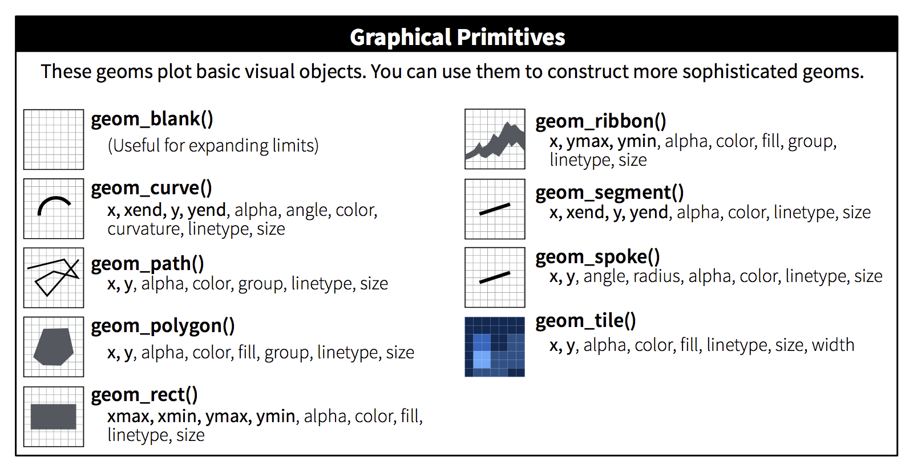
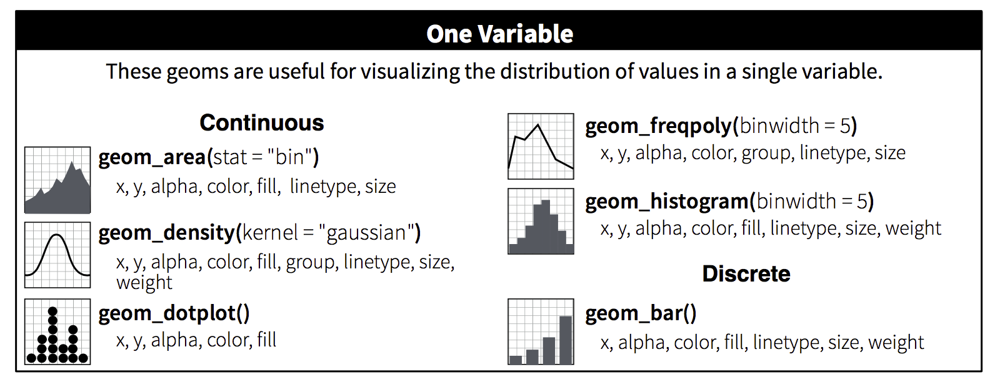
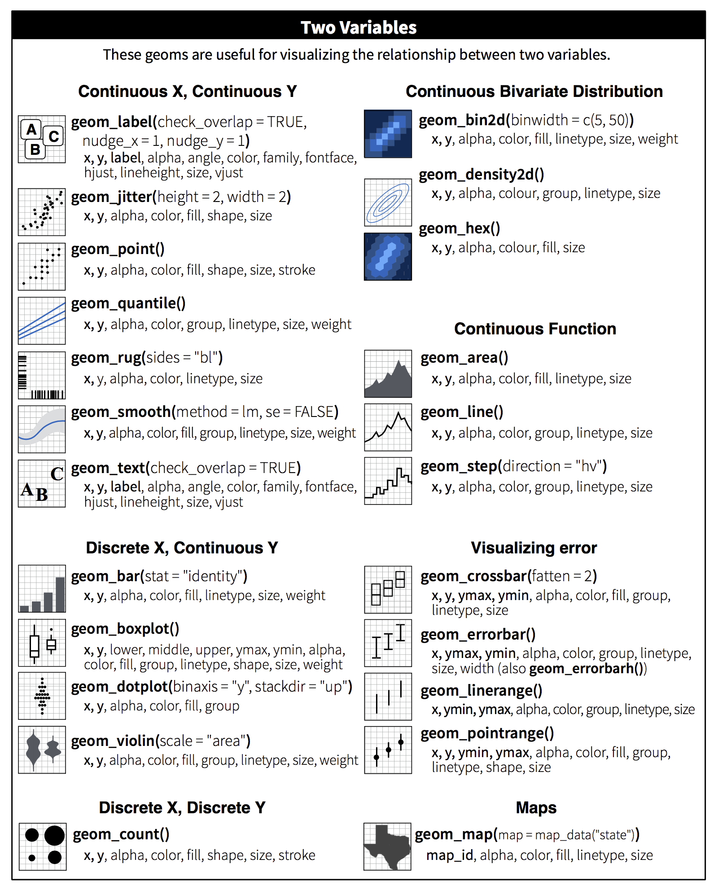
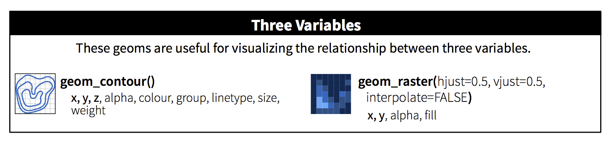
```

Many geoms, like `geom_smooth()`, use a single geometric object to display multiple rows of data. For these geoms, you can set the `group` aesthetic to a categorical variable to draw multiple objects. ggplot2 will draw a separate object for each unique value of the grouping variable. In practice, ggplot2 will automatically group the data for these geoms whenever you map an aesthetic to a discrete variable (as in the `linetype` example). It is convenient to rely on this feature because the group aesthetic by itself does not add a legend or distinguishing features to the geoms.

```{r, fig.width = 3, fig.align = 'default', out.width = "33%", message = FALSE}
ggplot(data = mpg) +
  geom_smooth(mapping = aes(x = displ, y = hwy))
              
ggplot(data = mpg) +
  geom_smooth(mapping = aes(x = displ, y = hwy, group = drv))
    
ggplot(data = mpg) +
  geom_smooth(
    mapping = aes(x = displ, y = hwy, colour = drv),
    show.legend = FALSE
  )
```

To display multiple geoms in the same plot, add multiple geom functions to `ggplot()`:

```{r}
ggplot(data = mpg) + 
  geom_point(mapping = aes(x = displ, y = hwy)) +
  geom_smooth(mapping = aes(x = displ, y = hwy))
```

This, however, introduces some duplication in our code. Imagine if you wanted to change the y-axis to display `cty` instead of `hwy`. You'd need to change the variable in two places, and you might forget to update one. You can avoid this type of repetition by passing a set of mappings to `ggplot()`. ggplot2 will treat these mappings as global mappings that apply to each geom in the graph.  In other words, this code will produce the same plot as the previous code:

```{r, eval = FALSE}
ggplot(data = mpg, mapping = aes(x = displ, y = hwy)) + 
  geom_point() + 
  geom_smooth()
```

If you place mappings in a geom function, ggplot2 will treat them as local mappings for the layer. It will use these mappings to extend or overwrite the global mappings _for that layer only_. This makes it possible to display different aesthetics in different layers.

```{r}
ggplot(data = mpg, mapping = aes(x = displ, y = hwy)) + 
  geom_point(mapping = aes(color = class)) + 
  geom_smooth()
```

You can use the same idea to specify different `data` for each layer. Here, our smooth line displays just a subset of the `mpg` dataset, the subcompact cars. The local data argument in `geom_smooth()` overrides the global data argument in `ggplot()` for that layer only.

```{r}
ggplot(data = mpg, mapping = aes(x = displ, y = hwy)) + 
  geom_point(mapping = aes(color = class)) + 
  geom_smooth(data = dplyr::filter(mpg, class == "subcompact"), se = FALSE)
```

(Remember, `dplyr::filter()` calls the `filter()` function from the dplyr package. You'll learn how `filter()` works in the next chapter.)

### Exercises

1.  What geom would you use to draw a line chart? A boxplot? 
    A histogram? An area chart?

1.  Run this code in your head and predict what the output will look like.
    Then, run the code in R and check your predictions.
    
    ```{r, eval = FALSE}
    ggplot(data = mpg, mapping = aes(x = displ, y = hwy, color = drv)) + 
      geom_point() + 
      geom_smooth(se = FALSE)
    ```
1.  What does `show.legend = FALSE` do?  What happens if you remove it?  
    Why do you think I used it in the example above.

1.  What does the `se` argument to `geom_smooth()` do?


1.  Will these two graphs look different? Why/why not?

    ```{r, eval = FALSE}
    ggplot(data = mpg, mapping = aes(x = displ, y = hwy)) + 
      geom_point() + 
      geom_smooth()
    
    ggplot() + 
      geom_point(data = mpg, mapping = aes(x = displ, y = hwy)) + 
      geom_smooth(data = mpg, mapping = aes(x = displ, y = hwy))
    ```

1.  Recreate the R code necessary to generate the following graphs.
    
    ```{r echo = FALSE, fig.width = 3, out.width = "50%", fig.align = "default", message = FALSE}
    ggplot(data = mpg, mapping = aes(x = displ, y = hwy)) + 
      geom_point() + 
      geom_smooth(aes(group = drv), se = FALSE)
    ggplot(data = mpg, mapping = aes(x = displ, y = hwy)) + 
      geom_smooth(aes(group = drv), se = FALSE) +
      geom_point()
    ggplot(data = mpg, mapping = aes(x = displ, y = hwy, color = drv)) + 
      geom_point() + 
      geom_smooth(se = FALSE)
    ggplot(data = mpg, mapping = aes(x = displ, y = hwy)) + 
      geom_point(aes(color = drv)) + 
      geom_smooth(se = FALSE)
    ggplot(data = mpg, mapping = aes(x = displ, y = hwy)) + 
      geom_point(aes(color = drv)) +
      geom_smooth(aes(linetype = drv), se = FALSE)
    ggplot(data = mpg, mapping = aes(x = displ, y = hwy)) + 
      geom_point(size = 4, colour = "white") + 
      geom_point(aes(colour = drv))
    ```

## Statistical transformations

Next, let's take a look at a bar chart. Bar charts seem simple, but they are interesting because they reveal something subtle about plots. Consider a basic bar chart, as drawn with `geom_bar()`. The following chart displays the total number of diamonds in the `diamonds` dataset, grouped by `cut`. The `diamonds` dataset comes in ggplot2 and contains information about ~54,000 diamonds, including the `price`, `carat`, `color`, `clarity`, and `cut` of each diamond. The chart shows that more diamonds are available with high quality cuts than with low quality cuts. 

```{r}
ggplot(data = diamonds) + 
  geom_bar(mapping = aes(x = cut))
```

On the x-axis, the chart displays `cut`, a variable from `diamonds`. On the y-axis, it displays count, but count is not a variable in `diamonds`! Where does count come from? Many graphs, like scatterplots, plot the raw values of your dataset. Other graphs, like bar charts, calculate new values to plot:

* __bar charts__, __histograms__, and __frequency polygons__ bin your data 
  and then plot bin counts, the number of points that fall in each bin.

* __smoothers__ fit a model to your data and then plot predictions from the
  model.

* __boxplots__ calculate the quartiles of your data and then plot the 
  quartiles as a box.

ggplot2 calls the algorithm that a graph uses to calculate new values a __stat__, which is short for statistical transformation. Each geom in ggplot2 is associated with a default stat that it uses to calculate values to plot. The figure below describes how this process works with `geom_bar()`.

```{r, echo = FALSE, out.width = "100%"}
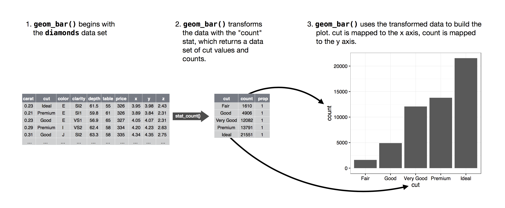
```

A few geoms, like `geom_point()`, plot your raw data as it is. These geoms also apply a transformation to your data, the identity transformation, which returns the data in its original state. Now we can say that _every_ geom uses a stat.

```{r, echo = FALSE, out.width = "100%"}
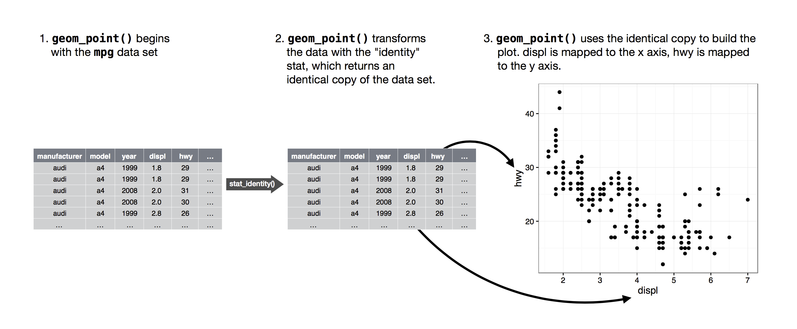
```

You can learn which stat a geom uses, as well as what variables it computes by visiting the geom's help page. For example, the help page of `geom_bar()` shows that it uses the count stat and that the count stat computes two new variables, `count` and `prop`.

Stats are the most subtle part of plotting because you can't see them directly. ggplot2 applies the transformation and stores the results behind the scenes. You only see impact in the final plot. Generally, you don't need to think about stats: the defaults work away on your behalf to summarise your data as needed for a particular plot. However, there are two cases where you might need to know about it:

1.  You might want to override the default stat. In the code below, I change 
    the stat of `geom_bar()` from count (the default) to identity. This lets 
    me map the height of the bars to the raw values of a $y$ variable. 
    
    ```{r}
    demo <- tibble::tibble(
      a = c("bar_1", "bar_2", "bar_3"),
      b = c(20, 30, 40)
    )
    demo
    
    ggplot(data = demo) +
      geom_bar(mapping = aes(x = a, y = b), stat = "identity")
    ```
    
    (Unfortunately when people talk about bar charts casually, they might be
    referring to this type of bar chart, where the height of the bar is already
    present in the data, or the previous bar chart where the height of the bar
    is generated by counting rows.)

1.  You might want to override the default mapping from transformed variables
    to aesthetics. For example, you might want to display a bar chart of
    proportion, rather than count:
    
    ```{r}
    ggplot(data = diamonds) + 
      geom_bar(mapping = aes(x = cut, y = ..prop.., group = 1))
    ```

    The help page of `?geom_bar` reveals that the sum stat creates two
    variables, `count` and `prop`. By default, `geom_bar()` maps `y`
    to `count`, but you can ask it to use `prop` instead with 
    `aes(y = ..prop..)`.The two dots that surround prop notify ggplot2 that 
    the `prop` variable appears in the transformed dataset not in the 
    raw dataset.
    
ggplot2 provides over 20 stats for you to use. Each stat is saved as a function, which provides a convenient way to access a stat's help page, e.g. `?stat_identity`.  The table below describes each stat in ggplot2 and lists the parameters that the stat takes, as well as the variables that the stat makes. 

```{r, echo = FALSE, out.width = "100%"}
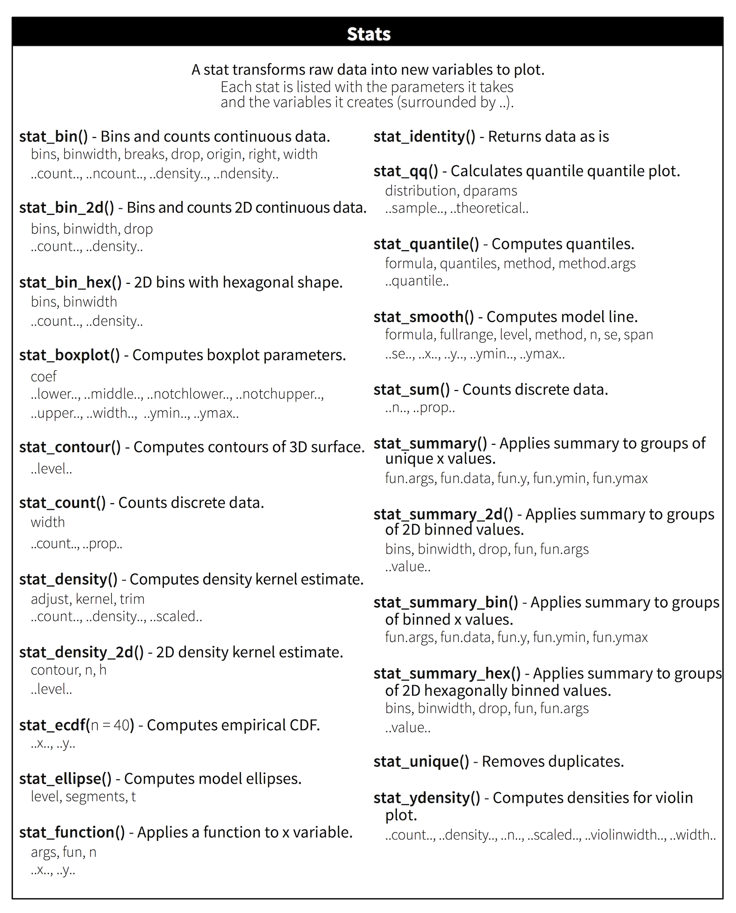
```

### Exercises

1.  In our proportion barchart, we need to set `group = 1`. Why?  In other
    words, why is this graph not useful?
    
    ```{r, eval = FALSE}
    ggplot(data = diamonds) + 
      geom_bar(mapping = aes(x = cut, y = ..prop..))
    ```
    
1.  How do you find out the default stat associated with a geom?

## Position adjustments

There's one more piece of magic associated with bar charts. You can colour bar chart using either the `colour` aesthetic, or more usefully, `fill`:

```{r fig.width = 3, out.width = "50%", fig.align = "default"}
ggplot(data = diamonds) + 
  geom_bar(mapping = aes(x = cut, colour = cut))
ggplot(data = diamonds) + 
  geom_bar(mapping = aes(x = cut, fill = cut))
```

Note what happens if you map the fill aesthetic to another variable, like `clarity`: the bars are automatically stacked. Each colored rectangle represents a combination of `cut` and `clarity`.

```{r}
ggplot(data = diamonds) + 
  geom_bar(mapping = aes(x = cut, fill = clarity))
```

The stacking is performed automatically by the __position adjustment__ specified by the `position` argument. If you don't want a stacked bar chart, you can use one of three other options: `"identity"`, `"dodge"` or `"fill"`.

*   `position = "identity"` will place each object exactly where it falls in 
    the context of the graph. This is not very useful for bars, because it
    overlaps them. To see that overlapping we either need to make the bars
    slightly transparent by setting `alpha` to a small value, or completely
    transparent by setting `fill = NA`.
    
    ```{r out.width = "50%", fig.align = "default"}
    ggplot(data = diamonds, mapping = aes(x = cut, fill = clarity)) + 
      geom_bar(alpha = 1/5, position = "identity")
    ggplot(data = diamonds, mapping = aes(x = cut, colour = clarity)) + 
      geom_bar(fill = NA, position = "identity")
    ```
    
    The identity position adjustment is more useful for 2d geoms, like points,
    where it is the default.
    
*   `position = "fill"` work like stacking, but makes each set of stacked bars
    the same height. This makes it easier to compare proportions across 
    groups.

    ```{r}
    ggplot(data = diamonds) + 
      geom_bar(mapping = aes(x = cut, fill = clarity), position = "fill")
    ```

*   `position = "dodge"` places overlapping objects directly _beside_ one 
    another. This makes it easier to compare individual values.

    ```{r}
    ggplot(data = diamonds) + 
      geom_bar(mapping = aes(x = cut, fill = clarity), position = "dodge")
    ```

There's one other type of adjustment that's not useful for bar charts, but it can be very useful for scatterplots. Recall our first scatterplot. Did you notice that the plot displays only 126 points, even though there are 234 observations in the dataset?

```{r echo = FALSE}
ggplot(data = mpg) + 
  geom_point(mapping = aes(x = displ, y = hwy))
```

The values of `hwy` and `displ` are rounded so the points appear on a grid and many points overlap each other. This problem is known as __overplotting__. This arrangement makes it hard to see where the mass of the data is. Are the data points spread equally throughout the graph, or is there one special combination of `hwy` and `displ` that contains 109 values? 

You can avoid this gridding by setting the position adjustment to "jitter".  `position = "jitter"` adds a small amount of random noise to each point. This spreads the points out because no two points are likely to receive the same amount of random noise.

```{r}
ggplot(data = mpg) + 
  geom_point(mapping = aes(x = displ, y = hwy), position = "jitter")
```

Adding randomness seems like a strange way to improve your plot, but while it makes your graph less accurate at small scales, it makes your graph _more_ revealing at large scales. Because this is such a useful operation, ggplot2 comes with a shorthand for `geom_point(position = "jitter")`: `geom_jitter()`.

To learn more about a position adjustment, look up the help page associated with each adjustment: `?position_dodge`, `?position_fill`, `?position_identity`, `?position_jitter`, and `?position_stack`.

### Exercises

1.  What is the problem with this plot? How could you improve it?

    ```{r}
    ggplot(data = mpg, mapping = aes(x = cty, y = hwy)) + 
      geom_point()
    ```

1.  Compare and contrast `geom_jitter()` with `geom_count()`.

1.  What's the default position adjustment for `geom_boxplot()`? Create
    a visualisation of the `mpg` dataset that demonstrates it.

## Coordinate systems

Coordinate systems are probably the most complicated part of ggplot2. The default coordinate system is the Cartesian coordinate system where the x and y position act independently to find the location of each point.

There are a number of other coordinate systems that are occasionally helpful.

*   `coord_flip()` switches the x and y axes. This is useful (for example),
    if you want horizontal boxplots.
    
    ```{r fig.width = 3, out.width = "50%", fig.align = "default"}
    ggplot(data = mpg, mapping = aes(x = class, y = hwy)) + 
      geom_boxplot()
    ggplot(data = mpg, mapping = aes(x = class, y = hwy)) + 
      geom_boxplot() +
      coord_flip()
    ```

*   `coord_quickmap()` sets the aspect ratio correctly for maps. This is very
    important if you're plotting spatial data with ggplot2 (which unfortunately
    we don't have the space to cover in this book).

    ```{r fig.width = 3, out.width = "50%", fig.align = "default", message = FALSE}
    nz <- map_data("nz")

    ggplot(nz, aes(long, lat, group = group)) +
      geom_polygon(fill = "white", colour = "black")

    ggplot(nz, aes(long, lat, group = group)) +
      geom_polygon(fill = "white", colour = "black") +
      coord_quickmap()
    ```

*   `coord_polar()` uses polar coordinates. Polar coordinates reveal an 
    interesting connection between a bar chart and a Coxcomb chart.
    
    ```{r fig.width = 3, out.width = "50%", fig.align = "default", fig.asp = 1}
    bar <- ggplot(data = diamonds) + 
      geom_bar(
        mapping = aes(x = cut, fill = cut), 
        show.legend = FALSE,
        width = 1
      ) + 
      theme(aspect.ratio = 1) +
      labs(x = NULL, y = NULL)
    
    bar + coord_flip()
    bar + coord_polar()
    ```

The table below describes each built-in coord. You can learn more about each coordinate system by opening its help page in R, e.g. `?coord_cartesian`.

```{r, echo = FALSE, out.width = "100%"}
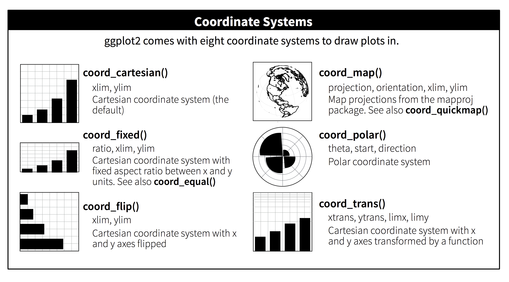
```

### Exercises

1.  Turn a stacked bar chart into a pie chart using `coord_polar()`.

1.  What does `labs()` do? Read the documentation.

1.  What's the difference between `coord_quickmap()` and `coord_map()`?

1.  What does the plot below tell you about the relationship between city
    and highway mpg? Why is `coord_fixed()` important? What does 
    `geom_abline()` do?
    
    ```{r, fig.asp = 1, out.width = "50%"}
    ggplot(data = mpg, mapping = aes(x = cty, y = hwy)) +
      geom_point() + 
      geom_abline() +
      coord_fixed()
    ```

## The layered grammar of graphics

In the previous sections, you learned much more than how to make scatterplots, bar charts, and boxplots. You learned a foundation that you can use to make _any_ type of plot with ggplot2. To see this, let's add position adjustments, stats, coordinate systems, and faceting to our code template:

```
ggplot(data = <DATA>) + 
  <GEOM_FUNCTION>(
     mapping = aes(<MAPPINGS>),
     stat = <STAT>, 
     position = <POSITION>
  ) +
  <COORDINATE_FUNCTION> +
  <FACET_FUNCTION>
```

Our new template takes seven parameters, the bracketed words that appear in the template. In practice, you rarely need to supply all seven parameters to make a graph because ggplot2 will provide useful defaults for everything except the data, the mappings, and the geom function.

The seven parameters in the template compose the grammar of graphics, a formal system for building plots. The grammar of graphics is based on the insight that you can uniquely describe _any_ plot as a combination of a dataset, a geom, a set of mappings, a stat, a position adjustment, a coordinate system, and a faceting scheme. 

To see how this works, consider how you could build a basic plot from scratch: you could start with a dataset and then transform it into the information that you want to display (with a stat).

```{r, echo = FALSE, out.width = "100%"}
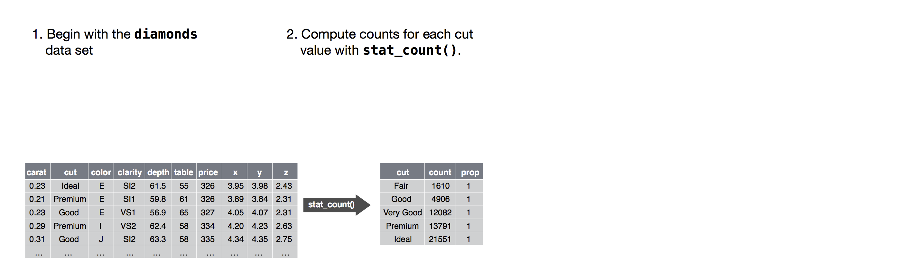
```

Next, you could choose a geometric object to represent each observation in the transformed data. You could then use the aesthetic properties of the geoms to represent variables in the data. You would map the values of each variable to the levels of an aesthetic.

```{r, echo = FALSE, out.width = "100%"}
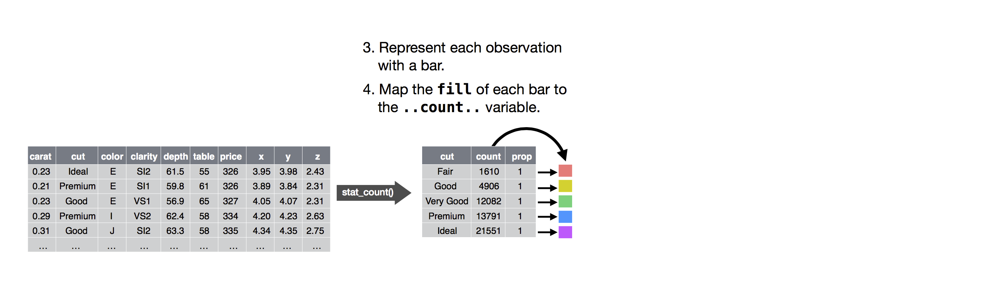
```

You'd then select a coordinate system to place the geoms into. You'd use the location of the objects (which is itself an aesthetic property) to display the values of the x and y variables. At that point, you would have a complete graph, but you could further adjust the positions of the geoms within the coordinate system (a position adjustment) or split the graph into subplots (faceting). You could also extend the plot by adding one or more additional layers, where each additional layer uses a dataset, a geom, a set of mappings, a stat, and a position adjustment.

```{r, echo = FALSE, out.width = "100%"}
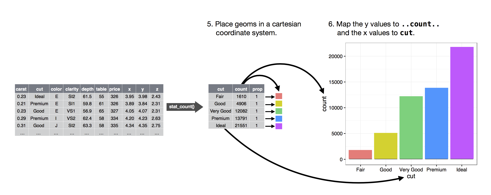
```

You could use this method to build _any_ plot that you imagine. In other words, you can use the code template that you've learned in this chapter to build hundreds of thousands of unique plots.
