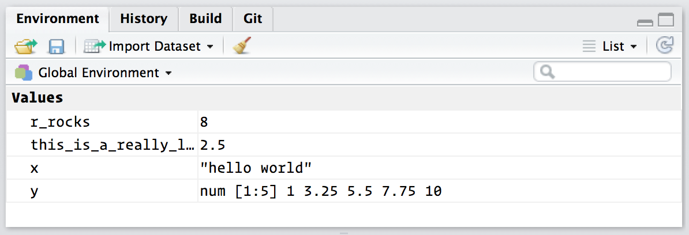

# Workflow: basics

You've now have some experience running R code. I didn't give you many details, but you've obviously figured out the basics, or you would've thrown this book away in frustration! Before we go any further, let's make sure you've got a solid foundation in running R code and, and  that you know about the most helpful RStudio features.

Let's review the basics: you can use R as a calculator:

```{r}
1 / 200 * 30
(59 + 73 + 2) / 3
```

And you can create new objects with `<-`:

```{r}
x <- 3 * 4
```

All R statements where you create objects, __assignment__ statements, have the same form:

```{r eval = FALSE}
object_name <- value
```

When reading that code say "object_name gets value" in your head.

You will make lots of assignments and the operator `<-` is a pain to type. Don't be lazy and use `=`. It will work, but it will sow confusion later. Instead, use RStudio's keyboard shortcut: Alt + - (the minus sign). RStudio offers many handy keyboard shortcuts. To get the full list, use the one keyboard shortcut to rule them all: Alt + Shift + K brings up a keyboard shortcut reference card.

Notice that RStudio automagically surrounds `<-` with spaces, which is a good code formatting practice. Code is miserable to read on a good day, so giveyoureeyesabreak and use spaces.

Object names must start with a letter, and cannot contain characters like commas or spaces. You want your object names to be descriptive, so it's a good idea to adopt a convention for demarcating words in names. I recommend __snake_case__ where you separate lowercase words with `_`. 

```{r, eval = FALSE}
i_use_snake_case
otherPeopleUseCamelCase
some.people.use.periods
And_aFew.People_HATEconventions
```

We'll come back to code style in [functions].

You can inspect an object by typing its name:

```{r}
x
```


Make another assignment:

```{r}
this_is_a_really_long_name <- 2.5
```

To inspect this object, try out RStudio's completion facility: type the "this", press TAB, add characters until you have a unique prefix, then press return.

Ooops, you made a mistake! `this_is_a_really_long_name` should have value 3.5 not 2.5. Use another keyboard short to help you fix it.  Type "this" then press Cmd/Ctrl + ↑. That will list all the commands you've typed that start those letters. Use the arrow keys to navigate, then press enter to retype the command. Change 2.5 to 3.5 and rerun.

Make yet another assignment:

```{r}
r_rocks <- 2 ^ 3
```

Let's try to inspect it:

```{r, error = TRUE}
r_rock
R_rocks
```

There's an implicit contract between you and R: it will do the tedious computation for you, but in return, you must be completely precise in your instructions. Typos matter. Case matters. Improving your touch typing skills will pay off!

R has a large collection of built-in functions that are called like this:

```{r eval = FALSE}
functionName(arg1 = val1, arg2 = val2, and so on)
```

Let's try using `seq()` which makes regular sequences of numbers and, while we're at it, learn more helpful features of RStudio.

Type `se` and hit TAB. A pop up shows you possible completions. Specify `seq()` by typing more (a "q") to disambiguate or using the up/down arrows to select. Notice the floating tooltip that pops up, reminding you of the function's arguments and purpose. If you want more help, press F1 to get all the details in help tab in the lower right pane. 

Press TAB once more when you've selected the function you want. RStudio will add matching opening (`(`) and closing (`)`) parentheses for you. Type the arguments `1, 10` and hit return.

```{r}
seq(1, 10)
```

Type this code and notice similar assistance help with the paired quotation marks:

```{r}
x <- "hello world"
```

Quotation marks and parentheses must always come in a pair. RStudio does it's best to help you, but it's still possible to mess up and end up with a mismatch. If this happen, R will show you the continuation character "+":

```
> x <- "hello
+
```

The `+` tells you that R is waiting for more input; it doesn't think you're done yet. Usually that means you've forgotten either a `"` or a `)`.  Either add missing pair, or press ESCAPE to abort the expression and try again.

If you make an assignment, you don't get to see the value. You're then tempted to immediately double check the result: inspect.

```{r}
y <- seq(1, 10, length = 5)
y
```

This common action can be shortened by surrounding the assignment with parentheses, which causes assignment and "print to screen" to happen.

```{r}
(y <- seq(1, 10, length = 5))
```

Now look at your environment in the upper right pane:

```{r, echo = FALSE, out.width = NULL}

```

The environment is where user-defined objects accumulate. 

## Practice

1.  Why does this code not work?

    ```{r, error = TRUE}
    my_variable <- 10
    my_varıable
    ```
    
    Look carefully! (This may seem like an exercise in pointlessness, but
    training your brain to notice even the tiniest difference will pay off
    when programming.)
    
1.  Tweak the each of the following R commands so that they run correctly:

    ```{r, eval = FALSE}
    library(ggplot2)
    library(dplyr)
    
    ggplot(dota = mpg) + 
      geom_point(mapping = aes(x = displ, y = hwy))
    
    mpg %>% 
      fliter(cyl = 8)
  
    diamond %>% 
      filter(carat > 3)
    ```
    
