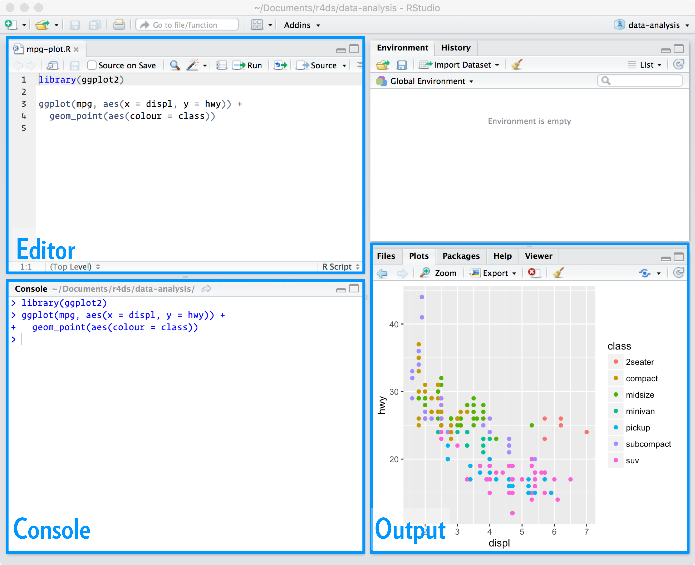
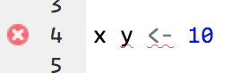
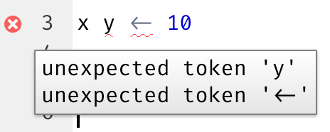
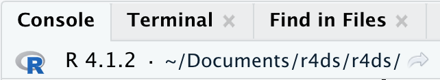
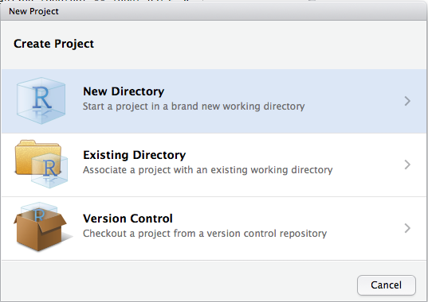
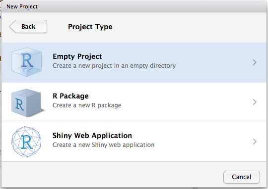
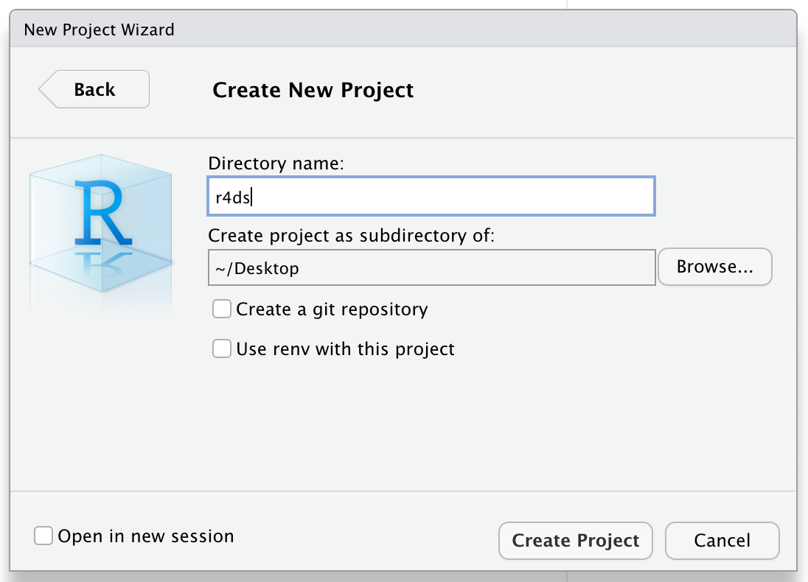

# Workflow: scripts and projects

```{r, results = "asis", echo = FALSE}
status("restructuring")
```

So far you've been using the console to run code.
That's a great place to start, but you'll find it gets cramped pretty quickly as you create more complex ggplot2 graphics and dplyr pipes.
To give yourself more room to work, it's a great idea to use the script editor.
Open it up either by clicking the File menu, and selecting New File, then R script, or using the keyboard shortcut Cmd/Ctrl + Shift + N.
Now you'll see four panes:

```{r echo = FALSE, out.width = "75%"}

```

The script editor is a great place to put code you care about.
Keep experimenting in the console, but once you have written code that works and does what you want, put it in the script editor.
RStudio will automatically save the contents of the editor when you quit RStudio, and will automatically load it when you re-open.
Nevertheless, it's a good idea to save your scripts regularly and to back them up.

TODO: Add file naming advice

## Running code

The script editor is also a great place to build up complex ggplot2 plots or long sequences of dplyr manipulations.
The key to using the script editor effectively is to memorise one of the most important keyboard shortcuts: Cmd/Ctrl + Enter.
This executes the current R expression in the console.
For example, take the code below.
If your cursor is at █, pressing Cmd/Ctrl + Enter will run the complete command that generates `not_cancelled`.
It will also move the cursor to the next statement (beginning with `not_cancelled |>`).
That makes it easy to run your complete script by repeatedly pressing Cmd/Ctrl + Enter.

```{r, eval = FALSE}
library(dplyr)
library(nycflights13)

not_cancelled <- flights |> 
  filter(!is.na(dep_delay)█, !is.na(arr_delay))

not_cancelled |> 
  group_by(year, month, day) |> 
  summarise(mean = mean(dep_delay))
```

Instead of running expression-by-expression, you can also execute the complete script in one step: Cmd/Ctrl + Shift + S.
Doing this regularly is a great way to check that you've captured all the important parts of your code in the script.

I recommend that you always start your script with the packages that you need.
That way, if you share your code with others, they can easily see what packages they need to install.
Note, however, that you should never include `install.packages()` or `setwd()` in a script that you share.
It's very antisocial to change settings on someone else's computer!

When working through future chapters, I highly recommend starting in the editor and practicing your keyboard shortcuts.
Over time, sending code to the console in this way will become so natural that you won't even think about it.

## RStudio diagnostics

The script editor will also highlight syntax errors with a red squiggly line and a cross in the sidebar:

```{r echo = FALSE, out.width = NULL}

```

Hover over the cross to see what the problem is:

```{r echo = FALSE, out.width = NULL}

```

RStudio will also let you know about potential problems:

```{r echo = FALSE, out.width = NULL}
knitr::include_graphics("screenshots/rstudio-diagnostic-warn.png")
```

# Workflow: projects

One day you will need to quit R, go do something else and return to your analysis the next day.
One day you will be working on multiple analyses simultaneously that all use R and you want to keep them separate.
One day you will need to bring data from the outside world into R and send numerical results and figures from R back out into the world.
To handle these real life situations, you need to make two decisions:

1.  What about your analysis is "real", i.e. what will you save as your lasting record of what happened?

2.  Where does your analysis "live"?

## What is real?

As a beginning R user, it's OK to consider your environment (i.e. the objects listed in the environment pane) "real".
However, in the long run, you'll be much better off if you consider your R scripts as "real".

With your R scripts (and your data files), you can recreate the environment.
It's much harder to recreate your R scripts from your environment!
You'll either have to retype a lot of code from memory (making mistakes all the way) or you'll have to carefully mine your R history.

To foster this behaviour, I highly recommend that you instruct RStudio not to preserve your workspace between sessions:

```{r, echo = FALSE, out.width = "75%"}
knitr::include_graphics("screenshots/rstudio-workspace.png")
```

This will cause you some short-term pain, because now when you restart RStudio it will not remember the results of the code that you ran last time.
But this short-term pain will save you long-term agony because it forces you to capture all important interactions in your code.
There's nothing worse than discovering three months after the fact that you've only stored the results of an important calculation in your workspace, not the calculation itself in your code.

There is a great pair of keyboard shortcuts that will work together to make sure you've captured the important parts of your code in the editor:

1.  Press Cmd/Ctrl + Shift + F10 to restart RStudio.
2.  Press Cmd/Ctrl + Shift + S to rerun the current script.

I use this pattern hundreds of times a week.

## Where does your analysis live?

R has a powerful notion of the **working directory**.
This is where R looks for files that you ask it to load, and where it will put any files that you ask it to save.
RStudio shows your current working directory at the top of the console:

```{r, echo = FALSE, out.width = "50%"}

```

And you can print this out in R code by running `getwd()`:

```{r eval = FALSE}
getwd()
#> [1] "/Users/hadley/Documents/r4ds/r4ds"
```

As a beginning R user, it's OK to let your home directory, documents directory, or any other weird directory on your computer be R's working directory.
But you're six chapters into this book, and you're no longer a rank beginner.
Very soon now you should evolve to organising your analytical projects into directories and, when working on a project, setting R's working directory to the associated directory.

**I do not recommend it**, but you can also set the working directory from within R:

```{r eval = FALSE}
setwd("/path/to/my/CoolProject")
```

But you should never do this because there's a better way; a way that also puts you on the path to managing your R work like an expert.

## Paths and directories

Paths and directories are a little complicated because there are two basic styles of paths: Mac/Linux and Windows.
There are three chief ways in which they differ:

1.  The most important difference is how you separate the components of the path.
    Mac and Linux uses slashes (e.g. `plots/diamonds.pdf`) and Windows uses backslashes (e.g. `plots\diamonds.pdf`).
    R can work with either type (no matter what platform you're currently using), but unfortunately, backslashes mean something special to R, and to get a single backslash in the path, you need to type two backslashes!
    That makes life frustrating, so I recommend always using the Linux/Mac style with forward slashes.

2.  Absolute paths (i.e. paths that point to the same place regardless of your working directory) look different.
    In Windows they start with a drive letter (e.g. `C:`) or two backslashes (e.g. `\\servername`) and in Mac/Linux they start with a slash "/" (e.g. `/users/hadley`).
    You should **never** use absolute paths in your scripts, because they hinder sharing: no one else will have exactly the same directory configuration as you.

3.  The last minor difference is the place that `~` points to.
    `~` is a convenient shortcut to your home directory.
    Windows doesn't really have the notion of a home directory, so it instead points to your documents directory.

## RStudio projects

R experts keep all the files associated with a project together --- input data, R scripts, analytical results, figures.
This is such a wise and common practice that RStudio has built-in support for this via **projects**.

Let's make a project for you to use while you're working through the rest of this book.
Click File \> New Project, then:

```{r, echo = FALSE, out.width = "50%"}



```

Call your project `r4ds` and think carefully about which *subdirectory* you put the project in.
If you don't store it somewhere sensible, it will be hard to find it in the future!

Once this process is complete, you'll get a new RStudio project just for this book.
Check that the "home" directory of your project is the current working directory:

```{r eval = FALSE}
getwd()
#> [1] /Users/hadley/Documents/r4ds/r4ds
```

Whenever you refer to a file with a relative path it will look for it here.

Now enter the following commands in the script editor, and save the file, calling it "diamonds.R".
Next, run the complete script which will save a PDF and CSV file into your project directory.
Don't worry about the details, you'll learn them later in the book.

```{r toy-line, eval = FALSE}
library(tidyverse)

ggplot(diamonds, aes(carat, price)) + 
  geom_hex()
ggsave("diamonds.pdf")

write_csv(diamonds, "diamonds.csv")
```

Quit RStudio.
Inspect the folder associated with your project --- notice the `.Rproj` file.
Double-click that file to re-open the project.
Notice you get back to where you left off: it's the same working directory and command history, and all the files you were working on are still open.
Because you followed my instructions above, you will, however, have a completely fresh environment, guaranteeing that you're starting with a clean slate.

In your favorite OS-specific way, search your computer for `diamonds.pdf` and you will find the PDF (no surprise) but *also the script that created it* (`diamonds.R`).
This is a huge win!
One day you will want to remake a figure or just understand where it came from.
If you rigorously save figures to files **with R code** and never with the mouse or the clipboard, you will be able to reproduce old work with ease!

## Summary

In summary, RStudio projects give you a solid workflow that will serve you well in the future:

-   Create an RStudio project for each data analysis project.

-   Keep data files there; we'll talk about loading them into R in \[data import\].

-   Keep scripts there; edit them, run them in bits or as a whole.

-   Save your outputs (plots and cleaned data) there.

-   Only ever use relative paths, not absolute paths.

Everything you need is in one place, and cleanly separated from all the other projects that you are working on.

## Exercises

1.  Go to the RStudio Tips Twitter account, <https://twitter.com/rstudiotips> and find one tip that looks interesting.
    Practice using it!

2.  What other common mistakes will RStudio diagnostics report?
    Read <https://support.rstudio.com/hc/en-us/articles/205753617-Code-Diagnostics> to find out.
