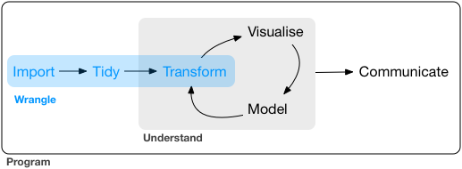

# (PART) Wrangle {-}

# Introduction

In this part of the book, you'll learn about data wrangling, the art of getting your data into R in a useful form. Data wrangling encompasses three main pieces:

```{r echo = FALSE, out.width = "75%"}

```

*   In [data import], you'll learn the art of data import: how to get your data 
    off of disk and into R.

*   In [tidy data], you'll learn about tidy data, a consistent way of storing your
    data that makes transformation, visualiation, and modelling easier.

*   You've already learned the basics of data transformation. In this part of the
    book we'll dive deeper into tools useful for specific types of data:

    * [Dates and times] will give you the key tools for working with 
      dates, and date times.
      
    * [Strings] will introduce regular expressions, a powerful tool for
      manipulating strings.
      
    * [Relational data] will give you tools for working with multiple
      interrelated datasets.

Before we get to those chapters we'll take a brief discussion to discuss the "tibble" in more detail, in [tibbles].

